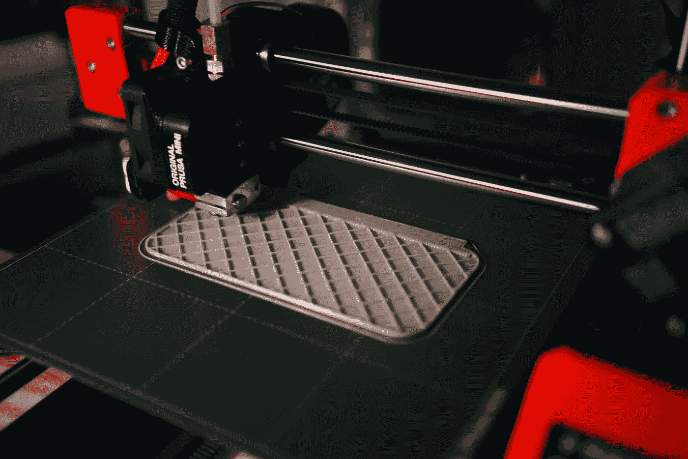
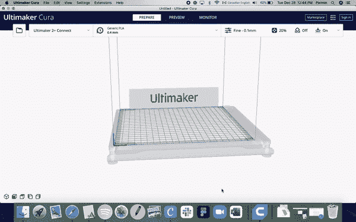
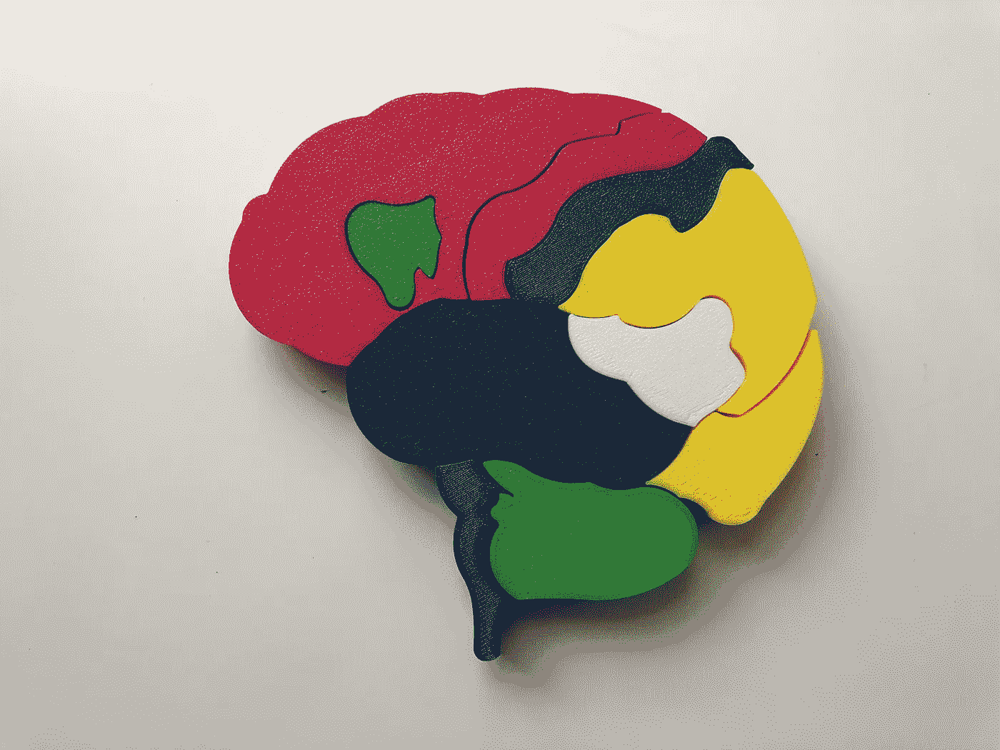

# 3D 打印完全入门指南

> 原文：<https://medium.com/geekculture/a-complete-beginners-guide-to-3d-printing-47af14177a5f?source=collection_archive---------2----------------------->

## 针对每个人的一般提示和针对 Prusa I3 MK3S 用户的具体提示，帮助他们开始 3D 打印

Photo by [Kadir Celep](https://unsplash.com/@kadircelep?utm_source=unsplash&utm_medium=referral&utm_content=creditCopyText) on [Unsplash](https://unsplash.com/s/photos/3d-printing?utm_source=unsplash&utm_medium=referral&utm_content=creditCopyText)

看着一个全新的物体由一些塑料制成是非常令人满意的，这是我有幸通过 3D 打印的魔力见证的事情。

自从我发现我当地的图书馆有一台 3D 打印机，确切地说是一台 Prusa I3 MK3S，我就有点痴迷于 3D 打印。我绝不是专家，但作为一个完全的初学者，我必须弄清楚如何**找到好的 3D 模型**、**切片**，以及**打印**，我认为分享我的经验是很重要的。因此，让我们深入所有这些主题，学习如何 3D 打印。

请注意，我将专门讨论我所使用的 **Prusa I3 MK3S** ，但我将讨论的前几个主题(关于处理 3D 模型)适用于任何打印机。

# 第一步:找到一个模型

自然，第一步是找到或创建一个你想打印出来的模型。这可以是任何东西，从你最喜欢的角色的小雕像到钥匙链或原型等功能性的东西。选择权在你。

Gif by author. A Prusa I3 MK3S at work.

我将向你讲述我的个人经历；我想打印出人类大脑的模型，但我不想创建自己的模型，因为我确信那里一定有一些合适的模型。3D 社区非常活跃，所以经过一番搜索，我找到了我正在寻找的。

那我是怎么找到的呢？通过在网站上的大量搜索，如…

*   [**Thingiverse**](https://www.thingiverse.com) :据我所知，这是**最受欢迎的**寻找 3D 模型的网站。它有很多用户，甚至更好的是，他们中的许多人在打印出模型后会发表评论，给你应该做什么的提示。例如，我从一个评论中了解到，我应该将模型的某个部分做得稍微小一点，这样它就可以与其他部分很好地配合。另外，网站的**搜索**功能非常强大，有很好的过滤器和分类。哦，我有没有提到所有的模特都是免费的？
*   [**MyMiniFactory**](https://www.myminifactory.com)**:**这是一个很好的地方，以防你在网上找不到你想要的东西。它有一些非常独特的型号，但要小心，其中一些确实很贵。
*   [**Pinshape**](https://pinshape.com) :类似于 MyMiniFactory，有一些很棒的免费模型，也有一些你需要付费的。有利的一面是，如果你决定开始自己制作模型，你可以**在平台上销售**。
*   [**YouMagine**](https://www.youmagine.com) :虽然我不觉得这个平台的搜索功能很强大，但是如果你**脑子里没有一个具体的型号**只是想找些东西打印出来，那就太棒了。他们有办法看到他们的*流行*和*流行*设计，以及不同的系列，比如“快速印花”来让你开始。

如果您想创建自己的模型呢？这是我建议寻找不同资源的地方，因为这不是我的专业领域。然而，我听说 [Tinkercad](https://www.tinkercad.com) 是开始你的 3D 模型创作之旅的一个很好的平台。

# 第二步:准备模型

当你下载了你的模型，它可能是一个. stl 或者。obj 文件，两者都是 3D 模型的常见文件类型。但是你不能直接在 Prusa I3 MK3S 上打印这种文件类型，我们需要通过一个叫做**切片**的过程。

在我们到达那里之前，我们首先需要调整模型的大小(如果你愿意的话)。回到我的大脑模型的例子，我想让它稍微小一点。我用一个叫做 **Ultimaker Cura 的免费程序做到了这一点。**你可以在这里下载[。](https://ultimaker.com/software/ultimaker-cura)

以下是您下一步要做的逐步说明…

Gif by author. A demonstration of how to resize and slice using Ultimaker Cura.

1.  从启动应用程序开始。
2.  单击左侧的下拉菜单选择您的打印机。然后，单击“添加打印机”如果您使用的是 Prusa I3 MK3S，请点击“添加非联网打印机”，然后找到您的打印机。这样可以显示正确的**打印机床尺寸**，帮助您为您的型号设置正确的尺寸。
3.  拖着你的。stl 或者。obj 文件到应用程序中，看着它出现。
4.  单击模型以选择它。然后，如果你愿意的话，可以移动它。
5.  要调整**的大小，点击左侧菜单中的第二个选项。确保“统一缩放”是开着的，然后调整你想要的大小。**

一旦你完成了这个，我们就可以开始切片了。这只是将文件类型从. stl 或。obj to **G 代码**，这是 Prusa I3 MK3S 可以打印的唯一文件类型。

在我们切片之前，你应该把你的 SD 卡插入你的电脑。Prusa I3 MK3S 的另一个限制是它只能从 SD 卡打印。我们还需要确保 SD 卡的格式是 FAT32。如果你是 Windows 用户，你可以在这里[找到如何操作](https://www.lifewire.com/format-usb-drive-in-fat32-on-windows-10-5113286)，如果你是 Mac 用户，点击这里。

一旦完成，我们将回到终极制造者 Cura。看到右下角那个蓝色的**切片**按钮了吗？我们将点击它。如果您的 SD 卡已插入，您将看到一个直接保存到 SD 卡的选项。瞧，你的文件可以打印了。

# 第三步:打印

随着所有准备工作的完成，终于到了印刷的时候了！

让我们从**清洁**打印机底座开始。你可以用异丙醇来做这个。

现在您可以**装载灯丝。**我使用的是 PLA(一种特殊类型的灯丝),所以这就是我选择的。你首先要把一卷细丝放在打印机顶部的手柄上。然后**将灯丝末端**切割成 45 度锐角。之后，从打印机屏幕中选择“加载灯丝”,并选择您正在使用的灯丝类型。

一旦挤压机(打印机中挤压灯丝的部分)达到正确的温度，屏幕将提示您插入灯丝。不需要太用力压入灯丝，只需**引导它**直到它被打印机本身拉入。

Video by author. A demonstration of how to load filament.

接下来，打印机将开始挤压灯丝，希望**清除掉**之前存在的颜色。只要按照屏幕上的指示，直到你只看到你的新颜色。

一旦这些都完成了，就该**插入你的 SD 卡**了！插入后，SD 卡的内容将显示在打印机屏幕上。使用旋钮选择正确的文件。然后退后一步，看着你的模型打印出来。

完成后，轻轻**取下您的模型**并**卸下灯丝**(除非您计划在同一个印刷过程中使用相同的灯丝进行另一次印刷。)从打印机屏幕上选择“卸载灯丝”,然后选择灯丝类型。当打印机准备就绪时，系统会提示您轻轻拉出灯丝。

Video by author. A demonstration of how to unload filament.

这让我们走到了尽头！如果你好奇，这是我完成的大脑模型的最后一张照片。(模型来自之前提到的 Thingiverse，由 [Laweez](https://www.thingiverse.com/Laweez) 创作。)

Image by author.

现在轮到*你的*了。走出去，用 3D 打印机创造一些很酷的东西。

# 额外资源

这里有一些其他的好资源可以帮助你掌握 3D 打印的艺术。

*   [Prusa i3 MK3S 手册](https://cdn.prusa3d.com/downloads/manual/prusa3d_manual_mk3s_en.pdf)
*   [视频:新用户的 Prusa i3 MK3 原始指南](https://youtu.be/GE-lrRbU124)
*   [tinker CAD 入门:完全初学者教程](https://youtu.be/60xfIu-lqAs)

> 你好。我是帕敏，一名 16 岁的研究干细胞的学生研究员 *🧪* 每天，我都渴望学习新的东西！请务必在 Medium 上关注我，了解我发布的每篇新文章，在 LinkedIn 上与我联系，或者在 parminsedigh@gmail.com 与我联系。另外[订阅我的每月简讯](https://parminsedigh.typeform.com/to/KN1aiJzW)来了解我在✍️工作的一切