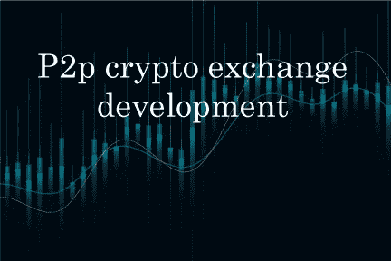
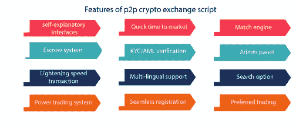
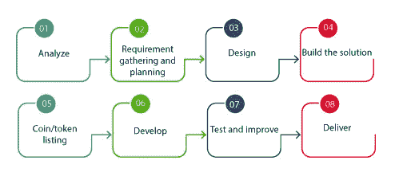
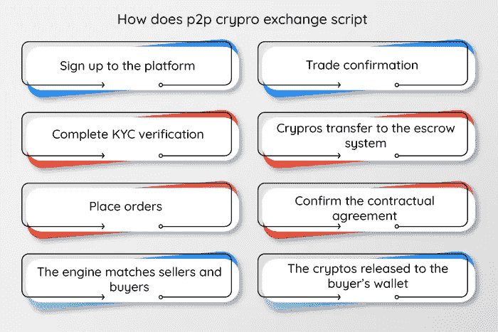

# P2p 加密交换开发完全指南

> 原文：<https://medium.com/geekculture/a-complete-guide-for-p2p-crypto-exchange-development-d9d36be1f2b5?source=collection_archive---------13----------------------->

随着对安全和分散的交易空间的需求的增加，p2p 加密交换被引入到加密领域。在这些交易所中，用户直接交易，没有中介的干扰。由于分散的交换使得更安全和可靠的对等交易成为可能，对 p2p 加密交换开发的需求增加了。

P2p 加密交换软件旨在解决集中式交换中缺乏安全性的问题。它既可以作为托管系统，也可以作为智能合同协议。它引进了最好的安全措施。因此，许多交易者加入点对点交易，在那里他们可以匿名和安全地交易。

# 什么是 p2p 加密交换脚本？

被称为 p2p 加密交换的对等加密交换是卖家和买家可以直接交易的交换。除了 p2p 交易平台给市场带来的所有优势之外，一个显著的好处是消除了任何第三方中介。 [**P2p 密码交易所发展**](https://radindev.com/p2p-crypto-exchange-script/) 打造可信、可靠、完全去中心化、透明的交易空间。

P2p 交换脚本开发可以根据您的业务需求进行 100%定制。p2p 加密交换脚本是一个交易空间，可以直接从钱包中进行交易。平台中的高级功能和高功能选项，方便交易。P2p 加密交换脚本开发被称为令人兴奋的被动生成器。

# 我们的 p2p 加密交换软件的特点

由区块链专家构建:我们的 p2p 加密交换开发是一个经过验证的高质量平台。它经过多重测试，并由最新的技术堆栈升级。

不言自明的界面:简单易用的界面可能是您的 exchange 脚本的一个优势。每个平台的界面都会给人留下该平台的功能和操作系统的第一印象。所以，记得把它开发的简单有吸引力。

托管系统:用户可以在 p2p 加密交换中以安全的方式进行交易，一旦交易双方履行了他们的合同协议，交易就不会有任何麻烦。

快速上市:一个克隆的 p2p 加密交换软件在几天之内就被开发出来并准备部署。这是克隆一个可以立即投入市场的加密交易所的一个很好的观点。

闪电速度交易:在 p2p 交换脚本中，交易者进行点对点交易，这消除了对授权的需要，并且与交易引擎相匹配，有利于提高交易速度。

KYC/反洗钱验证:KYC/反洗钱在 p2p 加密交换开发过程中的集成至关重要。因此，这种验证有助于管理员快速验证用户的配置文件。这避免了盗窃和洗钱。

多语言支持:一个可以支持多种语言的交换脚本意味着为交易者的爱好者提供最好的交流平台。每个用户在使用自己的语言时都有更好的用户体验。

匹配引擎:p2p 加密交换脚本由一个高级匹配引擎支持，该引擎可以将订单与最佳交易者匹配。它是平台的基石之一。

管理面板:管理面板的开发是为了方便用户的活动。有了高度先进的管理面板，用户的每一个活动都可以被跟踪。

搜索选项:p2p 加密交换开发中的高级搜索选项，帮助用户立即访问他们正在寻找的内容。一般来说，它可以方便搜索每个用户。

首选交易:通过开发首选交易，可以在 p2p 加密交易软件上实现平稳可靠的交易。交易者可以选择最匹配的交易伙伴进行交易。

无缝注册:该功能简化了注册过程。用户可以很容易地登录并开始交易。

电力交易系统:在 p2p 加密交换开发中，提供了一个健壮的电力交易系统。该选项支持与合适的买家买卖加密货币和 it 供应商。

## **P2P 交换脚本的安全特性**

监狱登录

双因素认证

KYC 认证

电子邮件验证

新设备管理

# **创建一个 p2p 加密交换脚本**

在**的** p2p 交易空间，用户可以完美地交易数字资产，其功能类似于流行的加密交易所。Radindev 提供了一个完全可定制并保持透明的 p2p 加密交换。您可以在任何可靠的区块链上开发您的 p2p 交换脚本，如以太坊、智能链、多边形、Tron 等。

在 p2p 加密交易开发中，智能合约和托管系统在提供交易空间的安全性方面起着至关重要的作用。它由匹配引擎支持，因此订单与最好的交易者匹配。p2p 加密交换脚本开发中的一个好方法是扩展托管系统。

# 为什么要克隆一个 p2p 加密交换软件？

P2p 加密交换脚本具有去中心化的性质，这导致大多数加密交易者转向 dex 平台，如 leading dex、 [**pancakeswap**](https://pancakeswap.finance/) 。随着此类平台的流行，创建 p2p 加密软件的需求也在增加。

在加密领域有很多可靠的平台，比如币安和 paxful，你需要选择它们来开始 p2p 加密交换开发。它们执行一个安全和透明的功能系统，许多投资者希望有这样一个具有类似特征的混合功能系统。克隆一个 p2p 加密交换脚本开发是最简单的和现成的市场解决方案，它可以帮助你立即启动你理想的加密交换。

在 p2p 交易脚本中，我们试图利用任何市场潜力来增加你的平台成功的机会。当你克隆一个加密交换时，你不仅仅是开发平台的确切特征和功能，你还试图实现原始平台的成就。

# 如何开发一个 p2p 加密交换脚本？

从头开始:从零开始的 p2p 加密交换开发允许您拥有自己的%100 纯交换脚本，并开发在所需功能系统中运行的任何所需功能。但是从零开始创建 p2p 加密交换软件的一个主要问题是分配的时间更长，费用更高，这不是每个创业公司和企业都能负担得起的。因此，作为一个更好、更实惠的解决方案，我们建议使用克隆脚本交换。在下一部分阅读它。

使用克隆脚本:克隆脚本加密交换是一种预制的交换，可以在不到一个月的时间内以可承受的成本为公众部署。克隆脚本平台是一个一站式解决方案，以预算友好的成本实现您的加密目标。它可以根据您的需求完全专门化，以满足您的业务目标。您可以选择特定操作系统所需的框架，并对其进行相应的定制。

## **P2P 交换脚本的开发过程**

分析:p2p 加密交易开发前的第一步，搜索和分析市场。

需求收集和计划:对你的业务目标和细分市场有一个清晰的战略。

设计:一个有吸引力的和易于使用的界面带来更多的用户到你的 p2p 加密交换软件。

构建解决方案:在区块链环境中开发 p2p 交换脚本解决方案。解决包括法律政策在内的重要问题。

硬币/代币列表:在您的对等交换脚本中选择并列出您需要的硬币和代币。

测试和改进:测试您的 p2p 加密交换脚本的可用性和无错误性能。您可以向平台添加更改。

交付:将您的 p2p 加密交换开发的最终产品部署到 IT 环境中，由我们的专家开发团队进行更新和更改。

# **P2P 加密交换脚本开发对你的业务有什么好处？**

匿名和隐私

高投资回报率

强大的交易引擎

没有中介

低交易费用

多种支付方式

集成数字钱包

高透明度

无懈可击的安全措施

# **P2P 交换功能是怎样的？**

在 p2p 加密交换脚本中，用户可以直接交易，没有第三方的干扰。用户无需中央授权即可进行交易。他们可以直接从他们的加密钱包交易。大多数加密交换都是通过区块链技术开发的。这种交易让你对资金有更多的控制权，因此在交易时，你可以对数字资产有更多的控制权。

p2p 密码交易开发中的托管系统也是为了安全交易。虽然 p2p 加密交换软件中的交易是通过智能合约及其安全协议进行的，但高级安全功能仍可用于更好的用户体验。

# **P2P 加密交换软件的工作流程**

用户需要注册并填写验证 KYC 和反洗钱。然后登录到交易所，以便他们可以启动交易过程。用户可以发布他们的订单，包括卖出订单、买入订单以及广告。参与者还可以从列出的订单中进行选择，活动消息将发送给卖方或买方。

当交易者提示交易时，资产被转移到第三方托管系统，因此，在支付完成后，买方可以收到资产。交易引擎将买方的交易与相应的卖方的交易相匹配。一旦交易双方就合同条款达成一致，资产将转移到买方的钱包中。由于 p2p 加密交换开发中没有托管部署，平台将缺乏安全性。

买方为购买的资产支付商定的最终价格。一旦第三方托管收到卖方的确认付款，买方就会收到由第三方托管系统存储的购买资产。如果在 p2p 交易脚本中交易时出现问题，交易的每一方都可以提出争议，因此管理员可以发展和解决问题。

# **P2P 交换软件是用来做什么的？**

P2p 加密交换软件是一个值得大肆宣传的解决方案，可以帮助创业公司或投资者被动创收。它可以由负担得起且可定制的白标版本创建。因此，p2p 加密交换开发听起来像是一项明智的长期投资。

对等加密交换用于高度安全的交易过程。它既安全又方便，具有高端安全原则和高级功能。用户可以直接从钱包里交易，同时他们可以完全控制自己的资金。在 p2p 交换脚本中，交易不需要中央权威机构。

# **P2P 加密交换软件的利与弊**

优势

多语言支持

支付网关

管理面板

多因素认证

不足之处

低流动性

交易速度变慢

# **结论**

通过请求我们的任务驱动平台，进入蓬勃发展的 p2p 克隆交换脚本。我们的 p2p 加密交换开发基于最新的技术堆栈。点对点交易消除了第三方的干预，从而带来了更安全的交易空间。开始交易时，用户倾向于选择功能最好的加密交易脚本。因此，选择正确的交易所提供商公司将引导您走向更高的受众平台。

如果你在市场上寻找一个突出的加密交易所，p2p 加密交易所脚本开发是解决方案。我们可以开发一个令人难以置信的克隆 p2p 加密交换软件，让你相当成功地开始这项具有挑战性的任务。