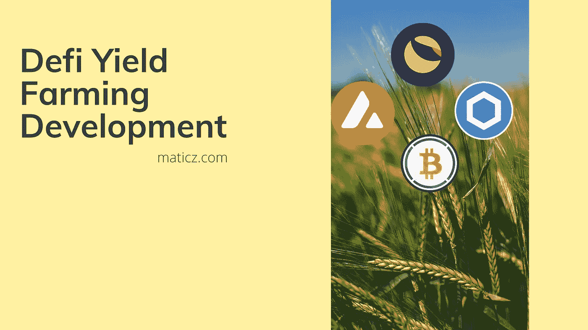

# 低产农业发展完全指南

> 原文：<https://medium.com/geekculture/a-complete-guide-of-defi-yield-farming-development-67a0427b6854?source=collection_archive---------14----------------------->

Defi 技术实施至今，对密码市场产生了更大的影响。因此，它在金融体系中做出了更令人钦佩的改变。通常在传统的银行部门，人们可以把他们的钱投资到储蓄存款或定期存款中，从银行赚取一些利息。同样的概念在密码行业被称为 Defi 产量农业。如果任何人都可以将加密硬币或令牌放入去中心化的应用程序(例如 DApp ), DApp 就包括加密钱包、dex、去中心化的社交媒体等等。通常情况下，农民选择 Defi exchange 来借出、借入或押注硬币，以赚取利息。这些活动与双方或多方之间的自动执行智能合同结合在一起。

# 高产农业的类型

1.  流动性提供者:如果用户将两枚硬币存入 DEX 以提供交易流动性。Defi 交易所收取少量费用来交换支付给流动性提供者的两个代币。有时，这些费用可以用新的流动性池(LP)代币支付
2.  贷款:这种贷款过程是一种加密硬币或令牌，可以在智能合同的帮助下借给加密借款人，并从贷款中赚取利息
3.  借款:用户可以使用一个令牌作为抵押品，从另一个令牌获得贷款。这种信用代币可用于农业生产。农民保持他们的持有量，在一段时间内可能会增加，同时也会增加借来的硬币。
4.  赌注是在 crypto 上赚取被动收入的一种众所周知的方式。当您将数字资产或代币投入流动性池时，它们将作为 LP 代币获得佣金奖励。

# 为什么高产农业得到蓬勃发展？

高产农业繁荣的原因是 COMP Token 的推出，这是一种复合金融系统的治理令牌。治理令牌为令牌持有者授予治理权限的许可，但是在分散的区块链中，治理令牌的分配方式通常带有流动性激励。Yield Farming 的主要成功是通过持有数字资产来提供流动性代币。它在 Defi 部门进行了更多的改革，以获得更多的关注，并对价格波动产生了更大的影响。

# 市场上著名的 Defi Yield 农业平台和协议

## 曲线金融

该曲线是最高的 Defi 平台，因为它收购了总价值近 190 亿美元的 Defi 资产。可信赖的互换者和流动性供应商都获得了这个平台。这种信任增长原因是专门为高效稳定的硬币互换而设计的。它允许用户以相对较低的滑点进行高市场价值的稳定的硬币互换。

## Aave

Aave 是借贷的分散协议之一。Aave 代币利率根据当前市场趋势进行算法调整，并且它还提供快速贷款的高级功能特性。这些 Defi 协议被大多数从事借贷等活动的 Defi 农民所使用。

## Uniswap

Uniswap 是著名的分散式交换协议之一，它允许用户与不可信用户进行令牌交换。流动性提供者可以投资等值的两个代币来建立一个新的市场。这个平台让交易者可以针对流动性池进行交易。作为贡献流动性的回报，流动性提供者从交易员那里获得费用这发生在一个资金池中。

## 薄饼交换

Pancakeswap 与 Uniswap 最为相似。它也运行在币安智能链(BSC)网络上，而不是以太坊上。在更多的增值功能，如不可替代的令牌(NFT)，BSC 令牌交换，赌注池等。如果你的赌注代币当 Pancakeswap 奖励代币被称为蛋糕。

# 它是如何工作的？

一般人认为收益农业是投资加密货币、代币和稳定硬币，而不是收益农业。将数字资产借给 Defi 协议，并形成赚取利息或奖励的赚钱机会，这就是收益农业。在简单的 Defi yield farmer 中，扮演一个银行的角色，向 Defi 市场出借硬币和代币。它将为贷款人提供利息或象征性奖励。高产农业的主要支柱是一个区块链驱动的智能合约，它连接借贷双方，并处理支付给投资者的回报。

# 市场上著名的 Defi 令牌列表

1.  土地
2.  雪崩
3.  包装比特币
4.  奶妈
5.  链环
6.  Uniswap
7.  复合的
8.  SushiSwap
9.  制造者
10.  Aave

# 结论

高产农业是 Defi 行业的新兴技术。在每个行业都有不同形式的风险发生，但每一个风险都是你解决问题以获得成功的机会。就像这样，发展农业是一种在你的职业生涯中获得胜利的有趣方式。我们 Maticz technologies 是一家领先的[Defi Yield Farming Development](https://maticz.com/defi-yield-farming-development)公司，拥有一支独特的团队，在全球范围内提供一流的功能和满意的客户。我们的 Defi 开发人员是所有主要区块链智能合约开发的主要参与者，这将使我们能够提供一个完整的产量农业平台，支持主要的以太坊、EOS、Solana、基于[的 Defi 代币](https://maticz.com/defi-token-development)和硬币