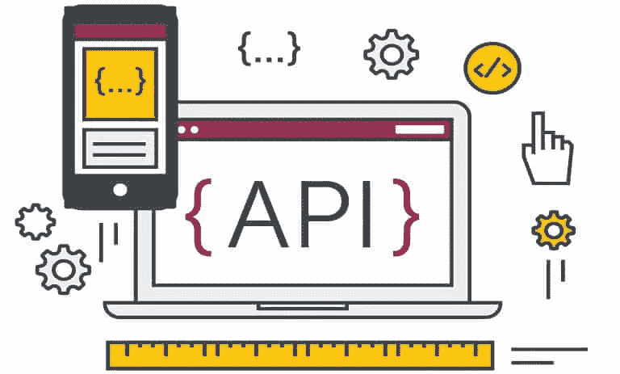

# 关于如何在加密市场使用加密货币 API 的完整指南

> 原文：<https://medium.com/geekculture/a-complete-guide-on-how-to-use-the-cryptocurrency-api-in-the-crypto-market-b25c964f79d0?source=collection_archive---------10----------------------->

什么是 API？

API 是“应用程序编程接口”的缩写，在波斯语中翻译为“应用程序编程接口”。数字货币 API 和公共 API 是软件互相沟通的手段，也是最好的交易工具之一。换句话说，它就像一个信使。

API 像信使一样在所有生态系统中发挥作用

在任何系统中，API 首先接收来自人的请求，然后尽可能快地将其传送给系统。最后，它将系统的响应或回应传送给人。请注意下面的例子，以便更好地理解数字货币 API 的工作原理。

假设你要从一个网站上预订航班。为此，您必须首先进入特定网站，并将您想要的航班信息输入系统，例如航班日期和目的地。在这一阶段，网站会比较所有航空公司数据库中的航班信息，为您的请求准备答复。这些信息和结果只能通过航空公司的 API 获得。

什么是加密货币 API？

数字货币 API 是数字货币交易的重要组成部分之一。这一集证明了数字货币交易生态系统的演变。例如，在进行交易和买卖密码时，您只能通过使用数字货币 API 与您想要的交易所进行通信。

使用数字货币 API 轻松进行货币交易

总的来说，可以说数字货币 API 是为了方便交易和货币交易而设计和实现的。还有一点很重要，就是谁用都无所谓。换句话说，你既可以作为加密程序的开发者使用数字货币 API，也可以作为加密货币的交易者和积极参与者。

在 Cryptos 的世界里，API 也叫 CryptoAPI。加密货币 API 或 [CryptoAPI](http://apie.io) 允许您从交易所访问数据。

API 在加密货币中的应用

既然你已经理解了数字货币 API 的概念，那就更好的去熟悉它的应用了。正如我们在上一节中提到的，通过在数字货币的世界中使用 API，您可以连接到您选择的交易所并与之通信。此外，您还可以在数字货币 API 的帮助下管理您的帐户并进行交易。同时，它为您提供了同时访问市场上所有可用数据的可能性。

获取市场上所有可用的数据

有两种不同类型的数字货币 API:价格 API 和加密货币买卖 API。因此，数字货币交易所可以向其用户提供数字货币的过去和当前价格数据。同样值得注意的是，大多数加密交易所都为用户提供了用于买卖的实时加密货币 API 文档。

API 在数字货币和加密货币领域的另一个用例是，交易者可以使用中介平台并在 API 的帮助下进行交易。为了更好地理解这个应用程序的概念，请注意这个例子。数字货币钱包允许用户在数字货币 API 的帮助下，通过使用内部转移、购买和出售的能力，来交易他们钱包中的数字货币。此外，无需直接进入所需的交易平台。

什么是 API 键？

加密货币 API 与所有其他应用程序需要相同的东西。第一个也是最重要的选项是 API 密钥。当您打算通过 exchange 应用程序进行货币交易和买卖数字货币时，您必须首先创建一个 API 密钥。API 密钥是由数字和相连字母组成的代码或短语。您可以在相关部分输入数字货币的 API 功能。

API 名称

有效期和激活期限:数字货币 API 密钥默认激活 90 天，在此期间可以使用。但是，如果您打算考虑缩短激活数字货币 API 密钥的时间，您可以将此时间更改为 15 天、30 天或 60 天。

**设置权限:**加密货币 API 密钥默认为只读。您可以在创建时为其启用交易和提款权限。关键的一点是，如果你选择了提现和交易选项，并开放其访问，你应该更加勤奋地维护你的 API 密钥的安全性，并指定授权的 IP 并输入。

**允许的 IP:**如果您在上一步中激活了取款许可，则必须通过这一步。这一步，对于两步认证，需要输入发送到你邮箱和手机的一次性密码。此外，您应该注意，在完成数字货币 API 创建过程后，您只有一次机会查看和复制您的 API 密钥。

加密货币世界中的 API 全新的体验

考虑到数字货币世界在过去几年中的增长，很自然会期待加密货币交易生态系统的大量发展。加密货币 API 是这种发展的明显例子之一。有了这个账户，你就可以等待大型投资公司进入加密货币市场，看看数字货币 API 和算法交易的使用会如何增加。

选择所需的钱包和交易所后，您应该考虑在您选择的交易所中创建一个数字货币 API 来执行货币交易。还有，之后可以进行各种转账，买卖，获取全球市场统计，市场订单，最新市场交易列表，市场及其状态列表等信息。在本文中，我们向您介绍了数字货币 API 及其在加密货币市场中的使用。