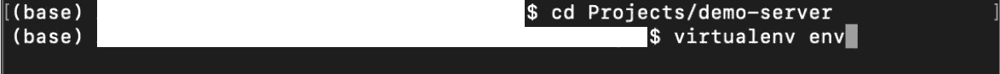
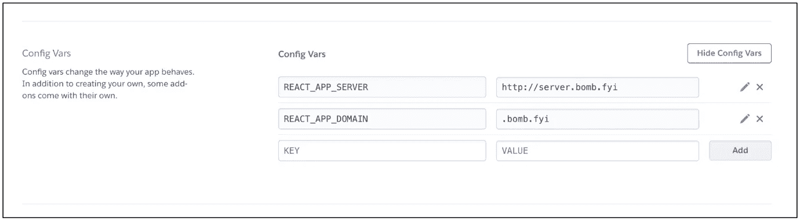
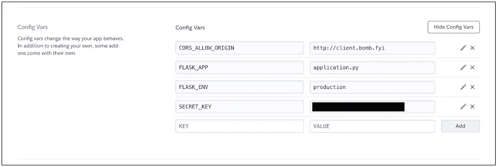

# 使用 React、Flask 和 Heroku 构建和部署自己的网站的完整指南

> 原文：<https://medium.com/geekculture/a-complete-guide-to-building-and-deploying-your-own-website-with-react-flask-and-heroku-bc002dd94787?source=collection_archive---------7----------------------->

Photo by [Christopher Gower](https://unsplash.com/@cgower?utm_source=medium&utm_medium=referral) on [Unsplash](https://unsplash.com?utm_source=medium&utm_medium=referral)

把你的作品展示给别人看是一件神奇的事情。有一种深深的自豪感，伴随着你可以让任何事情发生的感觉——相信你可以打造下一个伟大的服务、产品、想法或公司并不是太疯狂。

但是也很容易觉得自己没有知识或工具来实现这一点。如果有人把最基本的神圣知识公之于众，你就可以去比赛了！当我第一次学习如何构建 web 应用程序时，我就有这种感觉。在网上资源和教程的前几周，我找到了很多很棒的资源，但没有一个是整合的。我找不到任何能给我空间让我按照自己的方向使用教程产品的东西。我发现了很多错误，并且没完没了地查阅旧的 StackOverflow 线程。

更不用说我想构建一个有点不寻常的东西——一个反应瓶应用程序。这个超级强大的 web 开发圣杯将有一个 React JS 前端(客户机)和 Flask Python 后端(服务器)。想象一下，最强大的 JavaScript 工具与最强大的 Python 工具(在我看来)一起为您服务。可能性是无限的！

本演练将整合我花了几十个小时搜索如何构建部署在 Heroku 上的 React-Flask 应用程序。在演练结束时，您应该有类似于 [this](http://client.bomb.fyi) 的东西(不要介意域名，这只是我放在身边的一个备用的)。希望你能利用这篇教程轻松地启动你的下一个伟大的想法！

# 入门指南

[Flask](https://flask.palletsprojects.com/en/2.0.x/) 是一个构建网络应用的微框架。Flask 有着广泛的应用，但是今天我们将集中使用它来构建我们网站的服务器端。 [React](https://reactjs.org/) 是一款构建动态用户界面的工具。这将为我们网站的发展打开一个巨大的可能性领域。如果你已经熟悉 HTML，它非常容易掌握，如果不熟悉，也有很好的特定用例文档。我们将使用 React 来增强我们网站的客户端。我们的 React 客户端将使用 [Fetch API](https://developer.mozilla.org/en-US/docs/Web/API/Fetch_API/Using_Fetch) 向我们的 Flask 服务器发出请求。所以让我们开始建设吧！

所有的[前端](https://github.com/Baloguna16/demo-client)和[后端](https://github.com/Baloguna16/demo-server)的代码都将在 Github 上提供，并在本教程的末尾链接。我们将在本教程的剩余部分解释这些存储库是如何构建的。

# 构建砂箱侧

我们从烧瓶那一边开始。我创建了一个文件夹来存放后端代码。我进入这个文件夹，用终端命令`virtualenv env`在文件夹里创建了一个虚拟环境。这将存储驱动后端的 python 包。你可以在 **requirements.txt** 中找到需求列表。

Entering the folder and creating an env folder

Flask 配置了一组环境变量。这通常保存在一个名为**的文件中。env** 。您还可以使用该文件将其他变量注入到您的应用程序中。这对于存储 API 密钥并保持它们的秘密非常有用。您不想上传您的**。env** ，环境文件夹，或者其他一些缓存文件到 Github。这些文件要么包含敏感信息，要么对试图运行你的应用的其他人来说是垃圾文件。我们可以用**。gitignore** 阻止这些文件公开。

接下来，我们将在工厂设计模式中构建应用程序的结构。你可以在这里阅读更多关于这个设计模式的信息[。我们将使用](https://flask.palletsprojects.com/en/2.0.x/patterns/appfactories/) [CORS](https://developer.mozilla.org/en-US/docs/Web/HTTP/CORS) 来限制谁可以向我们的服务器发出请求。烧瓶-CORS 是完成这项任务的绝佳资源。CORS 对于构建安全的 web 应用非常重要。它防止恶意参与者调用您的 API。这一点很重要，原因比我们在本演练中所能涵盖的还要多。

These CORS settings are essential. CORS_ALLOW_ORIGIN must be set to the domain of your client side while CORS_SUPPORTS_CREDENTIALS must be true to accept cookies from the client. More on the importance of cookies to follow.

我们将在 **utils/config.py** 中为我们的应用和 CORS 配置设置。此外，对于我们的受保护路由，我们将请求一个特殊的会话令牌，当客户端请求 */get/unprotected* 时提供。受保护的路由将由名为 **auth_required** 的装饰器包装。这个装饰器在传入的请求头中寻找会话令牌。它的灵感来自于 Flask API 文档提供的一个类似的装饰器，绝对值得一看！

Auth_required is a decorator which looks for the ‘sessionToken’ in the request header sent by the client. This is how most apps handle user authentication after login and between requests.

否则，我们可以在 **routes/main.py** 中看到简单应用程序的代码。

We will have three routes that are powered by our server: unprotected, protected, and post.

我们几乎完成了我们的 Flask 服务器！在根文件夹中，我们将创建一个名为 **application.py** 的文件，该文件将从在 **__init__ 中创建的工厂中生成我们的应用程序。py** 。我们还将创建一个 **Procfile** 。Heroku 需要这些来托管我们的服务器。现在说说客户端。

# 构建反应侧

react 团队和脸书制作的[**create-React-app**](https://create-react-app.dev/)包使得构建前端变得简单。我们可以用它来快速启动客户端，然后在必要的地方进行裁剪和添加。我用`npx create-react-app demo-client` 做了这个，其中**演示客户端**是文件夹的名称。

从包中删除一些不必要的文件后，我们将有一个准系统 React 应用程序。我们将使用一些简单的样式，包含在 **index.css、**中，并且我们将使用`yarn add bootstrap`安装 bootstrap 以使构建更快。我们还需要[**react-router-DOM**](https://reactrouter.com/)来处理我们的多个页面，还需要 [**js-cookie**](https://github.com/js-cookie/js-cookie) 来处理 cookie 设置。

我们的每个页面都将被表示为组件，在 App.js 中相遇。您会注意到一个组件用于未受保护的页面，一个用于受保护的页面，一个用于从客户端发布数据，还有一个登录页面。这些组件构建在[功能模式](https://www.freecodecamp.org/news/functional-components-vs-class-components-in-react/)中，有关每个组件中发生的事情的更多信息，请参考 React JS 文档。

目前，我们只是对观察数据如何在客户机和服务器之间发送感兴趣。这对于受保护的页面尤其重要，因为它需要在请求头中发送凭证。

The session token is received from the server and set using js-cookie. When you build you app, you’ll need to use HTTPS and set a ‘secure: true’. [This seems to be a feature of cookies](https://developer.mozilla.org/en-US/docs/Web/HTTP/Headers/Set-Cookie/SameSite) where ‘secure’ cannot be false while ‘samesite’ is ‘none’. Samesite must be ‘none’ for this application structure to work. You can add HTTPS to your Heroku apps by upgrading from the free tier to the hobby tier. I have not done this for the example in this article.

The cookie previously set is pulled from the browser and sent with the request to the server. This only works because the server and client have the same domain: ‘.bomb.fyi’ and both have HTTPS, or SSL certificates.

我们几乎完成了我们的反应方面！让我们创建一个**。env** 文件，这样我们就可以在应用加载时注入服务器的地址。React 要求应用程序中引用的环境变量以“REACT_APP_*”开头。要在应用程序中访问该变量，我们使用如上所示的“process.env.REACT_APP_*”。现在让我们部署！

# 转移到 Heroku

有大量的[现有资源](https://devcenter.heroku.com/articles/git)涵盖了如何在 Heroku 上部署。我假设你已经有了一个 Heroku 的账户，已经配置好了，并且知道如何推送到 Heroku。

我们的项目需要知道的关键事情是，我们将部署**两个** Heroku 应用程序:**一个用于我们的 React 端**和**一个用于我们的 Flask 端**。一旦您部署了这些存储库，我们将进入它们的每个设置，并在 *Config Vars* 选项卡下更新它们的环境变量。你还需要[给每个 Heroku 应用程序他们自己的自定义域](https://successengineer.medium.com/how-to-setup-heroku-with-godaddy-d8e936d10849)来让 cookies 工作。

Environment variables for the React side, hosted at [http://client.bomb.fyi.](http://www.bomb.fyi.) This is just for demo. Your app will use HTTPS which will allow credential cookies to be sent between the client and server.

Environment variables for the Flask side, hosted at [http://server.bomb.fyi.](http://server.bomb.fyi.) Again, this is just for demo. Your app will use HTTPS while will allow credential cookies to be sent between the client and server.

我们快完成了。对于我们的 React 应用程序，我们还需要使用一个名为'[https://build pack-registry . S3 . amazonaws . com/build packs/mars/create-React-app . tgz](https://buildpack-registry.s3.amazonaws.com/buildpacks/mars/create-react-app.tgz)'的特殊构建。你可以在 Heroku 中 React 应用的设置中的 *Buildpacks* 标签下搜索这个。这个构建包使得在 Heroku 上部署 **create-react-app** 的实例变得容易。

# 包扎

如果你做的一切都正确，你应该会得到一个像[这个](http://client.bomb.fyi)一样的网络应用！因为我的客户机和服务器没有 SSL 证书，所以不会设置凭证 cookies，受保护的页面会拒绝您。我这样做是为了节省这个演示应用程序的成本:)，但你的项目应该为 HTTPS 设置 SSL！

如果您的客户端似乎没有与您的服务器通信，您很可能有一个 cookie 问题。如果你使用的是 Chrome，你可以通过查看“应用程序”下的开发者工具来查看浏览器中是否设置了 cookie。这种 React-Flask 应用程序结构要求客户机和服务器驻留在同一个定制域中，使用不同的子域和 SSL 证书。在 React 应用程序中，cookie 应该设置为 *samesite=none* 和 *secure=true* 。如果你打开你的开发者工具，你没有看到“sessionToken”作为你的 cookie 之一，那么你可以确定你的浏览器拒绝了 React 试图设置的 cookie。Cookie 权限很难，但它们是为了防止恶意行为者攻击你的应用。

希望你发现这篇教程很有帮助，祝你下一个伟大的项目好运！