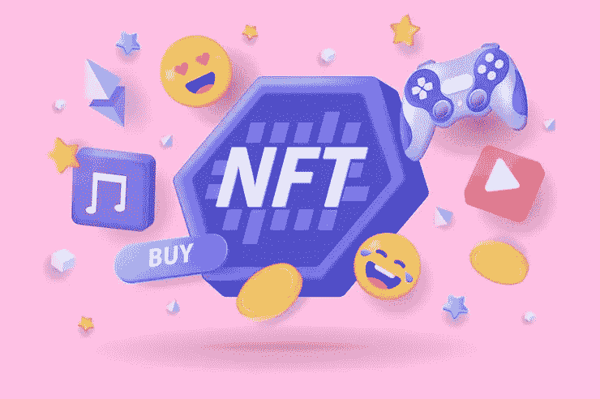
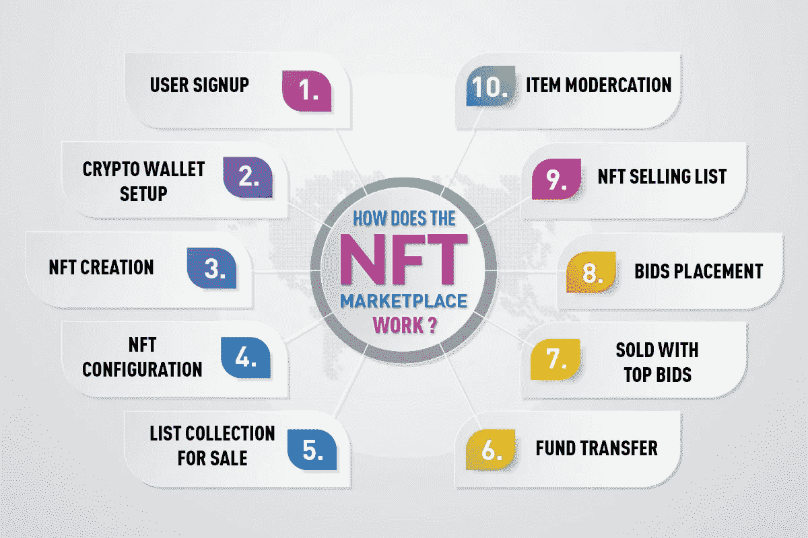

# 一个完整的指南，以提升你的业务在网络 3 市场与 NFT 市场的发展

> 原文：<https://medium.com/geekculture/a-complete-guide-to-escalate-your-business-in-the-web3-market-with-nft-marketplace-development-a153279095cc?source=collection_archive---------17----------------------->

社交媒体巨头 Twitter 最近宣布，它将允许用户与 marketplaces 合作，通过 tweets 直接购买、出售和交易 NFT。NFTs 将在应用程序的 Tweet Tiles 功能上可用。Instagram 已经宣布，它将允许用户连接他们的钱包，并在平台上共享 NFT。

NFT 的巨大增长鼓励了 Twitter 和 Instagram 等科技巨头进入 NFT 领域。特别是在 NFT 繁荣之后，数字领域对非功能性翻译的需求直线上升。由于全球对非正规金融服务的兴趣，对 NFT 市场的需求也大幅增长。因此， [***NFT 市场发展***](https://bit.ly/3NkPeSd) 已经成为 NFT 最成功的商业冒险之一。

## **NFT 市场**

简单来说，NFT 市场是一个用户存储、销售、购买和购买 NFT 的平台。这是一个网络平台上的虚拟展览。区块链将平台上的所有交易存储在其节点上。平台上的所有这些交易都是通过智能合约执行的，没有任何第三方的介入。

 [## NFT 市场开发公司服务| NFT 市场开发| NFT 市场…

### NFT 市场的发展正在塑造即将到来的创业公司的未来，以在竞争中胜出。构建您自己的…

bit.ly](https://bit.ly/3NkPeSd) 

## **NFT 市场的特点**

➺ **可交易性:**由于它们的互操作性，NFT 可以在不同的市场进行交易。买家也可以从这些非功能性交易的二次销售中获益。

➺ **标准化:**标准化通过使开发人员能够对 NFT 使用通用的可重用标准，为 NFT 提供了基本的功能。

➺ **流动性:**NFT 可以即时交易，为资产提供高流动性。

➺ **可互操作:** NFT 令牌标准使 NFT 能够与多个区块链网络交互。这使得非金融债券可以在各种 NFT 市场交易。

➺ **可控性:**NFT 是完全可编程的，就像传统资产一样。今天的非功能性测试有一个复杂的制作和修复机制。

➺ **稀缺性:**通过智能合约，你可以限制非金融资产的供应，并强制执行铸造后无法伪造的资产，以保持非金融资产的独特性。

## **NFT 市场的特点**

➺ **用户简介:**所有用户，无论是购买者还是创造者，都应该在 NFT 市场上创建一个账户。用户拥有的资产及其详细信息显示在此用户配置文件中。

➺ **虚拟展览:**数字艺术家可以在 NFT 市场的虚拟展览中展示他们的作品。

➺ **数字钱包:**通过集成的数字钱包，用户可以存储他们的数字资产，并在平台上使用它们进行交易。

➺ **列表:**卖家可以铸造他们的代币，并可以在平台上列出来卖给 NFT 收藏家。

➺ **拍卖:**用户也可以在平台上拍卖他们的非专利技术。感兴趣的买家可以出价并跟踪出价状态。

➺ **搜索和分类:**用户可以通过平台上的高级搜索选项轻松搜索他们想要的 NFT。用户可以应用价格、所有权历史和利基等过滤器来搜索他们正在寻找的 NFT。非功能性艺术也被归类为数字艺术、生成艺术等。

➺ **评级:**NFT 市场中的评级功能对平台上的新来者有很大帮助，因为它们可以帮助买家了解产品的可信度。

➺ **交易历史:**用户可以通过该功能访问平台上的交易历史。交易历史功能包括价格、日期、卖家等细节。

➺ **空投:**通过空投功能，创作者和销售者可以组织空投，向潜在买家推广他们的 NFT。

➺ **推送通知:**用于提醒平台用户关于新的更新、新的出价、销售等。

## **如何启动 NFT 市场**

在进入 NFT 市场发展之前，进行基础研究并决定你的 NFT 平台的组成部分。

***下面是 NFT 市场开发流程的简化路线图:***

➺ **目标利基:**为你的 NFT 市场选择一个垂直市场而不是水平市场。为平台选择一个通用的利基可以扩大你的受众。

➺ **定义项目和设计:**所有的 NFT 市场开发过程都从项目文档开始。定义你的项目，决定你的市场的设计方面。

➺:用户界面/用户体验设计:你可以从构建平台的用户界面原型开始。要特别注意你平台的用户界面/UX，因为用户体验在你平台的整体成功中扮演着重要的角色。为用户设计一个复杂而友好的界面，让他们可以无缝地浏览你的平台。

 [## NFT 市场开发公司服务| NFT 市场开发| NFT 市场…

### NFT 市场的发展正在塑造即将到来的创业公司的未来，以在竞争中胜出。构建您自己的…

bit.ly](https://bit.ly/3NkPeSd) 

➺ **发展过程:**接下来是你的非功能性营销市场的发展阶段。找到一个适合您业务的框架，让一个熟练的开发团队为您的 NFT 市场进行前端和后端开发。此外，为平台创建智能合约，并集成您的平台的前端和后端。

➺ **测试:**测试阶段检测平台上的错误和缺陷。与专家 QA 团队一起在平台上运行多项测试，检查错误和错误，并检查平台的功能。

➺ **发布:**一旦你解决了平台上所有的错误和缺陷，你就可以部署这个平台供公众使用了。此外，确保你根据用户反馈不断更新你的平台。

## 建立一个 NFT 市场的成本是多少？

建立一个 NFT 市场的成本取决于你的需求和完成这样一个项目所需的工作量。如果你计划在规定的预算内发展你的 NFT 市场，那么选择白标解决方案可能是一个明智的选择。白标解决方案可以立即推出，同时还可以通过 NFT 市场开发为您节省时间和资金。

## **包装完毕，**

由于 NFT 市场已经在短时间内达到了 10 亿美元的上限，许多企业家和科技巨头已经开始进入 NFT 市场。随着最近 NFT 的趋势和新兴的加密市场，NFT 市场的发展可以在 Web3 领域获得很高的回报。如果你计划开发自己的 NFT 市场，但对开发过程有所怀疑，那么雇佣一家专业的 NFT 市场开发公司可以帮你理清思路。