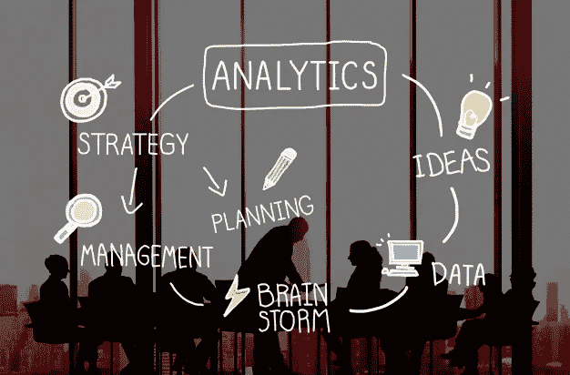

# 线性回归完全指南

> 原文：<https://medium.com/geekculture/a-complete-guide-to-linear-regression-cfa984055671?source=collection_archive---------4----------------------->

## 涵盖线性回归的所有基础知识

The picture on [Freepik](https://image.freepik.com/free-photo/analytics-comparison-information-networking-concept_53876-15846.jpg) by [rawpixels](https://www.freepik.com/rawpixel-com)

对于我们许多人来说，数据科学领域的旅程是从[线性回归](https://en.wikipedia.org/wiki/Linear_regression)开始的。我觉得线性回归在概念上是数据科学中最完整的主题之一，因为它引入了线性、非线性、特征独立性、[多重共线性](https://en.wikipedia.org/wiki/Multicollinearity)、[自相关](https://en.wikipedia.org/wiki/Autocorrelation)、[多元正态性](https://en.wikipedia.org/wiki/Normal_distribution) …