# 假设检验之一的 T 检验完全指南

> 原文：<https://medium.com/geekculture/a-complete-guide-to-the-t-test-one-of-the-hypothesis-tests-6a72d741957e?source=collection_archive---------19----------------------->

T-test 背后的直觉指南，它的定义，公式，手工实现使用公式和使用 Scipy 库。

Photo by [Vladislav Babienko](https://unsplash.com/@garri?utm_source=medium&utm_medium=referral) on [Unsplash](https://unsplash.com?utm_source=medium&utm_medium=referral)

## 主题

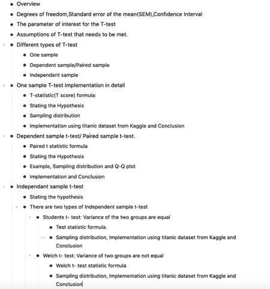

## **概述**

t 检验，就像 Z 检验一样，是对连续变量进行的统计假设检验。T 检验有时比 Z 检验更现实，主要原因如下:

1.  我们可能并不总是有大量的样本(大于 30):在很多实时场景中，我们希望找到一些与较小样本相关的东西，并且数据不是正态分布的。
2.  我们很少会知道人口方差。比方说新加坡的平均智商是 107，要得到新加坡每个人的智商记录是不现实的。在一般人群中，方差大多是未知的。

T 检验也是一种参数检验，因此来自总体的数据假定了某种概率分布标准。T-test 需要有一个 t 分布，对于较小的样本量，t 分布是相当对称的，具有较厚的尾部。当涉及更大的样本量时，分布将更接近正态分布。

在进行 T 检验之前，我们需要熟悉几个术语，如自由度、SEM、置信区间。

**自由度(df)**

自由度是数据样本中可以自由变化的最大数值。

例如:我们必须选择 3 个平均数为 10 的数字。现在我们可以自由选择任意两个数字:

*   我们可以选择 10，15，然后第三个数字必须是 5，这样平均值就是 10。
*   我们也可以选择 8，9，然后第三个数字必须是 13，因此平均值是 10。

所以最后一个数字必须是固定的，而 n-1 个值可以自由变化。

自由度= n — 1，n 是样本中的项目数(样本大小)

**平均值的标准误差(SEM)**

SEM 不是一个测量值，而是一个估计值。这是对数据的样本均值(平均值)可能与真实总体均值相差多远的推断。SEM 获取样本标准差，并除以样本大小的平方根。

*   SEM = s/ìn

s —样本标准偏差

n —样本量

**置信区间**

在统计学中，我们永远不可能 100%确定，关键在于我们对自己的决定有多自信。这就是为什么我们有一个置信区间，置信区间是一个我们相当确定我们真正价值所在的值的范围。

**T 检验感兴趣的参数是:**

平均值(μ):用于比较平均值。

*   比较样本平均值和总体平均值。
*   大多数情况下，将一组的样本均值与另一组的样本均值进行比较，以检验它们是否有显著差异。

**需要满足的 T 检验假设。**

1.  样本应该是来自总体的独立随机样本，以确保数据中没有偏差。
2.  T 检验主要在**总体**标准差/方差未知时使用。
3.  对于较小的样本量(小于 30 个样本量)，抽样分布应该具有 t 分布。当涉及更大的样本量时，分布将更接近正态分布。
4.  **样本**标准差已知。

**不同类型的 T 检验**

*   **一个样本** t 检验:将单个组的样本均值与已知均值或假设均值进行比较。
*   **非独立** **样本**t-检验/ **配对样本**t-检验:检验来自**同一组**的两个非独立样本的均值差异显著。
*   **独立样本** t 检验:检验两组中两个独立样本的均值差异是否显著。

注意:上述每种类型的 T 检验都在下面实现。我主要使用 titanic 数据集和 scipy 库实现了测试，也使用各自的测试统计公式从头开始实现了测试。

**1。一个详细的样本 T-test 实现**

将单个组的样本均值与已知总体均值或假设均值进行比较。

我们有一个铅笔生产单位，预计铅笔长度为 19 厘米。我们从生产线上随机抽取 25 件，检查长度是否与预期的 19 厘米有显著差异。

**T 统计量(T 得分)公式:**

*   x̄:样本均值
*   μ:总体均值
*   s:样本标准偏差
*   n:样本量

上式中的 s/√n 为均值的标准差。t-score 以样本均值的抽样分布上的标准误差单位来表示样本均值与总体均值之间的距离。t 统计量越小，我们获得的拒绝零假设的证据就越强

泰坦尼克号数据集:举个例子，我们将考虑一个新的说法，泰坦尼克号上幸存乘客的平均年龄是 29 岁。我们随机抽取了 15 个样本，看看我们是否有重要的结果来支持另一种理论。

**陈述假设**

H0:平均年龄是 29 岁:μ0 =29 岁

哈:平均年龄不等于 29: μ1 ≠ 29

让我们首先检查样本均值的抽样分布

**采样分布**

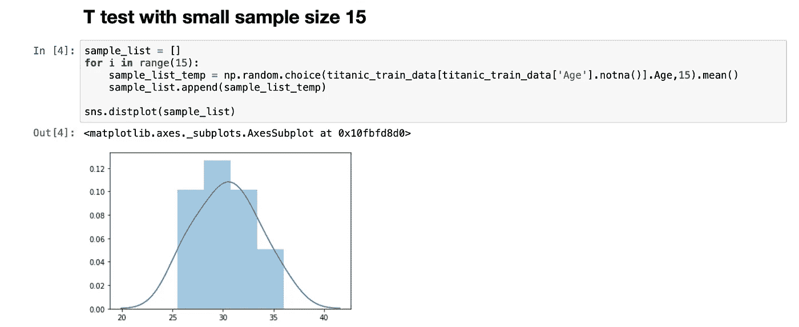

**实施**

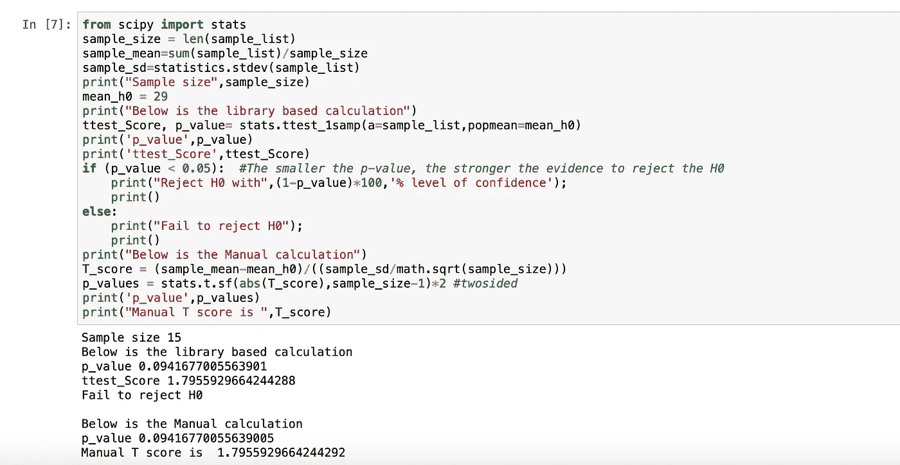

**结论**

当用 15 个样本进行测试时，我们没有显著的结果。

**现在让我们用大样本(100 个样本)对同一索赔进行 T 检验。**

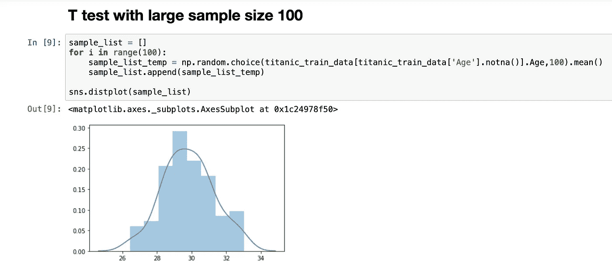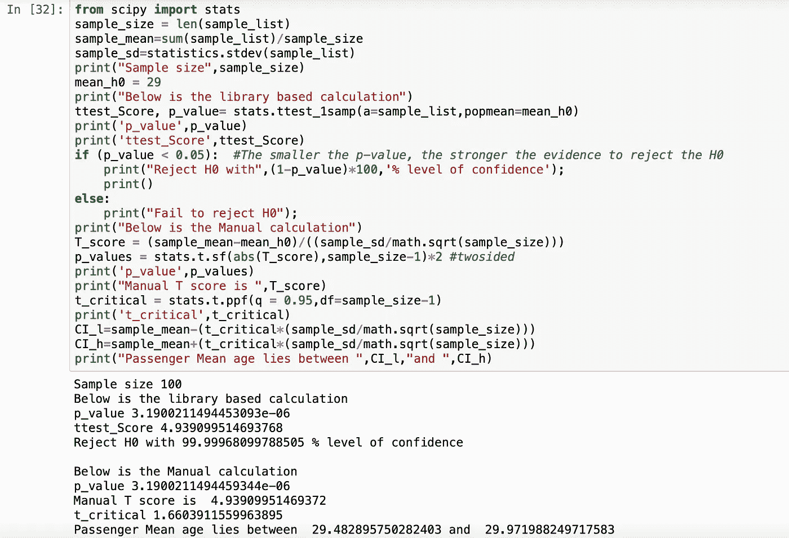

将我们从上面得到的 T 分数~4.9 与 T 临界值~ 1.7 进行比较。我们观察到 T 分数比 T 临界值更极端，因此落在拒绝区域。

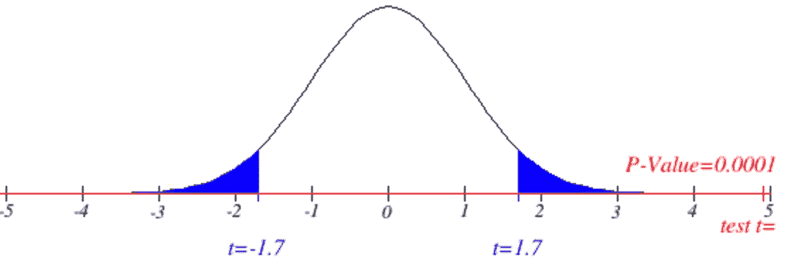

**结论:**我们得到了一个大样本拒绝 H0 的显著结果。因此，即使对于大样本，但当总体标准差未知时，也最好使用 T 检验。

**2。非独立** **样本** t 检验/ **配对样本** t 检验。

检验来自同一组的两个相依样本的均值差异在某些共同的唯一条件下是显著不同的。例如，锻炼一个月后，测量并比较人们的平均体重。

**配对 t 统计**公式:

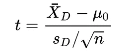

**paired t statistic**

*   d 是每对值之间的差值
*   X̄ *D，*成对差异的样本均值
*   s，d 的标准差。
*   n，样本量
*   0 = 0，假设值为 0。

**陈述假设**

H0: _before = _after(配对总体均值相等)
H1:_ before≦_ after(配对总体均值不相等)

运筹学

H0: _before- _after = 0(配对总体均值无差异
H1: _before- _after ≠ 0(配对总体均值有差异)

**例**:锻炼 1 个月后测量并比较 80 人的平均体重，检查 80 人的平均体重是否减轻。这里的两个样本都是从同样的 80 个人身上采集的，分别是锻炼前和锻炼后 1 个月。这些数据仅用于说明。

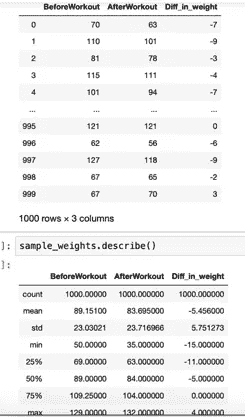

**抽样选择及其分布**

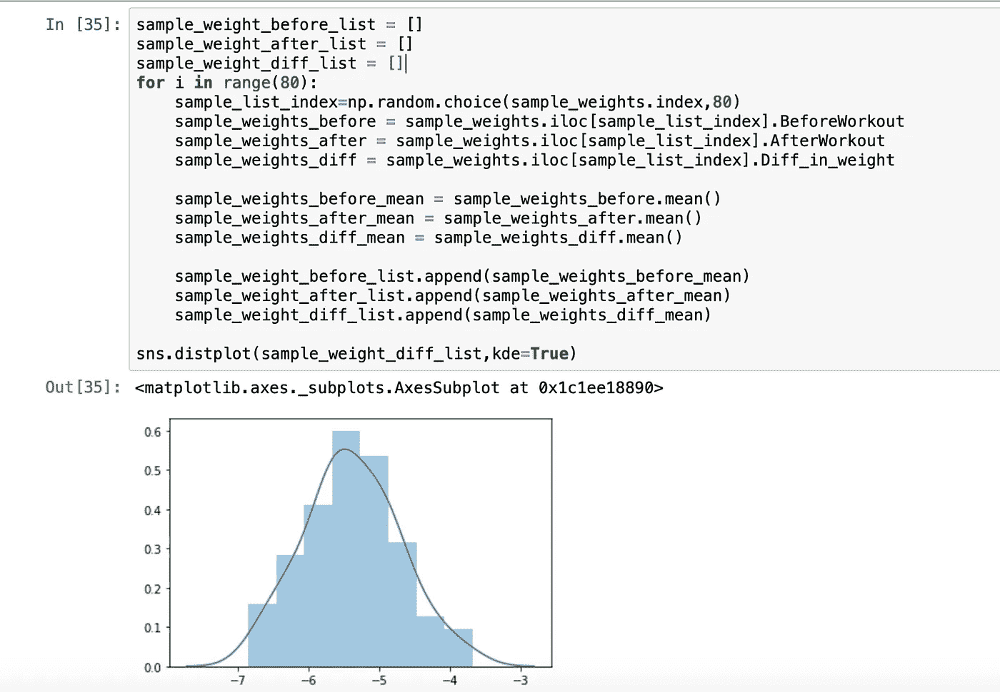

假设满足其他 T 检验假设，T 检验可以应用于极小的样本量，如 2 或 5。t 检验对大样本和正态假设相对稳健。

下面的 Q-Q 图，显示数据几乎正常

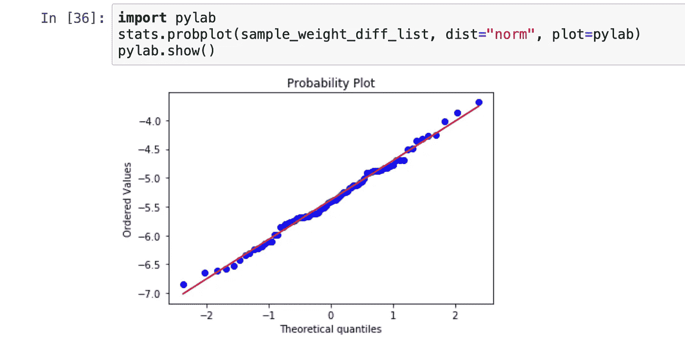

履行

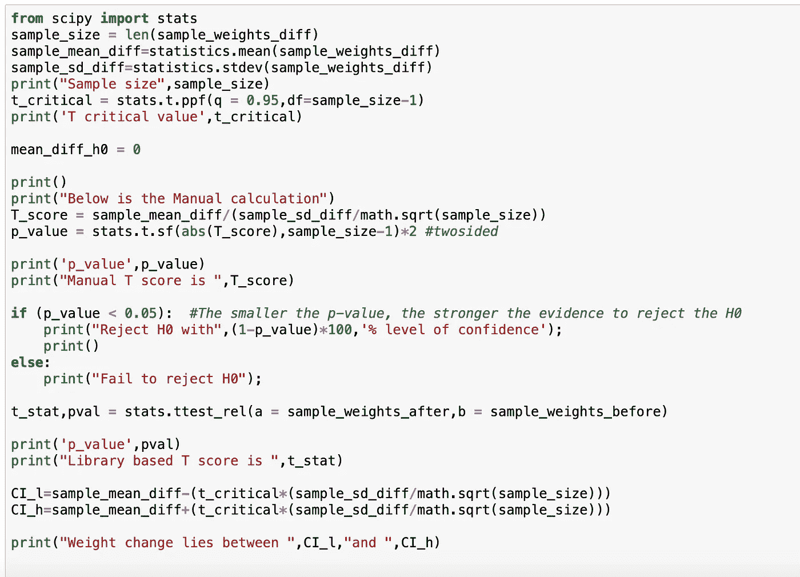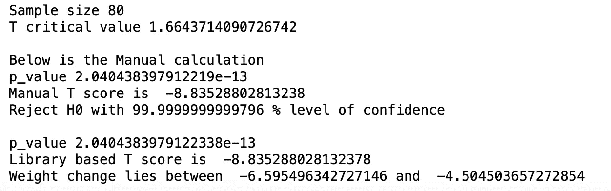

**结论**

测试拒绝 H0，因此我们采用另一种理论，即锻炼前后存在差异。置信区间计算显示，数值为负，所以我们可以说，锻炼后平均减肥的人大约在-6.6 到-4.5 之间。

**3。独立样本 t 检验**

t 检验决定了两个总体在被检验变量上相同或不同的概率。该检验假设有一个连续的因变量和一个独立的分类变量，有两个或两个以上的组。

示例:将“男性”乘客的平均年龄与“女性”乘客的平均年龄进行比较。

*   年龄，连续因变量
*   性别:女性和男性，独立分类变量有 2 组:

**陈述假设**

H0: 1 = 2:人口平均数相等

H1: 1 ≠ 2:人口意味着不平等

运筹学

H0: 1 — 2 = 0:两个总体均值之差等于 0

H1: 1 — 2 ≠ 0:两个总体均值之差，不为 0

1 和 2 有来自两个独立组的数据。组 1 中的数据不能同时出现在组 2 中。

**独立样本 t 检验有两种类型**

1.  **学生 t 检验:**两组方差相等

测试统计公式:

我们使用混合标准差(Sp ),它是两组标准差的加权平均值。权重基于自由度，因此较大的组比较小的组具有更大的权重。这有助于更好的测试估计，因为计算的效果与样本大小成比例。

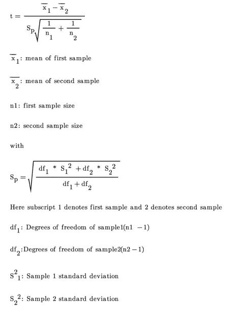

**使用 Kaggle 的 titanic 数据集实现**

让我们检查一下二等舱乘客的平均票价是否与二等舱乘客有显著差异。

**采样分布**

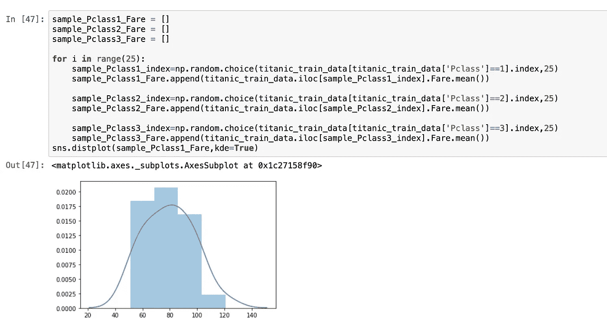

P-class 2:方差约为 7.2，P-class 3:方差约为 7.4。方差、样本的标准偏差和显示正态分布的 Q-Q 图如下所示

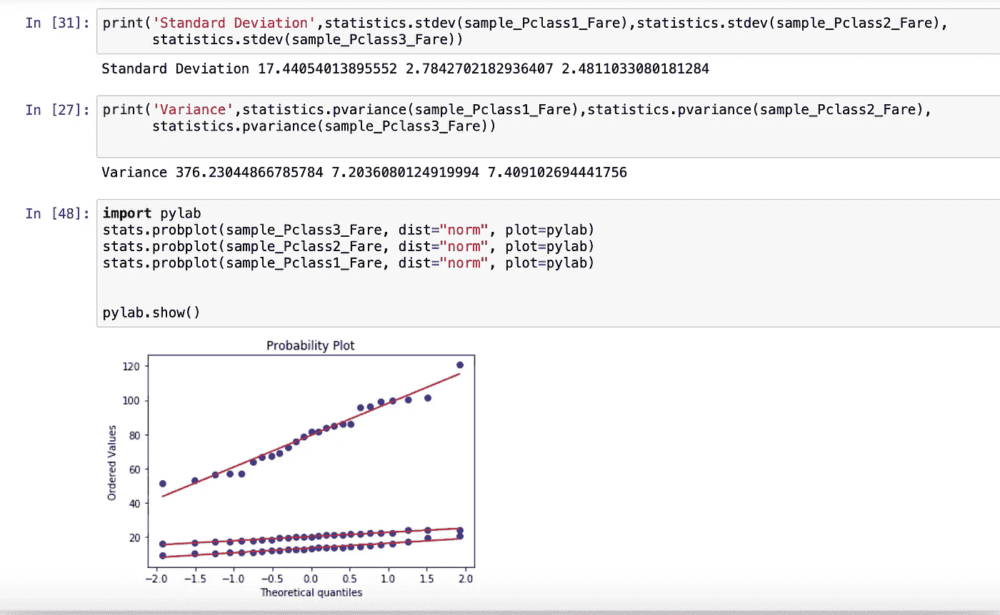

如上所示，第 2 类和第 3 类的方差大致相等，均值的抽样分布呈正态分布，满足学生 t 检验假设。

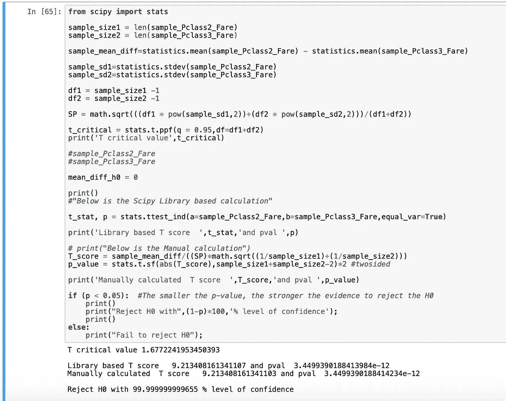

结论

二等舱和三等舱的平均票价不同。

**2。韦尔奇 t 检验:两组的方差不相等**

在现实生活中，我们可能经常有方差不相等的数据。韦尔奇检验主要用于两组方差不相等的情况。上面的学生 T 检验使用了混合标准偏差，以便对检验估计有更好的总体效果。同样，在 Welch T-检验中，我们对自由度进行调整(Satterthwaite 修正)以获得更好的估计。

韦尔奇 t 检验统计公式

使用以下公式计算 df

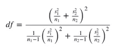

抽样分布

**实施:**

让我们检查一下 1 等舱乘客的平均票价是否与 2 等舱乘客有显著差异。如下所示的差异对于类别 1 和类别 2 是不相等的。

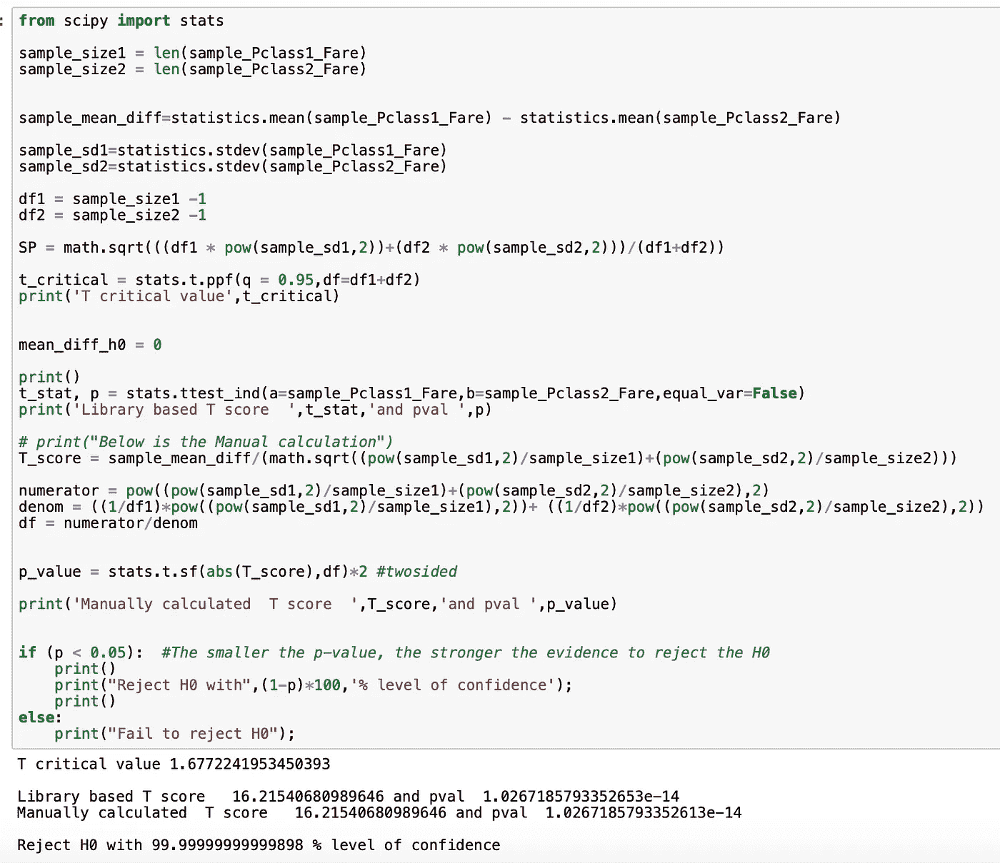

结论:一等舱和二等舱的平均票价不同。

感谢阅读这篇文章。以下是我其他相关帖子的链接。

 [## 假设检验-Z 检验:用 titanic Kaggle 数据集的实现来解释

### 假设是一个新的研究问题。假设有一个新药提案，它的意义是什么？

mahima-s.medium.com](https://mahima-s.medium.com/hypothesis-test-z-test-explained-with-implementation-of-titanic-kaggle-dataset-71e4f7129a0d)  [## 简化的假设检验

### 假设是一个前提或一个可检验的主张。这是一个有根据的猜测，主要基于过去的数据，来自以前的…

medium.com](/analytics-vidhya/hypothesis-test-simplified-b747b8eeeb5c)