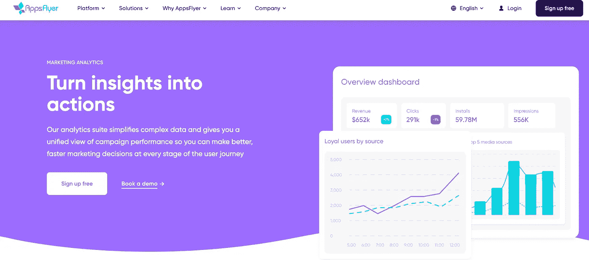
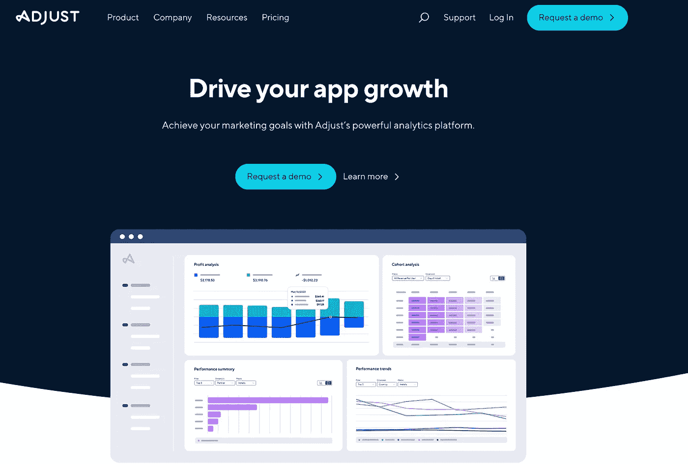
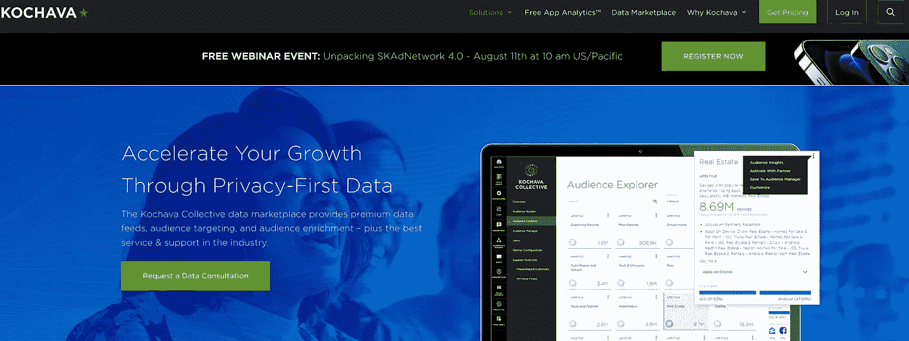
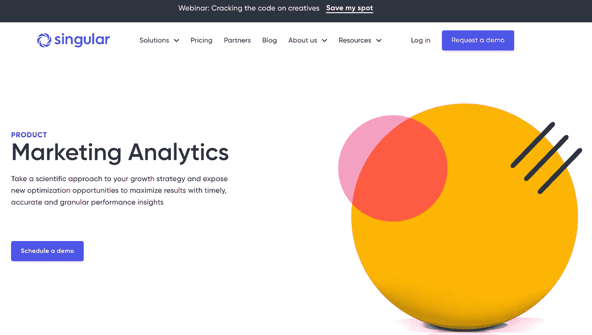
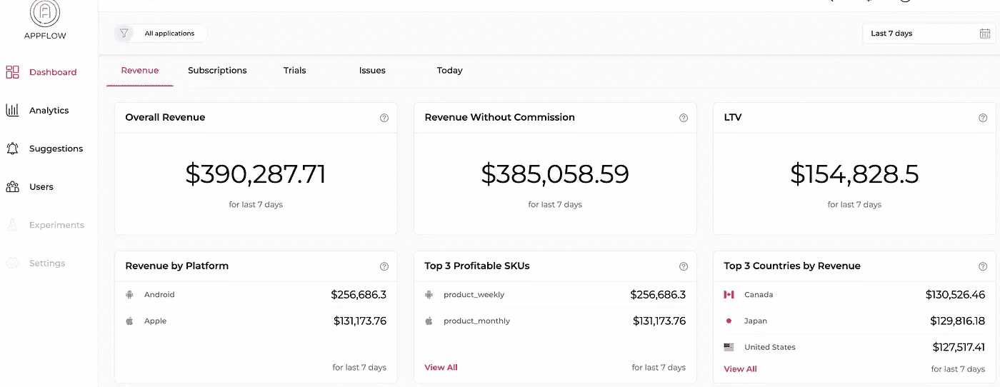
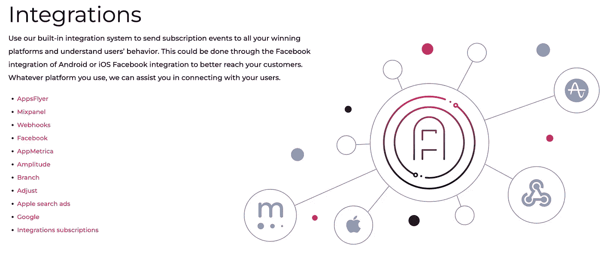

# iOS 应用归属的完整介绍

> 原文：<https://medium.com/geekculture/a-complete-introduction-to-ios-apps-attribution-297bbed9db0c?source=collection_archive---------10----------------------->

如果你从事应用业务，你可能会意识到移动归属和应用分析的重要性。了解用户如何找到你的应用，以及他们到达后会做什么是至关重要的。归因是学习者提高应用商业投资回报率的金钥匙。

在数字营销中，归因是决定最终转化的功劳的实践。归因工具是实现这一点的技术，但选择正确的工具并不容易。它们都有不同的优势和专长以及不同的价位，因此在深入研究之前，您应该了解它们的运营环境。

在我们进入归因工具本身之前，让我们先了解一下它们是什么和它们做什么。

[iOS Attribution](https://www.appflow.ai/blog/IOS-apps-attribution-complete-introduction)

# 什么是移动归属地追踪？

移动属性监控需要从移动接触点收集数据，并在这些接触点关联消费者行为。这些都可以在营销活动的帮助下完成。许多多点触摸归属技术可以监控移动归属，但是，有些仅适用于移动设备，有些仅适用于桌面设备。

# iOS 归属方法:

# 1.IDFA

IDFA 代表苹果移动设备(iPhones)上的广告客户标识，苹果为广告客户提供的标识符，为设备分配一个唯一的 ID 标签，以允许广告监控。当手机用户点击广告或安装应用程序时，IDFA 可以提醒广告客户。苹果公司建立了 IDFA 来追踪广告。

2020 年 6 月 24 日，在 2020 年苹果全球开发者大会上，苹果宣布修改其 [AppStore 隐私限制](https://developer.apple.com/app-store/app-privacy-details/#user-tracking)。他们给出了它所认为的“跟踪”的明确例子。例如:

*   根据从其他公司的应用程序和网站获取的用户数据，在你的应用程序中显示定制的广告。
*   与第三方广告网络共享电子邮件(或哈希电子邮件)、广告 id 或其他 id 的列表，以在其他开发者的应用中重新定位这些用户或找到类似的用户。

任何用于跨应用程序识别用户的基于身份的监控类型都需要通过 AppTrackingTransparency API 明确选择加入。所以苹果取消了 IDFA 的方法。

# 2.SKAdNetwork

[SKAdNetwork](https://developer.apple.com/documentation/storekit/skadnetwork/) 是一个用于衡量应用安装转化率的苹果框架。印象事件与实际的程序安装是分离的，消除了对用户识别的需求。它使用由 App Store 管理的端到端归属机制，使用颁发给 ad 的加密签名来确认每个归属。

简单地说，SKAdNetwork 允许广告商在维护最终用户隐私的同时跟踪其广告的有效性。SKAdNetwork 为基于 IDFA 的归属提供了一个简单、一致的替代方案。

**SKAdNetwork 限制:**

*后期调度:*

回帖将在安装后 24 小时内生成并通过电子邮件发送。这可以防止已安装的应用程序尝试在设备级别识别用户。实时优化将会过时，网络优化活动性能的能力将会受到影响。

*实施中的问题:*

实现 SKAdNetwork 也有困难，它要求发布者应用程序在新发布的应用程序版本中主动注册允许的广告网络。这包括当你想与一个新的广告网络合作时，做开发工作。

*延期深度链接:*

SKAdNetwork 没有提供一个框架来推迟广告的深度链接。这在用户体验和转化上是一个很大的损失。

*不再进行印象跟踪:*

不再支持透视属性。苹果公司要报告接下来的行动，必须点击一个广告单元。计算印象和计算支持性接触的影响已经过时了。

*安装后活动:*

SKAdNetwork 仅允许您将单个安装后事件传输回广告网络，因此，使用这种特定的解决方案，将应用内事件与这些安装活动相关联是不可行的。

*工作流程中断:*

如果无法访问底层数据，任何需要提取聚合报告背后的设备级信息的过程都将变得不可能。

# 3.IDFA 对斯卡德回发:

**IDFA** 回发包含以下信息:

*   IDFA 的设备 ID
*   触发属性的点击的交易 ID。
*   附加设备数据:

> *用户代理*
> 
> *IP 地址*
> 
> 地理定位
> 
> *操作系统版本*

**SKAdNetwork** 回发包含以下信息:

*   SKAdNetwork 活动 ID
*   发行商应用名称/捆绑包 ID(仅当满足 Apple 的秘密隐私标准时)
*   转换值

# 到底什么是归因工具？

归因工具有助于确定在线广告活动和其他营销渠道的有效性。它们在您的营销工具和您的网站、应用程序或其他自有终端之间充当桥梁，确定哪些获取来源正在推动转化，并为您提供客户旅程的全面、完整视图。

你必须监控广告活动的效果。你必须了解你的目标人群、广告类型和创意、广告出现的渠道，当然，还有基本的量化指标**，比如安装和 CPI。**

**手动跟踪所有这些信息可能会让人精疲力尽。这就是为什么我们建议使用移动归因工具来帮助您确定您的用户来自哪里，以及哪些活动对他们最有效。**

# **如何评估归因工具:**

**在评估归因工具时，我们通常会考虑三个主要标准:**

*   ****归因工具的整合次数:****

**一般来说，集成越多越好。你的归属解决方案至少应该有一个与你的 CRM、电子邮件提供商和 SEO 工具接口的 API。**

*   ****该工具覆盖多少器件:****

**一些归因工具专注于特定的设备，而其他工具则涵盖了广泛的范围。根据你的公司战略，你需要选择一个正确的。**

*   ****平台的安全性:****

**您的归属工具将存储最终用户的数据，任何数据泄露都将带来严重后果。如果您的公司重视隐私(也应该如此)，您应该选择具有最佳安全功能的产品。**

*   ****他们如何应对过度归因和欺诈:****

**每年，欺诈都会影响广告业数十亿美元，并削弱公司做出明智、正确广告决策的能力。选择一个解决方案，采取实质性的措施来检测和防止伪造的归属。**

**在下面，我们选择了顶级移动归因工具供您考虑。**

# **推荐的 4 大移动归因工具**

# **应用程序:**

**[Appsflyer](https://www.appsflyer.com/) 提供多点触控归因、重定位归因、可定制归因窗口等功能，让营销人员能够轻松高效地实现目标。**

****

**基础版允许您与员工互动和交流，无论何时您决定加大营销力度，您都可以访问改进的报告、警报甚至仪表板。**

**Appsflyer 还提供基于国家和应用版本的保留统计和群组分析。**

# **调整:**

**[Adjust](https://www.adjust.com/) 通过提供对有机安装、广告点击和应用内事件的洞察，帮助广告商跟踪移动归属，所有这些都具有无限的回望期。他们还提供移动分析、受众增长、欺诈防范以及产品移除和重新安装。**

****

**当其他人发现它时，调整可以防止欺诈。他们的方法是预防性的，因为它阻止数据进入客户的环境。他们还收购了 Unbotify，这是一家网络安全初创公司，可以识别并消除应用程序内的机器人欺诈。**

**它提供了一个易于使用的仪表板，您可以根据关键的移动应用 KPI 以及您可以手动自定义的应用内事件来跟踪网络性能。**

# **科查瓦:**

**[Kochava 的](https://www.kochava.com/)统一受众平台结合了移动归因工具、分析和数据管理平台。当重要指标发生变化或安装量波动时，它会发送电子邮件、短信或寻呼通知。**

****

**它是唯一一款无需在应用内部署软件开发工具包(SDK)即可对安装进行属性划分的移动属性解决方案，这意味着它可以通过云集成而不是加载到应用本身来对安装进行属性划分。**

# **单数:**

**[Singular](https://www.singular.net/) 是一款营销智能工具，将营销活动和属性数据整合到一个仪表板中。Singular 的规模为成长型营销人员提供了智能见解，在全球范围内有超过 2，000 个集成，与所有主要广告网络建立了合作伙伴关系，并且在收入排名前 200 的应用程序中有一半以上是客户。**

****

**功能包括:**

**手机和网络的成本汇总。**

**活动指标被规范化和标准化。**

**优化所有媒体渠道的创意。**

# **结论:**

**正如你所看到的，几个归因平台非常适合各种不同的目的。许多人简化了部署过程，但他们专注于将您的营销工具链接到您的网站、应用程序或任何其他自有终端。为了恰当地利用归因的好处，你的归因解决方案必须与你的完整技术体系兼容。**

**[Appflow.ai](https://www.appflow.ai/) 让你在整个客户群中传递属性数据变得简单。目前，Appflow.ai 允许你将订阅事件发送到你的任何一个[集成](https://www.appflow.ai/integrations)中，以便将所有的东西都放在一个地方。当一个工具检测到某个会话、安装或事件可以归因于某个特定的活动时，Appflow.ai 可以获取该上下文并将其传递给任何相关联的目的地。**

****

**他们正在开发一种方法，允许来自所有集成服务的属性出现在 Appflow.ai 上。要了解有关 Appflow.ai 的更多信息，并将您的应用收入与属性联系起来，请单击[此处](https://www.appflow.ai/integrations)。**

****

**您可以根据团队的规模、时间框架和预算进行研究，以评估哪种解决方案最符合您的目标并付诸实施！**

** [## 测试用户- Appflow，应用内订阅分析工具

### 在 Appflow.ai，我们致力于为用户提供最好的应用内订阅分析工具，这就是为什么我们需要…

bit.ly](https://bit.ly/3vB1qH2)**