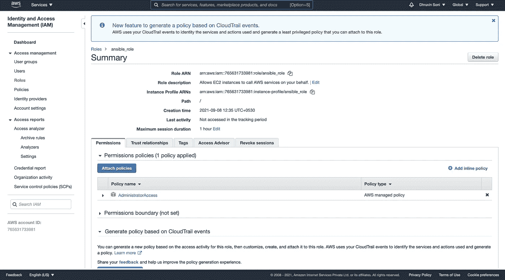
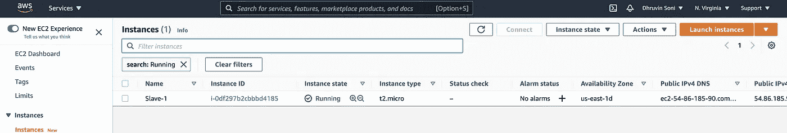

# 静态动态库存的完整概述

> 原文：<https://medium.com/geekculture/a-complete-overview-of-ansible-dynamic-inventory-a9ded104df4c?source=collection_archive---------8----------------------->

# 什么是 Ansible？

**Ansible** 是一款开源软件**供应、配置管理和部署工具。**它运行在许多类 Unix 系统上，可以配置类 Unix 系统和 Microsoft Windows。Ansible 使用 SSH 协议来配置远程服务器。Ansible 遵循基于**推的**机制来配置远程服务器。


Ansible

# 什么是动态库存？

默认情况下，ansible 处理静态清单，但在生产环境中，应用程序在自动扩展组上运行，因此，服务器的 IP 地址会不断变化，因此，在这种情况下，动态清单就会出现。Ansible dynamic inventory 连接到云提供商，它将获得可用的虚拟机 IP，然后在这些虚拟机上运行剧本。


Ansible dynamic inventory

在本教程中，我将解释如何在 AWS 上使用 Ansible 动态库存。

# 先决条件:

*   安装了 [**ansible**](https://docs.ansible.com/ansible/latest/installation_guide/intro_installation.html) 的网络服务器
*   对 [**ansible**](https://docs.ansible.com/ansible/latest/installation_guide/intro_installation.html) 的基本了解
*   基本了解 [**AWS**](https://docs.aws.amazon.com/)
*   AWS **访问密钥** & **秘密密钥**

对于本教程，我已经有了一个安装了 **ansible** 的 **ubuntu 20.04 OS** 的 **EC2** 实例。在继续本教程之前，创建一个目录并将所有文件存储在其中总是一个好的做法。

让我们开始配置项目。

**第一步:-** 安装 **Ansible-EC2** 插件

*   运行以下命令以安装 Ansible-EC2 插件

```
ansible-galaxy collection install amazon.aws
```

**第二步:-** 安装 **python3 & pip**

*   运行以下命令以安装**大钳 3** 和**小钳**

```
sudo apt-get install python3 -y
sudo apt-get install python3-pip -y
```

步骤 3:-安装 **boto3** 库

*   Ansible 使用引导核心对 AWS 进行 API 调用，以检索 EC2 实例细节。
*   运行以下命令安装 **boto3 库**

```
sudo pip3 install boto3
```

**第四步:-** 创建**。yaml** 文件

*   创建名为`aws_ec2.yaml`或`aws_ec2.yml`的文件
*   上面的文件对我们来说就像动态清单一样
*   在`aws_ec2.yaml`或`aws_ec2.yml`文件中添加以下代码

```
**plugin:** aws_ec2
**regions:**
  **-** us-east-1
```

> 您也可以更改地区

**步骤 5:-** 创建一个 **IAM** 角色

*   为了获取 EC2 实例的详细信息，ansible server 必须需要一个 IAM 角色来允许与 EC2 实例进行交互。
*   将`AWS_EC2_FullAccess`角色附加到服务器



IAM Role

**步骤 6:-** 验证**输出**

*   运行以下命令以验证输出

```
ansible-inventory -i aws_ec2.yaml --list
```

*   上述命令将给出您在`aws_ec2.yaml`或`aws_ec2.yml`文件中指定的区域中所有 EC2 实例的详细信息

> **注意:-** 如果您的 ansible 服务器不在 AWS 中，那么您不能将 IAM 角色附加到它，因此您可以修改`aws_ec2.yaml`或`aws_ec2.yml`文件并在其中添加以下内容。

```
aws_access_key: <YOUR-AWS-ACCESS-KEY> 
aws_secret_key: <YOUR-AWS-SECRET-KEY>
```

通过添加 **AWS 访问密钥**和 **AWS 秘密密钥**，ansible 服务器可以与 AWS 帐户通信，并可以获得所有 **EC2 实例**的详细信息。

您应该得到如下所示的输出。我在`us-east-1`地区有 1 个 EC2 实例



EC2 instance

```
ansible-inventory -i aws_ec2.yaml --list
{
    "_meta": {
        "hostvars": {
            "ec2-52-90-221-25.compute-1.amazonaws.com": {
                "ami_launch_index": 0,
                "architecture": "x86_64",
                "block_device_mappings": [
                    {
                        "device_name": "/dev/xvda",
                        "ebs": {
                            "attach_time": "2021-09-08T06:32:38+00:00",
                            "delete_on_termination": true,
                            "status": "attached",
                            "volume_id": "vol-0e65b1e8755de632c"
                        }
                    }
                ],
                "capacity_reservation_specification": {
                    "capacity_reservation_preference": "open"
                },
                "client_token": "",
                "cpu_options": {
                    "core_count": 1,
                    "threads_per_core": 1
                },
                "ebs_optimized": false,
                "ena_support": true,
                "enclave_options": {
                    "enabled": false
                },
                "hibernation_options": {
                    "configured": false
                },
                "hypervisor": "xen",
                "image_id": "ami-087c17d1fe0178315",
                "instance_id": "i-0d1f6c9e678e60185",
                "instance_type": "t2.micro",
                "key_name": "tests",
                "launch_time": "2021-09-08T06:32:37+00:00",
                "metadata_options": {
                    "http_endpoint": "enabled",
                    "http_protocol_ipv6": "disabled",
                    "http_put_response_hop_limit": 1,
                    "http_tokens": "optional",
                    "state": "applied"
                },
                "monitoring": {
                    "state": "disabled"
                },
                "network_interfaces": [
                    {
                        "association": {
                            "ip_owner_id": "amazon",
                            "public_dns_name": "ec2-52-90-221-25.compute-1.amazonaws.com",
                            "public_ip": "52.90.221.25"
                        },
                        "attachment": {
                            "attach_time": "2021-09-08T06:32:37+00:00",
                            "attachment_id": "eni-attach-00b9e24d154e08de2",
                            "delete_on_termination": true,
                            "device_index": 0,
                            "network_card_index": 0,
                            "status": "attached"
                        },
                        "description": "",
                        "groups": [
                            {
                                "group_id": "sg-06e7003e04d368388",
                                "group_name": "launch-wizard-1"
                            }
                        ],
                        "interface_type": "interface",
                        "ipv6_addresses": [],
                        "mac_address": "12:ec:04:76:8c:1d",
                        "network_interface_id": "eni-0bd2237d5c6d162a7",
                        "owner_id": "765631733981",
                        "private_dns_name": "ip-172-31-84-192.ec2.internal",
                        "private_ip_address": "172.31.84.192",
                        "private_ip_addresses": [
                            {
                                "association": {
                                    "ip_owner_id": "amazon",
                                    "public_dns_name": "ec2-52-90-221-25.compute-1.amazonaws.com",
                                    "public_ip": "52.90.221.25"
                                },
                                "primary": true,
                                "private_dns_name": "ip-172-31-84-192.ec2.internal",
                                "private_ip_address": "172.31.84.192"
                            }
                        ],
                        "source_dest_check": true,
                        "status": "in-use",
                        "subnet_id": "subnet-e490c9c5",
                        "vpc_id": "vpc-84bfd0f9"
                    }
                ],
                "owner_id": "765631733981",
                "placement": {
                    "availability_zone": "us-east-1d",
                    "group_name": "",
                    "region": "us-east-1",
                    "tenancy": "default"
                },
                "private_dns_name": "ip-172-31-84-192.ec2.internal",
                "private_ip_address": "172.31.84.192",
                "product_codes": [],
                "public_dns_name": "ec2-52-90-221-25.compute-1.amazonaws.com",
                "public_ip_address": "52.90.221.25",
                "requester_id": "",
                "reservation_id": "r-061722678cf48ffa4",
                "root_device_name": "/dev/xvda",
                "root_device_type": "ebs",
                "security_groups": [
                    {
                        "group_id": "sg-06e7003e04d368388",
                        "group_name": "launch-wizard-1"
                    }
                ],
                "source_dest_check": true,
                "state": {
                    "code": 16,
                    "name": "running"
                },
                "state_transition_reason": "",
                "subnet_id": "subnet-e490c9c5",
                "tags": {
                    "Name": "Slave-1"
                },
                "virtualization_type": "hvm",
                "vpc_id": "vpc-84bfd0f9"
            }
        }
    },
    "all": {
        "children": [
            "aws_ec2",
            "ungrouped"
        ]
    },
    "aws_ec2": {
        "hosts": [
            "ec2-52-90-221-25.compute-1.amazonaws.com"
        ]
    }
}
```

> **注意:-** 您也可以使用过滤器，通过添加以下细节来修改`aws_ec2.yaml`或`aws_ec2.yml`文件，从而获得特定的输出

```
**filters:**
  *# All instances with their `Environment` tag set to `dev`*
  tag:Environment**:** dev
  *# All dev and QA hosts*
  tag:Environment**:**
    **-** dev
    **-** qa
```

**第 7 步:-** 运行`ad-hoc`命令

*   我们可以通过运行下面的命令在 EC2 实例上运行各种命令

1.  **乒**

```
ansible <group-name> -i aws_ec2.yaml -m ping --private-key=<private-key-name> 
```

您应该得到如下所示的输出

```
ec2-107-21-17-60.compute-1.amazonaws.com | SUCCESS => {
    "ansible_facts": {
        "discovered_interpreter_python": "/usr/bin/python"
    }, 
    "changed": false, 
    "ping": "pong"
}
```

2.安装 **Git**

```
ansible <group-name> -i aws_ec2.yaml -m yum -a 'name=git state=present' --private-key=<private-key-name>
```

您应该得到如下所示的输出

```
ec2-54-86-185-90.compute-1.amazonaws.com | CHANGED => {
    "ansible_facts": {
        "discovered_interpreter_python": "/usr/bin/python"
    }, 
    "changed": true, 
    "changes": {
        "installed": [
            "git"
        ]
    }, 
    "msg": "", 
    "rc": 0, 
    "results": 
```

**第八步:**-**分组**实例

*   您可以使用标签、实例类型、实例名称、自定义过滤器等对实例进行分组
*   你可以从 [**这里**](https://docs.ansible.com/ansible/latest/collections/amazon/aws/aws_ec2_inventory.html) 找到更多细节
*   在`aws_ec2.yaml`文件中添加以下代码

```
keyed_groups:
  - key: tags
    prefix: tag
  - prefix: instance_type
    key: instance_type
  - key: placement.region
    prefix: aws_region
```

*   运行以下命令以检查输出

```
ansible-inventory --graph
```

*   您将看到如下所示的输出，所有实例都分组在标签、区域和区域下，动态组名为`aws_region_us_east_1`、`instance_type_t2_micro`、`tag_Name_Ansible`

**第 9 步:-** 运行 **ansible-playbook**

*   我们还可以使用动态库存来运行 ansible-playbook
*   创建一个名为`apache.yml`的文件，并将下面的代码添加到其中

```
---
- hosts: aws_ec2
  become: true
  tasks:
    - name: ensure apache is at the latest version
      yum: name=httpd state=latest
    - name: start apache
      service:
          name: httpd
          state: started
```

*   上面的代码将在所有 EC2 实例上安装 apache，并启动 apache 服务
*   运行以下命令来执行行动手册

```
ansible-playbook -i aws_ec2.yml apache.yml --private-key=<your-private-key>
```

*   您应该会看到如下所示的输出

```
PLAY [aws_ec2] ****************************************************************************************************************************************TASK [Gathering Facts] ********************************************************************************************************************************[WARNING]: Platform linux on host ec2-54-86-185-90.compute-1.amazonaws.com is using the discovered Python interpreter at /usr/bin/python, but futureinstallation of another Python interpreter could change this. See https://docs.ansible.com/ansible/2.9/reference_appendices/interpreter_discovery.htmlfor more information.ok: [ec2-54-86-185-90.compute-1.amazonaws.com][WARNING]: Platform linux on host ec2-107-21-17-60.compute-1.amazonaws.com is using the discovered Python interpreter at /usr/bin/python, but futureinstallation of another Python interpreter could change this. See https://docs.ansible.com/ansible/2.9/reference_appendices/interpreter_discovery.htmlfor more information.ok: [ec2-107-21-17-60.compute-1.amazonaws.com]TASK [ensure apache is at the latest version] *********************************************************************************************************changed: [ec2-54-86-185-90.compute-1.amazonaws.com]changed: [ec2-107-21-17-60.compute-1.amazonaws.com]TASK [start apache] ***********************************************************************************************************************************changed: [ec2-54-86-185-90.compute-1.amazonaws.com]changed: [ec2-107-21-17-60.compute-1.amazonaws.com]PLAY RECAP ********************************************************************************************************************************************ec2-107-21-17-60.compute-1.amazonaws.com : ok=3    changed=2    unreachable=0    failed=0    skipped=0    rescued=0    ignored=0ec2-54-86-185-90.compute-1.amazonaws.com : ok=3    changed=2    unreachable=0    failed=0    skipped=0    rescued=0    ignored=0
```

就这样，你已经了解了 Ansible 动态库存的所有内容。您可以从 [**这里**](https://docs.ansible.com/ansible/latest/collections/amazon/aws/aws_ec2_inventory.html) 进一步探索 Ansible 动态库存。

如果您发现此指南有帮助，请点击👏按钮，也可以随意发表评论。

关注更多类似的故事😊