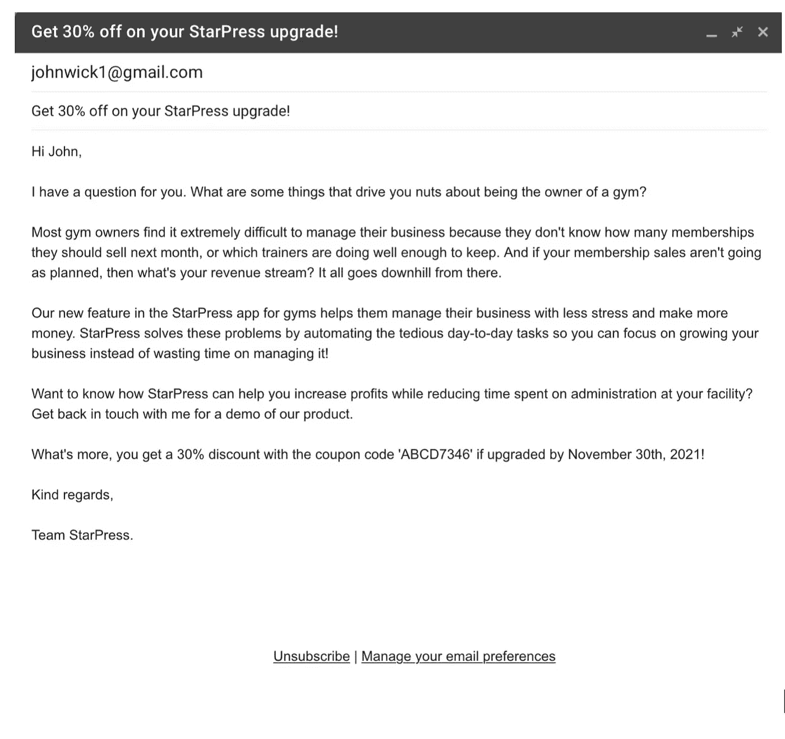
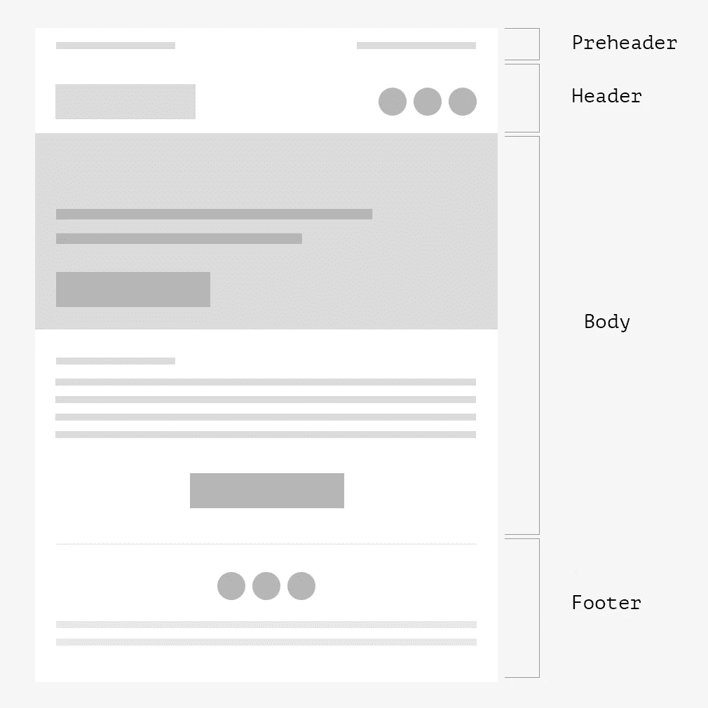
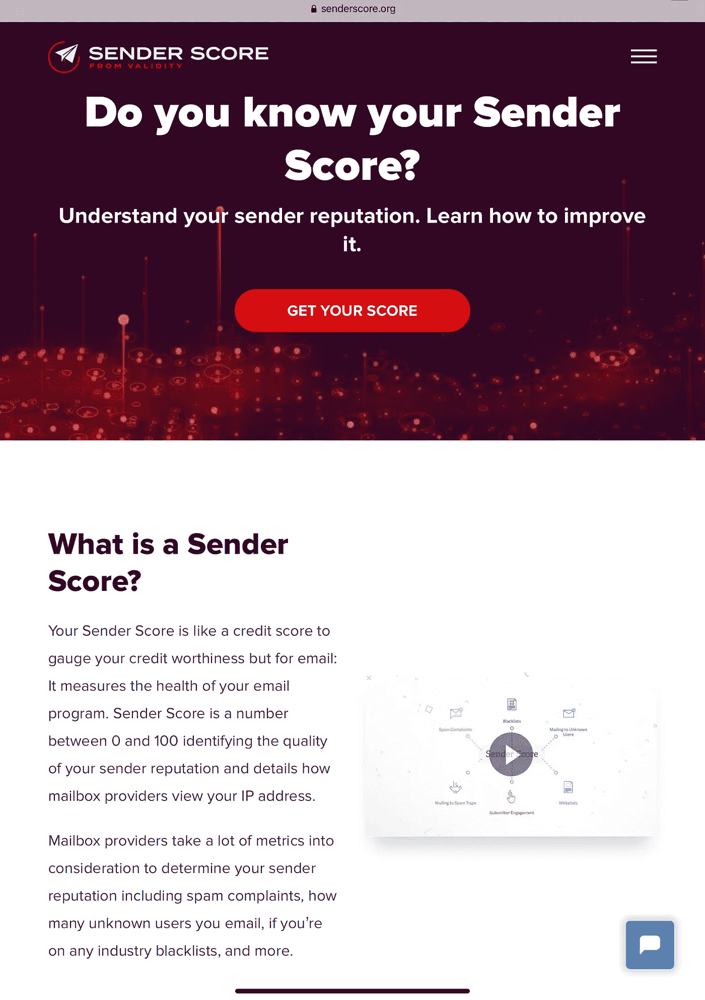
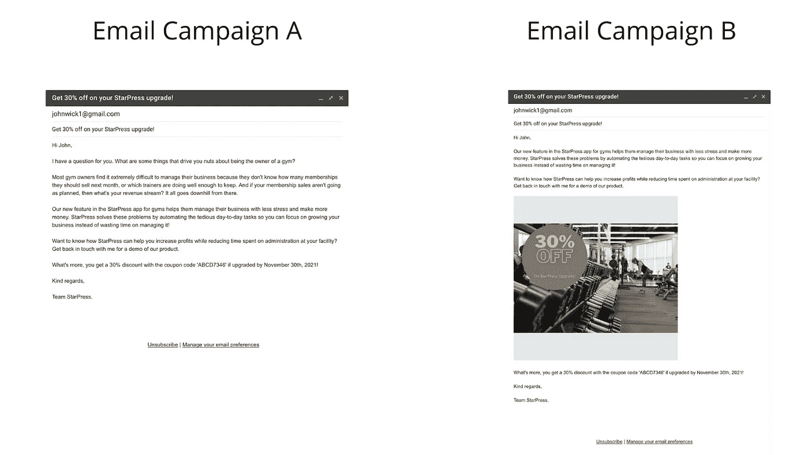
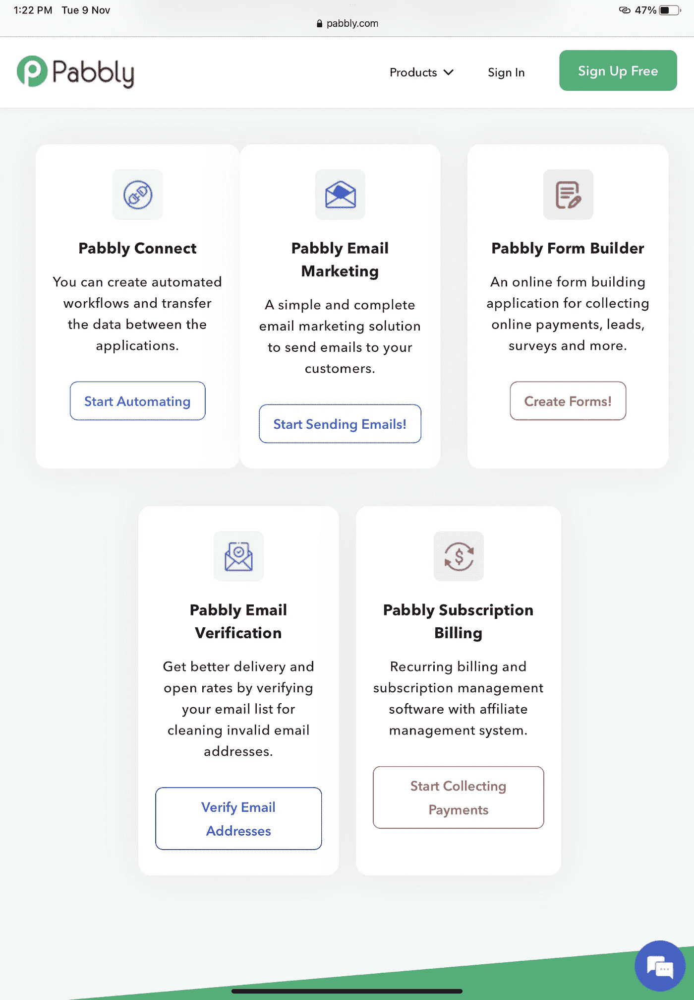

# 电子邮件审计的完整分步指南:

> 原文：<https://medium.com/geekculture/a-complete-step-by-step-guide-to-an-email-audit-33417af145d0?source=collection_archive---------4----------------------->

# 它是什么以及您为什么需要它

Original illustration by A.Malyavina

许多营销人员都在为他们的电子邮件营销审计而努力。他们不确定在电子邮件中发送什么，什么时候发送，多久发送一次。我们整理了一份关于审核您的电子邮件的分步指南，以确保您仍能联系到希望收到您邮件的人。

仅仅发送电子邮件是不够的；他们需要包含引人注目的内容，并为他们提供一些有价值的东西，甚至让他们再看一眼。“请购买我们的产品”的日子已经过去了；如果你不能帮助人们改善生活或生意，那么没有理由有人会打开你的邮件或点击任何链接。

这就是为什么是时候深入研究你的电子邮件营销了。这篇博客文章将指导你为自己的公司设置电子邮件审计所需的步骤。我们在这里帮助您了解您的电子邮件列表中有多少是不活跃的，哪些活动表现良好，哪些需要改进，以及如何充分利用您的电子邮件营销。

准备好了吗？我们走吧！

# 什么是电子邮件审计？

电子邮件审计可以被定义为一个文档，它提供了对您当前电子邮件营销活动在特定时间范围内的“健康状况”的深入分析。进行成功的电子邮件审计的目的是明确定义您的业务目标，并根据收集的数据做出重要决策。它还为营销人员提供深度分析，帮助他们创建更好的活动。

# 审计你的邮件的目的是什么？

电子邮件营销审计已经成为确保成功战略的重要过程。电子邮件审计可以识别活动中的问题和错误，以及贵公司整体表现的优势，让您有机会解决问题并改善未来的结果。

电子邮件审计是让你的数字房子井然有序的好方法。它有助于你确定一切是否正常运行，比如你的电子邮件是否吸引了你的客户。然后，您可以使用此信息进行任何必要的更改，以防止将来出现问题。你需要做的是:

# 1.内容创建、电子邮件营销活动和电子邮件模板

## 创造一流的内容

你的电子邮件营销策略是在创建内容和完成内容之间的微妙平衡。理解你的工作流程很重要，包括如何从概念到实现创建电子邮件。在我们审计流程的这个阶段，我们应该研究以下几点:

1.  **构思:**在考虑了你的电子邮件宣传活动所需的语气后，你可能需要考虑由谁来构思，以及他们需要多长时间。一个简单的设计可能需要一个小时，但如果许多部分在最终完成之前需要特别的关注，基本的活动将需要更多的资源、人员和时间。
2.  **“发件人”字段:**“发件人”字段中应指定发件人的电子邮件地址。包括您的公司域，以便用户知道是谁向他们发送电子邮件。
3.  **主题和前置标题:**主题是你脱颖而出的机会。使它个性化，保持在 60 到 70 个字符以内，并将其链接到预收件人，这样他们就知道你在发送什么，而不必通读他们的整个收件箱。
4.  **邮件结构:**为了确保你的邮件是专业的，它应该由三个部分组成:带有公司标志或菜单栏的标题、概述主要优惠的正文、带有联系信息的页脚、退订按钮和社交媒体句柄的可点击图标。
5.  **行动号召:**行动号召按钮是传达信息的最佳方式。不需要超过两个 CTA，他们应该敦促客户采取有针对性的行动，如购买或订阅电子邮件。
6.  图片:关注细节很重要，尤其是图片。alt 文本应该总是可见的，以防实际图像加载不正确。图像需要。小于 200 KB 的 png 文件，因此它们在您的电子邮件中加载速度更快—确保您正确使用此格式以获得最佳结果。

An example of an email

## 检查你的电子邮件营销活动的有效性

要了解哪些活动对你的公司有帮助，不仅要注意成功的活动，还要注意那些表现不佳的活动，这一点很重要。

**单独**:当你是一个单独的电子邮件营销人员时，你可能已经记录了你一年来开展了哪些营销活动，以及它们的成功程度。

**公司:**如果你为一个更大的组织工作，比如 EmailSoldiers，并且不同的团队从同一个地图发送电子邮件，你可以跟踪发送了哪些照常营业(BAU)的活动。例如，EmailSoldiers 发送 BAU 活动，并跟踪谁收到了它们以及它们的表现如何。此外，如果活动是 A/B 测试的一部分，你应该记录结果和获胜者。另一个检查电子邮件营销活动有效性的有用工具是使用 [UTM 标签](https://clc.to/utm-tags)。

在电子表格中包括以下列:

1.  电子邮件活动的名称
2.  部署日期
3.  段或目标的列表
4.  主题行的 A/B 测试(如果需要)
5.  发送的电子邮件总数
6.  高跳出率
7.  跳出率低
8.  异常开盘价
9.  独特的点击率
10.  点击与打开的比率
11.  取消订阅的比率
12.  转换率(如果需要)

这是一份关于您的电子邮件活动的报告，包括全年的自动活动。根据您希望在此电子邮件营销审计中包含多少指标，您可以决定包含和删除哪些列。有了每个活动 12 个月的数据，很容易看出哪些活动比其他活动更成功。

## 创建准确的电子邮件模板

无论你的活动模板有多好，只有每个关键的设计元素都考虑到了，它才会起作用。这包括放置所有必要的部分，如包含相关信息的对象或页脚，验证发件人姓名的所有内容，设计 CTA 按钮，确保没有拼写错误，等等。

分析模板时，检查以下九个要素非常重要:

1.  **发件人姓名:**您的电子邮件的发件人姓名必须清楚，以便告知收件人是谁发送了该邮件。如果他们认为垃圾邮件来自地址不明的人，他们更有可能报告垃圾邮件。
2.  **主题:**你的主题行长度要短。它应该是清晰简洁，没有垃圾邮件的话。
3.  **前置标题:**前置标题是出现在主标题之前的第一个东西。它不仅应该提供有用的信息，还应该在发件人的电子邮件被打开时提醒他们。
4.  为了确保你的标题是有效的，它应该抓住眼球，告诉人们他们将要阅读的内容。它需要简单而又有创意，这样就不会对接下来的内容产生混淆。
5.  **邮件正文:**为了获得最佳效果，请确保您的邮件适合手机使用，并且不要太长。检查它的所有副本是否与你要说的内容相符，并且没有打字错误。它还应该有一个符合品牌的良好风格。
6.  **标志:**确保你的品牌是可见的。当用户点击徽标时，他们应该被直接引导到您的网站。
7.  **CTA:** 确保有一个 CTA 按钮，并且突出显示。此外，确保 CTA 按钮是 HTML 格式的，以避免出现任何问题。
8.  **媒体:**确保图片有吸引力，有替代文字，并且不要太大。
9.  **页脚:**页脚应包含联系方式、退订按钮、可点击的社交媒体图标和隐私政策链接。

Structure of an email

# 2.基础设施、细分和列表

在电子邮件营销审计的这一步骤中，您将检查电子邮件基础结构、分段和列表。同样，这有助于您做出为其他群组创建新内容或通过其他电子邮件活动锁定现有成员的战略决策。

## 检查电子邮件基础结构中的设置

您的电子邮件的技术方面是我们这一步的重点。查看一下基础设施，确保一切正常。 **IP 信誉:**这是一个 IP 地址表现出来的估计行为质量。有很多方法可以找到一个 IP 地址的声誉。你可以从 ISP 那里得到垃圾邮件投诉报告。微软智能网络数据服务将显示用户对他们收到的电子邮件的反馈。
发件人分数计算器和黑名单检查工具也可用于此目的，如 SenderScore.org。

Finding out your sender score

2.**链接:**确保所有链接都处于活动状态。
3。 **DNS:** 再次检查 DNS，确保它是正确的。
4。**认证:**确保你的电子邮件经过 DKIM 验证，并检查你的 SPF 记录和 DMARC 设置是否正确。电子邮件被伪装成呈现来自其他来源的内容或包含其他主题的信息。为了避免这种情况，DKIM 验证是必不可少的。例如，Gmail 使用[默认验证。](https://support.google.com/a/answer/174124?hl=en) 您可以在这里查看 DKIM 标准[并进行相应设置。
为了增加电子邮件的安全性，也要设置](http://www.dkim.org/) [SPF](https://support.google.com/a/answer/33786) 和 [DMARC](https://support.google.com/a/answer/2466580) 。
5。**安全性:**通过采取积极主动的方法并将电子邮件安全性纳入贵公司的信息技术政策，您将能够遵守联邦法令，确保敏感数据的安全性、信息的安全传输以及邮件列表的质量。这样，到了审计的时候，你就能证明所有必要的安全措施都到位了。电子邮件安全审计将确保您的组织通过使用多因素身份认证、加密和遵守行业标准来适当管理其风险。

## 细分和列表有效吗？

如果现有的列表不够，现在是考虑是否需要更多列表的好时机。你还可以计划一旦这些部分被测试后会发生什么，并确保在推出另外一批之前一切顺利。问问你自己:

1.  哪个是主要部分？你使用的营销计划可以分成不同的部分，但重要的是要知道重点。
2.  每个细分市场的绩效指标是什么？
3.  你能带来哪些改善？
4.  是否需要新的细分市场？

# 3.数据库、参与度、可送达性和隐私

## 数据库在特定时间段内发生了怎样的变化？

在此步骤中，您可以使用营销自动化数据库、营销自动化平台或电子邮件服务提供商。检查以下因素:

1.  唯一联系人总数
2.  可销售的联系人总数
3.  过去 3 个月、6 个月和 12 个月的电子邮件联系总数(可销售)
4.  在过去 3 个月、6 个月和 12 个月中没有任何活动的可销售联系总数
5.  发送的电子邮件总数
6.  新联系人总数
7.  减少的联系人总数

## 什么是参与度指标？

倾听联系人的心声是建立联系基础的重要组成部分。这将有助于更好地了解他们对某些活动的兴趣程度，在设计未来的沟通计划时，可以将其用作反馈或输入。它还可以提供关于该组中任何非活动集群的洞察力——如果结果是一些电子邮件从未得到回复，因为收件人根本不感兴趣(或不够感兴趣)，那么重新激活它们可能是有意义的。

## 可送达性和隐私措施是否到位？

让你的联系人错过邮件相当于失去潜在的销售。在任何成功的电子邮件营销审计中，可送达性分析应该是一个基本的最佳实践。

为了保持合规性，有必要验证您的电子邮件活动没有违反隐私法规。检查每个更新，确保用户和个人资料的获取过程 100%符合所有法律。

# 4.改进计划

电子邮件审计不是最容易跟上的事情，但它值得你花费所有的时间和精力。为了改进你的电子邮件实践，根据需要改进的地方做出这些改变。通过创建关于不同主题行、内容或发件人姓名将如何影响用户行为的新假设，为 A/B 测试做准备。

A/B testing

2.测试不同的主题行。
3。搜索技术错误，并根据需要更改电子邮件基础架构。

# 你可能需要的工具

看看下面的工具，你可以用在你的电子邮件审计上:
1。**电子邮件服务提供商:**该工具将帮助您创建电子邮件营销活动，例如 Gmail、ProtonMail、Outlook 等。

2.**Google Analytics:**Google Analytics 是追踪电子邮件活动成功与否的绝佳方式。该工具允许你测量用户通过电子邮件到达你的网站后的旅程。所以，当你在这些信息中创建链接的时候，一定要包含 UTM 追踪代码，以便更好地了解人们是否点击了任何直接进入你网站的流量。

3. **PowerPoint 和 PDF** —展示电子邮件营销审计的两种最流行的演示格式。这种格式的使用确保了从报告设计到图形的每个方面都得到关注，使演示者和观察者都更容易理解。
4。 **Pabbly 电子邮件营销:**该服务提供电子邮件监控服务，包括营销自动化功能。

# 最后一句话

电子邮件审计是检查电子邮件内容的准确性、可用性和最佳性能的过程。如果您想对电子邮件审计采取更实际的方法，以下是几个要点:

1.  在开始你的电子邮件审计之前要有条理。
2.  确定您将测量哪些指标。
3.  写下基准目标。
4.  参与定期报告。
5.  对结果进行定期分析。
6.  确保您的电子邮件营销审计符合垃圾邮件法律和其他类似的法规。
7.  确保电子邮件平台的编码和架构符合标准。
8.  对照目标检查内容的性能。
9.  检查适当的数据管理，以便电子邮件不会发送给选择退出的人。

总之，电子邮件审计是改善你的电子邮件营销策略的好方法。重要的是要透过数字来关注内容、基础设施和点击率。

回顾这些因素将有助于您确定哪些因素对您的电子邮件活动有效，哪些因素需要改进。如果你发现某件事表现不好，是时候做出一些改变了。你必须记住，电子邮件营销应该是一个持续的过程，因为情况总是在变化。

如果你遵循这个电子邮件审计指南，你一定会看到你的电子邮件营销策略的有效性增加。此外，在完成这篇关于电子邮件审计的文章后，希望你会对自己作为一名电子邮件营销人员或商业专家的能力更有信心！