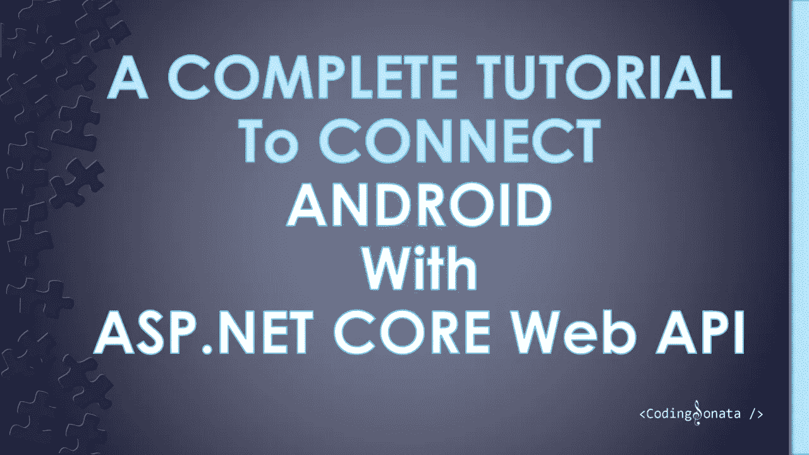

# 一个完整的教程来连接 Android 与 ASP.NET 核心网络 API

> 原文：<https://medium.com/geekculture/a-complete-tutorial-to-connect-android-with-asp-net-core-web-api-db5e439204d7?source=collection_archive---------0----------------------->

在本教程中，我们将学习如何连接 Android 与 ASP.NET 核心网络应用编程接口。我们将建立一个 Android 应用程序来显示分类技术博客列表。

使用 retreate 2，Android 应用程序将连接到 RESTful APIs，我们将使用微软和开源社区的最新技术构建 RESTful API:ASP.NET 核心 Web API 5。