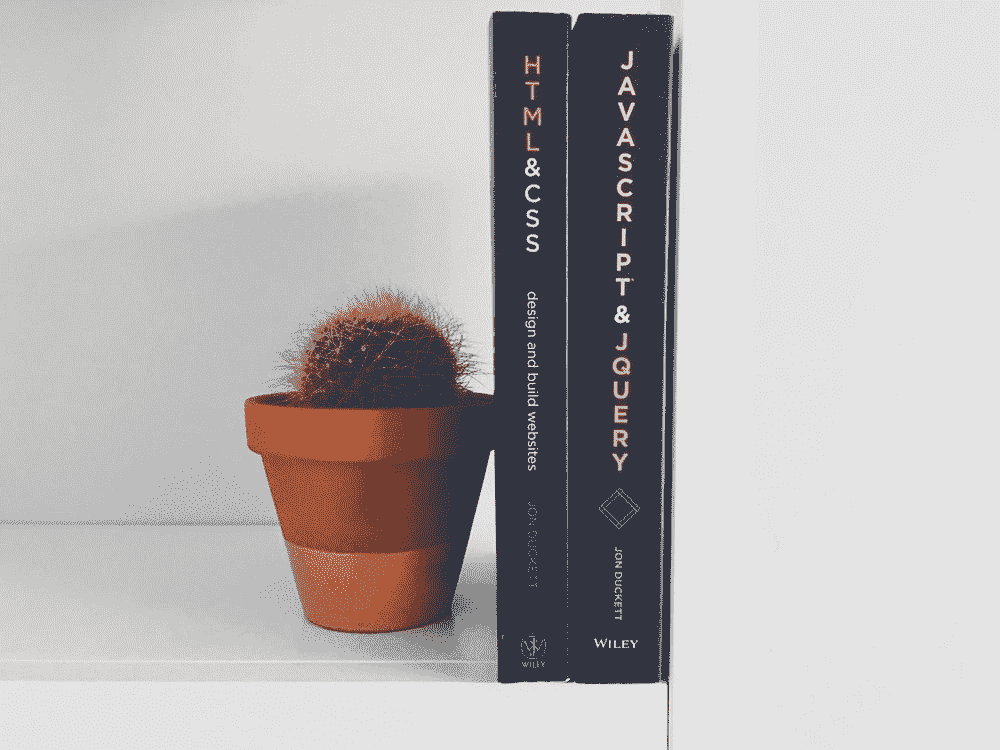

# 关于 Freecodecamp.org 的综合指南——这个平台是开始的最佳方式吗？

> 原文：<https://medium.com/geekculture/a-comprehensive-guide-on-freecodecamp-org-is-this-platform-the-best-way-to-start-7eeae8ea0dfa?source=collection_archive---------6----------------------->

## 以下是我学到的东西。从注册到认证，以及这之间的一切。

Image from [Unsplash](https://unsplash.com/photos/vw3Ahg4x1tY)

当我在学校的时候，我两次化学不及格，因为我太忙于做我的计算机期末项目。这是一个简单的 C++项目，没什么特别的。但是我太喜欢它了，所以我…