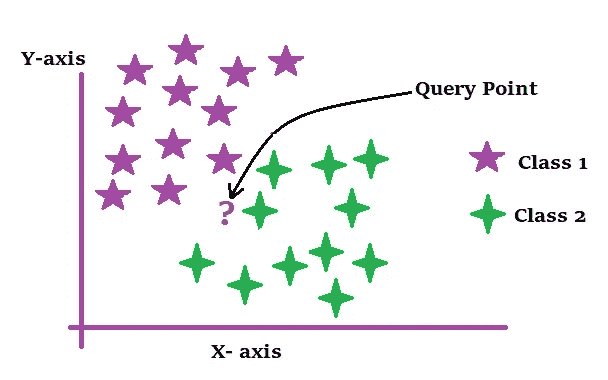
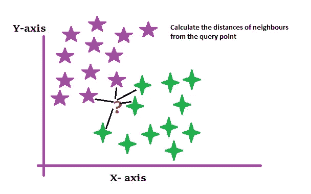
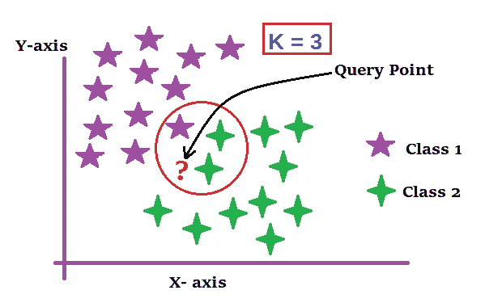
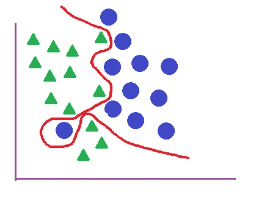
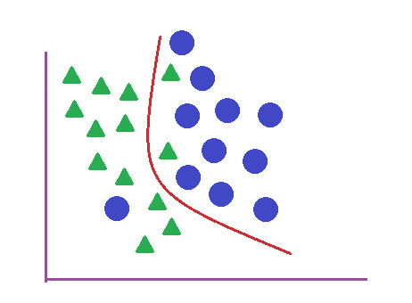
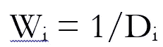

# KNN 综合指南

> 原文：<https://medium.com/geekculture/a-comprehensive-guide-to-knn-5b0d4cd90947?source=collection_archive---------47----------------------->

在当今高度互联的互联网时代，全球各地的人们以前所未有的规模日复一日地以不同的方式消费信息，如浏览在线商店的产品、在 YouTube/网飞上观看视频、寻找推荐、新闻、搜索信息，所有这些都在以指数速度增长。

在这样的环境中，提供有效的搜索、有意义的推荐、相关和相似的新闻/文章/产品等对于商业组织来说是非常关键的。在最短的时间内。

因此，当涉及到开发能够在最短时间内提供用户正在寻找的信息的可扩展解决方案时，最近邻算法已经成为一种选择的武器。

**什么是 KNN 算法？**

KNN 算法基于一个简单的假设，即相似的事物(属于同一类别的数据点)往往彼此接近。在 KNN 算法中，给定一个查询点，我们找到它的最近邻，并观察它们是如何被分类的。基于查询点周围的大多数类别，确定查询点的类别。
就这么简单。

**KNN 的几个属性:**

这是一种受监督的机器学习算法。
有监督的机器学习是指我们为训练数据集中的数据点提供标签。在我们没有对应于训练数据中的数据点的标签的情况下，这样的问题通过无监督的机器学习算法来解决。

KNN 算法可以用来解决二元分类问题以及多类分类问题。在二元分类中，我们只有两个类，其中所有的数据点都被划分，而在多类分类中，我们可以有多个类。

KNN 也可以用来解决回归问题。

KNN 是一种非参数算法:非参数算法是对训练数据集的底层数据分布不做任何假设的算法。非参数算法有助于解决许多现实世界的问题，因为现实世界的数据集很少遵循任何理论上的数据分布。

KNN 是一个懒惰的算法。术语“懒惰算法”意味着模型实际上不经历训练数据集上的任何训练，即模型不使用训练数据来实现任何泛化。这些模型在测试或预测阶段使用训练数据本身来对查询数据点进行预测。
例如，KNN 使用其训练数据点来寻找查询数据点的最近邻居，以便预测其类别标签。

KNN 是如何工作的？

如上所述，KNN 是基于这样一个简单的假设，即相似的事物彼此接近地存在，即在空间/平面中彼此接近的数据点应该属于同一类。使用这个概念，为了预测查询数据点的类标签，KNN 遵循以下步骤:

Query point in KNN

**第一步:**计算查询点周围邻居的距离。
为了计算距离，我们可以使用像欧几里德距离、曼哈顿距离、汉明距离或闵可夫斯基距离这样的距离度量。

Calculate the distances of neighbors around the query point

**第二步:**找到最近的 K 个邻居。
K 是您在评估查询数据点的类别标签时要考虑的相邻数据点的数量。至少对于二进制分类而言，K 值优于奇数(原因将在下一点解释)。

K = 3

**步骤 3:** 投票:
每个最近的 K 个邻居(最近的 K 个数据点)为他们自己的类标签投票。统计所有的选票，并计算出哪个班级获得了多数票。这就是我们倾向于 K 取奇数的原因，这样投票就不会出现平局。**获得最高票数的类别被认为是查询数据点的预测类别标签。**

**如何选择合适的 K 值？**

在 KNN 选择 k 值时，请记住以下几点:

如上所述，您应该更喜欢将奇数设置为 k。

小 K 值导致不稳定的决策边界。为了获得平滑的决策边界，使用 K 的实际值。
随着 K 的增加，决策表面的平滑度也增加。

首先，你可以选择一个 K 的初始值，观察增加或减少 K 值时的误差率。

为了找到 K 的最佳值，绘制“误差率与 K 值”图，并选择误差率最小的 K 值。

等于训练数据中数据点总数的 K 值将导致拟合不足，因为多数类将倾向于支配超空间上的所有点。

**K 变化对决策边界的影响:**

对于 K = 1:决策边界不稳定且不平滑。这会导致过度拟合。

K = 1

对于 K = 5:判定边界是平滑的。随着 K 的增加，决策曲面的平滑度也增加。

K = 5

**KNN 的局限性:**

1.KNN 不适用于非常大的数据集。如果数据集太大，KNN 将需要更大的内存，速度会相当慢。你可以尝试一些降维技术，如主成分分析，t-SNE 等。在将 KNN 应用于大型数据集之前。

2.万一，如果一个查询点离训练点太远，我们就不能确定 KNN 所做的分类预测。

3.如果数据传播过于随机，KNN 就表现不佳。

**加权 KNN:**

正如我们到目前为止所了解的，特定类的邻居的数量在决定查询数据点的类标签中起着至关重要的作用。此外，为了使预测更准确，我们还可以考虑最近邻居的距离的大小，即给最接近的邻居较高的权重，给较远的最近的邻居较低的权重。这种技术被称为加权 KNN。

这里，我们根据最近的邻居与查询数据点的距离为它们分配权重。

Wi = Weights

权重与查询点和最近邻点之间的距离成反比。因此，随着距离的增加，权重降低，因此，与更远的最近邻居相比，更近的最近邻居将获得更高的权重。

此外，为了预测查询点的类别标签，代替简单 KNN 情况下的基于普通数字的投票，这里我们将进行如下操作:

1.首先，计算每个最近邻的“距离 X 权重”(距离乘以权重)。我们就叫它 DiWi 吧。(距离。数据点 Xi 的权重)。

2.现在，计算所有 DiWi 的类别和，即，对属于特定类别标签的所有数据点的 DiWi 求和。K 个最近邻中所有数据点的 DiWi 总和最高的类将成为查询点的预测类。

我们可以进一步探索 KNN 的各种变体，如 KNN 使用 KD 树或 LSH。我将在下一篇文章中介绍更多关于 KNN 的内容。

感谢阅读。