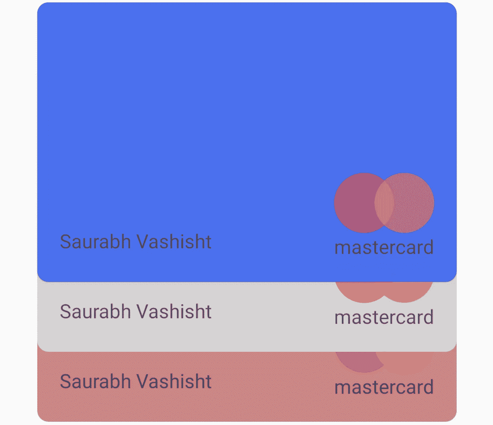
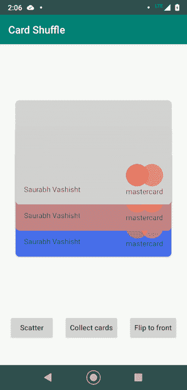
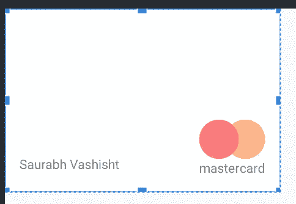
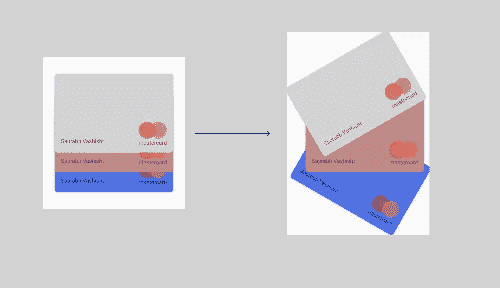
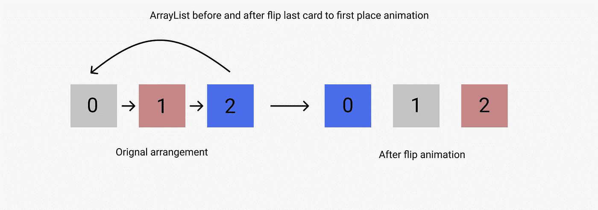

# 借记卡/信用卡的酷动画

> 原文：<https://medium.com/geekculture/a-cool-animation-for-debit-credit-cards-87634e9d5a97?source=collection_archive---------13----------------------->



A cool animation for debit/credit cards

在一个慵懒的周六，在浏览 Medium 时，我偶然看到一篇文章，解释了如何在你的数字钱包应用中整理信用卡/借记卡。我没有读这篇文章，但决定自己制作一些动画(你可能会发现一篇类似的文章，有相同的动画。但是没有从上一篇文章中复制任何代码)。下面是我们将在这篇文章中努力实现的动画



Card animations demo

以下是我对此的看法:

第一步:设计一张卡片。这是我的卡片 XML 布局的外观

```
<?xml version="1.0" encoding="utf-8"?>

<androidx.cardview.widget.CardView xmlns:android="http://schemas.android.com/apk/res/android"
    xmlns:app="http://schemas.android.com/apk/res-auto"
    android:id="@+id/card_view"
    android:layout_width="300dp"
    android:layout_height="200dp"
    android:padding="8dp"
    app:cardCornerRadius="8dp">

    <androidx.constraintlayout.widget.ConstraintLayout
        android:layout_width="300dp"
        android:layout_height="200dp">

        <TextView
            android:id="@+id/mastercard"
            android:layout_width="wrap_content"
            android:layout_height="wrap_content"
            android:layout_margin="16dp"
            android:text="@string/mastercard"
            app:layout_constraintBottom_toBottomOf="parent"
            app:layout_constraintEnd_toEndOf="parent" />

        <app.example.cardshuffle.MasterCardIcon
            android:layout_width="0dp"
            android:layout_height="0dp"
            app:layout_constraintBottom_toTopOf="@+id/mastercard"
            app:layout_constraintEnd_toEndOf="@+id/mastercard"
            app:layout_constraintStart_toStartOf="@+id/mastercard" />

        <TextView
            android:layout_width="0dp"
            android:layout_height="wrap_content"
            android:layout_marginStart="16dp"
            android:layout_marginBottom="20dp"
            android:text="@string/my_name"
            app:layout_constraintBottom_toBottomOf="parent"
            app:layout_constraintStart_toStartOf="parent" />
    </androidx.constraintlayout.widget.ConstraintLayout>
</androidx.cardview.widget.CardView>
```



Preview of card XML file

这是预览的样子。我也设计了万事达卡图标。不过，使用图像会是一个更好的选择。如果你想检查图标的代码，检查这里

 [## svvashishtha/CardShuffle

### 展示卡片动画的应用程序。通过在…上创建帐户，为 svvashishtha/CardShuffle 开发做出贡献

github.com](https://github.com/svvashishtha/CardShuffle/blob/master/app/src/main/java/app/example/cardshuffle/MasterCardIcon.java) 

现在我们需要三张动画卡片和三个按钮来触发/控制动画。因此，让我们设计我们的活动布局。这是活动的 XML

```
<?xml version="1.0" encoding="utf-8"?>
<androidx.constraintlayout.widget.ConstraintLayout xmlns:android="http://schemas.android.com/apk/res/android"
    xmlns:app="http://schemas.android.com/apk/res-auto"
    xmlns:tools="http://schemas.android.com/tools"
    android:layout_width="match_parent"
    android:layout_height="match_parent"
    tools:context=".Main2Activity">

    <FrameLayout
        android:id="@+id/container"
        android:layout_width="match_parent"
        android:layout_height="0dp"
        android:clipChildren="false"
        android:foregroundGravity="center_horizontal"
        app:layout_constraintBottom_toBottomOf="parent"
        app:layout_constraintEnd_toEndOf="parent"
        app:layout_constraintStart_toStartOf="parent"
        app:layout_constraintTop_toTopOf="parent">

        <include
            android:id="@+id/card1"
            layout="@layout/card_layout"
            android:layout_width="wrap_content"
            android:layout_height="wrap_content"
            android:layout_gravity="center" />

        <include
            android:id="@+id/card2"
            layout="@layout/card_layout"
            android:layout_width="wrap_content"
            android:layout_height="wrap_content"
            android:layout_gravity="center"
            android:layout_marginBottom="@dimen/translationY" />

        <include
            android:id="@+id/card3"
            layout="@layout/card_layout"
            android:layout_width="wrap_content"
            android:layout_height="wrap_content"
            android:layout_gravity="center"
            android:layout_marginBottom="@dimen/translation2Y" />
    </FrameLayout>

    <Button
        android:id="@+id/scatter"
        android:layout_width="wrap_content"
        android:layout_height="wrap_content"
        android:layout_marginBottom="@dimen/dimen_48dp"
        android:text="@string/scatter"
        android:textAllCaps="false"
        app:layout_constraintBottom_toBottomOf="parent"
        app:layout_constraintEnd_toStartOf="@id/collect_cards"
        app:layout_constraintStart_toStartOf="parent" />

    <Button
        android:id="@+id/collect_cards"
        android:layout_width="wrap_content"
        android:layout_height="wrap_content"
        android:layout_marginBottom="@dimen/dimen_48dp"
        android:text="@string/collect_cards"
        android:textAllCaps="false"
        app:layout_constraintBottom_toBottomOf="parent"
        app:layout_constraintEnd_toStartOf="@id/flip_cards"
        app:layout_constraintStart_toEndOf="@id/scatter" />

    <Button
        android:id="@+id/flip_cards"
        android:layout_width="wrap_content"
        android:layout_height="wrap_content"
        android:layout_marginBottom="@dimen/dimen_48dp"
        android:text="@string/flip_to_front"
        android:textAllCaps="false"
        app:layout_constraintBottom_toBottomOf="parent"
        app:layout_constraintEnd_toEndOf="parent"
        app:layout_constraintStart_toEndOf="@id/collect_cards" />

</androidx.constraintlayout.widget.ConstraintLayout>
```

在[https://github . com/svvashishtha/card shuffle/blob/master/app/src/main/RES/layout/activity _ main 2 . XML](https://github.com/svvashishtha/CardShuffle/blob/master/app/src/main/res/layout/activity_main2.xml)处签出该文件。

现在我们有了布局，剩下的就是制作卡片动画了。对于动画来说，最好将卡片放在一个列表中，这样我们就可以将它们作为列表项来引用，而不是通过它们的 XML 视图 id 来引用每张卡片。(容易将卡片称为卡片[0]而不是卡片 1)
所以首先将卡片添加到一个数组列表中。

```
private fun addCardsToList() {
    card1.*tag* = "card1"
    card2.*tag* = "card2"
    card3.*tag* = "card3" cardList.add(card3)
    cardList.add(card2)
    cardList.add(card1)
}
```

这里总共有 3 个动画:

1.  散布卡片动画
2.  收集卡片动画
3.  将最后一张牌翻到正面动画

让我们一个一个地过一遍。

## 散布卡片动画



Scatter animation

让我们试着把这个动画分解成简单的步骤。

1.  动画灰色卡旋转，向上和向右平移
2.  红色/栗色卡片翻译成右。
3.  蓝色卡片旋转并向右下方平移。

## 制作灰色卡片的动画

要旋转灰色卡片:

```
cardList[0].animate()
        .rotation(-30f)
        .start()
```

要向右平移，请添加平移 X 动画:

```
cardList[0].animate()
        .rotation(-30f)
        .translationXBy(-1 * *resources*.getDimension(R.dimen.*translationX*))
        .start()
```

为了使中间的卡片可见，我们也需要将卡片向上移动(Y 平移):

```
cardList[0].animate()
        .rotation(-30f)
        .translationXBy(-1 * *resources*.getDimension(R.dimen.*translationX*))
        .translationYBy(-1 * *resources*.getDimension(R.dimen.*translationY*))
        .start()
```

为了使动画看起来平滑和真实，我们应该使用插值器:

```
cardList[0].animate()
        .rotation(-30f)
        .translationXBy(-1 * *resources*.getDimension(R.dimen.*translationX*))
        .translationYBy(-1 * *resources*.getDimension(R.dimen.*translationY*))
        .setInterpolator(OvershootInterpolator(3f))
        .start()
```

这是灰卡(或第一张卡)的号码

## 制作中间(红色/栗色)卡片的动画

将中间的卡片向右平移

```
cardList[1].animate()
        .translationXBy(50f)
        .setInterpolator(OvershootInterpolator(3f))
        .start()
```

## 制作蓝色卡片的动画

制作这张卡片的动画非常简单。这将是相同的动画作为灰色卡，除了它将被逆转。

```
cardList[2].animate()
        .rotation(30f)
        .translationXBy (*resources*.getDimension(R.dimen.*translationX*))
        .translationYBy (*resources*.getDimension(R.dimen.*translationY*))
        .setInterpolator(OvershootInterpolator(3f))
        .start()
```

仅此而已。现在你有一个很酷的动画来展示你钱包里所有的卡。

## 收集卡片动画

现在我们已经分散了我们的卡片，我们需要用动画把它们带回到原来的位置。

## 重置灰色卡

重置灰色卡

1.  将其旋转回原始状态，即 0 度。
2.  通过*资源*翻译 X。getDimension(r . dimension*translationX*)
3.  通过*资源*翻译 Y。getDimension(r . dimen*翻译* Y)

```
cardList[0].animate()
        .rotation(0f)
        .translationXBy (*resources*.getDimension(R.dimen.*translationX*))
        .translationYBy (*resources*.getDimension(R.dimen.*translationY*))
        .setInterpolator(OvershootInterpolator(3f))
        .start()
```

## 重置中间(红色/栗色)卡

要重置中间的卡

1.把它转换回原来的 Y 状态。

```
cardList[1].animate()
        .translationXBy(-50f)
        .setInterpolator(OvershootInterpolator(3f))
        .start()
```

## 重置蓝色卡片

重置蓝色卡片

1.  将其旋转回原始状态，即 0 度
2.  翻译 X by -1 * *资源*。getDimension(r . dimension*translation x*)
3.  翻译 Y by -1 * *资源*。获取尺寸(r . dimension*translation*Y)

```
cardList[2].animate()
        .rotation(0f)
        .translationXBy(-1 * *resources*.getDimension(R.dimen.*translationX*))
        .translationYBy(-1 * *resources*.getDimension(R.dimen.*translationY*))
        .setInterpolator(OvershootInterpolator(3f))
        .start()
```

现在这些卡片又回到了原来的位置，并伴有一段甜蜜的动画。

## **将最后一张牌翻到前面**

在这个例子中，我们需要将 cardList[2]卡设置为 cardList[0]，并将索引为 0 和 1 的卡分别移动到 1 和 2。有点像一个队列，我们删除最后一个元素，把它推到第一个位置。



ArrayList before and after animation

为此，我扩展了 ArrayList 类，并添加了一个函数来完成这个操作

```
*/**
* Moves an item from position index to 0 position.
**/* fun moveToFront(index: Int){
    val temp = get(index)
    for (i in index *downTo* 1)
    {
        set(i , get(i-1))
    }
    set(0, temp)
}
```

在以下位置签出此课

[https://github . com/svvashishtha/card shuffle/blob/master/app/src/main/Java/app/example/card shuffle/custom queue . kt](https://github.com/svvashishtha/CardShuffle/blob/master/app/src/main/java/app/example/cardshuffle/CustomQueue.kt)

现在我们有了其他的东西，让我们看看动画本身。


Flip animation

将动画分成几个步骤

1.  从堆叠中取出蓝色卡片(向下旋转)
2.  将蓝色卡片移动到其他卡片的顶部(平移卡片的 Z)
3.  将蓝色卡片移动到其他卡片上方(旋转到原始位置+平移 Y)
4.  移动灰色卡片和红色/栗色卡片，为蓝色卡片腾出空间。

让我们看看每一个步骤，并进一步分解成简单的动画。

## 从牌堆中取出蓝色牌

这一步包括以下动画

1.  将卡旋转 45 度
2.  稍微翻译一下 X
3.  充分平移 Y 轴，使整张卡片可见
4.  缩放卡片，使其看起来像在空间中移动过。

这将看起来像这样

```
cardList[2].animate()
        .rotation(45f)
        .translationX(*resources*.getDimension(R.dimen.*translationX*))
        .translationYBy(3 * *resources*.getDimension(R.dimen.*translationY*))
        .scaleX(0.9f)
        .scaleY(0.9f)
        .setInterpolator(FastOutSlowInInterpolator())
        .start()
```

## 将蓝色卡片移动到其他卡片的顶部(平移卡片的 Z)

```
//pull blue card on top of other cards
cardList[2].*z* = 2f 
//push 2 cards below
cardList[1].*z* = -2f 
cardList[0].*z* = -2f
```

就是这样。很简单对吧！

## 将蓝色卡片移动到其他卡片上方(旋转到原始位置+平移 Y +缩放回原始大小)

```
//bring cardList[2] to it's new position
cardList[2].animate()
        .rotation(0f)
        .translationX(0f)
        .scaleX(1f)
        .scaleY(1f)
        .translationYBy(-5 * *resources*.getDimension(R.dimen.*translationY*))

        .setInterpolator(FastOutSlowInInterpolator())
        .withEndAction **{** //change the position of card in the list
            //now cardList[2] will become cardList[0],
            //cardList[0] will become cardList[1],
            //cardList[1] will become cardList[2]
            cardList.moveToFront(2)
            flipping = false
        **}** .start()
```

平移 Y 非常大，因为我们需要在步骤 1 中补偿 Y 平移。

当这个动画完成后，我们进行数组列表操作，将卡片从数组列表的第 2 个位置移动到第 0 个位置。

## 移动灰色卡片和红色/栗色卡片，为蓝色卡片腾出空间

```
//slide cardList[0] to 1 pos below
cardList[0].animate()
        .translationYBy (*resources*.getDimension(R.dimen.*translationY*))
        .setInterpolator(OvershootInterpolator(3f))
        .start()
//slide cardList[1] to 1 pos below
cardList[1].animate()
        .translationYBy (*resources*.getDimension(R.dimen.*translationY*))
        .setInterpolator(OvershootInterpolator(3f))
        .start()
```

移动卡片 0 和 1 只需要 Y 平移。

这些是完成这个复杂动画所需的动画。结合所有这些步骤，我们得到:

```
cardList[2].animate()
        .rotation(45f)
        .translationX(*resources*.getDimension(R.dimen.*translationX*))
        .translationYBy(3 * *resources*.getDimension(R.dimen.*translationY*))
        .scaleX(0.9f)
        .scaleY(0.9f)
        .setInterpolator(FastOutSlowInInterpolator())
        .withEndAction **{** //pull card on top of other cards
            cardList[2].*z* = 2f
            //push 2 cards below
            cardList[1].*z* = -2f
            cardList[0].*z* = -2f

            //bring cardList[2] to it's new position
            cardList[2].animate()
                    .rotation(0f)
                    .translationX(0f)
                    .scaleX(1f)
                    .scaleY(1f)
                    .translationYBy(-5 * *resources*.getDimension(R.dimen.*translationY*))

                    .setInterpolator(FastOutSlowInInterpolator())
                    .withEndAction **{** //change the position of card in the list
                        //now cardList[2] will become cardList[0],
                        //cardList[0] will become cardList[1],
                        //cardList[1] will become cardList[2]
                        cardList.moveToFront(2)
                        flipping = false
                    **}** .start()
            //slide cardList[0] to 1 pos below
            cardList[0].animate()
                    .translationYBy(*resources*.getDimension(R.dimen.*translationY*))
                    .setInterpolator(OvershootInterpolator(3f))
                    .start()
            //slide cardList[1] to 1 pos below
            cardList[1].animate()
                    .translationYBy(*resources*.getDimension(R.dimen.*translationY*))
                    .setInterpolator(OvershootInterpolator(3f))
                    .start()
        **}** .start()
```

你可以在这里检查这个类的代码

[](https://github.com/svvashishtha/CardShuffle/blob/master/app/src/main/java/app/example/cardshuffle/Main2Activity.kt) [## svvashishtha/CardShuffle

### 展示卡片动画的应用程序。通过在…上创建帐户，为 svvashishtha/CardShuffle 开发做出贡献

github.com](https://github.com/svvashishtha/CardShuffle/blob/master/app/src/main/java/app/example/cardshuffle/Main2Activity.kt) 

就是这样。

这个项目托管在 github 上

[](https://github.com/svvashishtha/CardShuffle) [## svvashishtha/CardShuffle

### 展示卡片动画的应用程序。通过在…上创建帐户，为 svvashishtha/CardShuffle 开发做出贡献

github.com](https://github.com/svvashishtha/CardShuffle) 

注意安全。