# 库伯内特斯的速成班

> 原文：<https://medium.com/geekculture/a-crash-course-in-kubernetes-1ccb70125ebf?source=collection_archive---------3----------------------->

## 自动化容器部署、扩展和管理


Containers for the masses

# 观众

这篇文章的目标读者是具有 Java 和 Docker 基础知识的开发人员，他们希望了解 T2 如何适应当代软件开发。

我们的目标是涵盖集装箱化、集装箱管理和 Kubernetes 的基础知识。我们将以一个使用 AWS 的[弹性 Kubernetes 服务](https://aws.amazon.com/eks/) (EKS)的工作示例来结束。

# 争吵

在软件工程中，我们有代码，我们需要运行它的地方。这可以是我们的本地机器、服务器或其他地方。然而，我们需要确保无论我们在哪里运行它，它都以相同的方式运行。这可能意味着在一台机器上安装相同的语言版本、相同的操作系统、相同的依赖项，等等。

容器旨在解决这个问题。它们允许我们在一个*映像*中声明所有这些方面，包括应用程序。我们传递*映像*的概念，无论它在哪里运行，都提供一致的环境。

我们现在不再担心运行应用程序，而是担心运行映像。

我们选择的解决这个问题的容器框架是 Docker。我们期望你对它的工作原理有一个基本的了解，但是即使你不了解，希望你仍然能够了解 Kubernetes 的工作原理。

为了阐明容器的用途，让我们来看看下图:

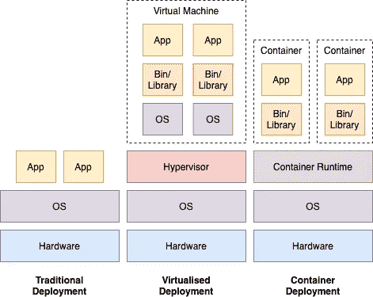

Traditional Deployment vs Virtualised Deployment vs Container Deployment

以上对比了传统、虚拟化和基于容器的部署。在传统情况下，我们手动维护操作系统，以便为在其上运行的所有应用程序提供运行时间。每个应用都会在同一台服务器上竞争资源。

在虚拟化部署中，我们使用虚拟机隔离应用程序。但是，它们都需要维护自己的操作系统和虚拟机管理程序层(创建和运行虚拟机的软件，负责与虚拟机共享和分配物理机的资源)。

容器以比虚拟机更轻量级的方式部署，因为它们具有更宽松的隔离属性(不绑定到特定的虚拟机)，并且是可移植的、高效的和一致的。

现在我们已经建立了容器的使用，什么是容器管理？

集装箱管理是我们创建、部署、组织和扩展集装箱的方式。假设我们想要托管一个网站，并决定使用容器。

我们用我们的站点定义了一个容器，并希望将它部署在云上。我们希望运行不止一个容器实例，并且希望在这些实例之间分配流量，以及在出现问题时让它们退出循环。这都是通过容器管理完成的。

我们已经介绍了相关的概念，现在让我们来考察 Kubernetes 本身。Kubernetes 是 Google 开发的开源容器管理系统。

让我们把系统分解成它的组成部分，一路上解释它们的目的。

## 库伯内特星团

这些收集并协调一组高度可用的计算机(称为**节点**)。我们将一个容器部署到集群，集群决定如何最好地将该容器放置在任何给定的节点上。组织集群的逻辑由**控制平面**负责，它通过运行在节点上的 API 和 **Kubelet** 服务与节点通信。此外，将有一个容器服务运行在节点上(如 Docker ),以便管理容器。

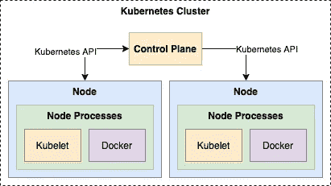

A Kubernetes Cluster

## Kubernetes 部署

如果我们有一个集群组织，我们会想把一些东西放在上面。这是我们进行**部署配置**的地方。这包含您的容器的图像和您想要运行的实例的数量。控制平面使用它在节点上更新或创建这些实例。它还监视已部署的容器，如果它们有问题，就替换它们。

我们可以使用 **kubectl、【Kubernetes 的命令行过程来组织这一切。**

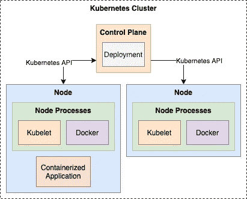

A Kubernetes Deployment

## 单元和节点

当我们部署容器时，它们在**容器**中运行。pod 用于对容器和资源进行分组，其中容器共享一个公共的 IP 地址和端口号。

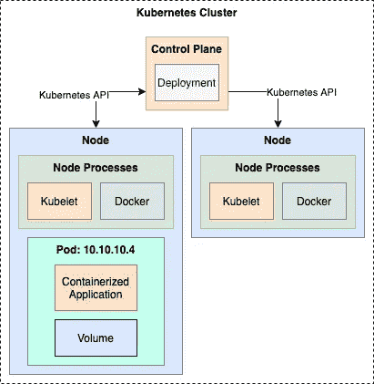

Introducing Pods

默认情况下，窗格仅对其他服务可见。如果我们想从群集外部联系他们，我们需要使用代理。

## 服务

pod 被逻辑分组，它们的访问策略由 YAML 文件中构建的**服务**定义。一个服务所指向的 pod 集通常由一个**标签选择器**定义。我们可以使用服务来做一些事情，比如创建一个负载均衡器，但是它们也负责让 pod 死去，然后在必要的时候复制它们。

服务使用标签和选择器来处理 pod。标签可用于添加版本标签或对对象进行分类。

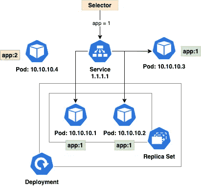

Kubernetes Services and Selectors

我们已经引入了**副本集的概念。**这些用于保持稳定数量的 Pod 同时运行，并包含一个 **Pod 模板**用于在必要时创建新的 Pod。

让我们引入更多的概念，并在一个使用 AWS EKS 的例子中阐明以上所有内容。

## AWS EKS 的工作示例

在这个简短的示例中，我们将向 EKS 部署一个示例 React 应用程序。大多数必要的代码可以在这里的库[中找到](https://github.com/JamesCollerton/Docker-React-App)。

EKS 很有用，因为它允许我们在 AWS 中托管节点，并处理补丁、节点供应和更新。我们可以跨可用性区域分布节点以获得更高的可靠性，AWS 提供了托管组节点和 Fargate 等服务，这将有助于资源扩展。

我们需要做的第一件事是创建 React 应用程序，并为它构建一个 Docker 映像。Docker 映像然后用于创建容器，我们将在 EKS 上运行这些容器。

我们使用以下方式创建应用程序:

```
npx create-react-app my-app
```

让我们浏览一下`src/App.js`文件并做一些修改。

```
function App() { return (
    <div className="App">
      <header className="App-header">
        
          <p>
            This is our example AWS EKS application!
          </p>
      </header>
    </div>
  );}
```

用`npm start`运行 React 应用程序，我们得到下面的屏幕。这就是我们试图让我们的应用程序在 EKS 上运行时所希望的:

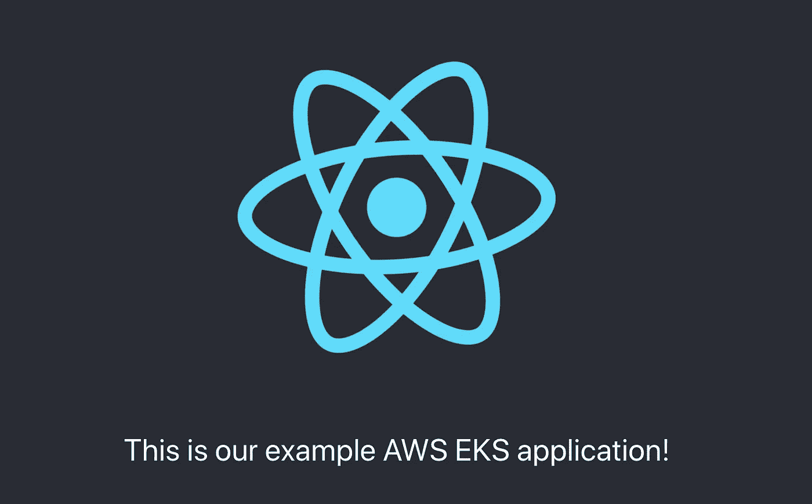

Let’s host this on EKS!

现在我们需要建立一个 Docker 图像。回到我们引入容器的最初原因，我们的映像定义了我们需要什么样的环境来运行我们的代码。

我们还可以利用 Docker 进行多阶段构建。除了需要一致的环境来运行我们的代码，我们还需要一致的环境来构建我们的代码。

```
########################################
# An environment to build our code# This is the base image. We want to build our own
# image on top of this.
FROM node:15.14.0-alpine3.10 as build# We set the container working directory to my-app
WORKDIR /my-app# Next we add the node modules to the path on the image
ENV PATH /my-app/node_modules/.bin:$PATH# We copy over our package.json and package-lock.json
COPY my-app/package.json ./
COPY my-app/package-lock.json ./# We install our dependencies
RUN npm ci# Copy over all of the files from our local machine and
# run the build commandCOPY my-app/. ./
RUN npm run build########################################
# An environment to run our code# This is the base image we want to use for our production
# build
FROM nginx:stable-alpine# Copy the built files onto our image
COPY --from=build /my-app/build /usr/share/nginx/html# Expose port 80 to be accessed via HTTP
EXPOSE 80# Start up the NGINX server
CMD ["nginx", "-g", "daemon off;"]
```

这是我们将用来构建图像的 docker 文件，我们可以将它包装在一个`docker-compose`中，以便于运行它。

```
version: '3.7'services:
  react-eks-app:
    container_name: react-eks-app
    build:
      context: .
      dockerfile: Dockerfile
    ports:
      - '80:80'
```

一旦完成，我们就可以使用`docker-compose up --build`调出并构建容器。

接下来的阶段假设您已经安装了 AWS CLI 并且是最新的，`kubectl`已经安装，并且有一个拥有必要权限的 AWS 帐户。我们将按照这里的说明[进行操作](https://docs.aws.amazon.com/eks/latest/userguide/getting-started-console.html)，以防您需要任何帮助来设置这些。

我们也将在一个合理的高水平上检查这些步骤。深入细节超出了中等文章的范围。关于创建集群的文章[将更完整地介绍接下来的几个部分。](https://docs.aws.amazon.com/eks/latest/userguide/getting-started-console.html)

## 创建 VPC 和 IAM 角色

我们首先需要一个 VPC 来部署我们的集群，这里我们使用 AWS 提供的堆栈。我们还需要一个 IAM 角色，我们可以将它分配给我们的集群，为它提供必要的 EKS 权限。

## 创建 EKS 集群

这是通过 AWS 控制台完成的。我们给它一个名字，即先前定义的角色，并将它链接到刚刚创建的 VPC。

一旦这一步完成，我们应该能够在控制台中看到它

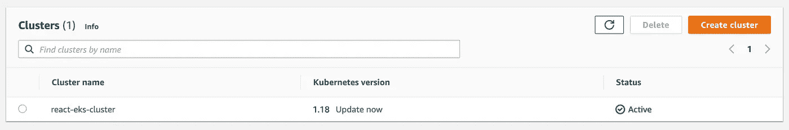

Our React EKS Cluster is now available!

## 配置我们的计算机以连接到群集

我们还需要本地机器能够连接到集群，这需要一个`kubeconfig`文件(一个用于使用`kubectl`工具配置 Kubernetes 访问的文件)。

完成后，我们可以运行`kubectl get svc`命令，并收到类似如下的响应:

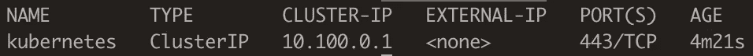

An example service response

## 创建 IAM OIDC 提供程序

这用于让我们的 Kubernetes 服务帐户访问 AWS 资源，完整的说明在上一篇文章中提供。

## 创建节点

现在我们有了一个集群和放置节点的地方(VPC ),我们可以开始将它们添加到我们的架构中了！我们将使用 AWS Fargate，它是为 EKS 和 ECS 设计的。它使我们不再需要担心服务器，而是可以专注于应用程序。

我们创建一个具有必要权限的 Fargate 配置文件，这允许我们根据容器的需要旋转资源。 ***然而，*** 在这一步值得注意的是，如果我们想只使用 Fargate(包括为集群的自动设置组件，如核心 DNS，以及后来为我们的负载平衡器)，我们需要做一些额外的设置[这里](https://docs.aws.amazon.com/eks/latest/userguide/fargate-getting-started.html)。

## 深呼吸，回顾一下

到目前为止，我们已经设置了用于部署节点的 VPC、集群和必要的权限。但是，我们没有在集群中部署任何东西，也没有提供访问运行在集群中的服务的方法。在接下来的步骤中，我们将完成上述两项工作，更多详细信息请参见本文关于部署 AWS 负载平衡器控制器的[和本文关于部署应用程序负载平衡器的](https://docs.aws.amazon.com/eks/latest/userguide/aws-load-balancer-controller.html)和。

## 安装 AWS 负载平衡器控制器

它为 Kubernetes 集群管理 AWS 弹性负载平衡器。我们将使用它来创建一个应用程序负载平衡器，将流量路由到我们的 React 应用程序。

一旦完成这些步骤，我们应该能够运行命令`kubectl get deployment -n kube-system aws-load-balancer-controller`并看到如下所示的内容:

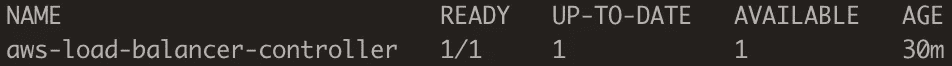

AWS Load Balancer Controller service

## 创建图像存储库并添加图像

现在，我们希望将在上一步中创建的图像添加到一个图像存储库中，这样它就可以被拉下来并作为一个容器运行。为此，我们将使用 [ECR](https://aws.amazon.com/ecr/) ，即 AWS 图像库。图像存储库是存储图像的方式，这些图像可以作为容器在其他地方运行。

创建 ECR 存储库非常简单。在 AWS 控制台中，导航到`us-west-2`区域，转到 ECR 并找到创建按钮。我们需要做的就是输入我们想要使用的存储库的名称。

完成后，我们需要标记之前构建的映像，以便将其连接到新的存储库:

```
docker tag <image-id> <aws_account_id>.dkr.ecr.<region>.amazonaws.com/react-eks-app
```

我们现在需要[向我们的私有存储库](https://docs.aws.amazon.com/AmazonECR/latest/userguide/registry_auth.html)认证 docker。通过认证后，我们现在可以推送我们的映像。

```
docker push <aws_account_id>.dkr.ecr.<region>.amazonaws.com/react-eks-app
```

我们应该可以在 ECR 中看到

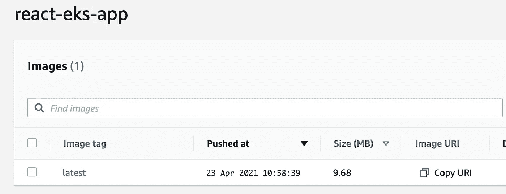

Viewing our image in ECR

## 将映像部署到我们的 EKS 集群

最后，我们需要在集群上将映像作为容器运行。首先，我们需要创建一个 Fargate 概要文件，它允许我们为应用程序部署节点。

```
eksctl create fargateprofile --cluster <my-cluster> --region <region-code> --name <alb-sample-app> --namespace <namespace>
```

下一步是创建一个引用我们图像的`yaml`文件。整个文件可以在这里看到[，但是核心组件是:](https://github.com/JamesCollerton/Docker-React-App/blob/main/eks-service-definition/services.yaml)

1.  一次部署运行我们的应用程序。这是获取我们之前推送到我们的存储库的映像并将其部署在一个节点上。
2.  一个节点端口服务，用于在集群的每个节点上打开一个端口。我们通过`http`运行我们的应用程序，所以我们使用端口 80。Kubernetes 然后将`NodePort`上的传入流量路由到我们的应用程序，而不考虑它的节点。
3.  一个应用程序负载平衡器入口。这就是从外部世界获取请求并将它们定向到我们的容器的原因。

我们可以使用这个文件，通过下面的命令来更新我们的集群:

```
kubectl apply -f <file name>.yaml
```

完成后，我们可以运行下面的。

```
kubectl get ingress/ingress-react-eks -n react-eks
```

这将给我们一个类似于这个图像的响应，但是有一个填充的地址。

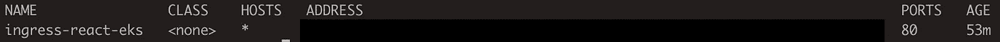

An example of an ingress response

将网址复制到我们的工具栏中，我们可以看到我们的应用程序被提供给我们！


The same site on EKS!

# 结论

总之，我们已经讨论了集装箱化和集装箱管理的动机和实现，并以一个使用 AWS EKS 的实例达到高潮。