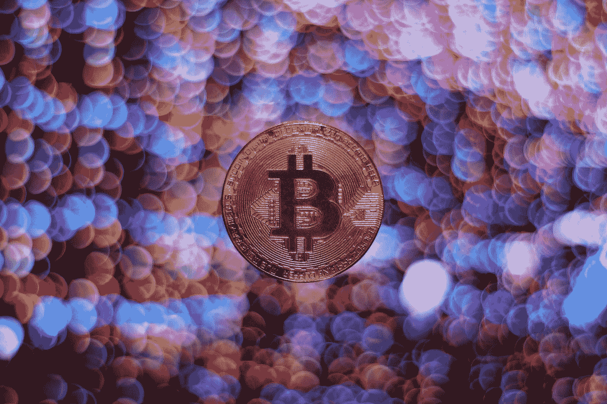

# Go 中的加密组合状态

> 原文：<https://medium.com/geekculture/a-crypto-portfolio-status-in-go-65f3b06c9bf1?source=collection_archive---------59----------------------->

Photo by [Viktor Forgacs](https://unsplash.com/@sonance?utm_source=medium&utm_medium=referral) on [Unsplash](https://unsplash.com?utm_source=medium&utm_medium=referral)

我不是一个专门的加密投资者，但我有一些微薄的加密控股定期喜欢检查。我说的定期，是指每隔几天左右，或者如果有市场消息的话。我并不迷恋他们。有很多方法可以在我的手机或电脑上追踪这些信息，但我也不想做得太多，所以充斥着广告的实时报价器或网站不是我的菜。我真的只是想要一句“嘿，你好…