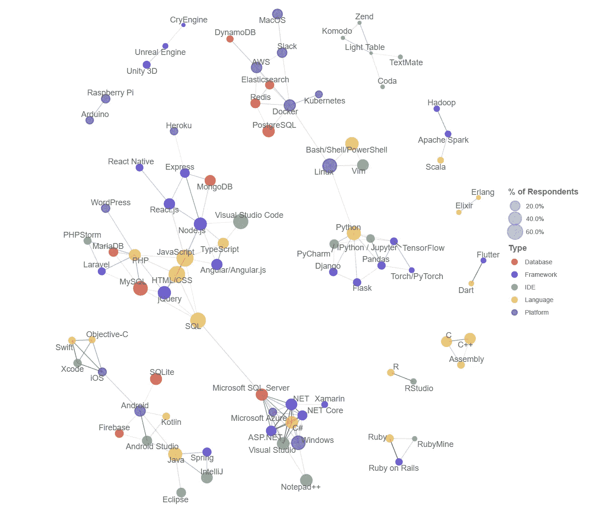

# 首席技术官不性感的决定是最重要的

> 原文：<https://medium.com/geekculture/a-ctos-unsexy-decisions-matter-the-most-ed3d8527504b?source=collection_archive---------15----------------------->

## 技术

## 这不仅仅是技术堆栈的问题

This Constellation of Technologies diagram reflects the popularity of various technology stacks. Image from [https://insights.stackoverflow.com/survey](https://insights.stackoverflow.com/survey/2020#correlated-technologies)

一位卓有成就的 CTO 最近与我交谈，感叹前任 CTO 的技术堆栈选择。她注意到团队无法轻松部署软件，并怀疑前任 CTO 的选择是否是原因。一点额外的调查揭示了底层的架构、设计…