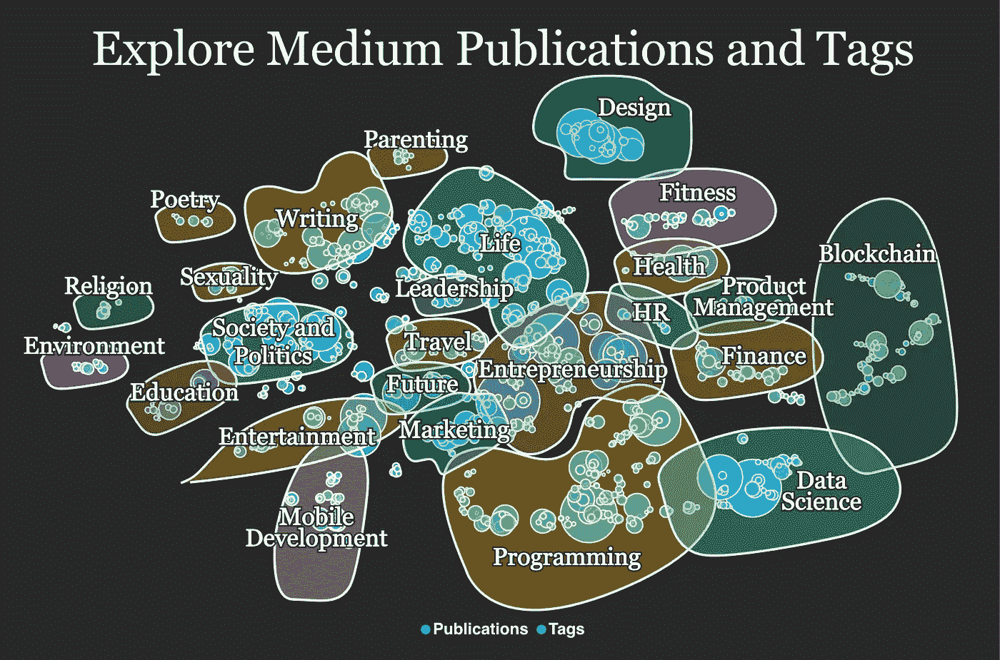

# 500 多家媒体出版物和标签的数据驱动分析

> 原文：<https://medium.com/geekculture/a-data-driven-analysis-of-the-top-500-medium-publications-and-tags-19ac8232d7c0?source=collection_archive---------12----------------------->

The Medium publications and tags grouped into semantic areas. Image from [https://pubs-and-tags.social](https://pubs-and-tags.social/).

## 对当前媒体主题前景的深入概述

由 Twitter 联合创始人[伊万·威廉姆斯](https://en.wikipedia.org/wiki/Evan_Williams_(Internet_entrepreneur))于 2012 年创立的 Medium 现已成为世界上最受欢迎的网站之一。据 [Alexa](https://www.alexa.com/siteinfo/medium.com) 称，Medium 已经将博客提升到了另一个高度，它目前是全球互联网的第 140 个网站…