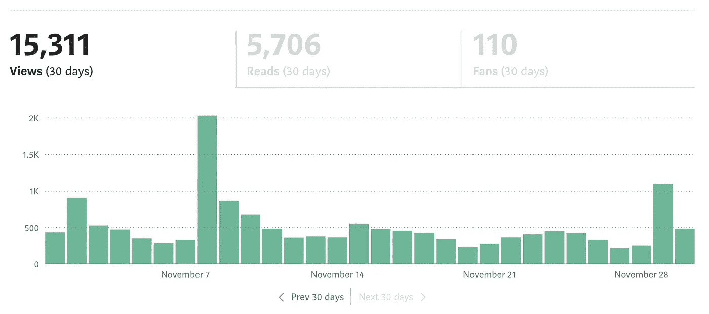

# 一年中每周一篇数据科学文章

> 原文：<https://medium.com/geekculture/a-data-science-post-a-week-for-a-year-d046601d8ca3?source=collection_archive---------1----------------------->

## 我的 DS 博客的中途反思。

六个月前，我决定一年内每周写一篇博客。写了 26 个帖子，还有 26 个要写，这是我的中途反思。

Figure 1: my readership stats for the month of November. Image by author.

快速，在我们进入它之前，这里有一些背景。

2020 年从学校毕业，学的是环境科学和数据科学。尽管我已经完成了很多兼职项目，但我觉得自己在第一份 DS 工作中准备不足。因此，为了提高我的技术技能，我开始写博客，在博客中我将学术研究进行分类，并使其易于获取。

以下是一些可行的思考，希望对数据科学领域感兴趣的人有所帮助。我们将开始关注细节，然后进行更高层次的讨论。

# 1 —为迈向数据科学而写作

首先，关于 TDS 写作的一些注意事项。

## 1.1 —金钱

我最初想将博客货币化，但在测试了货币化文章和免费文章之间的关系后，免费文章似乎有更高的浏览者和阅读量(图 2)。

Figure 2: very unscientific test of metered vs. free article engagement. Image by author.

我还和一些朋友聊天，看了一些关于潜在收入的帖子。根据上面的帖子，1000 次浏览相当于 15 美元，所以在 11 月份我可以赚 225 美元。然而，如果我们假设付费文章的参与度大约为一半，月收入将接近 100 美元。

现在文章影响力有了很大的变化。我最喜欢的三篇文章如下:

1.  [如何利用深度学习预测时间序列数据](https://towardsdatascience.com/deep-learning-for-time-series-data-ed410da30798):2.1 万观众(315 美元)
2.  [如何在你的机器学习模型中找到弱点](https://towardsdatascience.com/how-to-find-weaknesses-in-your-machine-learning-models-ae8bd18880a3) : 11k 观众(165 美元)
3.  如何使用 CUPED 将 A/B 测试速度提高一倍 : 5.1k 查看器(75 美元)

尽管有这三个异常的帖子，最常见的文章浏览量大约是 1000，这表明大多数帖子价值大约 15 美元。

对我来说，我宁愿增加曝光率，也不愿每月多拿 100 美元。此外，通过不赚钱，我潜意识里更愿意致力于个人感兴趣的话题，而不是迎合潮流和时髦词汇。

为 TDS 写作谋生是困难的。

## 1.2 —暴露

在过去的 6 个月里，我在 medium 上聚集了 370 名粉丝，在 LinkedIn 上有大约 100 个联系。这些联系大多是寻求帮助或寻求销售的人，但我通过博客交了几个朋友。最值得注意的事件是被邀请参加一个 ML 播客。

我也为 KDnuggets 写了一些东西——该网站似乎每篇文章都吸引了更多的曝光率和直接联系，但我还没有正式调查参与度的差异。

**总体而言，你从 TDS 获得了可靠的曝光率。**

## 1.3—TDS 写作建议

以下是一些在提高读者参与度方面对我很有效的技巧:

*   遵循 TDS 写作指南。这些建议有点老套，但是很可靠，为你的工作打下了良好的基础。
*   撰写足够好的帖子，以便 TDS 编辑在社交媒体上推广。这成倍地增加了收视率——这是成百上千的浏览量之间的差别。
*   在标题中使用流行词汇，但是要确保你的文章与众不同。
*   TDS 市场已经相当饱和——你实际上必须写*好的*帖子才能获得浏览量。

# 2 —我作为数据科学家的成长

我正试图开发一套“独特的”技能来克服我缺乏经验的问题，这似乎正在奏效。

## 2.1 —理论知识与实践知识

刚开博客的时候，我的动手知识(编程，解决问题等。)远远压倒了我对统计学和 ML 的理论知识。令人惊讶的是，这种趋势已经逆转，所以我试图重新平衡。然而，在过去的 6 个月里，我的总体 l 增长是相当惊人的。

即使有了 DS 学位，在我职业生涯的开始，我也只能跟随导师和/或更资深同事的指导。现在，我能够有意义地讨论广泛的技术主题，构思并从头到尾实现一个项目，并在代码审查期间发现细微的错误。

我在每个帖子上花了 4-5 个小时，所以按比例增加，我的承诺是大约 6 周的全职工作。在我看来，投资回报率是存在的。

如果你有上进心和好奇心，这可能是建立一般知识库的可靠方法。但是很难。

## 2.2-与数据科学工作的联系

不幸的是，我不能分享任何已经在工作中实施的项目，但这个博客导致了~3 个实施。然而，我认为我有能力有意义地讨论技术上先进的概念，这对我的团队更有价值。

大多数成功的团队依赖于协作，所以通过增加我的技术知识，我可以帮助整个团队，而不仅仅是我自己。

到目前为止，我已经写了一些我感兴趣或与我的工作相关的话题。对于后者，我的策略是用一篇论文 A)列出主题，B)提供新的想法/解决方案。任何论文的引言都应该提供一个主题的概述，我把它作为大纲。在对我来说是新的话题进行强调和记录之后，我就有了坚实的基础。从那里，我可以进入论文的贡献，给团队带来新的想法。

**我强烈建议利用这个策略。**

# 3 —我学到的一般知识

接下来，让我们谈谈我在过去 6 个月里学到的一些经验。

*   通常学术界的假设对工业界来说过于严格，这没什么。在 DS 行业实施项目的镜头是:“这个解决方案比当前的更好吗？”另一方面，学术研究寻找绝对真理。**不要让完美成为好的敌人。**
*   成为某方面的“专家”只能在大型或专业公司发挥杠杆作用。大多数少于 10 人的 DS 团队受益于多面手技能组合。对于决策科学(这是我工作的主要领域)，基本面是关键。对于一般 DS 来说，两个最有价值的技能是 python/SQL 中的数据操作和假设检验。了解你所在组织的理想技能组合，并(可能)采取相应的行动。
*   每个人都会在某方面比你强。我过去认为这是一个问题，但是当我检查越来越高级的话题时，我发现我有非常聪明和有知识的同事。你将不断学习和迭代，直到退休。

# 4 —最后一点:迭代是关键

> “动作要快，打破东西。除非你在破坏东西，否则你的速度不够快。”—马克·扎克伯格

我不知道我的职业生涯将走向何方，这很好。我做过的最有价值的一件事就是学会了如何快速迭代。无论你目前的风格/目标/知识如何，能够相应地反思和改变过程都是有益的。如果你在成长，你会犯很多错误，所以最好尽快改正。

陈腐但真实的行动号召——如果你有时间/兴趣，请就学习和职业发展之间的关系发表评论。这是我思考了很久的事情，希望听到更多的意见。

我目前的观点是，为了获得最佳的职业发展，你必须**在你的“最佳点”内外摇摆不定。**要传递价值，最有效的方法是发挥你的优势。然而，如果你总是发挥你的长处，你就不会成长。所以，“最优”路径是在两者之间切换。想法？

*感谢阅读！同样，如果你对职业发展和学习之间的关系有什么想法，请留下你的评论。*