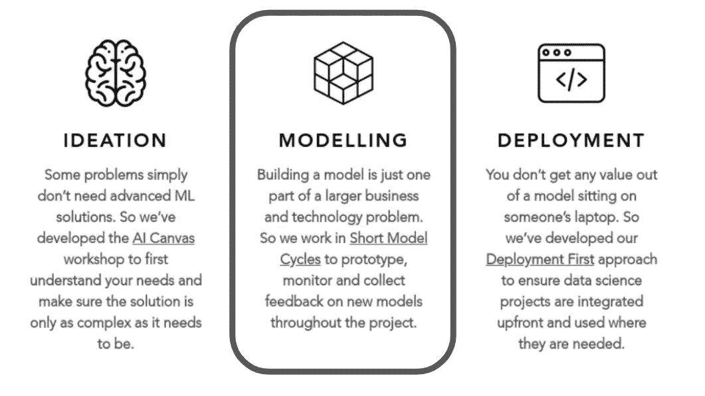
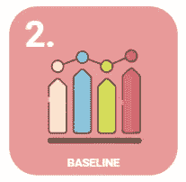
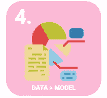

# 数据科学从业者指南(第 2 部分:建模)

> 原文：<https://medium.com/geekculture/a-data-science-practitioners-guide-part-2-modelling-1a7225f45394?source=collection_archive---------14----------------------->

# **简介**

在这个由 3 部分组成的系列文章中，我试图提炼出我在这个过程中学到的一些经验，以帮助数据科学从业者避免一些从事 ML 项目的公司最常犯的错误。该系列分为关于 [(1)范围](https://samueldylantrendlerking.medium.com/a-data-science-practitioners-guide-f459eb915b5a)、 [(2)建模](/geekculture/a-data-science-practitioners-guide-part-2-modelling-1a7225f45394)、 [(3)部署](https://samueldylantrendlerking.medium.com/a-data-science-practitioners-guide-part-3-deployment-e017c780cd85)的课程。这是那个系列的第**第二个**。

The Three Phases of a Data Science project ([https://www.codepan.com/](https://www.codepan.com/))

# DS 项目的“建模”阶段是什么？

数据科学的“建模”阶段涉及实际构建机器学习模型的实质。如果你已经确定了[构思阶段](https://samueldylantrendlerking.medium.com/a-data-science-practitioners-guide-f459eb915b5a)，那么项目和数据收集的目的现在应该很清楚了。建模阶段实际上就是回答这个问题:**‘ML*真的*能解决这个问题吗？’**。做到这一点的唯一方法是陷入数据和建立证据。

下面我总结了我在 ML 项目建模阶段学到的六条最重要的经验:

## **1。探索性数据分析(EDA)和清理等至关重要:**

出于某种原因，数据探索和清理通常被视为数据科学领域的次要艺术。这真是大错特错。EDA 是数据科学家真正理解这个问题的唯一途径。探索数据对于理解数据真正代表什么是至关重要的；而不是我们可能认为它代表了什么。事实上，数据经常包含偏见(例如，标签代表了他们应该定义的类别吗？标签有错误吗？).

> EDA 是数据科学家真正理解这个问题的唯一途径

它还帮助我们理解可能需要如何清理数据(数据类型是否正确？是否存在缺失值？我们需要从原始数据中创建新的特征来提取相关信号吗？等等。).这些步骤可能是劳动密集型的，所以请确保您预算足够的时间来完成适当的工作，但是数据理解/清理通常会比任何其他步骤对最终的模型性能产生更大的影响，所以给予它至少与模型本身一样的关注是至关重要的。

## **2。基线基线基线:**

建模阶段最常见的错误之一是直接跳到试图构建“可能的最佳模型”。停下来，深呼吸。一旦数据准备好建模，要做的第一件事就是创建一个坚实的基线来评估您的改进。我有时会将加权类概率用作基线(即，如果我将所有内容都预测到最大的类中，性能会如何)。虽然这是一个不错的开始，但我发现了其他三种更有帮助的基线设置方法。

第一种是**启发式(基于规则)方法**。我能使用一些 if 语句建立一个简单的模型吗(例如，如果身高> 175cm &体重> 80kg，那么性别=男性)。只要稍加思考，这种启发式基线可以扩展到几乎任何领域空间(例如，在计算机视觉分类中，如果我取每个像素的平均值，并预测到该平均值的总距离最小的类，或者在 NLP 中，如果我只基于常见的关键字进行预测，会怎么样)。

仅使用**最简单的现成 ML 模型**是另一种设定坚实基线的好方法。 [Scikit-learn](https://scikit-learn.org/stable/) 像 LogisticRegression 或 RandomForest 这样的浅层模型的实现可能是一个不错的选择。AutoML 解决方案也是一种不需要太多努力就能找到基线模型的好方法。

最后，做好你的功课，看看你的问题已经有哪些其他的实现。有解决类似问题的具体 python 模块或者开源项目吗？这不仅可以确保你不会在没有必要的情况下另起炉灶，还可以帮助你找到解决问题的方法。

> 基线对于理解一个“简单”的方法可以实现什么是必不可少的，并且给你一个很好的指示，你在改进你的模型中的努力带来了多少价值。

## **3。为工作选择正确的模型复杂度:**

我在建模阶段看到的最大错误可能是为了复杂的解决方案而选择复杂的解决方案。先验地决定你要使用定制的深度学习架构，会让项目更复杂、更昂贵、更难理解和维护；特别是当深度学习的东西通常有更大的研究成本来实际理解正在发生什么，为什么它/不工作，以及你需要什么来使它工作；更不用说必须调试 GPU/TPU 服务器的硬件限制了。你应该从简单的开始(上面的基线),找到最简单的解决问题的方法！请记住，技术只是解决现实问题的一种方式，它本身并不是目的。当只有这些深度架构具有建模非常复杂的问题所必需的变化时，定制深度学习算法应该是最后的手段。

> 你应该从简单开始，找到实际解决问题的最简单的模型。

## 4.改进数据通常比改进模型更好:

数据科学家经常沉迷于模型选择和调整，保持他们的数据不变，并试图通过使用越来越复杂的模型来挤出额外的性能。实际上，通过全面考虑您的 ML 管道，通常可以实现更大的改进。例如，选择一个合适的基线模型(见上文)，然后保持*不变，转而考虑改进您的数据，这通常会更有成效。尤其值得回顾一下你的训练数据，以检查标签定义是否一致，是否涵盖了所有的类和重要的(边缘)案例。一个很好的方法是建立基线模型，然后手动检查模型仍然做出错误预测的情况。我经常做一些事情，比如通过相似类型的错误进行聚类(例如，X 类的假阳性被预测为 Y 类)，并与正确的预测进行比较(例如，X 类的假阳性与真阳性)。在这些情况下，纠正标签和审查标签过程以提高数据质量，往往比单独调整模型对整体性能产生更大的影响。*

> 保持模型不变，转而考虑改进数据通常会带来最大的改进

## **5。较短的模型周期有助于您尽早发现真正的问题:**

帮助解决上述问题的一个很好的解决方案是实现短建模周期(SMCs)。这是一个受 [CRISP-DM](https://exde.wordpress.com/2009/03/13/a-visual-guide-to-crisp-dm-methodology/) 方法启发的过程，但是其中数据理解/清理- >建模- >评估- >部署- >反馈的整个迭代在短时间内完成(我发现 1 周的周期工作得很好)。这种方法的主要好处是让数据科学家专注于工作(例如，在一周内可以展示哪些切实的改进…而不是我会研究 3 个月，然后带着最终的解决方案回来)。然而，帮助将数据科学成果整合到更广泛的产品开发流程中也非常有用。归根结底，模型的价值取决于它们给用户带来了多少价值，因此将模型集成到产品开发周期中，以便测试人员/用户能够接触和感受到模型预测或早期标记问题的影响是无价的。

SMCs 还迫使建模认真考虑部署问题。如果您在边缘设备上部署，并且型号大小需要为<1MB then you want to hit that problem as soon as possible (and not 3 month later when a data scientist comes back with a perfect 10GB model). SMCs are a great way to hit these problems early and build great ML driven products where the model is tightly integrated with both user needs and software requirements.

> At the end of the day models are only as valuable as how much value they bring to users and so integrating the modelling into the product development cycle […] is invaluable.

## **6。评估指标远远超出了模型性能:**

评估是所有 ML 项目的关键。如果不能以稳健的方式比较模型的性能，就不可能取得进展。然而，数据科学家通常对评估指标的定义非常狭窄，仅包括模型性能(例如，错误率/精确度/召回率/分类问题的 f1 分数)。能够理解更广泛的业务问题并超越模型性能以开发更切实的评估指标是关键。这里我指的是用户指标(例如，对以前手动处理的 90%的文档进行分类，每个新客户可以为用户节省 2 个小时)和业务指标(例如，以 0.1 的错误率向新客户推荐正确的产品，从而使€在去年增加了 50 万美元的收入)。有时候，这些指标很容易计算，有时候，它们需要更认真地参与领域理解和 A/B 测试等。但它们对建模阶段的成功至关重要，因为它允许数据科学家最有效地向所有参与的*利益相关者传达结果。*

以这种问题优先的方式思考也有助于为您的模型性能度量创建一个更加现实的训练/测试/验证集:这里的一个好的经验法则是“创建一个测试集，它最接近地代表您认为生产中的输入数据将会是什么样子！”这也有助于避免数据泄露问题。例如，如果客户一次提交所有文档，那么在训练集和测试集中包含来自同一个客户的文档是不公平的，因为这在现实中永远不会发生！总的来说，处理手头的实际问题，并获得超越常规训练/测试分割和性能度量的评估度量，以真正捕捉问题空间的细微差别，这对于构建理解模型的真正附加值所需的证据是至关重要的。

我发现像 [MLflow](https://mlflow.org/) 这样的工具是非常有用的框架，可以构建项目的建模阶段，并确保你掌握以上六课。

# 结论

建模是任何成功的 ML 项目的面包和黄油，但是，除非你花时间适当地接近你的建模框架，否则它经常会变成一个黑箱，在那里很难评估你是否真的在改进。

我希望这篇文章是有帮助的！如需了解更多关于 ML 项目或其他任何信息，请直接联系我。期待您的来信，并在这个系列的下一部分中再见。