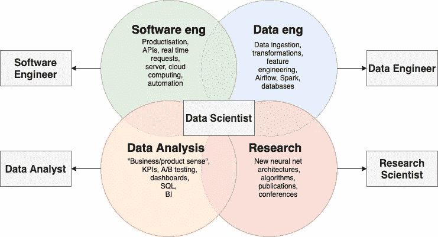

# 数据科学家只是一名软件工程师

> 原文：<https://medium.com/geekculture/a-data-scientist-is-just-a-software-engineer-f13fcaf8730f?source=collection_archive---------34----------------------->

## 我们已经找到了困扰数据科学项目的许多问题的解决方案

Image from the slides of [Full Stack Deep Learning, Lecture 11](https://fullstackdeeplearning.com/spring2021/lecture-11/)

对于数据科学家和软件工程师来说，这可能是一个挑衅性的标题。一个有经验的后端开发人员可能会断言工程师更擅长编写产品代码。数据科学家会声称，新产品和新功能(尤其是数据驱动的)构思阶段的探索性工作更适合他们。

当然，关键不是角色完全相同。相反，出于建立流程和组织的目的，类似地对待这些角色可能更有意义，而不是像对待数据分析师一样对待数据科学家。这种更正确的分类将有助于管理数据科学项目、设定期望值和交付价值。

# 原型

查看组织中的数据科学家有几种替代方法:

## 巫师

这是第一种模式，通常是技术成熟度低的组织或小型创业公司的固有模式。向导加入了一个真空的过程或组织支持，但对它们有着巨大的期望，因为负责任的利益相关者听说过谷歌实施的酷人工智能应用。

随着时间的推移，利益相关方对数据科学角色的期望和看法不可避免地会偏离这一原型。在实践中，这里的科学家经常发现实际上没有太多建模和高级分析要做，工作的本质归结为基本的商业智能。就像马斯洛的需求层次理论一样，呼吸比自尊更重要，在一个组织中，拥有一个基本的收入仪表板比实现一个神经网络(可能基于破碎的数据)更重要。

## 研究员

出于某种原因，这个原型是许多(初级)数据科学家自己建立期望的基础。他们认为他们的日常工作将围绕构建新颖的值得出版的方法论，例如 PyTorch 中的定制架构。在现实中，这项研究将构成他们工作的一小部分(至少对于大多数被称为数据科学家/机器学习工程师的角色来说)。最有可能的是，这种预期不匹配是由学术界的势头驱动的，学术界奖励新奇而不是影响，这与工业界截然相反。

## 分析师

数据分析师是科技公司中必不可少的一员。他们通常掌握业务脉搏，通过可视化工具、自动化报告、特别分析、领域知识等支持决策制定。我认识的许多数据分析师都拥有与数据科学家类似的技能:他们对机器学习模型和统计方法并不陌生。主要的区别来自于对角色的期望:分析师的产出是我们所谓的*知识*，而数据科学家主要生产软件(下面会有更多的介绍)。

## 工程师

由于历史较长，软件工程师的角色相对来说更容易确立。一般来说，与向导相比，对工程师的期望更低，因为优秀的经理明白大的变化是强大团队渐进发展的结果，而不是天才向导的零星贡献。工程师需要研究新项目的最佳实践方法、工具和论文。在实践中，80/20 权衡通常意味着使用一些现有的复杂逻辑库，而不是从头实现一个功能。最后，一名优秀的工程师仍然会进行数据分析，尤其是在新设计的构思阶段，但对分析师来说，主要的区别在于交付物的性质——软件，而不是知识。

Image by me, recreated from article of Jason Jung

这是 Jason Jung 的一篇文章中对数据科学子技能的另一个类似细分。然而，如果我必须为这些分配与在不同工作模式下花费的时间成比例的线性权重(基于我所知道的数据科学家/ML 工程师)，我会说它是这样的:

*   0.3 软件工程
*   0.4 数据工程
*   0.25 数据分析
*   0.05 研究

我认为数据工程是软件工程的一个子集，因此 70%的时间花在与软件工程相关的工作上。

# 科学家 vs 工程师

让我们回顾一下数据科学和软件开发之间的区别和相似之处，看看角色是否相似到足以有用。

## 差异

一个主要的区别是在计划和执行项目。经典的软件项目通常是[二进制的](https://www.linkedin.com/posts/joonatan-samuel_data-science-teams-are-fundamentally-different-activity-6699589047687380993-SB4A)，在这个意义上，它们对于预期的实现及其准确性具有较少的不确定性。有产品需求，它被转化为技术规范，然后在代码中实现。请注意，大多数软件工程设计文档是在实现之前编写的。

数据科学项目天生具有[高不确定性](https://www.comet.ml/site/why-software-engineering-processes-and-tools-dont-work-for-machine-learning/)。在实现原型之前，您永远不知道模型的准确性。此外，模型永远不会像典型的软件项目那样“完成”。一个新的热门科学家可能会在 2 周后带着一个关于特征工程的聪明想法来，显著提高模型的准确性，实现以前甚至无法想象的新产品特征。在 Bolt，数据科学设计文档总是在实施后编写，与最初的想法相比，通常会发生重大变化。

这种现象意味着数据科学家更经常地使用一次性笔记本和脚本来验证快速假设——这可能就是他们无法编写正确代码的概念的来源。在务实程序员的术语中，数据科学家最常与[原型](https://blog.codinghorror.com/the-prototype-pitfall/)一起工作——这是实验特性的必要条件。

## 类似

与数据分析师原型的主要相似之处和区别在于，数据科学家被期望交付软件，而不仅仅是报告、仪表板、意见或信息图表。这通常采用托管模型工件的微服务的形式，后端调用者可以使用这些模型工件进行推理。

一旦您部署了模型，它就变成了一个持续的维护项目，因为需要:

*   监控和记录
*   管理技术债务
*   考虑到现有用户，以向后兼容的方式添加新功能

换句话说，软件的生产者也承担了软件的所有权。

最后，数据科学家和软件工程师都要接受一些通用技能的评估，这些技能也与生产软件相关:

*   将业务问题转化为技术规范
*   处理与其他团队的依赖关系
*   在设计中以顾客为导向
*   在确定优先级和计划过程中考虑收益递减
*   评估新技术和新方法，以更好的方式做事

# 这对您的数据科学团队意味着什么

由于数据科学家生产将在生产中使用的代码，它需要高质量。为了确保这一点，我们可以重用软件工程在过去几十年中开发的许多过程和工具，例如:

*   使用代码版本控制系统
*   在拉式请求中工作，实施审核
*   使用 linters、调试器、剖析
*   通过 CI/CD 工具实现自动化部署
*   为整个模型管道编写测试。机器学习模型通常需要比普通软件更复杂的测试，因为您希望确保(黑盒)模型在极限情况下表现良好，符合您的假设，您的验证框架模拟生产环境，生产中没有数据漂移等。

另一个要点是，如何为数据科学团队设定流程和期望，这主要是针对经理的。因为向导和研究员是不现实的原型，所以通常可以归结为工程师和分析师之间的选择(你也可以把它看作一个光谱)。在我看来，优化更接近于工程。

在没有明确定义的结果(“看看这些数据，看看你是否能想出什么好主意”)和可交付成果的情况下，从事高度不确定性的研究项目通常不是一个好主意——在一个足够有趣的问题上，你可能很容易花费数年时间！相反，我们可以采用一些用于复杂软件项目的有用的计划方法:

*   明确定义的目标指标
*   总是追求 80/20 MVP，而不是理想的解决方案
*   将不确定的项目划分为明确定义的可交付成果(在第 1 周完成数据查询，在第 2 周实施预处理，在第 3 周训练简单的逻辑回归，在第 4 周微调最先进的神经网络)
*   将计划的可交付成果从有趣的知识转移到自动化的行动(软件)。当有人提议研究一些有趣的数据时，我首先会问的一个问题是——“你认为我们如何利用这些数据改进产品，并以自动化和可扩展的方式做到这一点？”

NB:那么你应该复制所有的软件工程过程并应用到你的团队中吗？大概不会！每周冲刺会议？日常单口相声？啊！上面的差异部分是不这样做的一个很好的理由。相反，我的观点是，我们可以从软件工程领域借用一些有用的技巧。

*原载于 2021 年 6 月 28 日*[*【https://mlumiste.com】*](https://mlumiste.com/a-data-scientist-is-just-a-software-engineer/)*。*