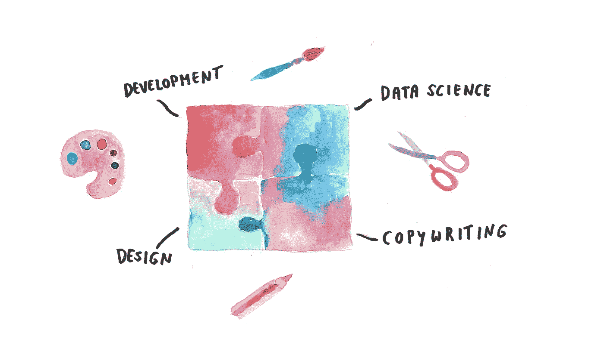

# 数据科学家跨学科工作指南

> 原文：<https://medium.com/geekculture/a-data-scientists-guide-to-working-between-disciplines-e9e46dd944c1?source=collection_archive---------16----------------------->

Illustration by the author.

## 简单的课程，修补心态的重要性，以及互补拼图的魔力。

在我的团队中，像我这样的数据科学家与开发人员、技术人员和设计师合作，将数据和机器学习转化为创造性的体验，从脆弱的原型到可扩展的产品。毫无疑问，对于数据科学家来说，这是一个非常独特的职位，自从几年前加入这个团队以来，我就没有停止过学习。

以下是我在跨学科团队中最喜欢的三堂编程课——以及这些课如何帮助你在数据和创造力的交汇处为客户打造更好的体验，这正是我们有幸参与的领域。

**用户第一(他们可能不是数据极客)**

作为一名数据科学家，你可能习惯于做只有另一个数据呆子才能真正欣赏的工作。但是，如果你已经在与软件工程师合作开发数据产品，你可能必须意识到，“部署到生产环境”不幸并不意味着“它在我的机器上成功运行了两次，所以我现在要洗手不干了”。我的团队成员，无论是技术人员还是创意人员，都是粗暴地打破我小小的数据科学后端泡沫的专家，而我也因此变得更好。

与创意人员一起工作教会了我，我们产生的任何数据或见解都需要既容易获取又有趣。除非你是好莱坞大片中的白帽子，否则黑屏上无尽的代码行不太可能引发欢乐。你的工作需要整合到一个快速可靠的数据管道中，除非你想听到你最喜欢的软件开发人员解释说*他们没有生气——他们只是对用户输入和完成输出之间的 15 分钟延迟感到失望*。

简单、美观和快速是生成和显示结果的关键，也是让用户在屏幕的另一边体验迷人的数据之旅的关键。

**涉足尖端科技(并对其进行批判性的质疑)是必须的**

当你与跨领域的团队成员一起工作时，你别无选择，只能站在最新的行业发展的顶端。有一天，你正在实时训练一个大规模的神经网络，并且必须找到一种方法来部署它，这样应用程序才不会崩溃和/或花费一大笔钱来运行。第二天(或一小时)，一位同事给你发来了一个看起来很有趣的全新开源库，于是你开始钻研它，哦，你看过这个交互式数据可视化框架了吗——我们能在下一个项目中使用它吗？

你的队友可能不像你一样知道你的特定学科的局限性(反之亦然)，所以你要对最闪亮的新物体的实质和实用性进行批判性评估。

这也是你的工作，以确保我们给予信用的地方应该得到的(如果你没有想出这个模型，是谁呢？)，并且诚实地面对代码的潜在风险和局限性——所有这些都为最终用户带来了更加透明和负责任的体验。

知道香肠是如何制作的只会增加魔力

有人可能会怀疑，在微软团队的聊天中看到香肠被制作会带走一个抛光产品的神秘感和诱惑力。相反，当你知道整个事情看起来像是被剥去一部分时，大揭露会感觉更特别。不知何故，你的机器学习管道现在对用户输入做出实时反应，漂亮地包装在一个时尚而实用的 web 应用程序中？如果这不是魔法，我不知道什么是。

如果您忘记了，没有什么比外出通知更能提醒您的了。作为一个相互依赖的小团队，如果一个人外出度假，有时这意味着我们错过了整个专业。这并不是说美国数据科学家无助地局限于我们的代码编辑器，而没有那些特殊的创造性点缀。只是我们很可能最终会把我们的模型放在一个让人想起互联网早期的网站上……但我们不希望这样。

这种对每个人工作的赞赏是额外的动力，确保我们做好自己的工作，这样团队的其他人也可以做得最好——并且在他们做的时候玩得开心。毕竟，我坚信，一项有创意的技术，构建起来很有趣，我们迫不及待地想自己玩一玩，它会转化为同样快乐的客户体验。

你也是跨学科团队的数据科学家吗？我很想听听你的经历。