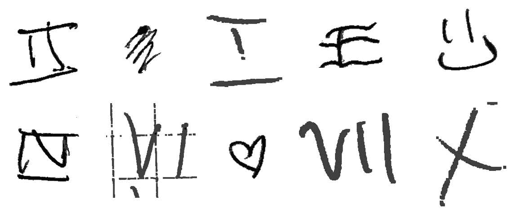

# 深入探讨 Andrew NG 以数据为中心的竞争

> 原文：<https://medium.com/geekculture/a-deep-dive-into-andrew-ng-data-centric-competition-eb2bc0886005?source=collection_archive---------2----------------------->

## 关于这种新型挑战，您需要了解的一切，关注数据质量而不是模型性能

Extract from training dataset — Compiled by Author with the authorization of DeepLearning.ai

# 给予荣誉应得的荣誉:吴恩达

如果你已经知道[吴恩达](https://medium.com/u/592ce2a67248?source=post_page-----eb2bc0886005--------------------------------)，你可以跳过这一部分！
但是如果你不这么做，[安德鲁](https://medium.com/u/592ce2a67248?source=post_page-----eb2bc0886005--------------------------------) …