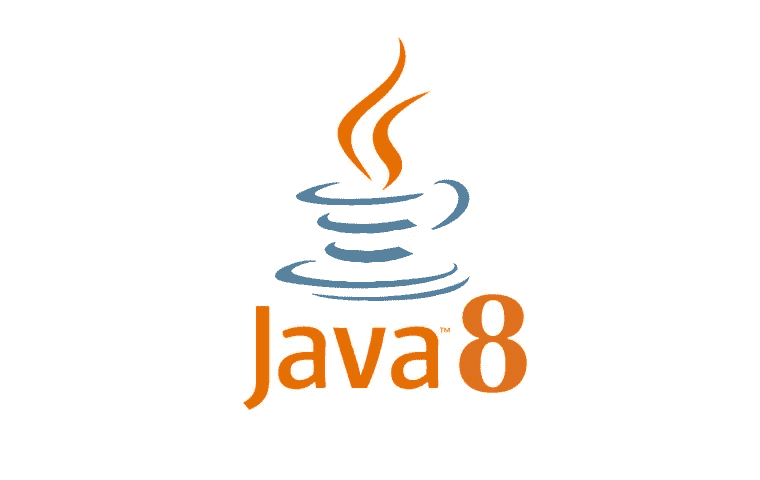

# 深入探究 Java 8 equals()和 hashcode()

> 原文：<https://medium.com/geekculture/a-deep-dive-into-java-8-equals-and-hashcode-902990535507?source=collection_archive---------3----------------------->



# 什么是 equals()？

在*Object.java*中的默认代码中，*等于()*定义如下:

```
public boolean equals(Object obj) {
    return (this == obj);
}
```

该方法使用“==”来比较两个对象。" == "比较 Java 中的引用地址。如果两个对象引用同一个地址，默认情况下它们是相等的。