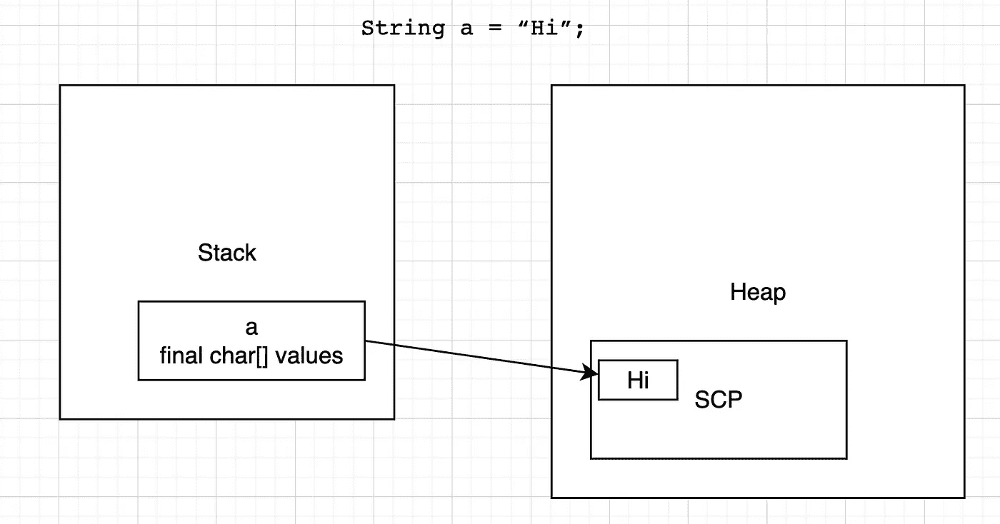
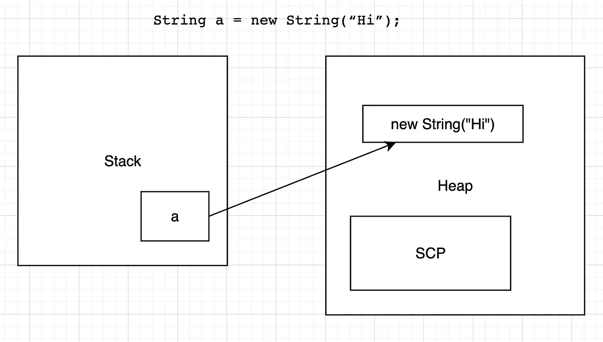

# 对 Java 字符串的深入研究

> 原文：<https://medium.com/geekculture/a-deep-dive-into-java-string-e5f67ccbdba8?source=collection_archive---------6----------------------->

Credit due to Christina Morill

你真的了解 Java 字符串吗？

字符串是 Java 程序中最常用的对象之一。看似简单，但真的是这样吗？检查你对以下程序的理解，看看你是否真正理解了`String`在 Java 中是如何工作的:

是否有些打印声明违背了你的预测？那你应该继续读下去。

## 管柱的工作机理:

为了能够理解所有这些结果，我们需要首先深入了解 String 类的工作机制。在 Java 的 String 类实现中，我们可以看到它包含了`final char[] value.`它包含了 final 关键字，所以我们知道 String 类的值只能赋值一次，使得`value`属性不可变。在 JVM 运行时，当我们调用类似`String a = “Hi”;`的东西时，会发生这样的事情:首先，JVM 会在栈上为变量`a`分配内存。然后，它还会在堆中一个叫做字符串常量池(SCP)的地方分配内存。(稍后解释)因此，该语句将创建两个内存:一个在堆栈中，一个在堆中。stack 中的变量的`value`属性指向 heap 中的`“Hi”`。

Diagram for direct assignment

因为 string 是一个对象，我们也可以通过`String b = new String(“Hi”);`创建一个 String，但是，正如你在程序中看到的，我们将让`a == b`计算为 false。为什么？是因为记忆力差。在前一种方式中，字符串的值可以在编译时确定，而在后一种方式中，则不能。因此，我们将在堆上为`new String(“Hi”)`额外分配一个内存。因此，虽然具有相同的`value`，但两个字符串变量`a`和`b`并不相同。同样，如果我们赋值`a=b`，然后我们改变`a’s`值，那么`b's`值不会改变。这是因为虽然`a`的值引用了`b`的值，但是只要`a`发生变化，它就必须获得一个更新了`char[] values`的新内存，而`b`的值将保持不变。

Diagram for “new” assignment

## SCP:

如上所述，每当我们创建一个字符串，JVM 就会在一个叫做 SCP 或字符串常量池的地方分配一个内存。根据它的名字，我们知道它是一个池，充满了类似于`“Hi”`、`“Hello”`等字符串值。当人们编写 Java 时，他们发现在许多场合，有许多变量具有相同的`char[] values`。因此，他们决定让所有的字符串变量共享同一个实际的`char[] values`，并将`char[] values`放在堆内存下的一个池中。比如，当我们创建一个值为`“Hi”`的变量`a`，然后创建一个值为`“Hi”`的变量`b`时，JVM 会先去检查 SCP 是否包含一个`“Hi”`的`char[] values`，如果包含，它会返回 SCP 对该变量的引用；如果没有，它将在 SCP 中创建一个值`“Hi”`。理解了这一点，我们就可以知道，如果我们声明两个值相同的字符串(用直接赋值的方式)，那么在 Java 中它们将是相等的。

需要注意的一点是，对于具有相同值的对象，它们的底层对象'`char[] values`'不会在 SCP 中产生，除非你调用`intern()`方法，这将在后面解释。因为新的字符串对象都必须在堆中单独分配。只看下面的程序:

通过类似的推理，如果我们有一个字符串变量通过直接赋值，一个通过调用 new，它们也会不同:

## 弦乐实习生

方法将返回一个对 SCP 中字符串的引用，如果没有，它将为您创建一个。因此，如果我们在对象上调用`intern()`方法，我们可以拥有以下类型的等式:

我们可以通过调用`intern()`方法创建 SCP，得到如下等式:

嗯，不调用上面的`intern()`方法怎么样，还会成立吗？不，不会的。我将在下面的部分解释它。

## 字符串相加、串联

首先，让我们考虑一下:

为什么这是真的？答案是，c 和 d 的加法将在编译时完成。因此，编译器将知道它们的值，并将能够把它放在 SCP 中，因此`d`可以获得这个值。因此，它们将被评估为是真实的。然而，如果我们不写成`“Hi” + “Java”`，而是写成`variable + constant`，这是不可能的，因为编译器将不能确定这个值。请参见以下内容:

表单`variable + variable`的推理相同:

对于用`new`构建的字符串对象，情况有点不同。如果我们在堆中连接两个字符串对象，它们的计算结果将不会与下面的相同:

为什么？试着自己想出解决办法。

## 字符串的更高效版本

String 并不像您看到的那样高效。每次我们重新分配字符串，因为`final`属性，我们都要创建新的内存，重新调整引用。有没有更高效的 String 版本？是的。给你:StringBuilder 和 StringBuffer。

StringBuilder 不使用`final char[] values`，而是使用`char[] values`，这暗示了它与 String 不同的功能:它可以更新值，而无需在内存中创建新对象，从而节省了我们的时间和空间。StringBuffer 做了类似的事情，只是它是线程安全的，这会降低一点性能。

事实上，`+`操作在幕后使用了 StringBuilder。每次我们调用`+`，JVM 都会创建一个 StringBuilder 操作符，并使用它将我们的字符串连接在一起。考虑以下程序:

在每个循环中，将构造一个 StringBuilder 对象，`str = str + i`将被粗略地翻译成`StringBuilder builder = new StringBuilder(str); builder.append(i); str = builder.toString();`你看，这样，我们将有 1000 个内部构造的 StringBuilder 对象，这是低效的。相反，我们应该这样做

通过这种方式，我们只需要构造一个 StringBuilder 对象，效率要高得多。

尽管 String 是我们 Java 编程中最常用的对象之一，但它实际上并不那么简单。为了充分理解它，我们必须深入 Java 的源代码和 JVM 的知识。幸运的是，你现在已经学到了足够的东西来真正理解它。把这些知识记在脑子里，它会让你在未来避免一些与 String 相关的难以捉摸的 bug！