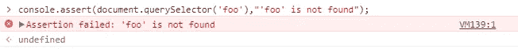
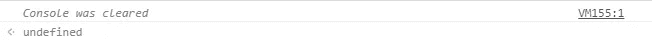
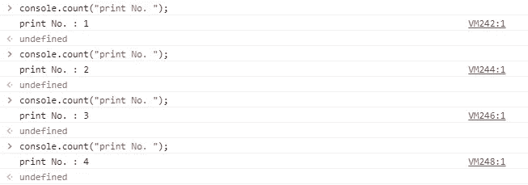
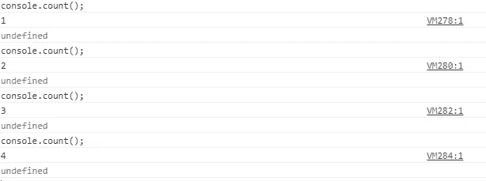
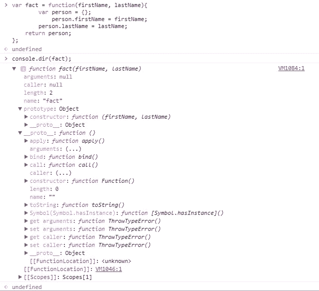
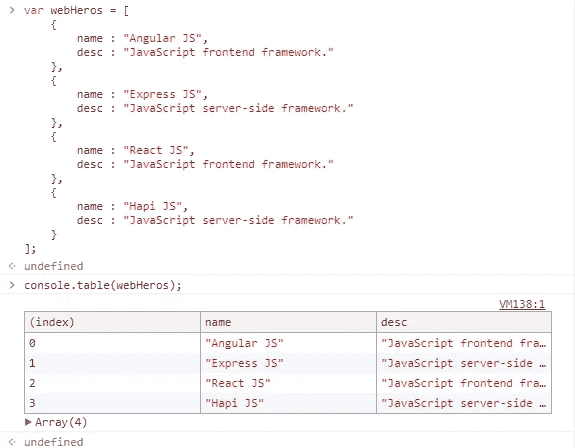
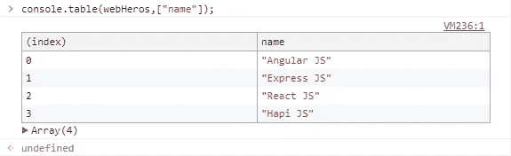
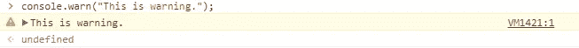
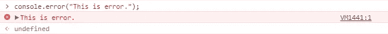

# 使用 JavaScript 控制台深入了解高级日志记录

> 原文：<https://medium.com/geekculture/a-deep-dive-to-advance-logging-with-javascript-console-4e3de695fcd4?source=collection_archive---------1----------------------->

作为前端开发人员，我们总是使用 console.log()来调试前端 web 应用程序。许多 web 开发人员只使用了 3%的控制台电源。控制台对象是调试任何 web 应用程序客户端的强大工具。现在我带着对主机的深厚了解来到这里，与大家分享。

# 控制台简介

通过属性控制台，可以从浏览范围上的任何全局对象`[Window](https://developer.mozilla.org/en-US/docs/Web/API/Window)`及其在 workers 中的特定变体中访问`Console`对象。暴露为`Window.console`，可以简称为`console`。

# 一些你不知道的控制台对象的功能

## 1.Console.assert()

通过使用 **console.assert()** 函数，如果断言为假，则**会写入一条错误消息。如果断言的结果为真，则不显示任何消息。console.assert()函数接受**两个参数**第一个是**断言**，第二个是**错误消息**。如果断言返回 true，则不显示任何消息，否则会显示一条错误消息。**

```
console.assert(document.querySelector('foo'),"'foo' is not found");
```

未声明“foo”时上述代码片段的结果。



## 2.Console.clear()

在控制台的这个功能列表中，第二个功能是 clear()功能。函数的作用是:清除控制台窗口并给出控制台被清除的消息。当大量控制台数据显示在控制台屏幕上并且您想要清除该屏幕时，此消息非常有用。如果在 Google Chrome 中，选中了保留日志复选框 console.clear()不起作用。



## 3.Console.count()

**console.count()** 函数在我们发现**特定日志被调用了多少次**时被调用。console.count()将标签作为可选参数。如果您给 console.count()函数一个标签，这个函数将打印带有这个标签的结果。



如果在没有标签的情况下调用 console.count()函数，它只打印 console.count()被调用的次数。



## 4.Console.dir()

**console.dir()** 函数给出 Javascript 对象或函数的部分列表。在控制台屏幕中打印类似于 **JSON 的**对象，并显示由 console.dir()调用的特定 javascript 对象或函数的每一部分。通过使用 console.dir()函数，我们可以访问由 console.dir()调用的特定对象或函数的子对象或函数。



## 5.Console.table()

控制台最重要也是我最喜欢的功能是 **console.table()** 。如果你想以最有组织的格式显示数据，那么这种方法适合你。通过使用 console.table()，您可以打印对象的数组和以**表格格式**显示的对象。console.table()有**一个强制参数**(对象或对象数组)。



如果我们想访问对象数组中对象的一些属性，我们就要限制数据访问。



## 6.Console.warn()

如果您在**控制台**屏幕中打印一条**警告消息**，我们可以使用 console.warn()函数。console.warn()函数将一个对象、消息和另一个 javascript 类型作为参数。控制台屏幕中的**浅黄色**显示的警告信息。



## 7.Console.error()

如果您在**控制台**屏幕中打印一条**错误信息**，我们可以使用 **console.error()** 功能。 **console.error()** 函数将对象、消息和另一个 javascript 类型作为参数。错误信息显示在控制台屏幕的**红色**中。console.error()函数和 console.exception()函数的工作方式相同。



## 8.Console.info()

**console.info()** 函数在控制台屏幕上打印**信息消息**。该功能仅用于**信息记录任务**。

## 9.Console.log()

该功能是**每个 web 开发者**在控制台屏幕上**记录**输出的主要使用功能。该功能被开发者用作**调试工具**。通过使用这个函数，web developer 在给定阶段检查日志中的输出。

[](https://github.com/vsvaibhav) [## 瓦伊巴夫(瓦伊巴夫夏尔马)

### vsvaibhav 有 13 个可用的存储库。在 GitHub 上关注他们的代码。

github.com](https://github.com/vsvaibhav)