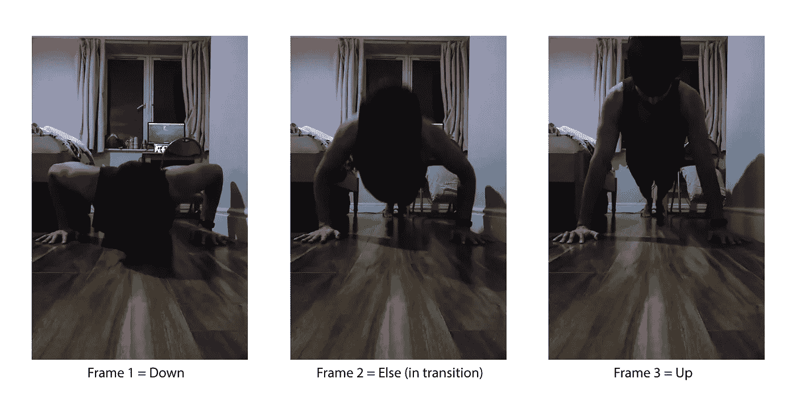
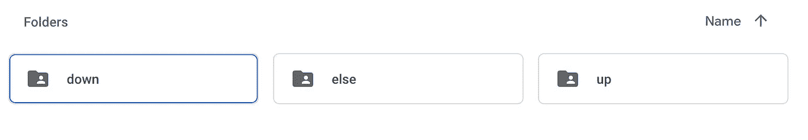
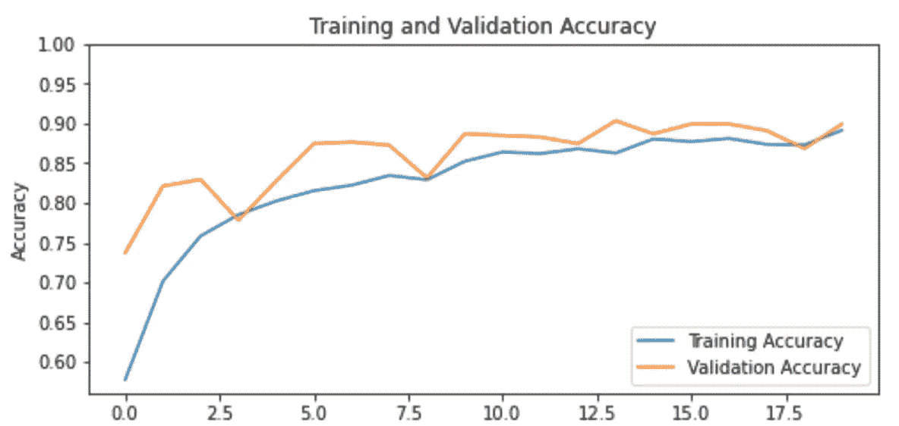

# 用于隔离家庭健身房的深度学习实验

> 原文：<https://medium.com/geekculture/a-deep-learning-experiment-for-quarantine-home-gyms-216ab1d28c1e?source=collection_archive---------24----------------------->

## 与 [Ojasvi Yadav](https://medium.com/u/b84cd651e185?source=post_page-----216ab1d28c1e--------------------------------) 合著


Image Credits — [https://www.castlehillfitness.com/group-programs/online-classes](https://www.castlehillfitness.com/group-programs/online-classes)

> 在 2020 年，大量的人口不得不被限制在他们家的四面墙内。隔离打开了以前没有想到的问题，不能去健身房就是其中之一。46%的印度人受到全国封锁的影响，因为健身房、公园和健身中心的可达性有限。因此，许多健身圈转移到在线视频会议平台，在家工作**变得突出。**

随着这些班级的规模每天呈指数级增长，培训师很难关注每个单独注册的学生。尤其是当一些锻炼涉及大量重复时，训练者很难保持计数并适当地评估注册的学生。它呼吁开发工具，以满足此类和类似场景的分析和实时性能跟踪。在这篇博客中，我们讨论了一个这样的用例——**在深度学习的帮助下计算俯卧撑的重复次数。**

由于深度学习可以帮助缓解和自动化许多计算机视觉问题，因此为管道找到正确的架构是我们必须解决的第一个问题。现在，通常使用先进的计算机视觉技术来解决这些问题，如[人体姿态估计](https://towardsdatascience.com/human-pose-estimation-simplified-6cfd88542ab3)、[光流](https://en.wikipedia.org/wiki/Optical_flow#:~:text=Optical%20flow%20or%20optic%20flow,brightness%20pattern%20in%20an%20image.)等。通过使用诸如 [Tensorflow 的姿势估计](https://www.tensorflow.org/lite/examples/pose_estimation/overview)库之类的库来进行关节的姿势估计是有用的，但是由于它需要高计算能力，所以在基于移动的部署中使用它可能是不合理的。但是因为我们希望这个实验非常用户友好、简单和灵活，所以我们选择使用传统的分类管道。该算法应该能够将俯卧撑视频的帧分类到不同的俯卧撑阶段，如图 1 所示，可以将其附加到事件列表中(…向下- >向上- >向下…)，因此充当计数器。

**更新**——这个博客不是一个跟进/代码跟进的博客，尽管它看起来可能是这样。查看本博客的结论，以便在继续讨论之前检查我们的学习成果。


Fig 1\. A simple illustration depicting the classification of frames into notable events.

# 1 —选择模型和框架

对于这种特殊情况，对象检测算法必须足够快速、精确和轻便，甚至可以部署在手持设备上。根据 Jonathan Hui 的全面比较，快速部署模型领域的流行算法包括 Fast-CNN、YOLO、SSD 和 MobileNet。与此同时，大多数被比较的模型都是 Tensorflow 2 的[检测模型 Zoo](https://github.com/tensorflow/models/blob/master/research/object_detection/g3doc/tf2_detection_zoo.md) 的一部分，所以我们继续使用 Tensorflow 2 作为框架。仔细比较了 COCO 数据集上许多模型的性能指标，以及它们的易于部署性和灵活性，我们选择了 SSD-MobileNet V2。该网的研究论文可以在这里阅读[。](https://arxiv.org/pdf/1801.04381.pdf)

使用该模型的特别优点包括即使在移动设备上也能快速准确地预测，并且可以方便地与 Tensorflow 一起用于迁移学习应用。[迁移学习](https://machinelearningmastery.com/transfer-learning-for-deep-learning/#:~:text=Transfer%20learning%20is%20a%20machine,model%20on%20a%20second%20task.&text=Common%20examples%20of%20transfer%20learning,your%20own%20predictive%20modeling%20problems.)是一种创新的方法，通过使用预训练模型(通常在大型数据集上训练，如 [ImageNet](https://www.image-net.org/) )和重新训练最后的“n”(可配置参数)层进行微调，来减少训练时间。这使得 NN 初始层中的基本特征识别器准确地工作，同时影响最终层的权重以迎合我们特定的数据集。使用迁移学习的另一个优点是，它有助于用更少的图像获得想要的结果。在我们的案例中，我们也决定遵循 TensorFlow 提供的迁移学习教程，如这个[链接](https://www.tensorflow.org/tutorials/images/transfer_learning)所示。

# 2 —获取和设置迁移学习所需的数据

在迁移学习开始之前，我们必须找到一个数据集来满足我们对俯卧撑阶段进行分类的需要。我们没有去寻找外部资源，而是录下了自己做俯卧撑的过程。视频是从我们的手机摄像头拍摄的非常简单的记录，帧是使用非常基本的 Python-OpenCV 脚本提取的，如图所示。

在查看提取的帧时，我们得出结论，最好将帧分成三个事件，down、else 和 up，如图 2 所示。标签完全是通过目测来决定的。



Fig 2\. Sample Images were taken from the video stream and labeled into the three respective categories purely based on visual examination.

在我们提取数据之后，我们手动地(随意探索注释数据的方法[这里是](https://evergreen.team/articles/image-annotation.html))将数据分离到它们各自的标签中，并将它们放入如下所示的三个类别中。这些文件夹存储在另一个文件夹中，即“标签帧”



Fig 3\. Labeled Folder structure for all the extracted frames from the pushup’s video, to ease out the CNN Training Process.

保持数据原样是一种非常低效的构建项目或机器学习应用程序的方式，尤其是当您在 Google Colab/Kaggle 等云机器上工作时。因此，我们决定使用 [Pickle](https://docs.python.org/3/library/pickle.html) 来序列化数据集。序列化或“pickle”数据可以帮助您将 python 对象转换为字符流，字符流可以通过 pickle 反序列化，对于共享对象非常有用。多亏了[sendex](https://pythonprogramming.net/)，我们能够使用下面的方法将数据集打包成一个序列化的对象。在序列化的同时，我们决定将图像的尺寸调整为 100 * 100，以使我们的图像与教程保持一致。

在这个过程完成之后，如图 4 所示，在随机重排之后，有必要以预定的比率将数据集分成训练、验证和测试数据集。它是使用 Sklearn 的 [train_test_split](https://scikit-learn.org/stable/modules/generated/sklearn.model_selection.train_test_split.html) 函数(执行了两次)实现的，并进一步序列化如下图以供进一步使用。


Fig. 4 — A visualization showcasing how the entire dataset has to be split to train a model with less bias and variance. Image Source — [https://towardsdatascience.com/train-validation-and-test-sets-72cb40cba9e7](https://towardsdatascience.com/train-validation-and-test-sets-72cb40cba9e7)

# 3 —数据预处理

在将数据序列化为单独的变量后，它被单独读取并被整形。数据集的形状是根据必须训练的神经网络的形状决定的，如教程中所示。

必须完成另一个预处理步骤，即[一键编码](https://machinelearningmastery.com/why-one-hot-encode-data-in-machine-learning/)。需要对标签进行一次热编码，其中标签本质上不是有序的。在这里，标签的性质是绝对的(up、down 和 else 是彼此独立的)。因此，我们需要一种方法来确保算法在对给定数据进行训练之前知道这种差异。下面你可以看到我们是如何在开始迁移学习之前对标签进行一次性编码的。

# 4 —执行迁移学习

首先，加载预先训练好的 MobileNet-V2(已经在 ImageNet 数据库上进行了训练),并如下所示创建数据批次。与此同时，参数 base _ model.trainable = False 用于定义在迁移学习期间不应训练 MobileNet 模型。

然后，创建非冻结层，并编译和验证模型。

输出应该是这样的

```
20/20 [==============================] - 5s 229ms/step - loss: 2.2518 - categorical_accuracy: 0.2546initial loss: 2.25
initial accuracy: 0.25
```

最后，它被训练…(请记住，我们选择在训练时保存每个时期的模型权重，因为这是一种良好的做法，以便在梯度爆炸的情况下选择最佳模型)。

输出太长而不能在本实验的范围内共享，然而，可以在图 5 中查看训练和验证准确度与训练时期的关系图。



Fig. 5 Training and Validation Accuracy after Transfer Learning has been done

我们在数据集上实现的验证数据集的总体分类准确度约为 0.89。

# 5-保存和测试模型

加载保存的模型，并使用下面的代码在测试数据集上评估该模型

输出是…

```
20/20 - 0s - loss: 0.2301 - categorical_accuracy: 0.9076
Restored model, accuracy: 90.76%
```

在测试数据集上实现了良好的准确性(因为它与我们的验证准确性相当)，这表明模型具有更小的偏差和方差。

# 5-网络摄像头上的实时测试

为了结束我们的实验，我们开始创建一个小脚本，它将直接从我们的笔记本电脑的网络摄像头接收视频，然后计算俯卧撑的总数。首先，我们保存了我们在之前的帖子中创建的检查点，然后我们加载它，以便直接从相机预测帧，如下所示。该代码从摄像机获取一个输入帧，通过 CNN 运行它，预测动作，并将其存储在一个列表中。当我们退出循环时，在后处理过程中，将按照特定顺序扫描整个事件列表([2(向上)，1(否则)，0(向下)])。找到这种模式后，计数器会更新，并打印在最后，表示俯卧撑的总数。

在运行这个脚本时，我们注意到，通过执行俯卧撑，脚本有时能够识别帧，但不是太准确，但我们以前没有预见到的许多其他问题出现了，它们将在下一节中讨论。

# 结论

尽管有一个非常快速和易于理解的原型，它的工作(有时😆)，网络摄像头上的现场测试为我们提供了一个了解项目中仍然存在的谬误的学习机会。

1-分类算法确实擅长快速解决问题，但是，不同的衣服，不同的背景，以及俯卧撑表演场所的不同设置，会很快破坏标准模型。在接下来的文章中，我们将进一步用其他模型对此进行实验，如[](https://www.jeremyjordan.me/semantic-segmentation/)**或**光流**，以便将动作从整体框架中分离出来。**

**2-在这种情况下，计数算法没有完全优化，以适应在解决计数问题时可能存在的各种边缘情况。例如，俯卧撑的速度可能快或慢，这取决于人，因此需要更鲁棒的模式识别算法，例如 [**Knuth Morris Pratt 搜索算法**](https://towardsdatascience.com/pattern-search-with-the-knuth-morris-pratt-kmp-algorithm-8562407dba5b) **。****