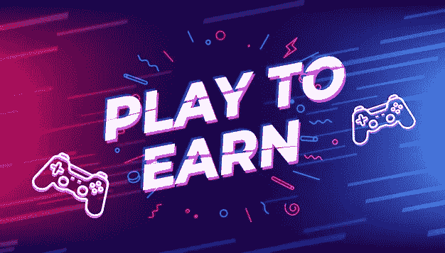

# 一些影响游戏产业的基于游戏开发的平台！

> 原文：<https://medium.com/geekculture/a-few-play-to-earn-game-development-based-platforms-that-impacted-the-gaming-industry-cc2acb7b9aad?source=collection_archive---------17----------------------->

## 今天，P2E 博彩市场超过 8 亿美元，预计在未来十年将大幅增长。

玩游戏/运动是世界上许多人的爱好。虽然几个世纪以来，体育已经以各种方式商业化，但游戏的金融化相当晚，因为视频游戏才成为游戏产业的根基。五十多年来，游戏产业一直掌握在少数知名公司手中，一些独立游戏工作室偶尔会掀起潮流。虽然这对大公司来说意味着增长(所谓增长，我们指的是巨大的增长)，但玩家除了娱乐之外无法获得任何好处，即使他们花了很多钱。有没有可以让事情变得更好的解决方案？

# 从游戏到收入的游戏开发:启蒙者

为了回答这样的问题来了[**【P2E】游戏开发**](https://bit.ly/3yhVBPP) 。这一过程依赖于区块链应用，如加密货币、不可替代令牌和其他 Web3 技术。虽然第一个基于区块链的用例在 2000 年代末首次出现，但第一个“玩赚”游戏——CryptoKitties——上市却花了几年时间。但是，在跳得更远之前，你必须知道 P2E 游戏通过玩家经营的经济为玩家和游戏工作室提供了一个双赢的局面。今天，P2E 博彩市场超过 8 亿美元，预计在未来十年将大幅增长。

# 2022 年顶级游戏开发项目

虽然今天有超过 1500 个 P2E 游戏，但并不是所有的游戏都在玩家群体中受到同样的欢迎和欢迎。在这篇博客中，我们将关注在 Web3 游戏世界中著名的六个游戏开发项目。

## [Axie Infinity](https://bit.ly/3eaSvq7)

也许，全球最知名的游戏开发项目 Axie Infinity 就是基于战略战斗类型的。由越南游戏工作室 Sky Mavis 于 2018 年 3 月开发，它的黄金时期只出现在 2021 年 NFT 繁荣时期，当时它的市场收入了价值数亿美元的加密货币。其本土代币$SLP 和$AXS 的价值同时飙升。游戏中的玩家使用“Axie”NFT 互相战斗并赢得 SLP 代币。AXS 令牌用于治理方面。游戏在其生态系统中的玩家参与程度是其受欢迎的主要原因。

## [夹板](https://bit.ly/3CwRzFQ)

Splinterlands 是一个由同名工作室创建的游戏开发项目，于 2021 年 3 月发布。它基于充当 NFT 的数字交易卡，玩家相互战斗以赢得各种加密和基于 NFT 的奖励，如魔法药水和暗能量晶体(该平台的原生令牌)。这款游戏因其不可预测的机制和吸引人的画面而广受好评。这款游戏的优势在于只需要很少的投资就可以开始玩，这给那些考虑在游戏中购买物品的玩家敲响了警钟。

## [去中心化](https://bit.ly/3C6N4AB)

虽然《分散之地》不能完全归入游戏开发类别，但它仍然为玩家提供了赚取功能。作为最早的元宇宙游戏之一(于 2020 年 2 月推出)，它为寻求从 Web3 运动中受益的人们打开了新的大门。这个平台是基于用土地表示的地块，可以用 100 美元的法力代币购买.然后，土地所有者可以在他们的土地上建立自己的企业(市场和游戏),赚取被动收入。此外，玩家可以玩这些迷你游戏来娱乐和赚取现金奖励。人们还可以在这个平台上进行虚拟社交。

## [沙盒](https://bit.ly/3efboIm)

沙盒是一个体素风格的元宇宙游戏开发项目，由著名的 Web3 游戏工作室 Animoca Studios 于 2021 年 11 月推出。它看起来和感觉上类似于《我的世界》，但与区块链的应用程序。玩家可以购买地块，建立自己的企业，并向他人收取使用费。游戏的原生令牌$SAND，可以用来体验游戏内的活动。该平台还为个人玩家提供帮助，帮助他们使用工具包制作迷你游戏。这样的机会只会增加沙盒在 P2E 游戏领域的声誉。P2E 元宇宙游戏拥抱创造力，这是其指数增长的主要原因。

## 外星世界

《异形世界》是一个基于元宇宙·NFT 游戏模式的游戏开发项目。该游戏在以太坊、蜡像和 BNB 链中运行，围绕 7 个虚拟星球，玩家将在那里采矿以获得游戏的原生加密货币 trillium。《异形世界》本质上就是通过标记本地令牌来访问高端功能。这是目前 Dappradar.com 追踪网站上排名最高的游戏。根据其创始人的说法，这款游戏不仅仅是 P2E，因为它旨在通过治理教授加密技术的采用，并以一种引人入胜的方式为大众制定策略。

## 农民世界

一个基于虚拟农业的新颖平台,《农民世界》是一个游戏开发项目，最近搅动了 Web3 游戏行业。这款游戏基于蜡像区块链，提供高效快速的交易。农民世界致力于采矿、繁殖、建造和培育虚拟土地，并保护其免受野生动物的侵害。它有三个主要标志:FWW、FWF 和 FWG，分别代表木材、食物和黄金——游戏世界中的主要资源。虽然游戏的路线图仍在运行，但由于游戏适合每个人在 Web3 中玩，用户流入量已经很大。

## 最终光线

因此，随着 NFT 游戏进入大众化阶段，尽管竞争日益激烈，业务范围仍然存在。如果你想推出一款特色鲜明、引人入胜的 P2E 游戏，这可能是开始的好时机。向游戏开发公司寻求技术支持，因为这个过程有一定的难度。 [**Web3 游戏**](https://bit.ly/3V82D3t) 世界是无限的，你的创新思维也是无限的！勇往直前，成为基于 Web3 技术的 P2E 游戏的领导者。