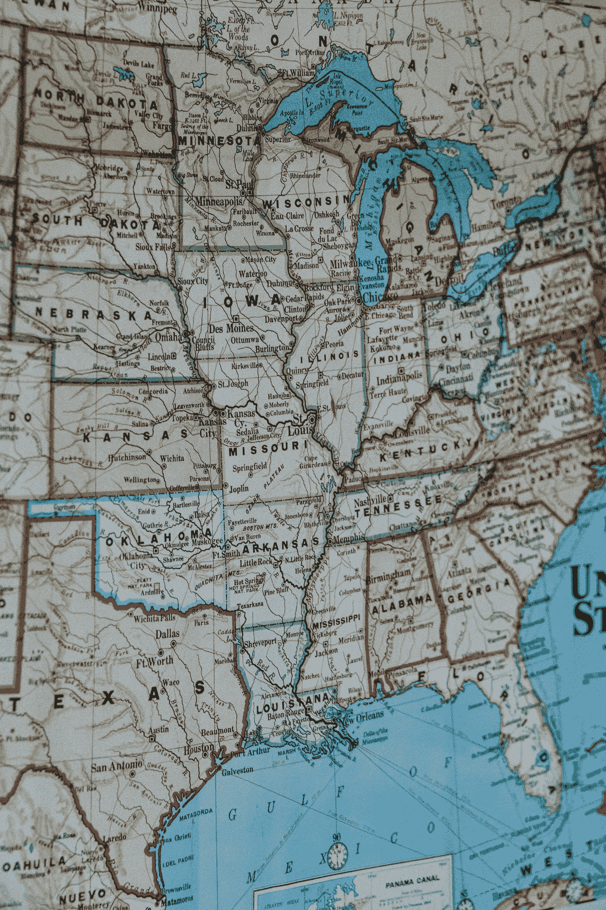

# 对“美国各州和美国人口普查局部门以及区域的助记符”的跟进以及“加拿大各省和地区的助记符”

> 原文：<https://medium.com/geekculture/a-follow-up-to-mnemonic-for-the-us-states-and-united-states-census-bureau-divisions-and-hence-73409745ea58?source=collection_archive---------57----------------------->

也许我应该把这两篇文章合在一起发表，名为“美国 USCB 地区和州以及加拿大各省和地区的助记符”或者也许它可以被称为“我的美国和加拿大分支助记符。”这是因为它们基于相同的原则，有相同的限制。事实上，我计划那样做，但是忘记了。

“单体”是一个真实的词，这也是我选择它来代表 MNMR 的原因。它是一种化学物质，就像聚合物一样。一种聚合物似乎是由几种单体组成的。

## 调整格式。

“WOC·安·TL·MA Flor”只是几个好的格式之一，因为易于理解而被选中。每个无意义的单词一个音节很容易理解，它显示了如何发音的助记符。

其他可能的格式有 WocantlmaFlor、Woc An Tl Ma Flor、Wocantlmaflor、wocantlmaflor、WOCANTLMAFlor’和 WOCANTLMAFlor。

同样“单体连接”(V)..(.)DiM VaNS G Flor '(伍德)”可能是“单体 Conn' (V)..(.)Dim Vans G Flor '(木)”或“monomerconn(v)..(.)dimvansgflor(wood)”或“monomerconnv dimvansgflorwood”。

有些人可能会发现将五个音节的行连接成一个无意义的单词很方便。

也许最好坚持“WOC AN TL MA Flor”的发音，因为它能回忆起这种方式的划分，并且每行有理想的五个音节。

## 如何使用助记符。

我可以用助记符(或者说助记符，如果你愿意这么看的话)在美国和加拿大的空白地图上填上美国所有的行政区和州以及加拿大所有的省和地区。

请注意，加拿大的一个省就像美国的一个州，加拿大的一个地区就像加拿大的一个省。我不知道加拿大有什么东西与美国的划分相对应，所以助记符并不试图表明这一点，而是简单地将加拿大分为北部和南部，在某种程度上表明 BASM 省有一些共同点，应该被视为一个群体。

如果美国的各州已经在地图上标出来了，那么用 Woc an tl ma Flor，Mim I yo P Newj 来回忆行政区划是很容易的。

如果你的地图只显示了行政区划，你可以很容易地填写每个行政区划中至少大致的州。通过一些练习，你将会在他们的区域内得到正确的位置。

如果地图只显示了美国的轮廓，你可以用所有的州来填充它。如果你只有一张白纸和一支铅笔，你可以凭记忆画出美国，包括五十个州和九个区。

如果你只是在脑海中描绘美国(当然，还有加拿大)，你可以用助记法相当准确地描绘出所有的州和行政区划。

如果有人提到一个州，你可以用助记法回忆它在哪里。例如，如果提到的州是田纳西州，你可以对自己说 WocantlmatKent，它回忆起田纳西州是“在马特肯特”区(或只是“在马特肯特”)，即区 6(因为 Woc 9，an 8，tl 7，ma 6，Flor' 5)。人们还可以回忆起田纳西州与肯塔基州和阿拉巴马州接壤。普通的记忆可能会提醒你，它也与密西西比接壤。

通过练习，你将能够在听到或读到田纳西时直接回忆起“马特肯特”。通过大量的练习，你会在脑海中简单地看到田纳西州位于肯塔基州之下，就像一个长方形位于另一个长方形之下，而密西西比州和阿拉巴马州就像一对正方形支撑着田纳西州。

如果你忘记了全部或部分记忆，通过查看标明各州的美国地图，很容易就能记起来。

注意，如果你回忆 WocantlmatKent 回忆田纳西在哪里，你就修改了前者。因为美国的州这些天被提到很多，甚至在北美以外，这意味着你会经常修改助记法的所有部分，这样你就不会忘记任何部分。

事实上，为了回忆田纳西州的位置，我曾经对自己说，“Woc an tl ma Flor: Woc an tl mat Kent”。

这个助记符没有直接告诉我每个州或省的确切纬度，尽管它给了我一些线索。为此，我有其他的记忆术，我也在媒体上发表了。但是，如果你已经知道他们所在的分区和大致位置，以及他们接壤的其他几个州，那么使用那些特定纬线和他们所接触的每个州的助记符，例如美国的北纬 40 度，效果会好得多。

我觉得这种知识特别享受，特别满足。我想部分原因是信息是如此精确，没有丝毫怀疑，这在人类世界的知识中是如此罕见。另一件事是知识的完整性和完善性。就像一字不差地熟读一首诗。你可以检查所有的方框，并对完美完成的工作感到满意。

我发现，一旦我能背诵一个国家的所有分支，我对这个国家的态度就会积极得多，就好像它是我的朋友一样。或者这可能是一种征服了地图的感觉，拥有了某种抽象的东西。毫无疑问，这是不理智的。另一方面，这可能是一个“知识就是力量”的例子。

不管你是不是美国人，无论你是爱美国还是恨美国，或者你还在犹豫不决，你都应该清楚这一点，一个简单而有趣的开始就是掌握美国的州和区。如果你是苏格兰人，你可能想用我的苏格兰助记法，如果你是爱尔兰人，你可能想用爱尔兰助记法，这两篇文章都发表在 Medium 上。

很多人，尤其是美国的年轻学生，记住美国各州的首府，这是值得做的，但我想说，理想的情况是，只有在完全掌握了每个州的位置之后，才应该这样做。我的记忆术让这变得简单。

当知道了美国的州和行政区划后，我们可以了解到的关于美国的许多其他事情就更容易了解，也更有意义。例如，密西西比河的流向。

请注意，我的“Mim I io P Newj”包含的第一个音节“Mim”是厨师的“帽子、头和躯干”，是著名的“Mimal”厨师(他们说，田纳西是他拿着的托盘)，因此助记符与 Mimal 助记符非常吻合(哪个天才想出的这个词？).

明尼苏达、爱荷华、密苏里、阿拉巴马、路易斯安那。你能看到厨师的身影吗？“分别是厨师帽、头、躯干、大腿和靴子”，他们说。

Mimal 是如此之好，以至于我对整个美国和加拿大的记忆术与它相吻合，而不是与之相冲突。

当你知道美国各州和各省的布局，以及你了解米马尔的时候，常见的短语“密西西比以西(或以东)”就更有意义了。还要注意的是，五大湖似乎是从米马尔的厨师帽顶端喷溅出来的。

Photo by [Hans Isaacson](https://unsplash.com/@hans_isaacson?utm_source=medium&utm_medium=referral) on [Unsplash](https://unsplash.com?utm_source=medium&utm_medium=referral)