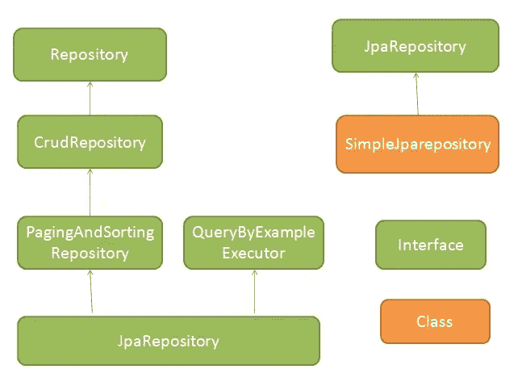
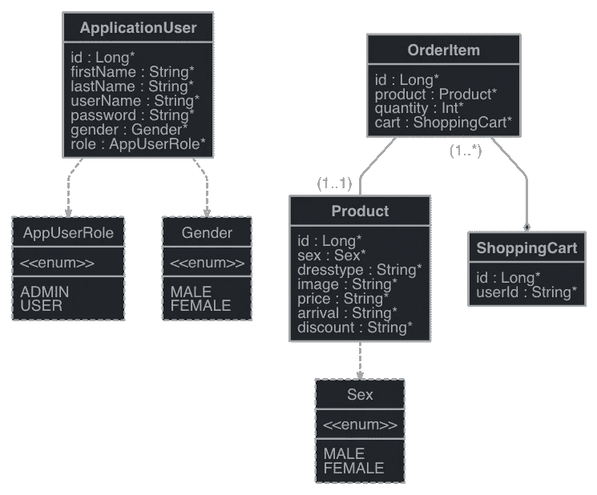
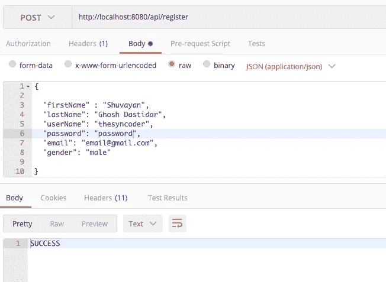
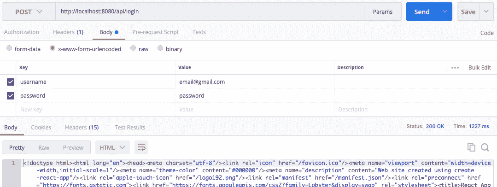
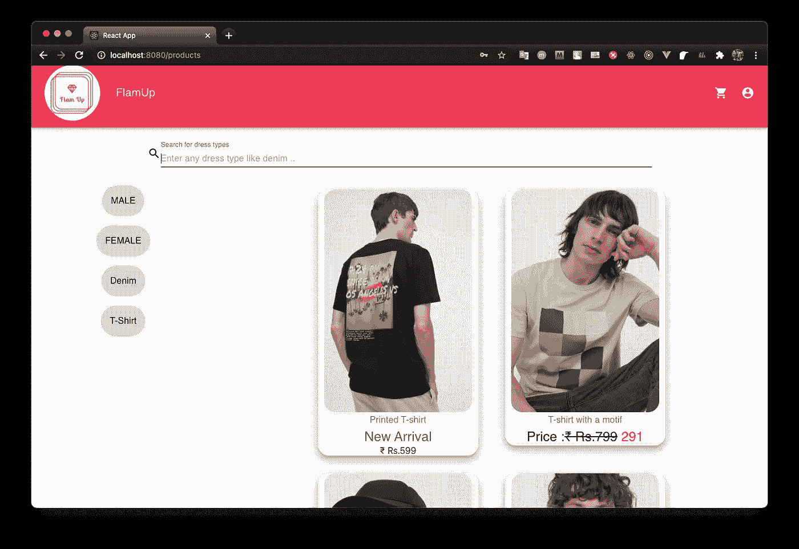

# 一个使用 Spring Boot 和 Docker 容器的全栈电子商务应用程序。

> 原文：<https://medium.com/geekculture/a-full-stack-e-commerce-application-using-spring-boot-and-making-a-docker-container-eff46f6f4e14?source=collection_archive---------3----------------------->


Photo by [Mink Mingle](https://unsplash.com/@minkmingle?utm_source=medium&utm_medium=referral) on [Unsplash](https://unsplash.com?utm_source=medium&utm_medium=referral)

啊，Spring Boot 这个名字会让你想起繁花似锦、气候宜人的春天。然而，如果没有一个合适的指导，使用弹簧靴工作可能不会那么愉快。本文旨在提供一个 Spring Boot 应用程序的演练。

# 什么是 Spring Boot？

从官方文件来看，

> Spring Boot 使得创建独立的、生产级的基于 Spring 的应用程序变得容易，你可以“直接运行”。
> 
> 我们对 Spring 平台和第三方库有自己的看法，所以你可以毫不费力地开始。大多数 Spring Boot 应用需要最小的弹簧配置。

如果您来自 servlet 背景，那么您应该熟悉设置 Tomcat 服务器来服务 web 文件以及手动设置端点和过滤器来处理 web 应用程序所需的基本内容的痛苦。Spring boot along 向前迈出了一步，并以最简单的方式完成了这些任务。有些是-

*   创建独立的 Spring 应用程序
*   直接嵌入 Tomcat、Jetty 或 Undertow(无需部署 WAR 文件)
*   提供自以为是的“初学者”依赖项，以简化您的构建配置

最重要的特性是依赖注入的特性。依赖注入是一种对象接收它所依赖的其他对象的技术。它允许组件的松散耦合。

让我们直接进入代码。对于这个例子，我们将为一家服装店构建一个 **API** ，它包括用户注册和登录，并在应用程序的整个生命周期中维护用户会话。产品项目将被存储在数据库中。Spring boot 提供了与 MySQL、Postgresql、Cassandra 等流行数据库的 **JDBC 连接**。对于这个例子，我们将使用 **postgresql** 来存储和查询产品项目。页面上显示的项目类型取决于当前用户会话以及用户与产品项目的**交互。来自服务器的项目被分页。Spring Boot 大力支持分页。**

这将是项目的最终设置。

```
.
├── main
│   ├── java
│   │   └── com
│   │       └── flamup
│   │           └── spring
│   │               ├── Application.java
│   │               ├── Controllers
│   │               │   ├── AuthController.java
│   │               │   ├── CartServiceController.java
│   │               │   ├── ProductController.java
│   │               │   ├── RegistrationController.java
│   │               │   ├── SessionController.java
│   │               │   └── TestGetController.java
│   │               ├── DTO
│   │               │   ├── OrderDTO.java
│   │               │   └── UpdateOrderDTO.java
│   │               ├── Models
│   │               │   ├── AppUserRole.java
│   │               │   ├── ApplicationUser.java
│   │               │   ├── OrderItem.java
│   │               │   ├── Product.java
│   │               │   ├── RegistrationRequest.java
│   │               │   └── ShoppingCart.java
│   │               ├── Repositories
│   │               │   ├── ApplicationUserRepository.java
│   │               │   ├── CartRepository.java
│   │               │   ├── OrderRepository.java
│   │               │   └── ProductRepository.java
│   │               ├── Services
│   │               │   ├── CartService.java
│   │               │   ├── CustomLogoutHandler.java
│   │               │   ├── ProductService.java
│   │               │   └── RegistrationService.java
│   │               ├── auth
│   │               │   └── AppUserService.java
│   │               └── security
│   │                   ├── PasswordEncoder.java
│   │                   ├── RestAuthEntryPoint.java
│   │                   ├── SwaggerConfig.java
│   │                   └── WebSecurityConfig.java
│   └── resources
│       ├── application.properties
│       ├── application.yml
│       ├── data-postgres.sql
│       └── static
└── test
    └── java
        └── com
            └── flamup
                └── spring
                    └── ApplicationTests.java
```

没有必要被吓倒，我们会详细介绍每一个方面。

我们将使用 maven 作为该项目的构建工具。你可以自由使用 gradle。

让我们检查一下我们同样需要的依赖项。

```
<dependencies>
    <dependency>
        <groupId>org.springframework.boot</groupId>
        <artifactId>spring-boot-starter-data-jdbc</artifactId>
    </dependency>
    <dependency>
        <groupId>org.springframework.boot</groupId>
        <artifactId>spring-boot-starter-data-jpa</artifactId>
    </dependency>
    <dependency>
        <groupId>org.springframework.boot</groupId>
        <artifactId>spring-boot-starter-security</artifactId>
    </dependency>
    <dependency>
        <groupId>org.springframework.boot</groupId>
        <artifactId>spring-boot-starter-web</artifactId>
    </dependency>
    <dependency>
        <groupId>org.springframework.session</groupId>
        <artifactId>spring-session-core</artifactId>
    </dependency>
    <dependency>
        <groupId>org.springframework.session</groupId>
        <artifactId>spring-session-jdbc</artifactId>
    </dependency>

    <dependency>
        <groupId>io.springfox</groupId>
        <artifactId>springfox-boot-starter</artifactId>
        <version>3.0.0</version>
    </dependency>

    <dependency>
        <groupId>org.postgresql</groupId>
        <artifactId>postgresql</artifactId>
        <scope>runtime</scope>
    </dependency>
    <dependency>
        <groupId>org.projectlombok</groupId>
        <artifactId>lombok</artifactId>
        <optional>true</optional>
    </dependency>
    <dependency>
        <groupId>org.springframework.boot</groupId>
        <artifactId>spring-boot-starter-test</artifactId>
        <scope>test</scope>
    </dependency>
    <dependency>
        <groupId>org.springframework.security</groupId>
        <artifactId>spring-security-test</artifactId>
        <scope>test</scope>
    </dependency>
</dependencies>
```

spring-boot-data-jpa 允许我们通过 JDBC 连接到数据库，并为我们提供查询数据和添加数据的界面。基本上，它为 API 的所有 CRUD 操作提供了接口。

项目的结构通常如下:

```
 - Models
 - Controllers
 - Repositories
 - Services
```

**车型。**它包含实体 POJO(Plain Old Java Object ),表示关系数据库中的一个表，在我们的例子中是 postgres。javax.persistence 包中有许多注释，适合让 spring boot 理解 POJO 的细节，并将它们转换成关系数据库的表。

**控制者。**这为 API 与外界的通信提供了配置。所有类型的请求映射，如 GET、PUT、POST、DELETE，都可以在控制器中配置，并用于为外部世界创建 api 端点。

**知识库。**这通常是扩展其他类的接口，提供一些基本方法来处理 CRUD 操作和其他复杂任务。



Source : [https://www.netsurfingzone.com/jpa/spring-data-jpa-interview-questions-and-answers/](https://www.netsurfingzone.com/jpa/spring-data-jpa-interview-questions-and-answers/)

作为层次结构，CrudRepository 位于顶部，分页和排序存储库具有 CrudRepository 的方法，并支持对结果进行分页和排序。JPA 存储库位于最高级别，支持 CrudRepository 和分页存储库提供的各种功能。

**服务。**这些是控制器调用的实际类，它们依次调用存储库的功能与数据库交互。因此，服务充当了数据库或存储库与控制器或 API 外部世界之间的桥梁。

让我们动手看看模型的 UML 设计。



Source : [https://www.jhipster.tech/jdl-studio/](https://www.jhipster.tech/jdl-studio/)

上面的 UML 图是用 JHipster JDL 工作室制作的，下面是相同的代码。

```
entity ApplicationUser{
 id Long required,
    firstName String required,
    lastName String required,
    userName String required,
    password String required,
    gender Gender required,
    role AppUserRole required
}enum AppUserRole{
 ADMIN,
    USER
}
enum Gender{
 MALE,
    FEMALE
}entity Product{
 id Long required,
    sex Sex required,
    dresstype String required,
    // image uri
    image String required,
    // price as Rs.2,299
    price String required,
    // arrival as "new" or "old"
    arrival String required, 
    // discounted price
    discount String required,

}enum Sex{
 MALE,
    FEMALE
}entity ShoppingCart{
 id Long required,
    userId String required,
}entity OrderItem{
 id Long required,
    product Product required,
    quantity Int required,
    cart ShoppingCart required
}relationship OneToOne{
 OrderItem{product} to Product
}relationship ManyToOne{
 OrderItem to ShoppingCart
}
```

一旦我们有了 UML 设计的想法，让我们开始设计实际的模型或实体类。

首先，我们有应用程序用户类，它实现了 spring 安全的 userDetails。这样做是为了通过 spring security 执行身份验证。

```
*import* lombok.*;
*import* org.springframework.security.core.GrantedAuthority;
*import* org.springframework.security.core.authority.SimpleGrantedAuthority;
*import* org.springframework.security.core.userdetails.UserDetails;
*import* javax.persistence.*;
*import* java.util.Collection;
*import* java.util.Collections;

*@Entity
@NoArgsConstructor
@Data
public class* ApplicationUser *implements* UserDetails {

    *public enum* Gender{
        MALE,
        FEMALE
    }

    *@SequenceGenerator*(
            name = "student_sequence",
            sequenceName = "student_sequence",
            allocationSize = 1
    )

    *@Id
    @GeneratedValue*(
            strategy = GenerationType.SEQUENCE,
            generator = "student_sequence"
    )
    *private* Long id;
    *private* String firstName;
    *private* String lastName;
    *private* String username;

    *private* String password;
    *private* String email;
    *@Enumerated*(EnumType.STRING) *private* AppUserRole appUserRole;
    *@Enumerated*(EnumType.STRING)
    *private* Gender gender;

    *public* ApplicationUser(String firstName,
                           String lastName,
                           String username,
                           String password,
                           String email,
                           AppUserRole appUserRole,
                           Gender gender) {
        *this*.firstName = firstName;
        *this*.lastName = lastName;
        *this*.username = username;
        *this*.password = password;
        *this*.email = email;
        *this*.appUserRole = appUserRole;
        *this*.gender = gender;
    }

    *public* Long getId(){
        *return* id;
    }
    *public* String getFirstName() {
        *return* firstName;
    }

    *public void* setFirstName(String firstName) {
        *this*.firstName = firstName;
    }

    *public* String getLastName() {
        *return* lastName;
    }

    *public void* setLastName(String lastName) {
        *this*.lastName = lastName;
    }

    *public* String getEmail() { *return* username; }

    *public void* setEmail(String email) { *this*.email = email; }

    *@Override
    public* Collection<? *extends* GrantedAuthority> getAuthorities() {
        SimpleGrantedAuthority authority =
                *new* SimpleGrantedAuthority(appUserRole.name());
        *return* Collections.singletonList(authority);
    }

    *@Override
    public* String getPassword() {
        *return* password;
    }

    *@Override
    public* String getUsername() {
        *return* email;
    }

    *@Override
    public boolean* isAccountNonExpired() {
        *return true*;
    }

    *@Override
    public boolean* isAccountNonLocked() {
        *return true*;
    }

    *@Override
    public boolean* isCredentialsNonExpired() {
        *return true*;
    }

    *@Override
    public boolean* isEnabled() {
        *return true*;
    }

    *public void* setPassword( String password){
        *this*.password = password;
    }

    *public void* setUsername( String username ){
        *this*.username = username;
    }

}
```

然而，正如我们所看到的，有许多重复的 Getter 和 Setter，可以通过 **Lombok** 注释、@Getter 和@Setter 来避免。

这是产品项目的模型类。

```
*import* lombok.*;

*import* javax.persistence.*;

*@Entity
@Table*(name = "clothes")
*@Getter
@Setter
@NoArgsConstructor
@AllArgsConstructor
@ToString
public class* Product {

    *public enum* sex{
        MALE,
        FEMALE
    }

    *@Id* Long id;
    *@Enumerated*(EnumType.STRING)

    *@Column*(name = "sex")
    sex a_sex;
    *@Column*(name = "dresstype")
    String b_dresstype;
    *@Column*(name = "image")
    String c_image;
    *@Column*(name = "price")
    String d_price;
    *@Column*(name = "arrival")
    String e_arrival;
    *@Column*(name = "discount")
    *int* f_discount;

}
```

注意“a_”和“b_”这样的语法。这样做是为了让它们按照预定的顺序存储在数据库中，因为 Spring JPA 按照字母顺序将属性存储为表中的列。

下面是购物车中每个订单项目的模型，它特定于单个用户(由他/她的电子邮件定义)。ManyToOne 注释服务于这个目的。

```
*import* com.fasterxml.jackson.annotation.*JsonIgnore*;
*import* com.flamup.spring.DTO.OrderDTO;
*import* lombok.*AllArgsConstructor*;
*import* lombok.*Getter*;
*import* lombok.*NoArgsConstructor*;
*import* lombok.*Setter*;

*import* javax.persistence.*;
*import* java.util.UUID;

*@Entity
@Table*(name = "item")
*@Getter
@Setter
@NoArgsConstructor
@AllArgsConstructor
public class* OrderItem {

    *@Id
    private* String id;

    *@OneToOne
    private* Product product;

    *@ManyToOne*(fetch = FetchType.LAZY, optional = *false*)
    *@JoinColumn*(name ="cart_id" , nullable = *false*)
    *@JsonIgnore
    private* ShoppingCart cart;

    *private int* quantity;

    *public void* fromDto(Product p, ShoppingCart cart, *int* quantity ){
        id = UUID.randomUUID().toString().replace("-", "");
        product = p;
        *this*.cart = cart;
        *this*.quantity = quantity;

    }

}
```

这是购物车的模型类。

```
 *import* lombok.*;

*import* javax.persistence.*;
*import* java.time.LocalDateTime;
*import* java.util.HashSet;
*import* java.util.Set;

*@Entity
@Table*(name = "cart")
*@AllArgsConstructor
@NoArgsConstructor
@Getter
@Setter
@ToString
public class* ShoppingCart {

    *@Id
    @GeneratedValue*(strategy = GenerationType.IDENTITY)
    *private* Long id;
    *@Column*(name = "user_id")
    *private* String userId;

    *@OneToMany*( mappedBy = "cart", cascade = CascadeType.ALL, fetch = FetchType.LAZY )
    *private* Set<OrderItem> items = *new* HashSet<>();

}
```

唷！我们就快到了，现在让我们看看接受来自服务的调用并与模型一起工作的存储库。

让我们看看认证过程是如何工作的。

首先我们有注册控制器，它在获得对“/api/register”的 POST 请求时调用 registrationService 的 register 方法。

```
*@RestController
@RequestMapping*(path = "api/register")
*@AllArgsConstructor
public class* RegistrationController {

    *private* RegistrationService registrationService;

    *@PostMapping
    public* ResponseEntity<String> register(*@RequestBody* RegistrationRequest request ){
        *return  new* ResponseEntity<String>(registrationService.register(request),HttpStatus.OK);
    }

}
```

这项服务有一个功能，可以检查重复的电子邮件，从而用密码编码器对明文密码进行编码，然后将用户的详细信息保存到数据库中。在登录过程中，会检查这些详细信息是否存在于数据库中。

```
*public* String signupUser( ApplicationUser applicationUser){
    *boolean* userExists = applicationUserRepository
            .findApplicationUsersByEmail(applicationUser.getUsername())
            .isPresent();

    *if* ( userExists ){
        *throw  new* IllegalStateException("email already used, try logging in");
    }

    String encodedPassword = bCryptPasswordEncoder.encode(applicationUser.getPassword());
    applicationUser.setPassword(encodedPassword);

    System.out.println("IN appUserService" + applicationUser);
    applicationUserRepository.save(applicationUser);
    *return* "SUCCESS";
}
```

我们稍后将讨论登录部分，因为它将是 spring 安全配置的一部分。

让我们看看分页是如何为服务器的 GET 请求服务的。分页大大有助于减少服务器的负载。

我们有产品控制器作为

```
*import* javax.servlet.http.HttpServletRequest;
*import* java.util.ArrayList;
*import* java.util.HashMap;
*import* java.util.List;
*import* java.util.Map;
*import* java.util.stream.Collectors;

*@RestController
@RequestMapping*(path = "api/v1/")
*@AllArgsConstructor
public class* ProductController {

    *private final* ProductService productService;

    *@GetMapping*(path = "dresses")
    *public* HashMap<String, Object> getProductsByDressTypeOnSearch(*@RequestParam*(name = "dress") String dress){
        HashMap<String, Object> hs = *new* HashMap<>();
        List<Product> products = productService.getProductsByDressType(dress);
        hs.put("products", products);
        hs.put("length" , products.size());
        *return* hs;
    }

    *@GetMapping*( path = "clothes")
    *public* HashMap<String, Object> getProductsBySexAndSession(
            *@RequestParam*(name = "sex") String sex,
            *@RequestParam*(defaultValue = "10") Integer items,
            *@RequestParam*(defaultValue = "0") Integer page,
            HttpServletRequest request){

        List<String> messages = (List<String>) request.getSession().getAttribute("SESSION_STORE");

        *if* ( messages == *null*){
            messages = *new* ArrayList<>();
        }

        Map<Boolean, Long> countByType = messages.stream().collect(
                Collectors.partitioningBy(
                        (String msg) -> (msg.equals("O")), Collectors.counting() ));

        *return* productService.getProductsBySex(sex,  items, page, countByType);

    }

}
```

函数**getProductsBySexAndSession**接受两个可选参数，分别表示页面和当前页面中的项目数量。 **countByType** 统计新服装与旧服装的交互次数。这调用了 productionService 的一个函数。

```
*public* HashMap<String, Object> getProductsBySex(String sex, Integer pageSize, Integer page, Map<Boolean, Long> countBySex){

    Pageable paging = PageRequest.of(page , pageSize);
    Page<Product> prods = productRepository.findProductByA_sex(sex, paging);
    List<Product> newProds = productRepository.findProductsByE_arrivalAndA_sex("new" ,sex);
    Integer totalPages = prods.getTotalPages();
    List<Product> products = prods.getContent();
    products = rearrange(products, countBySex, newProds);
    Integer current = page;
    HashMap<String, Object> hs = *new* HashMap<>();
    hs.put("current" , current);
    hs.put("products" , products);
    hs.put("total" , totalPages);
    *return* hs;

}

*private* List<Product> rearrange( List<Product> products, Map<Boolean, Long> countBySex, List<Product> newProds){

    List<Product> ll = *new* ArrayList<>(products);
    Product ptemp = ll.get(0);
    ll.remove(ptemp);
    ll.add(0, newProds.get(0));

    *if* ( (*long*)( countBySex.get(*true*) + countBySex.get(*false*) ) == 0){
        *return* ll;
    }

    Integer toShift =
            (*int*)(*long*)( (*double*) countBySex.get(*false*)  / (countBySex.get(*true*) + countBySex.get(*false*)) * products.size()) ;

    System.out.println("toShift" + toShift);
    *int* pivot = Math.max( 0 , (*int*) (Math.random() * 50) - 5 );
    *for* ( *int* start =0; start < Math.min(Math.min(Math.min( products.size() , toShift), newProds.size() ), 7) ; start++){
        Product p = ll.get(start );
        ll.remove(p);
        ll.add(0, newProds.get(start + pivot ));
    }
    *return* ll;
}
```

以上是根据相关网站的每页商品数量及其交互返回商品的算法。下面是产品存储库的代码。

```
*@Repository
@Transactional
public interface* ProductRepository *extends* JpaRepository<Product, Long> {

    Optional<Product> findProductById( Long id);

    *@Query*("select p from Product p where LOWER(p.b_dresstype) LIKE LOWER(CONCAT('%', :type, '%'))")
    List<Product> findProductsByB_Dresstype(*@Param*("type") String type);

    *@Query*(value = "select p from Product p where LOWER(p.a_sex)=lower(:sex) order by p.e_arrival desc ")
    Page<Product> findProductByA_sex(*@Param*("sex") String sex, Pageable paging);

    *@Query*(value = "select p from Product p where LOWER(p.e_arrival)=LOWER(:arrival) and LOWER(p.a_sex)=LOWER(:sex)")
    List<Product> findProductsByE_arrivalAndA_sex(*@Param*("arrival") String arrival, *@Param*("sex") String sex);

}
```

在这里，查询注释用于为我们的目的编写定制查询。Spring boot 支持原生查询，即包含原始 SQL 语句，而不是 Hibernate 创建的 SQL 语句。

因此，我们只剩下购物车服务，它具有在购物车中添加商品、更新购物车中商品的数量以及从购物车中删除商品的功能。

这是用于定义后端将被调用的端点的控制器，

```
*@RestController
@RequestMapping*(path = "api/v1/")
*@AllArgsConstructor
public class* CartServiceController {

    *private final* CartService cartService;

    *@PostMapping*( path = "add")
    *public* ResponseEntity<String> addProduct(*@RequestBody* OrderDTO orderDTO ){
        *return new* ResponseEntity<String>(cartService.addToCart(orderDTO) , HttpStatus.CREATED);
    }

    *@GetMapping*( path = "orders")
    *public* ResponseEntity<HashMap<String , Object>> getOrders(){
        *return new* ResponseEntity<>(cartService.getProducts(), HttpStatus.OK);
    }

    *@PutMapping*(path = "order")
    *public* ResponseEntity<String> updateOrder(*@RequestBody* UpdateOrderDTO updateOrderDTO){
        *return new* ResponseEntity<>(cartService.updateOrder( updateOrderDTO ), HttpStatus.CREATED);
    }

    *@DeleteMapping*( path = "order/{id}")
    *public* ResponseEntity<String> deleteOrder(*@PathVariable* String id){
        *return new* ResponseEntity<>(cartService.deleteOrder(id), HttpStatus.OK);
    }

}
```

我们有两个数据传输对象(DTO)。DTO 用于在客户端和 API 的服务之间传输信息。

让我们来定义一下，

```
*@Getter
@Setter
@NoArgsConstructor
@AllArgsConstructor
public class* OrderDTO {

    *private* Long productId;
    *private int* quantity;

}*@Getter
@Setter
@NoArgsConstructor
@AllArgsConstructor
public class* UpdateOrderDTO {
    *private* String id;
    *private* Integer quantity;
}
```

现在让我们看看购物车服务，

如我们所见，它支持 POST、GET、PUT、DELETE，是一个完美的例子。

```
*@Service
public class* CartService {

    *private final* CartRepository cartRepository;
    *private final* ProductRepository productRepository;
    *private final* OrderRepository orderRepository;

    *@Autowired
    public* CartService(CartRepository cartRepository,
                       ProductRepository productRepository,
                       OrderRepository orderRepository
                       ) {
        *this*.cartRepository = cartRepository;
        *this*.productRepository = productRepository;
        *this*.orderRepository = orderRepository;
    }

    *public* String addToCart(OrderDTO order){
        Object principal = SecurityContextHolder.getContext().getAuthentication().getPrincipal();

        *if* ( principal *instanceof* UserDetails) {

            Optional<ShoppingCart> cartFromRepo = cartRepository.findByUserId(((UserDetails) principal).getUsername());
            ShoppingCart cart;
            *if* ( ! cartFromRepo.isPresent() ){
                cart = *new* ShoppingCart();
                cart.setUserId(((UserDetails) principal).getUsername());
                cartRepository.save(cart);
            }
            *else*{
                cart = cartFromRepo.get();
            }

            OrderItem item = *new* OrderItem();
            Product pt = productRepository.findProductById(order.getProductId())
                    .orElseThrow( () -> *new* IllegalStateException("product not found"));
            item.fromDto(pt, cart, order.getQuantity());

            orderRepository.save(item);
            *return* "SUCCESS";
        }
        *else*{
            *throw  new* IllegalStateException("user not authenticated");
        }
    }

    *private* Integer sanitizePrice( String price) {
        *// price with Rs.2,244 --> 2244* price  = price.substring(3).replace(",", "");
        *return* Integer.parseInt(price);
    }

    *public* HashMap<String, Object> getProducts(){
        Object principal = SecurityContextHolder.getContext().getAuthentication().getPrincipal();
        HashMap<String, Object> hs = *new* HashMap<>();
        hs.put("products" , *new* ArrayList<>());
        hs.put("total" , 0);
        *if* ( principal *instanceof* UserDetails) {
            Optional<ShoppingCart> cartFromRepo = cartRepository.findByUserId(((UserDetails) principal).getUsername());
            ShoppingCart cart;
            *if* ( ! cartFromRepo.isPresent() ){
                *return* hs;
            }
            cart = cartFromRepo.get();
            ArrayList<OrderItem> orders = *new* ArrayList<>(orderRepository.findByCart_Id(cart.getId()));
            hs.put("products" ,  orders);
            *int* price =0;
            *for* ( OrderItem order : orders ){
                *if* ( order.getProduct().getE_arrival().toLowerCase(Locale.ROOT).equals("old")){
                    price += order.getQuantity() * order.getProduct().getF_discount();
                }
                *else* {
                    price += order.getQuantity() * sanitizePrice(order.getProduct().getD_price());
                }
            }
            hs.put("total", price);
            *return* hs;
        }
        *else*{
            *throw  new* IllegalStateException("user not authenticated");
        }
    }

    *public* String updateOrder(UpdateOrderDTO updateOrderDTO){
        OrderItem item = orderRepository.findById(updateOrderDTO.getId())
                .orElseThrow(()->*new* IllegalStateException("order does not exist"));

        item.setQuantity(updateOrderDTO.getQuantity());
        orderRepository.save(item);
        *return* "SUCCESS";
    }

    *public* String deleteOrder( String id){
        OrderItem item = orderRepository.findById(id)
                .orElseThrow(()->*new* IllegalStateException("order does not exist"));
        orderRepository.delete(item);
        *return* "DELETED";
    }

}
```

现在，在介绍了服务之后，让我们定义 spring 安全配置，它将定义会话管理以及用户登录和注册到我们的 web 应用程序。现在，我们将通过 JDBC 身份验证来执行用户登录，还有许多其他身份验证方法，您可以在文档中查看。Spring security 是一个很大的话题，值得一学。

这是安全配置，

```
*@Configuration
@EnableWebSecurity
public class* WebSecurityConfig *extends* WebSecurityConfigurerAdapter {

    *private final* PasswordEncoder passwordEncoder;
    *private final* AppUserService appUserService;

    *@Autowired* RestAuthEntryPoint restAuthEntryPoint;

    *@Autowired
    private* CustomLogoutHandler logoutHandler;

    *@Autowired
    public* WebSecurityConfig(PasswordEncoder passwordEncoder, AppUserService appUserService) {
        *this*.passwordEncoder = passwordEncoder;
        *this*.appUserService = appUserService;
    }

    *@Override
    public void* configure(WebSecurity registry) *throws* Exception {
        registry.ignoring()
                .antMatchers("/docs/**")
                .antMatchers("/actuator/**")
                .antMatchers("/swagger-ui.html")
                .antMatchers("/webjars/**");
    }

    *@Override
    protected void* configure(AuthenticationManagerBuilder auth) *throws* Exception {
        auth.authenticationProvider(daoAuthenticationProvider());

    }

    *@Override
    protected void* configure(HttpSecurity http) *throws* Exception {
        http.
                csrf().disable()
                .authorizeRequests()
                .antMatchers("/","/static/**", "index*", "/css/*", "/js/*","/media/*","*.ico","*.png").permitAll()
                .antMatchers("/api/register").permitAll()
                .antMatchers("/api/auth").permitAll()
                .antMatchers("/api/persist/**").authenticated()

                .antMatchers("/api/v1/**").authenticated()
                .antMatchers("/admin/api/**").hasRole(ADMIN.name())
                .and()
                .exceptionHandling()
                .authenticationEntryPoint(restAuthEntryPoint)
                .and()
                .formLogin()
                    .loginProcessingUrl("/api/login")
                    .permitAll()
                .and()
                .logout()
                .logoutUrl("/api/logout")
                .invalidateHttpSession(*true*)
                .deleteCookies("JSESSIONID")
                .clearAuthentication(*true*)
                .addLogoutHandler(logoutHandler)
                .logoutSuccessHandler(*new* HttpStatusReturningLogoutSuccessHandler(HttpStatus.OK));

    }

    *@Bean
    public* DaoAuthenticationProvider daoAuthenticationProvider(){
        DaoAuthenticationProvider provider = *new* DaoAuthenticationProvider();
        provider.setPasswordEncoder(passwordEncoder);
        provider.setUserDetailsService(appUserService);
        *return* provider;
    }
}
```

antMathers 匹配任何带有提供给服务器的 url 的 regex，并被配置为 authenticated 或 permitAll()。我们同样使用 form-login，即它接受对配置中定义的端点“api/login”的**应用程序/x-www-form-urlencoded** post 请求。注销发生在 URL“API/logout ”,并清除所有 cookies 和验证。该配置用于基于 ReactJs 的前端，它是一个单页面 web 应用程序，或者从应用程序的静态内容或资源文件夹提供单个 index.html 页面。让我们看一下我们的 application.properties 文件。

```
server.error.include-message=always
server.error.include-binding-errors=always

spring.datasource.url=jdbc:postgresql://db:5432/flamup
spring.datasource.username=postgres
spring.datasource.password=postgres

spring.jpa.hibernate.ddl-auto=update
spring.jpa.properties.hibernate.dialect=org.hibernate.dialect.PostgreSQLDialect
spring.jpa.properties.hibernate.format-sql=true
spring.jpa.show-sql=*true* spring.session.jdbc.initialize-schema=always
spring.session.jdbc.table-name=SPRING_SESSION
spring.session.store-type=jdbc
```

数据源 url 中的 db 是在 docker 配置中定义的，它的 uri 在运行时存在。

随着万物被春天覆盖，让我们看看我们如何能把它整理好。

**码头工人简介**


Photo by [Dominik Lückmann](https://unsplash.com/@exdigy?utm_source=medium&utm_medium=referral) on [Unsplash](https://unsplash.com?utm_source=medium&utm_medium=referral)

> Docker 是一组平台即服务产品，使用操作系统级虚拟化来交付称为容器的软件包中的软件。容器是相互隔离的，捆绑了它们自己的软件、库和配置文件；他们可以通过明确定义的渠道相互交流。

最重要的是，docker 帮助我们将应用程序容器化，并为不同的应用程序相互通信提供一个公共的网桥。

为了形成一个容器，我们需要在项目的根目录中定义一个 DockerFile。

```
FROM maven:3.6.1-jdk-8-slim AS build
RUN mkdir -p workspace
WORKDIR workspace
COPY pom.xml /workspace
COPY src /workspace/src
COPY frontend /workspace/frontend
COPY data2.csv /workspace
RUN mvn -f pom.xml clean install -DskipTests=trueFROM openjdk:8-alpine
COPY --from=build /workspace/target/*.jar app.jarEXPOSE 8080
ENTRYPOINT ["java","-jar","app.jar"]
```

因此，我们获取一个 maven 映像，首先通过将所有必需的文件复制到容器中来构建 jar 文件。

jar 文件形成后，我们从 maven 容器中复制 jar 文件，并将其复制到 openjdk 容器中，最终运行编译器。然而除此之外，我们还需要一个 postgres 数据库来运行我们的容器。因此，我们需要一个 postgres 映像和我们应用程序的容器，postgres 容器应该通过一个**公共网络**连接起来，以便它们通过彼此通信。有两种方法可以实现这一点，第一种是

```
docker create network net1
docker run postgres --network net1 -e POSTGRES_USER=postgres ...
...
```

然而这需要写太多的配置参数不是很合适。Docker-Compose 是另一种拯救方法，它将不同的服务结合起来，并通过所需的网络将它们结合起来，以便它们可以通过彼此通信。

```
version: '3'

services:

  db:
    image: "postgres:9.6-alpine"
    container_name: db
    restart: always

    ports:
      - 5432:5432

 *volumes:
      - postgres_data:/var/lib/postgresql/data* environment:
      - POSTGRES_DB=flamup
      - POSTGRES_USER=postgres
      - POSTGRES_PASSWORD=postgres
      - PGDATA=/var/lib/postgresql/data/pgdata

  flamup:
    build: ./
    container_name: flamup
    environment:
      - DB_SERVER:db
      - POSTGRES_DB=flamup
      - POSTGRES_USER=postgres
      - POSTGRES_PASSWORD=postgres
    ports:
      - 8080:8080 *# Forward the exposed port 8080 on the container to port 8080 on the host machine* depends_on:
      - db

volumes:
  postgres_data:
```

因此，默认情况下，docker-compose 会根据 flamup 服务中的依赖参数创建一个默认网络。db 服务将容器端口 5432 映射到主机端口 5432，而 flamup 或 web-app 服务将容器端口 5432 映射到主机端口 5432。我们还可以定义容器所需的环境变量。

运行这个非常简单，只要在系统上安装了 docker 和 docker，只需一行代码就可以完成。

```
docker-compose up --build
```


Running of docker-compose up

一旦构建了容器，就可以在下一次运行。

```
docker-compose up
```

因此，应用程序已经启动并运行，可以通过 [http://localhost:8080 进行访问。](http://localhost:8080.)



A register post request



A login post request

所以本文到此结束。我将在基于 ReactJS 和 material-UI 库的前端基础上写两篇文章。这里是前端的一瞥。



在讨论了前端之后，我还会写一篇文章来讨论 AWS 上这个应用程序的托管以及未来的展望。所以一定要保持关注，一定要关注我。

[Twitter](https://twitter.com/TheSYNcoder)[LinkedIn](https://www.linkedin.com/in/shuvayan-ghosh-dastidar-3b5383166/)

因此，我们将在另一篇文章中再见。

再见。

## 参考

[1]春安安全登出—[https://www.baeldung.com/spring-security-logout](https://www.baeldung.com/spring-security-logout)

[2] JPA 查询注释—[https://www . petrikainulainen . net/programming/spring-framework/spring-data-JPA-tutorial-creating-database-queries-with-the-Query-annotation/](https://www.petrikainulainen.net/programming/spring-framework/spring-data-jpa-tutorial-creating-database-queries-with-the-query-annotation/)

[3] JPA 一对多映射—[https://grokonez . com/spring-framework/spring-boot/spring-JPA-hibernate-一对多关联-PostgreSQL-spring boot-crud-restapis-post-get-put-delete-example](https://grokonez.com/spring-framework/spring-boot/spring-jpa-hibernate-one-to-many-association-postgresql-springboot-crud-restapis-post-get-put-delete-example)

[4]Spring Boot 应用程序 Docker Compose—[https://dev . to/tech tter/Docker-Compose-demo-example-with-angular-spring-boot-PostgreSQL-3d o8](https://dev.to/techtter/docker-compose-demo-example-with-angular-spring-boot-postgresql-3do8)