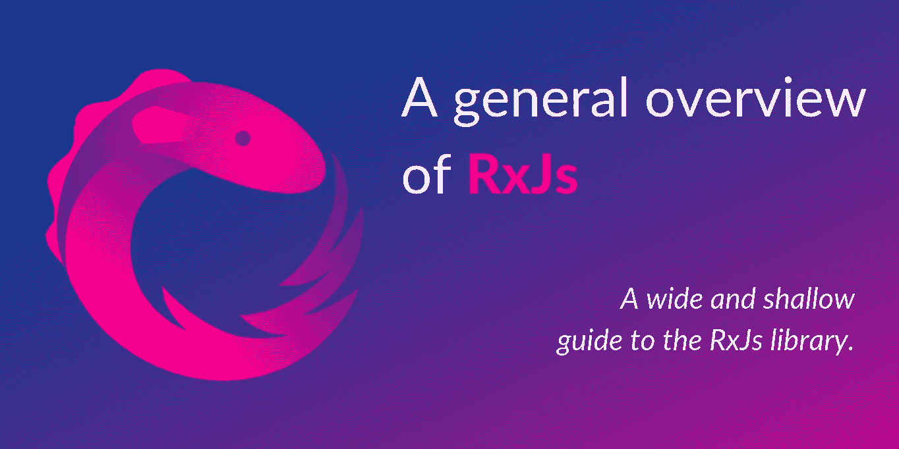
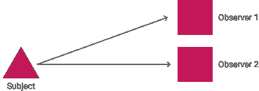
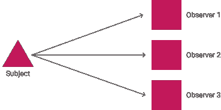

# RxJs 概述

> 原文：<https://medium.com/geekculture/a-general-overview-of-rxjs-ddfb94241c97?source=collection_archive---------23----------------------->

## RxJs 库的浅显指南。



RxJs(Reactive Extensions Library for JavaScript)顾名思义，是一个让我们在使用 JavaScript 时能够编写更多[反应性和功能性](https://en.wikipedia.org/wiki/Functional_reactive_programming)代码的库。这使得我们更容易处理异步调用/事件/数据或大量事件驱动的用例。

在本文中，我将描述 RxJs 的基本构建块(类),试图帮助您开始使用这个库。本文决不是库的[文档](https://rxjs.dev/guide/overview)(顺便说一句，这很棒)的替代品，但是它的目的是通过给你一个简单易懂的库的主要类的视图来帮助你在进入文档时做更充分的准备。对 RxJs 库的概述旨在提供一个库的整体视图，内容广泛(涵盖大量概念)，但不太深入(避免许多细节)。

# 一般

在我们开始之前，让我们快速地看一下 Observer 模式是如何工作的，因为它被图书馆大量使用。根据[维基百科](https://en.wikipedia.org/wiki/Observer_pattern):

> **观察者模式**是一种软件设计模式，其中一个名为**主题**的对象维护一个名为**观察者**的依赖者列表，并自动通知它们任何状态变化，通常是通过调用它们的方法之一。

例如，在下图中，每当[状态](http://softwareengineering.stackexchange.com/questions/150120/ddg#150123)发生变化时(例如当事件发生时)，`Subject`就会通知`Observer 1`和`Observer 2`。想象一下，`Subject`可以是一个按钮，每当它被点击时都会通知`Observers`。



A Subject with 2 `Observers`.

此外，由于`Subject`维护了一个`Observers`列表，以后可以添加更多的`Observers`。新的`Observers`将从事件被添加的那一刻开始接收事件(除非用户选择也向它们发送过去的事件)。这是一个可能的下一个状态:



A Subject with 3 `Observers`.

现在在按钮示例`Observer 1`，`Observer 2`和`Observer 3`将监听事件。

# 可观察量

可观测量是 RxJs 最重要的部分之一。同样，它们也没有在上面的模式中描述。这是因为他们做一些相似的事情，但也有不同的事情。

**可观察对象**是相似的主题，在某种意义上，观察者可以听到它们，但它们也有点像可以返回多个值的*函数*(通常是异步的)。可观察对象和主体之间的主要区别在于，可观察对象不维护其观察者的列表。下面我将定义一个可观察对象，并使用这个定义来进一步解释它(顺便说一下，所有代码片段都在 TypeScript 中)。

```
const observable = new Observable(subscriber => {
    subscriber.next('Hello World');
});// this will print *Hello World*
observable.subscribe(x => console.log(x));
```

让我们来看看上面超级简单的代码。如你所见，我们正在使用类的构造函数创建一个可观察对象(名为`observable`)。构造函数接受一个函数参数(这里是 lambda)。还记得我们说过，一个可观察值有点像函数，这个λ有点像函数的主体。每次你“调用”可观察对象，lambda 就会被执行。lambda 中对`.next()`函数的每一次调用都**类似于函数的`return`语句。**

在上一段中，关键是要注意短语“种类”；可观察值不是函数，它们有一些核心区别，主要是:

*   我们不“调用”可观察对象，我们订阅它(注意`observable.subscribe`调用),通过订阅它，我们**调用**可观察对象。
*   与函数的`return`语句相比，`.next()`函数不会停止可观察对象的执行。实际上，我们可以在一个可观察对象中有多个`.next()`调用，这样我们就可以**从中推出多个值。**

然而，我之所以如此频繁地提到函数，是因为可观察量和函数有着非常重要的相似性。他们被称呼的方式。就像当我们在代码中定义一个函数时，我们不能再修改它(当然，除非我们重写那部分代码)，我们不能在定义后改变一个可观察对象的“体”(我们在构造函数中传递的函数)。比方说，不可能在初始回调之外调用可观察对象的`.next()`方法。除此之外，每次我们称之为`observable.subscribe`的时候，一个全新的、独立的对可观察的“身体”的“召唤”正在发生。下面是一个代码示例:

```
const observable = new Observable(subscriber => {
    let i = 0;
    subscriber.next(i); 
    i++;
    subscriber.next(i);  // notice how we can call .next() twice
});// this will print *0* and then *1*
observable.subscribe(x => console.log(x));// this will **also** print *0* and then *1*
observable.subscribe(x => console.log(x));
```

因此，在上面的例子中，你可以看到这个可观察对象无论被调用多少次，都会推动值`0`和`1`；每个调用都独立于之前的调用。同样，无论我们做什么，我们都无法让可观察到的东西推动更多的价值(比如说`2`)。我们可以对推送的值做不同的事情(例如`console.log(x+1)`)或者使用[操作符](https://rxjs.dev/guide/operators)转换它们，但是我们不能推送新的值。

关于可观测量，我们可以说的还有很多，但由于本指南的目的是给你一个 RxJs 不同类别的简要介绍，我就不再赘述了(请记住，我忽略了一些基本和重要的东西)。然而，现在重要的是要知道:

*   可观测量和函数的异同。
*   可观察对象和观察者模式主体之间的差异和相似之处(稍后将详细介绍)。

# 观察者

**观察者**，你可能从名字(以及上面观察者模式的描述)就能理解，是价值观的“消费者”。他们倾听观察对象(或主体)推动的价值观。它们非常简单，所以我们将直接看一个例子:

```
const observable = new Observable(subscriber => {
    subscriber.next(0);
});const observer = {
    next: x => console.log(x)
};// This will print *0* in the console
observable.subscribe(observer);
```

如你所见，观察者是一个 JSON(就像 JavaScript 中的大多数东西一样)。如果您在 TypeScript 上编写，它将是 Observer 类的一个实例。你可以看到它有一个键(`next`)和一个 lambda 值(函数)。在我们创建了观察者之后，我们将它作为一个参数传递给 Observable 的 subscribe 方法。该方法将调用`observable`，并且每次它用`.next()`函数推送一个值时，将调用与键`next`相关联的`observer`函数。`x`的值是`.next()`函数的自变量(这里是值`0`)。

如果你还记得在 Observable 部分的例子，我们在 subscribe 方法中传递了一个 lambda 作为参数，这是一个创建观察者的更快的方法。正如你已经知道的，我们可以创建多个观察者来监听同一个可观察对象，每个可观察对象的调用都是独立的。

最后，值得一提的是，观察者还有 2 个键，叫做`error`和`complete`，它们监听来自被观察者的类似功能。但是我不打算在这里详细讨论这个问题。

# 科目

而现在该说说观察者模式的**主语**(在 RxJs 中也叫主语)。您可以将主题视为一个可观察对象，它可以在每次创建后推送值(它不像可观察对象那样绑定到其构造函数中传递的函数)。当然这个定义不是 100%准确，但是它会帮助你理解主题是什么。

让我们快速看一个例子:

```
// notice that we don't pass a function/lambda
const subject = new Subject<string>();subject.subscribe(x => console.log(x));// This will print *Hello*
subject.next('Hello');subject.subscribe(x => console.log(x));// This will print *World* **twice**, once for each observer
subject.next('World');
```

好了，这里发生了很多事情，让我们看看最重要的:

1.  我们没有在主体的构造函数中传递任何函数/lambda。
2.  我们创建一个观察者(通过调用`subscribe`)而之前没有任何`.next()`调用。
3.  我们称之为`.next()`主体之外的创造。
4.  (2)中提到的观察者监听`.subscribe()`后的`.next()`。
5.  另一个观察者被创建并与主题相关联。
6.  另一个`.next()`被调用，现在两个观察者都在听主体推送的数据。

所以，几乎所有的科目都很棒。你可以创建它们，给它们分配多个观察者，一旦有事情发生就调用它们的`.next()`方法。然后所有的观察者将会听到这个变化并采取你指定的任何行动。因为主体也是可观察的，所以你可以对它们做任何你可以对可观察物做的事情(顺便说一句，主体也是观察者)。

随着你对 RxJs 的深入研究，你会发现你可以用这些主题做很多很酷的事情，但是现在我认为这个概述已经足够了。

# 关闭

这篇文章包含了很多关于 RxJs 的信息，所以如果你坚持到了最后，那么恭喜你。另一方面，这仅仅是对 RxJs 是什么以及它能做什么的皮毛。关于这里提到的类，我们可以说的远不止这些，还有一些我们根本没有提到的东西(比如操作符或订阅)。然而，我相信在读完这篇文章之后，你已经对 RxJs 是什么以及它的主要类是做什么的有了一个基本的了解。

# 从这里去哪里

读完这篇文章后，我强烈推荐阅读 RxJs 的[文档。它非常清楚，很好地解释了你需要知道的东西。我也相信，由于这篇文章，你会更容易浏览它。](https://rxjs.dev/guide/overview)

在那之后，看看其他可能更深入 RxJs 概念的文章是一个好主意，这些文章可以教你如何在你的代码中利用这个库(顺便说一句，我建议[这篇](https://betterprogramming.pub/rxjs-best-practices-7f559d811514?source=user_profile---------6----------------------------&gi=baac74153fff))。如果您正在使用一些特定的 JavaScript 框架，如 Angular 或 React，我相信您也可以找到许多与它相关的 RxJs 文章。

最后，如果你觉得这篇文章有用，请鼓掌并与你的朋友分享。当然，如果你对你读到的内容有任何问题或观点，请随时发表评论。