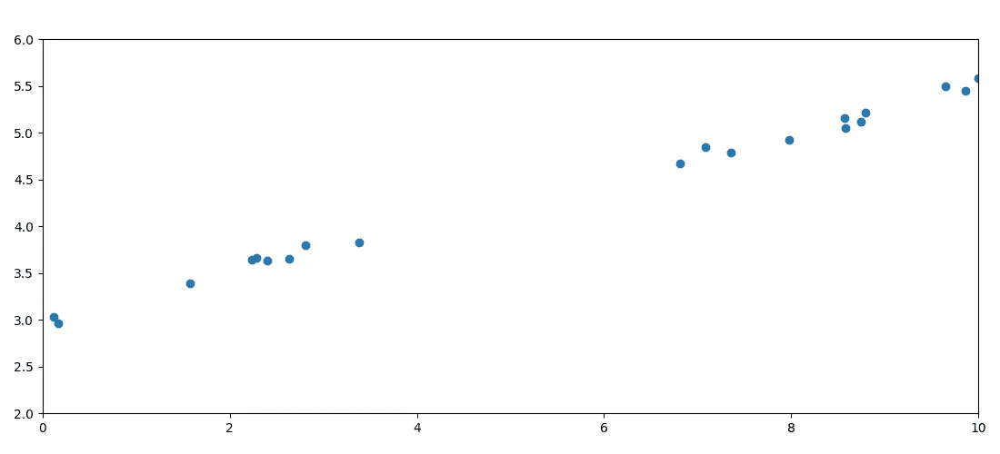
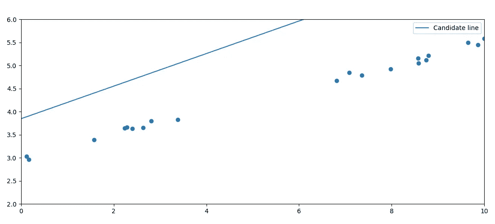

# 遗传算法简介

> 原文：<https://medium.com/geekculture/a-genetic-algorithm-for-line-fitting-f20862853734?source=collection_archive---------24----------------------->

## 直线拟合的遗传算法

# 介绍

在这篇文章中，我们将解决一个简单的问题，作为说明遗传算法的主要特点。

我们要解决的问题是一组数据的直线拟合。这个问题可以用更简单的方法来解决——你甚至可能知道其中的一些——但是通过保持简单，我们可以确保我们的注意力集中在遗传算法上，而不是所选问题的复杂性上，后者总是会变化的。

我将使用 Python，因为它快速、简单、易读，即使你不懂这种语言。但是这里没有一个概念是 Python 特有的；如果你想跟上，任何语言都可以。

## 是什么让算法具有遗传性？

遗传算法的构成有正式的数学定义。我将大致遵守这个定义，但我的目标是给你一个直观的理解，所以我不会被它所束缚。在我的解释中，遗传算法由以下特征定义:

*   随机生成的初始人群。
*   从每一代中挑选最佳候选人。
*   基于上一代中的最佳群体创建新的候选群体。

## 获取一些数据

你首先需要的是一些近似直线的数据。直线完全由其梯度和*y*-截距定义，通常标记为 *m* 和 *c* 。一条线是所有对【T6(x，y)】使得 *y = mx + c* 。这是平面中一条线仅有的自由度，所以这是一个相当简单的问题。

我用 Python 的 random 模块生成了一些随机数据。：

```
import randomm = 0.25
c = 3X = [random.random() * 10 for _ in range(20)]
Y = [m * x + c + (random.random()-0.5)*0.2 for x in X]
```

这将在范围(0，10)内生成 20 个随机的 *x* 值。然后，我们使用这些 *x* 值来生成 *y* 值，并在 *y* 值上添加一点随机噪声，这样数据就不会完全符合一条直线。真实数据总是如此。

我们手动选择我们的 *m* 和 *c* 值。当然这意味着我们提前知道了答案，但这在这里很好。我们需要知道我们的遗传算法能在多大程度上发现这个解，才能知道我们写了一个好的算法。把这个当做我们的测试数据。以后我们可以把这个算法的用途扩展到解决不知道 *m* 和 *c* 的问题。

我们现在可以用 matplotlib 绘制我们的数据点。

```
import matplotlib.pyplot as pltplt.scatter(X, Y)
plt.show()
```

这产生了一个类似如下的图:



我们看到了我们所期待的； *x* 在 0 到 10 之间随机分布， *y* 缓慢增加，在 *x = 0* 处约为 *y = 3* 的值。

所以我们有一些数据可以利用。让我们开始寻找解决方案。

## 生成初始群体

当使用遗传算法解决一个问题时，第一步总是生成一个初始种群。在这种情况下，“群体”意味着一组候选解决方案，通常是随机生成的。我们问题的一个解决方案就是一对 *(m，c)* ，所以我们的初始种群是一组随机生成的数字对。

如果你对这个解可能接近什么有一些先验的想法，你可以用它来生成你的初始解。然而，我将完全随机地开始，假装我不知道解决方案会是什么。我要假设的是数据大致在一条直线上。

*m* 和 *c* 可以被称为基因，因为它们在几代人之间会发生变化。产生好的解决方案的基因将被保留并进化到后代，而产生坏的解决方案的基因将被允许消亡。

你也可以把对 *(m，c)* 看作一个单一的基因，它作为一个单一的单元进化。我认为它们是独立的基因，因为当我们到达那里时，遗传模式不会鼓励 m 和 c 的混合。它们在某种程度上是独立发展的，尽管它们自然会相互影响，因为是 *m* 和 *c* 的特定组合提供了最佳解决方案。

所以我们来生成一些初始值。我将随机生成 100 个可能的解决方案，其中 *m* 和 *c* 都位于范围(-10，10)内。

```
candidates = [{
    "m": (random.random() - 0.5) * 10,
    "c": (random.random() - 0.5) * 10
} for _ in range(100)]
```

我将候选项存储在一个字典中，因为我们很快就要向候选项添加另一个属性。如果愿意，您可以定义一个候选类。

现在我们有了解决方案，是时候对它们进行排序了。我们如何做到这一点？

## 定义误差度量

为了给我们的候选人排名，我们需要一些方法来衡量他们有多好。实际上，在实践中，我们通常定义一种方法来衡量他们有多好*或*。这有各种各样的原因，但基本上是因为误差的测量在零处有一个自然的下限，但精度的测量，除非仔细定义和缩放，通常会有一个无限的最大值。如果精确度可以无限增长，就不可能有完美的精确度。

这个问题的经典误差度量是从我们的候选生成的线的点的平方距离的总和。我们将使用垂直平方距离，因为它更容易计算，并达到同样的效果。

```
def error(candidate):
    err = 0
    for x, y in zip(X, Y):
        y_ = candidate["m"] * x + candidate["c"]
        err = err + (y - y_)**2
    return err
```

这个函数接受我们的一个候选对象，并计算它与数据的拟合程度。我们对集合中的每个候选项执行此操作，并将错误信息添加到候选项字典中:

```
for candidate in candidates:
    candidate["error"] = error(candidate)
```

现在，我们有了一个衡量每种拟合有多差的标准。我们先把列表从最好到最差排序，然后把最好的那个打印出 *m* 和 *c* 。

```
candidates.sort(key=lambda x: x["error"])
print(
    "m:", candidates[0]["m"],
    "c:", candidates[0]["c"],
    "e:", candidates[0]["error"]
)
```

我得到的值是

```
m: 0.35    c: 3.85   error: 42.5
```

不完美，但大致在正确的范围内。我的数据产生了这样一个图:



现在我们尝试改进我们的解决方案。

## 选择最佳候选人

我们选择最佳候选的标准是我们刚刚计算的误差。误差最小的是最佳拟合。

我将保留 100 名候选人中最好的 25 名。

```
candidates = candidates[:25]
```

## 产生新的一代

利用我们保留的候选人，我们创造了我们的新一代。对于每一个幸存的候选人，我们给基因添加一点随机扰动，这个随机扰动的候选人就是后代。我们为每个候选人做三次，使我们的总数回到 100。请注意，我们保留了上一代的候选人，而不是丢弃他们。这是因为他们中的一些人实际上可能比他们的孩子更适合，我们希望保留那些强大的基因，而不是较弱的变异版本。你不必总是这样做。你可以利用上一代来建立一个全新的种群，然后扔掉原来的种群。

为随机扰动选择合适的大小在很大程度上取决于问题。在这种情况下，我们假设 *m* 在范围(-10，10)内，因此相对于此扰动应该很小。让我们从 1%开始，对于 *c* 也是如此。

```
for i in range(25):
    for _ in range(3):
        new_candidate = {
            "m": candidates[i]["m"] + (random.random()-0.5)*10/100,
            "c": candidates[i]["m"] + (random.random()-0.5)*10/100
        }
        candidates.append(new_candidate)
```

同样，我们评估候选人:

```
for candidate in candidates:
    candidate["error"] = error(candidate)
```

然后排序并打印最佳候选。

```
candidates.sort(key=lambda x: x["error"])
print(
    "m:", candidates[0]["m"],
    "c:", candidates[0]["c"],
    "e:", candidates[0]["error"]
)
```

我们希望新的最佳候选人比上一代的最佳候选人更好。在我的例子中，第二代的误差是 33.07，而第一代是 42.50。这是一个明显的进步。

## 迭代改进解决方案

现在，只需要一遍又一遍地重复最后几步:

1.  选择最佳候选人
2.  扰动那些候选以产生新的候选
3.  选择最佳候选人
4.  重复…

并不总是清楚应该如何最好地选择迭代次数。有时你可能会让它永远消失，直到你看到错误停止下降。有时，您可能会提前决定什么样的误差水平是可接受的，并重复该过程，直到误差低于该容差。我运行了十代程序，得到了以下结果:

```
m: 0.35   c: 3.85   error: 42.5
m: 0.32   c: 3.89   error: 33.07
m: 0.3    c: 3.86   error: 26.57
m: 0.26   c: 3.86   error: 17.11
m: 0.23   c: 3.82   error: 10.6
m: 0.19   c: 3.9    error: 7.53
m: 0.17   c: 3.81   error: 4.3
m: 0.14   c: 3.77   error: 3.26
m: 0.16   c: 3.72   error: 2.89
m: 0.16   c: 3.69   error: 2.55
```

它仍然不完美，但你可以看到明确的改进。更重要的是，你可以看到误差开始时迅速缩小，然后缩小得越来越慢。但是很明显我的还没有进化完，需要更多的迭代才能达到最优解。我跑了 50 代，得到如下结果:

```
m: 0.25   c: 3.01   e: 0.08
```

还不错！回想一下，我们基因的“真实”值是 *m = 0.25* 和 *c= 3* 。由于数据的噪声性质，解决方案永远不会是精确的，但这绝对是正确的答案，误差非常小。

这是一个算法聚焦于一个越来越好的拟合的动画。这非常清楚地表明，我们已经找到了正确的解决办法。


# 结论

我希望这篇文章能让你对遗传算法的关键方面有所了解。我们解决了一个简单的问题，这个问题通常需要一点微积分。

特别是我们研究了一种*无性*遗传算法。它是无性的，因为候选人之间没有混合。在性遗传算法中，我们通过组合上一代最佳候选人的基因来产生新的一代。有些问题自然会有这样或那样的解决方法。在这种情况下，你也许可以取两个好候选人的平均值来产生一个新的候选人。相反，我们只是随机干扰了最佳候选人。

我选择研究无性遗传算法，因为候选混合的方法非常强烈地依赖于手头问题的性质。

# 密码

如果你想玩代码，你可以在这里找到它:

[](https://github.com/colin-broderick/genetic_algorithm) [## 科林-布罗德里克/遗传算法

### 此时您不能执行该操作。您已使用另一个标签页或窗口登录。您已在另一个选项卡中注销，或者…

github.com](https://github.com/colin-broderick/genetic_algorithm) 

将随机种子设置为 15 允许您精确地重复随机数生成，并恢复我的精确解。