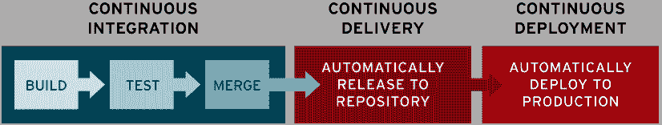
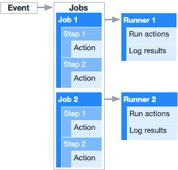
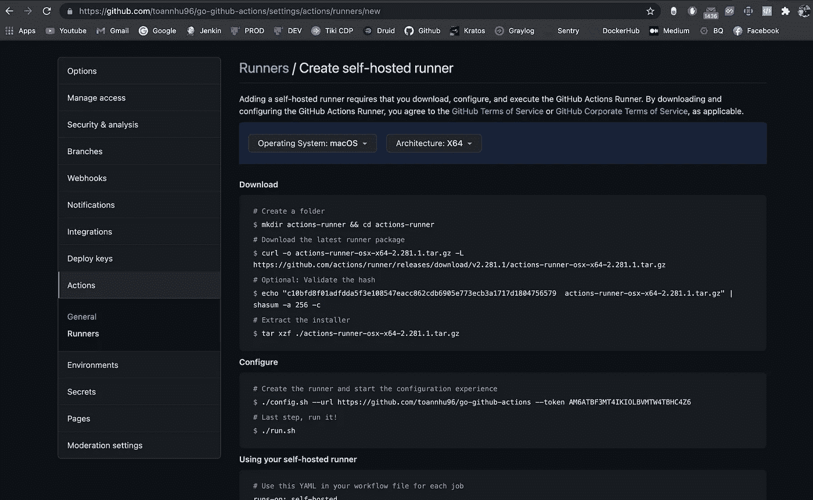
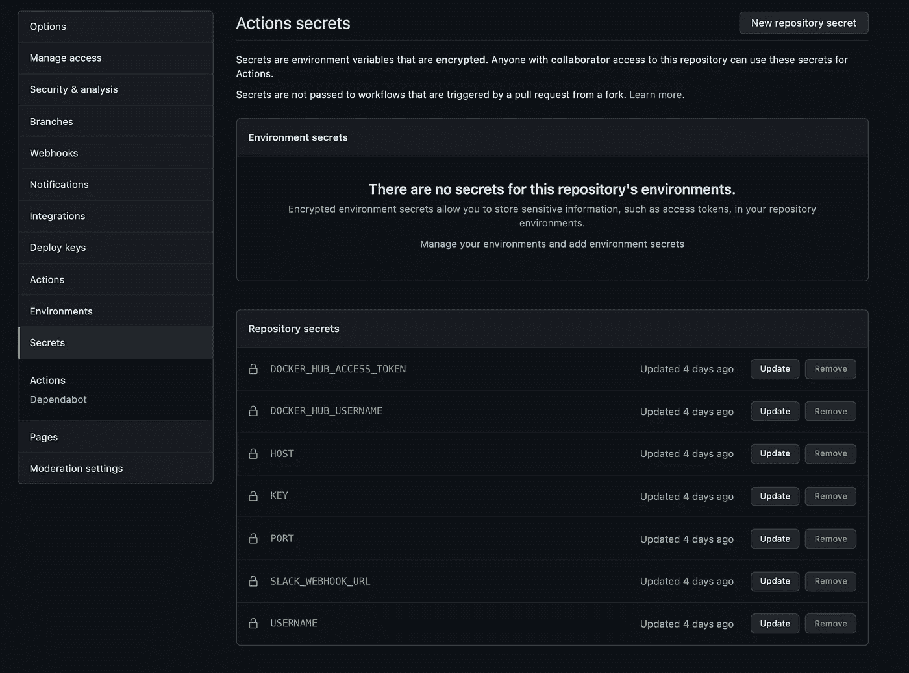
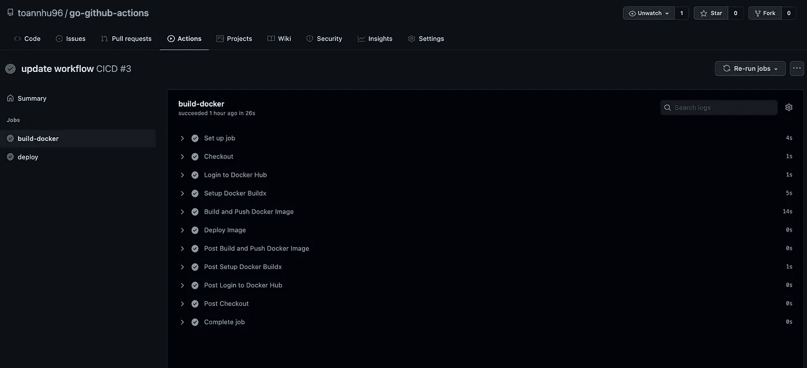
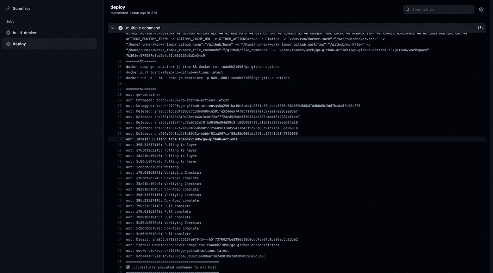
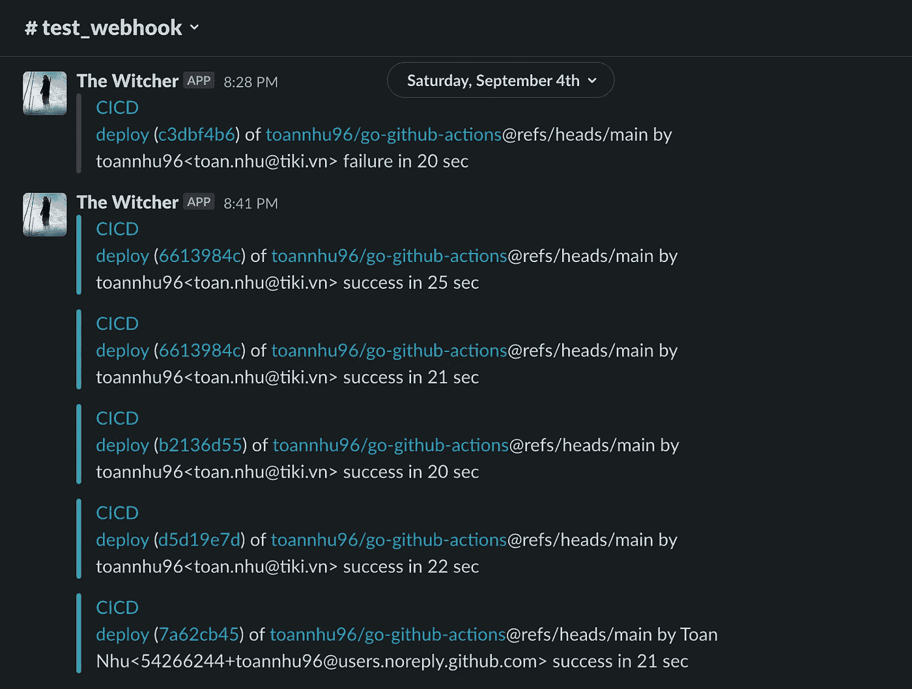
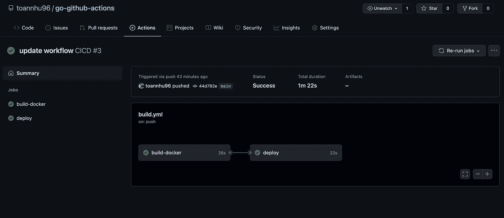

# 用 Github 动作对 CI/CD 管道的简单介绍

> 原文：<https://medium.com/geekculture/a-gentle-introduction-to-ci-cd-pipeline-with-github-actions-86115c4a6310?source=collection_archive---------6----------------------->

## 通过摆脱枯燥和耗时的代码部署来提高您的生产力

你好。希望你一切都好。在最近的 [2021 栈溢出开发者调查中](https://insights.stackoverflow.com/survey/2021)证实 Docker 是除 Git 之外第二受欢迎的工具，并成为开发者的基本工具。按照传统的方式，开发人员必须编写代码，然后在本地环境中基于 Docker 文件构建 Docker 映像，然后再推送到 Docker Hub。大多数人同意我的观点，认为这花费了大量的时间和精力，因为每当源代码改变时，整个过程都要重复(也称为“集成地狱”)。但是别担心，CI/CD 来拯救我们的生命了。

# **那么，什么是 CI/CD 呢？**

CI 和 CD 是现代开发实践和 DevOps 中经常使用的两个缩写词。CI 代表持续集成，这是一个基本的 DevOps 最佳实践，开发人员经常将代码更改合并到一个中央存储库中，在那里运行自动化构建和测试。但是 CD 既可以指持续交付，也可以指持续部署。

当我们将这两者结合在一起时，我们将拥有对付“集成地狱”的最强大的武器，这就是 CI/CD 管道。如今，有许多工具可以帮助我们在您的软件开发生命周期内实现任务自动化，如 TravisCI、CircleCI、Jenkins、Buddy、final builder……如果您熟悉 Github，它们也提供 Github 操作，您无需为您的 CI/CD 管道使用第三方工具。

> GitHub 动作帮助您在存储代码和协作处理拉取请求和问题的同一位置自动化您的软件开发工作流程。您可以编写称为操作的单个任务，并将它们组合起来创建自定义工作流。工作流是定制的自动化过程，您可以在存储库中设置它，以便在 GitHub 上构建、测试、打包、发布或部署任何代码项目。

在本文中，我将向您展示如何设置一个完整的 Github Actions CI/CD 管道来构建映像并推送到 Docker Hub，最后在`ssh`之前部署到服务器。但在此之前，我们需要了解 Github Actions 的组件是什么，以及它们是如何工作的。

# Github 操作的组件

我们将详细介绍 Github Actions 工作流中的组件。Github 动作使用`YAML`文件来定义这些组件。

## **工作流程**

工作流是一个定制的自动化过程，我们可以将它包含在我们的存储库中，以构建、测试和部署我们的源代码。我们可以有一个以上的工作流，它必须存储在源代码的根目录下的`.github/workflows`文件夹中，并且可以被调度或由事件触发。

## 事件

事件是触发工作流的特定活动。例如，当有人将提交推送到存储库时，或者当一个问题或拉请求被创建时，活动可以源自 GitHub。当外部事件发生时，您还可以使用[存储库调度 webhook](https://docs.github.com/en/rest/reference/repos#create-a-repository-dispatch-event) 来触发工作流。有关可用于触发工作流的事件的完整列表，请参见[触发工作流的事件](https://docs.github.com/en/actions/reference/events-that-trigger-workflows)。

## 乔布斯

作业是在同一个流道上执行的一组步骤。默认情况下，包含多个作业的工作流将并行运行这些作业。您还可以将工作流配置为按顺序运行作业。例如，一个工作流可以有两个生成和测试代码的连续作业，其中测试作业依赖于生成作业的状态。如果构建作业失败，测试作业将不会运行。

## 步伐

步骤是可以在作业中运行命令的单个任务。一个步骤可以是一个*动作*或者一个 shell 命令。作业中的每一步都在同一个运行器上执行，允许该作业中的操作彼此共享数据。

## 行动

*动作*是独立的命令，组合成*步骤*以创建*作业*。动作是工作流最小的可移植构件。您可以创建自己的动作，或者使用由 [GitHub 社区](https://github.com/marketplace?type=actions)创建的动作。要在工作流中使用操作，您必须将其作为一个步骤包括在内。

## 滑行装置

runner 是安装了 GitHub Actions runner 应用程序的服务器。你可以用 GitHub 托管的 runner，也可以自己托管。运行程序监听可用的作业，一次运行一个作业，并向 GitHub 报告进度、日志和结果。GitHub 托管的运行程序基于 Ubuntu Linux、Windows 和 macOS，工作流中的每个作业都在一个全新的虚拟环境中运行。

Create a self-hosted runner in Github Actions.

# 我们开始吧

## **写 Dockerfile**

我们使用 docker 构建由 Golang 编写的简单 hello-world RESTful 服务。Dockerfile 是一个逐步建立图像的指令。我们使用多阶段构建，以保持图像大小尽可能小。

## 将环境添加到报告机密

加密机密允许您将敏感信息存储在您的组织、存储库或存储库环境中。要使机密可用于操作，您必须将机密设置为工作流文件中的输入或环境变量。在这个项目中，我们需要在下面添加一些秘密

*   `DOCKER_HUB_USERNAME` - Docker Hub 用户名
*   `DOCKER_HUB_ACCESS_TOKEN` -您可以创建一个访问令牌或直接使用 Docker Hub 密码登录以推送图像。
*   `HOST` - ssh 主机
*   `PORT` - ssh 端口，默认为`22`
*   `USERNAME` - ssh 用户名
*   `KEY`-ssh 私钥的内容。ex ~/的原始含量。ssh/id_rsa
*   `SLACK_WEBHOOK_URL` - Slack webhook url，用于在运行后发送关于 CI/CD 管道状态的通知。

## 创建工作流并配置要触发的事件

首先，创建一个 yaml 文件，存储在源代码根目录下的`.github/workflows`文件夹中。该示例工作流将在分支“主”、“暂存”和“开发”上的推送和拉取请求时被触发。此外，工作流也可以根据时间表触发。

我们将我们的工作流分成两个主要的工作:“构建”和“部署”。类似于 CI 渠道的“构建”和类似于 CD 渠道的“部署”。所有作业都将在您选择的特定运行程序上运行。所以在这个例子中，我将使用`ubuntu-latest` runner。

## “构建”工作

为了简化构建和推送 Docker 图像，我们只使用现有的动作`docker/build-push-action@v2`。它是基于 BuildKit 构建的，build kit 是一个新的 Docker 图像生成器。它带来了许多改进和更好的性能。令我印象深刻的最有趣的事情之一是 [*使用远程存储库作为缓存*](https://github.com/docker/build-push-action/blob/master/docs/advanced/cache.md) 。这对于您的 CI 构建特别有用，因为缓存文件夹可能不可用，并且您将对每个管道进行冷构建。

使用 BuildKit，除了本地构建缓存之外，构建器还可以使用指向注册表中图像的`--cache-from`标志重用从以前的构建中生成的缓存。这也支持很多类型缓存导出器，在这里我只是为了我们的简单需要而使用了`type=inline`。

## “部署”作业

为了将我们的代码部署到服务器，我们需要执行远程 ssh 并运行 docker 命令。动作`[appleboy/ssh-action](https://github.com/appleboy/ssh-action)`可以帮助我们完成这项工作，你不需要担心安全威胁，因为它还提供了许多参数来保护你的连接和防止中间人攻击。

最后但同样重要的是，在运行之后，您需要知道 CI/CD 管道是否成功。我们将设置一个简单的 Slack Webhook，使用这个动作`[8398a7/action-slack@v3](https://github.com/8398a7/action-slack)`来提醒构建的状态

瞧啊。一切都像魔咒一样管用。我们刚刚完成了 Github Actions CI/CD 管道的设置。

以下是 Github 操作工作流程的完整配置:

# 太好了！不是吗？

只需几个简单的设置，我们就有了基于不同事件触发作业的自动化流程。这种解决方案可以帮助您摆脱枯燥、耗时的代码部署，并且更专注于业务和代码逻辑。这个示例项目的源代码可以在下面找到:

 [## GitHub-toanhu96/go-GitHub-actions:简单的 go rest 服务，带有 GitHub 动作，可将图像推送到…

### 简单的 go rest 服务，github 动作将图像推送到 docker hub 并部署到服务器- GitHub …

github.com](https://github.com/toannhu96/go-github-actions.git) 

# **资源**

docker:[https://docs.docker.com/get-started/overview/](https://docs.docker.com/get-started/overview/)Gihub Actions:[https://docs.github.com/en/actions](https://docs.github.com/en/actions)

感谢阅读这篇文章，我希望它是有用的，随时讨论更多。