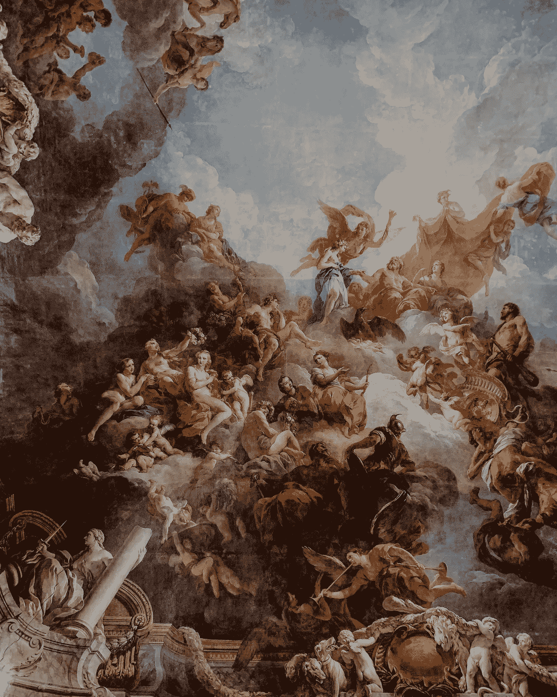
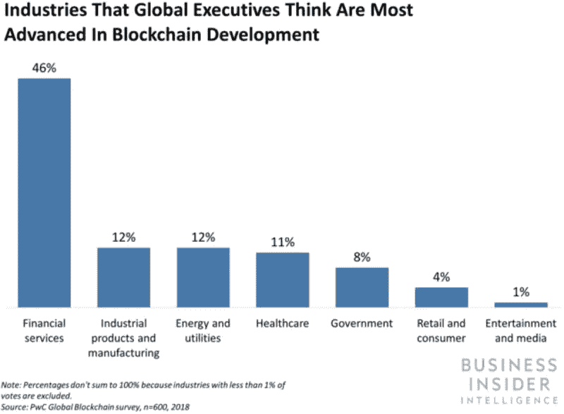
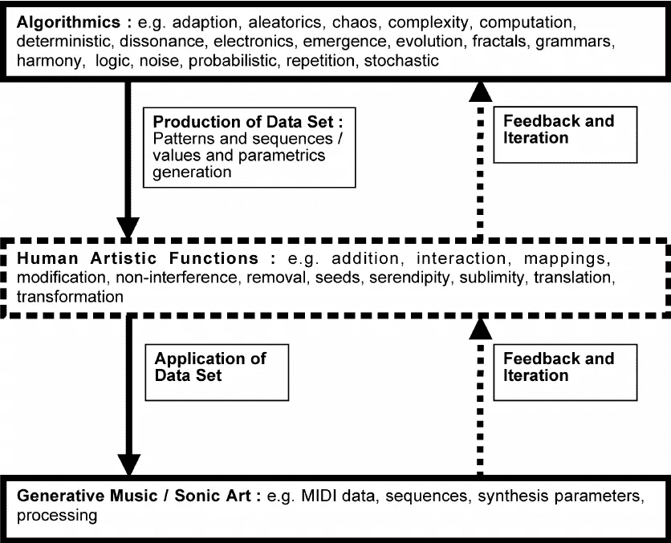
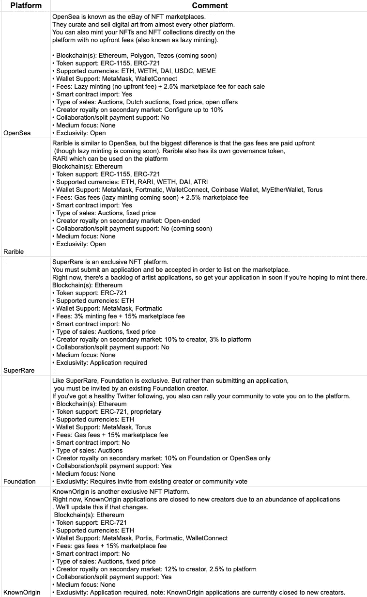

# 人工智能、艺术和 NFT 的交集

> 原文：<https://medium.com/geekculture/a-gentle-introduction-to-the-intersection-of-the-ai-art-nft-6f4e4c0851?source=collection_archive---------6----------------------->

## 区块链、人工智能和数字艺术的共存



Photo [adrianna geo](https://unsplash.com/@adrigeo_?utm_source=medium&utm_medium=referral) on [Unsplash](https://unsplash.com/?utm_source=medium&utm_medium=referral)

我们将触及一个非常热门的话题，人工智能、艺术和不可替代的代币的交集(NFT)。这将是一篇非技术性的文章，我们讨论以下主题

1.  区块链和机器学习
2.  算法&生成艺术与人工智能(GANs)
    2.1 算法生成模型如何应用于艺术的背景？
    2.2 深度学习模型如何生成艺术作品？
    2.3 人工智能与艺术的平衡
3.  加密艺术与 NFT
    3.1 什么是加密艺术& NFT？
    3.2 NFT 市场

**区块链&机器学习**

最有可能的是，机器学习(ML)和区块链是当今市场上最有影响力的两项技术，在各种业务中获得了巨大的宣传。随着 ML 的出现，统计驱动的企业将其模型转换为能够捕捉真实世界动态和随机的 ML 模型。它对从游戏行业、自动驾驶汽车和自动运输到个性化数字媒体和客户服务都有巨大的影响。另一方面，区块链是交易的数字分类账，其分布在计算机系统的整个网络上，使得能够进行基于协议的可编程(即，智能合同)、分散的、加密的(安全的)、带时间戳的和不可变的交易。它有非常实际的使用案例，主要是在金融领域。以下是区块链系统的一些使用案例。

*   分散财务
*   分散应用程序
*   加密货币交易市场
*   加密钱包(例如元掩码)
*   NFT 市场
*   实时物联网操作系统
*   个人身份安全
*   供应链和物流监控
*   数据的安全共享

这是工业环境中区块链用例的快速分布。



Industrial Use Case Distribution of the Blockchain (Source: [https://www.businessinsider.com/blockchain-technology-applications-use-cases](https://www.businessinsider.com/blockchain-technology-applications-use-cases)

从上面的图表中我们可以看到，人工智能和区块链有很多交集。然而，我将在下面的章节中解释 NFT(由区块链支持)和人工智能艺术(由机器学习支持)的交集。

**算法&生成艺术与人工智能**

首先，什么是算法艺术？维基父亲说

> **算法艺术**或**算法艺术**是艺术，主要是[视觉艺术](https://en.wikipedia.org/wiki/Visual_art)，其中的设计是由一个[算法](https://en.wikipedia.org/wiki/Algorithm)生成的。

所以，它基本上是计算机科学与一堆生成算法和艺术的交集。所以，“算法主义者”这个术语就是通过算法生成艺术的人。让我们再次向父亲询问“algorist”的定义。

> “算法艺术家”是一个术语，指的是创造算法艺术的数字艺术家。

Hébert 被认为创造了这个术语及其定义，这是他自己的算法[【3】](https://en.wikipedia.org/wiki/Algorithmic_art#cite_note-Verostko-3)。这是算法学家的一个快速定义。

```
if (creation && object of art && algorithm && one's own algorithm) {
     return * an algorist *
} else {
     return * not an algorist *
}
```

这完全说得通。“生成艺术”这个术语呢？让我们进一步问维基爸爸。

> **生成艺术**指的是[艺术](https://en.wikipedia.org/wiki/Art)全部或部分是利用一个自主系统创造出来的。在这种情况下，自主系统通常是非人类的，并且可以独立地确定艺术品的特征，否则需要艺术家直接做出决定。

生成艺术通常指算法艺术，所以从现在开始，我将使用术语“生成艺术”。 **2.1 算法&生成模型如何应用在艺术的语境中？**让我们直接进入下面的流程图，逐一分析各个组件。



Burraston, Dave & Edmonds, Ernest. (2005). Cellular automata in generative electronic music and sonic art: A historical and technical review. Digital Creativity — DIGIT CREAT. 16\. 165–185\. 10.1080/14626260500370882.

简而言之，我们拥有的是生成算法+艺术数据集。从计算机科学的角度来看，这就是我们所需要的。艺术视角呢？这就是人类的艺术功能。我们对算法和数据进行了大量的扩充，以给出“艺术的观点”。在生成艺术的背景下，这对于艺术家来说是非常特殊的。实际上，上图中的所有元素都是可以放大的，可以区分不同的艺术家。在接下来的章节中，我将简要地谈谈人类艺术功能的重要性。

长话短说，一个算法学家使用一堆算法和数据来满足她/他的需求、愿景等。以人为本的增强和功能，以产生一个创作。

**2.2 深度学习(AI)模型如何生成艺术作品？**

当我们说 AI 时，我们一般会指出 ML 或深度学习(DL)，但也有一些例外。在本文中，当我使用术语 AI 时，我指的是 ML & DL。于是问题就变成了“我们如何使用 ML & DL 来生成艺术作品？”。

让我们快速参考一下上面的图表。现在，上面图表中的“算法”部分被 ML & DL 所取代。所以我们使用艺术数据支持的 ML & DL 算法进行创作。也有很多 ML & DL 算法是在它们的上下文中生成的，并与视觉和信号一起工作。大概用的最多的就是“[生成对抗网络](https://en.wikipedia.org/wiki/Generative_adversarial_network)(干)”。我不会在这篇文章中详细介绍甘，但我打算这样做。gan 是非常强大的生成网络，它学习训练数据的分布。对于非技术人员来说，这意味着当我们估计训练数据的分布时，我们可以以新兴的方式生成新数据，这些方式可以是视觉艺术、音乐、视频等。这取决于对人类观察者来说表面上看起来真实并且具有现实主义&艺术特征的背景。因此，GANs 是非常强大的系统，可以创建、设计、绘制、创作、扩充和生成艺术交响乐。这里有一位算法艺术领域的知名艺术家，即“Refik Anadol”，他是一位媒体艺术家、导演，也是机器智能美学的先驱。他和他的团队应用了一系列最先进的 ML & DL 算法来解决无处不在的计算给人类带来的挑战和可能性，以及在人工智能时代对人类意味着什么。他探索了既然机器主宰了我们的日常生活，对时间和空间的感知和体验是如何彻底改变的。这是他被 YouTube 采用的视频样本。

对于 GANs 的一般了解，我强烈推荐下面这篇文章。

[](https://heartbeat.fritz.ai/artificial-art-how-gans-are-making-machines-creative-b99105627198) [## 人工艺术:甘人如何让机器变得有创造力

### 检验机器的创造潜力

heartbeat.fritz.ai](https://heartbeat.fritz.ai/artificial-art-how-gans-are-making-machines-creative-b99105627198) 

**2.3 AI 与艺术的平衡**

本部分包括主观评论。问题在这里:“生成 AI 艺术时，AI 和艺术的正确平衡是什么？”。我的简单回答是，它不存在。这对于应用程序本身来说是非常特殊的，因为对算法和数据的每一次操作和增强都会以不同的组合结束。就像艺术的本质一样，艺术数据告诉我们的不仅仅是像素，事实上，通过一些操作，“生成”模型可以在它们自己的上下文中出现。这里的成功标准是我们的测试集中没有度量标准，即使没有使用模型最成功的点，从人工智能的角度来看仍然有学习的空间，但这是必要的吗？

**密码艺术& NFT**

**3.1 什么是加密艺术& NFT？**

在当今的艺术世界中，数字艺术作品与传统艺术技巧(如绘画或雕塑)一样，近年来发展迅速。艺术家们已经开始将他们追求了几代人的艺术追求带到发展中国家的数字化道路上。现存的物品是独一无二的。然而，对于数字艺术品来说，这并不是线性的。因为这些储存在电脑或云存储区域的作品，以数字文件的形式，可以被轻易地无休止地复制和印刷。对于转换为加密艺术和 NFTs(不可替换令牌)的艺术品来说，情况就不一样了。因此,“唯一性和不可替代性”的概念通过区块链得以保留。让我们通过向维基百科询问这些术语的确切定义来进一步了解细节:

**密码艺术**(也被程式化为**密码艺术**或**密码艺术**)是与[区块链](https://en.wikipedia.org/wiki/Blockchain)技术相关的艺术类别。

在 2010 年代中后期，随着[区块链](https://en.wikipedia.org/wiki/Blockchain)网络的发展，如[比特币](https://en.wikipedia.org/wiki/Bitcoin)和[以太坊](https://en.wikipedia.org/wiki/Ethereum)，密码艺术作为一种艺术作品的小众流派迅速流行起来，这在很大程度上是因为底层技术为纯粹的[数字艺术品](https://en.wikipedia.org/wiki/Digital_art)提供了前所未有的能力，可以由任何人以[去中心化](https://en.wikipedia.org/wiki/Decentralized)的方式购买、出售或收藏。[【1】](https://en.wikipedia.org/wiki/Crypto_art#cite_note-:0-1)

我们可以认为 CryptoArt 是一种收集和交易数字作品的区块链方式。NFT 怎么样？让我介绍 NFT 如下。

以 NFT 的身份购买艺术品的人拥有该作品的“原始”版本。这样，这件独一无二的作品将永远属于购买它的人。由于 NFT 技术，数字艺术品可以保持其原创性，并转化为可交易的。这项技术证明了数字设计和艺术作品的独特性，是艺术史上的一场革命。它不仅为艺术和艺术家增加了巨大的价值，也使作品和艺术家全球化。通过让艺术家与来自世界各地的艺术爱好者见面，寻找相似领域的艺术家彼此相遇。这是一个强大的范例。

3.2 NFT 市场

有很多 NFT 市场和项目可以让人们以一种简单的方式进行收藏和交易。任何人，引起你的注意，任何人和每个人都可以用他们的加密货币钱包铸造，列出，收集和交易 NFT。大多数 NFT 市场都是建立在以太网和代币的基础上，以促进 NFT 的收藏和交易。以下是一些拥有最大资本的 NFT 市场。

*   OpenSea
*   超级罕见
*   稀有的
*   基础
*   已知来源
*   币安·NFT

还有很多。在这里，我收集了一些关于 NFT 市场的关键信息和评论。你可以找到一个详细的和关键的信息为导向的 NFT 市场总结如下。



艺术数据和算法告诉我们的不仅仅是像素，这是艺术的本质。人工智能的进步和 NFT 的存在让我们能够统一这个领域，并将由此产生的“生成性”艺术作品作为一种独特的作品进行展示。

这就是这篇文章的内容，我还计划发表一些独立的文章，从更深的意义上来说，我会涉及到这些标题。

**我在这里！**

[Twitter](https://twitter.com/canKocagil2)|[Linkedin](https://www.linkedin.com/in/can-kocagil-970506184/)|[Medium](https://cankocagil.medium.com/)|[Mail](mailto:cankocagil123@gmail.com)