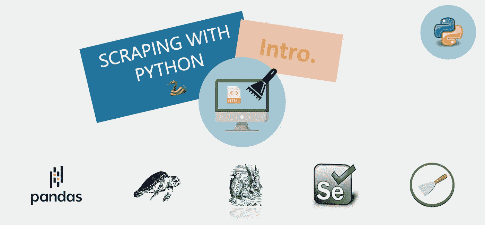

# Web 数据提取的简单介绍🐍

> 原文：<https://medium.com/geekculture/a-gentle-introduction-to-web-data-extraction-scraping-with-e8dc7253b571?source=collection_archive---------3----------------------->

Fig. 1 — Scraping with Python — A gentle introduction to web data extraction (*Image by author*)

## 数据无处不在。数据在网上。但是什么是网络呢？以及如何从中提取数据？

> 这篇文章是系列文章**“用 Python 抓取”的第一篇🐍"**我打算在这里解释和教授从基础到最先进的刮削概念**。**

# 介绍