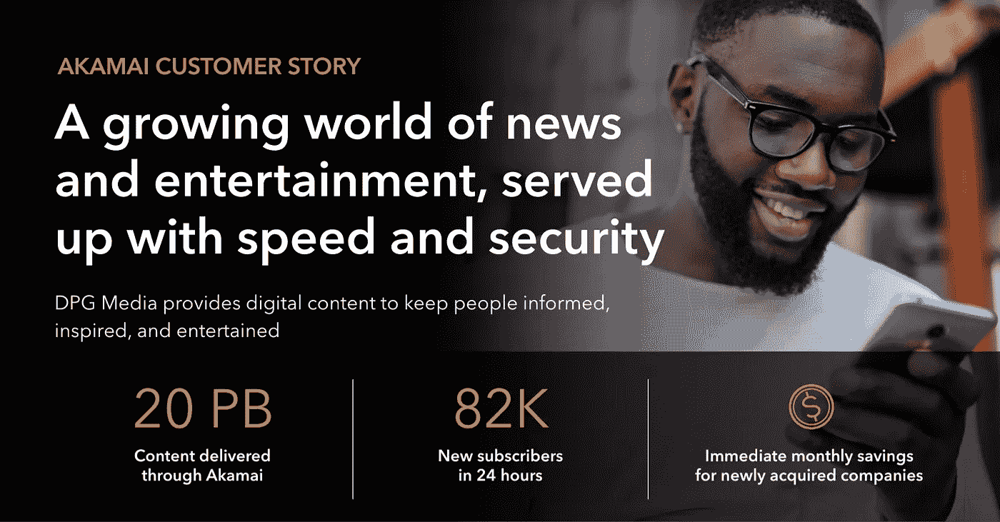

# 不断增长的新闻和娱乐世界，速度快，安全可靠

> 原文：<https://medium.com/geekculture/a-growing-world-of-news-and-entertainment-served-up-with-speed-and-security-8916b0df76e0?source=collection_archive---------49----------------------->

*由 Akamai 和 DPG 媒体云治理团队的产品负责人 Jo De Coninck 撰写*

**新闻和娱乐的基础——随时随地** 为了与全球媒体公司竞争，DPG 媒体必须成为区域性新闻和在线娱乐的领导者——收购较小的品牌，并通过世界级的性能和安全性进行扩展。DPG 媒体依靠 Akamai 为其所有在线媒体品牌提供性能、稳定性和安全性，提供数百万人每天依赖的新闻和娱乐。

**坐下来欣赏演出的信心，有内容交付网络作为后盾**
在疫情新冠肺炎举办一年后，DPG 媒体在其广受欢迎的新闻和娱乐门户网站 HLN.be 上举办了一场现场音乐活动。通过 24 小时在线直播表演，这是一个展示当地表演者的机会，而当时不可能举办现场音乐会。它成功了——在比利时吸引了超过 540，000 名观众，并为网站带来了 82，000 名新订户。

对于 DPG 媒体云治理团队的内容交付网络和 Web 应用防火墙产品负责人 Jo De Coninck 来说，这是一个巨大的个人胜利。“我们向成千上万的人传输了 270 Gbps 的直播视频，”De Coninck 说。“这对我们来说是巨大的流量，但我们不需要扩大基础设施或托管容量。我们只是坐下来欣赏表演。”

De Coninck 在该公司工作了 20 年，在过去的十年里，他一直在帮助这家媒体集团推动数字化转型。DPG 传媒运营着 90 个知名的区域品牌，涵盖平面新闻和杂志、电视和广播、数字出版物以及视频点播。它还将更多的新闻和娱乐带到网上，覆盖比利时、荷兰和丹麦的数百万人。

De Coninck 在向在线转变的过程中发挥了重要作用，确保基础设施具备出色的性能、稳定性和安全性，以应对不断扩大的读者群、大规模视频流事件以及突发新闻导致的不可预测的流量高峰。他依靠 Akamai 来完成这项工作，并在整个公司领导一项倡议，将所有面向公众的应用程序置于 Akamai 之后。

向较小的媒体品牌提供企业规模和数量的贷款
标准化工作是媒体集团更大商业战略的重要组成部分:利用公司的规模和覆盖范围推动收购和新业务的快速增长。通过将较小的品牌引入 Akamai，De Coninck 可以立即为他们提供所需的基础设施资源，让他们能够进行大规模思考，提供更丰富的内容，接触到更多的受众。所有这些都不需要扩展
基础设施。这使得 DPG 媒体能够加强其区域优势，并与脸书、谷歌和网飞等破坏性的全球参与者竞争。

***“我们的集中式 CDN 战略是一个机会，可以优化我们数字产品的性能，提高安全性，并且——因为这是一个批量游戏——我们可以比独立的方法降低成本。三赢！”DPG 媒体公司的首席技术官弗兰克·马蒂斯说。***

**旅程始于一份在线出版物**
大约 10 年前，De Coninck 首次向 DPG 媒体介绍 Akamai 技术，当时该公司正准备推出其第一份数字出版物 iPaper。他需要确保读者在他们的台式机、平板电脑和手机上访问新闻时有快速、完美的体验。通过 Akamai 的下载交付产品在边缘缓存内容，他可以快速加载页面，为人们创造更好的阅读体验——甚至比在早餐时打开折叠的报纸更容易。与此同时，缓存内容
将为基础设施创建一个缓冲区，使其能够承受突发新闻带来的不可避免的流量波动。

“没有 Akamai，我们根本无法交付第一款数字产品，”De Coninck 回忆道。从那时起，他将内容交付网络(CDN)扩展到了数十个面向公众的应用程序，添加了动态站点加速器来进一步优化站点性能和自适应媒体交付，以支持 DPG 媒体公司更新的视频点播频道。DPG 媒体还使用 Edge DNS 和云包装器，为新闻和娱乐网站保持高性能、
可用性和稳定性。

“即使当我们的应用程序和托管基础设施崩溃时，我们也能让我们的新闻网站在缓存版本上运行，”德·康宁克说。"阿卡迈让我们在那些日子里活了下来."

**指向移动未来，具有低成本可扩展性** 将内容推向边缘也为公司走向更加移动的未来提供了一条清晰的道路。“去年，我们的移动流量超过了常规流量，这一趋势只会继续下去，”De Coninck 说。“我坚信 Akamai 面向边缘的方法将成为移动接入的一大优势，因为它让我们更接近用户。”

此外，在单个 CDN 上实现标准化有助于 DPG 媒体通过 Akamai 捆绑所有流量来降低成本，无论应用程序位于何处，无论是内部还是任何云平台。在最近对 Sanoma NL 的收购中，DPG 媒体发现，将该品牌转移到 Akamai 之后，€每月立即节省了 1 万英镑的基础设施成本，同时使其能够接触到比以往更多的受众。

***“Akamai 为我们提供了在不增加基础设施成本的情况下扩大规模的灵活性和速度，因此像 Sanoma 这样的新品牌可以在不增加 10 倍成本的情况下从 10 倍的访客中获益，”***De Coninck 说道。“这意味着我们可以将节省下来的资金再投资于一个日益重要的领域:安全。”

**保护新闻网站免受安全威胁** De Coninck 一直致力于通过 Akamai 增加外围保护来保护 DPG 媒体的基础设施。这家媒体和娱乐公司选择 Kona Site Defender 来防范分布式拒绝服务攻击——将威胁移至远离基础设施的地方，并在边缘阻止它们——客户声誉为外围增加了一层额外的
保护。页面完整性管理器可以防止脚本攻击，而 Bot Manager Premier 可以阻止抓取内容或窃取用户凭据的企图。

“我们需要保护我们的应用程序和用户数据免受有针对性的威胁，如凭据填充和内容抓取，”De Coninck 说。“将我们的应用程序集中在一个 web 应用程序防火墙后，大大减少了我们的公开攻击面，并有助于保护我们的用户数据安全。”

**强大的商业案例，长期增长战略** DPG 媒体自首次推出 Akamai 及其 IP apaper 应用程序以来，已经取得了长足的进步。从每月仅数百 TB，部署已经发展到包括每月 20pb 的内容，从每日新闻出版物和杂志到流媒体视频。在很大程度上，这是 De Coninck 不懈努力推动标准化计划的结果。他专注于公司对带宽要求最高的前 30 个品牌，
他已经帮助 Akamai 迁移了 70%面向公众的应用。他还没有完成。

De Coninck 的部分工作是帮助开发人员在构建和部署新应用程序时过渡到 Akamai。他有一个强有力的商业案例，表明单一企业 CDN 有助于优化性能、稳定性、可扩展性和安全性，同时降低成本。他可以依靠 Akamai Premium 服务和支持 3.0 的安全优化帮助来保持一切顺利运行。他知道保持 CDN 与应用层分离有多重要，这让开发团队能够灵活地扩展应用并移动它们。

“作为一个独立的 CDN，Akamai 为我们提供了一种将性能优化和安全功能从我们的应用基础设施中分离出来的方法，”De Coninck 说。“这一点很重要，因为我们会继续收购和吸收较小的公司，让它们受益于我们的企业规模和覆盖范围。”

对于一家不断发展和适应日益数字化的行业的公司来说，这是一个强有力的战略——将一直以来提供给数百万在线用户的高质量新闻和娱乐延伸出去。