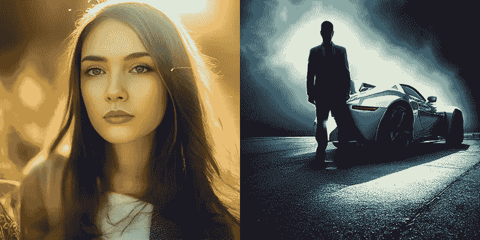

# 中途照明指南

> 原文：<https://medium.com/geekculture/a-guide-to-lighting-in-midjourney-3c94d00b20d0?source=collection_archive---------1----------------------->

Various lighting examples made by me on Midjourney

我的大学摄影教授曾经告诉过我一些深刻的东西，他说:“掌握了照明，其他的一切都会到位。”

即使在今天，当我用 iPhone 相机拍照时，我总是试图首先考虑照明以及它对构图的重要性。

当处理人工智能艺术时，特别是处理现实主义或照片时，得到光照会很棘手…