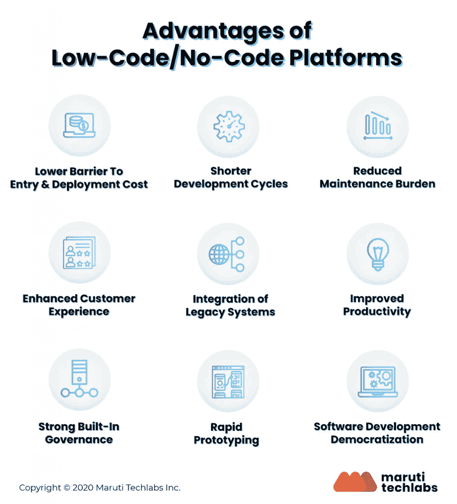
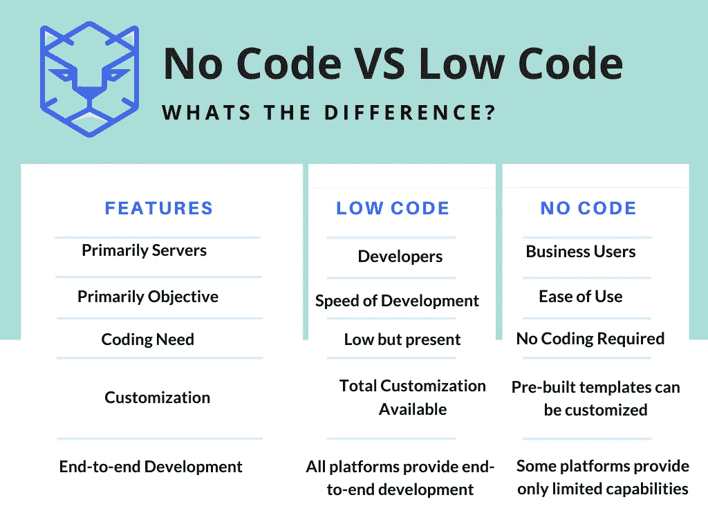
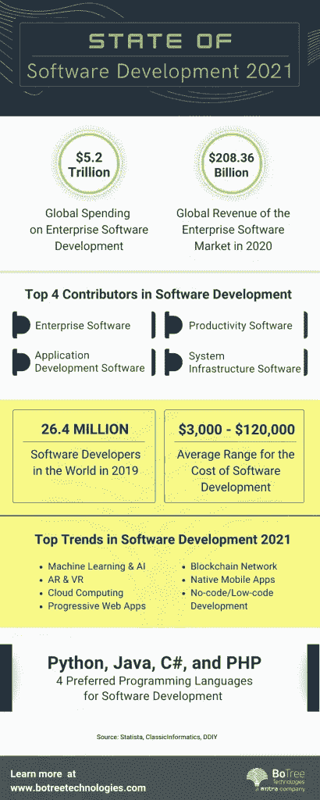

# 2022 年低代码/无代码软件开发指南

> 原文：<https://medium.com/geekculture/a-guide-to-low-code-no-code-software-development-in-2022-692df2cfefb1?source=collection_archive---------17----------------------->

Gartner 预测，到 2024 年，65%的应用程序活动将来自低代码开发。

随着效率成为数字企业的基石，低代码无代码软件变得更加流行。最大的优势是加速了整个产品交付生命周期。

自从 covid 出现以来，认为低代码无代码开发是他们最重要的自动化投资的执行官的百分比从 10%增加到了 26%。

# 什么是低码无码？

低代码/无代码平台使开发人员无需编写冗长的代码。它提供了一个拖放界面来添加应用程序功能。低代码无代码环境提供了具有直观工具的可视化界面，不需要任何广泛的编码知识就可以开始开发过程。

这些平台加速了产品交付过程，提供了便利，并提供了对过程的更多控制。更重要的是，它们将开发成本降低了两倍。

来源:马鲁蒂技术实验室

# 低码和无码是一样的吗？

虽然低代码应用程序开发需要某种形式的编码经验，但没有代码不需要任何这样的技能。在低代码开发平台中，开发人员专注于使用可视化开发环境，并自动链接到后端系统、数据库、web 服务或 API。

没有代码，结合软件开发的敏捷方法，提供了更快的方法。这些平台提供了可视化的拖放界面，允许任何人在没有任何经验的情况下构建应用程序。

来源:TigerSheet

然而，两种低代码无代码平台都减少了开发时间，因为不需要写很长的代码。它还节省了资源部署，因为不需要建立一个由 5-8 名开发人员组成的内部团队来构建产品。

# 使用低代码无代码平台时需要考虑什么

越来越多的采用低代码无代码开发平台导致原型快速进入市场。

然而，在切换到软件开发的低代码模型时，有几个因素需要考虑。他们在这里:

*   **开发成本** 虽然低代码无代码软件开发服务肯定节省时间和资源，但成本可能是一个决定性因素。低代码/无代码平台的订阅模式需要大量关注。
*   无论何时需要，低代码平台都应该允许可伸缩性。某些订阅功能有限，这可能会导致不时创建新的应用程序。这肯定会增加开发的业务关键成本。
*   软件基础设施
    人们必须明白，部署这种需要最少甚至不需要编码的平台不是一种选择——它们是一种企业战略。它是软件开发基础设施不可或缺的一部分。
*   然而，低代码平台需要连接不同的软件孤岛，如人工智能、RPA、云计算和其他对企业软件开发至关重要的东西。这种简化使得高管们很容易决定他们是否需要低代码/无代码。
*   **安全性考虑** 最后，还有低代码/无代码开发平台的安全性考虑。虽然仅限于特定企业的内部应用程序具有丰富的内置安全特性，但面向外部的应用程序可能需要考虑它们较低的代码优先级。
*   应该适当部署一个 IT 安全团队来管理威胁并保护应用程序免受漏洞攻击。授权和认证的最佳实践是必不可少的，因为团队可能会认为低代码/无代码平台比从头构建应用程序风险更大。

# 最佳低代码/无代码平台

低代码/无代码是可能的，因为平台简化了开发过程。这些平台提供了一个直观的界面，使开发人员能够利用拖放方法来构建应用程序。

一些最好的低代码/无代码平台包括:

*   **Caspio** 它是最知名也是唯一一个提供云集成 app 开发的平台，无限用户，无限 app 开发者。Caspio 运行在 AWS 和 SQL server 上。它提供了对企业应用程序至关重要的企业级安全性和性能。
*   HCL Volt Mx
    作为最好的低代码/无代码平台之一，HCL Volt Mx 使开发人员能够创建具有迷人体验的应用。团队可以在任何平台上构建 web、本地和可穿戴的应用程序。该平台集成了 AR & VR，以独特的方式吸引用户，并提供高性能的解决方案。
*   **Opsera** 作为一个完整的 DevOps 编排平台，Opsera 支持无代码开发和智能自动化开发应用。这是一款低代码应用开发软件，为 SDLC 和 SaaS 用例提供自助式工具链供应和集成、声明式管道。

以上是三个人气很高，使用最多的低码/无码平台。低代码平台的列表包括其他几个平台，如 OutSystems、Reify、PegaSystems、Kintone、Mendix 等等。

# 低代码/无代码开发的挑战

虽然低代码用例在世界范围内激增，但是开发团队面临着某些限制。

在几个低代码/无代码示例中可以看到的最大挑战之一是数据安全性。无法了解数据的使用方式和暴露内容。由于平台是第三方应用程序，数据控制可能是一个挑战。平台中的安全威胁和漏洞可能会导致应用程序无法正常工作。

另一个挑战是学习低代码开发的编程技术。即使是最好的低代码开发工具，也只有有限的培训和有限的材料。这就是为什么雇佣一家提供低代码/无代码开发的软件开发公司是有意义的。

基于订阅的应用模式也带来了挑战。它可能会阻碍可伸缩性并加速开发过程。低代码开发有一个显著的成本关联，有几个低代码例子面临同样的命运。

# 包扎

研究人员估计，大多数公司中至少有一个软件开发团队使用低代码开发平台。越来越多的企业应用程序使其成为企业和初创公司的完美选择。

然而，公司应该总是在无代码开发可能无法正常工作的地方雇佣软件开发人员。有必要分析项目的复杂性，并确定它是否适合低代码/无代码开发。

*原载于 2022 年 6 月 7 日*[*【https://techytune.com】*](https://techytune.com/2022/06/07/a-guide-to-low-code-no-code-software-development-in-2022/)*。*