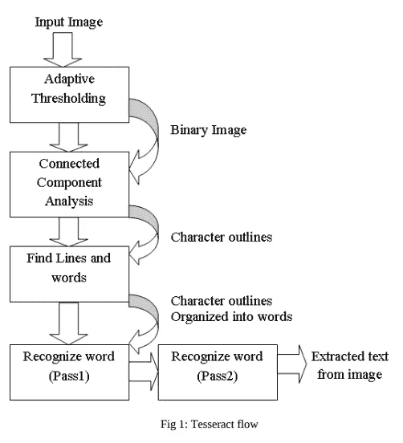
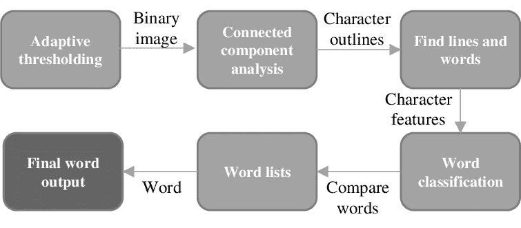

# 用 Python 和 Tesseract 实现光学字符识别的路线图

> 原文：<https://medium.com/geekculture/a-guide-to-ocr-and-tesseract-engine-75195210f4f7?source=collection_archive---------13----------------------->

**光学字符识别**或**光学字符阅读器** ( **OCR** )是将打字、手写或印刷文本的图像电子或机械转换成机器编码文本，无论是来自扫描文档、文档照片、场景照片还是叠加在图像上的字幕文本。更简单的说， **OCR** 就是从图像中提取文字的过程。您可能已经体验过它的许多实际应用，比如从文档中提取文本，从发票、护照文档、银行对账单、计算机化收据、名片、邮件、静态数据的打印输出或任何合适的文档中收集数据。这是将印刷文本数字化的一种常用方法，这样它们可以被电子编辑、搜索、更紧凑地存储、在线显示和用于机器处理。

# 简史

光学字符识别主要用于修改**电报**为盲人创造阅读设备。1914 年，伊曼纽尔·戈德堡发明了一种机器，能够阅读文本字符并将其转换成电报代码。同时，Edmund Fournier d'Albe 开发了 Octophone，这是一种手持扫描仪，当它在打印页面上移动时，会产生与特定字母或字符对应的音调。

20 世纪 20 年代末到 30 年代，伊曼纽尔·戈德堡开发了一种他称之为“统计机器”的东西，利用光学代码识别系统搜索缩微胶片档案。1931 年，他的发明获得了美国专利第 1，838，389 号。这项专利被 IBM 收购了。

在 1900 年代后期，在光学字符识别方面出现了无数的发明。最受欢迎和开创性的发明之一是影印或复印。

# 现代光学字符识别

早期的版本需要用每个角色的图像进行训练，并且一次处理一种字体。能够对大多数字体产生高度识别准确度的高级系统现在很常见，并且支持各种数字图像文件格式输入。一些系统能够再现非常接近原始页面的格式化输出，包括图像、列和其他非文本组件。

作为一个过程，现代 OCR 通常由几个子过程组成，以尽可能精确地执行。子流程包括:

1.  **图像的预处理**
2.  **文本本地化**
3.  **字符分割**
4.  **字符识别**
5.  **后处理**

子流程列表可以根据情况和要求而有所不同，但总流程的大致轮廓是这样的。整个过程的目的是正确地识别每个单词，并尽可能准确地给出结果。

所以，我们要计划好这一切，对吗？不，规划这整个过程不是一件容易的事，需要很多年。希望有一个名为“宇宙魔方”的预编程引擎，它将帮助我们轻松执行整个任务。

# 宇宙魔方

" ***宇宙魔方*** *是一个适用于各种操作系统的光学字符识别引擎。它是自由软件，在 Apache 许可下发布。最初是由惠普公司在 20 世纪 80 年代开发的专有软件，它在 2005 年作为开源软件发布，从 2006 年开始由谷歌赞助开发。*

*2006 年，Tesseract 被认为是当时最精确的开源 OCR 引擎之一。*”

市场上有很多可用的 OCR 引擎，但没有一个像 Tesseract 一样高效。它们要么不自由，要么操作起来令人沮丧。尽管很难集成 T**essract**但仍然比许多可用的选项要好。默认情况下，**宇宙魔方**是一个命令行软件，但是对于 **GUI 宇宙魔方**软件有许多第三方选项。它可以通过 **API** 与其他流行的编程语言绑定使用。

宇宙魔方 4 有一个新的神经网络子系统，被配置为文本行识别器。它实际上是基于 OCRopus Python 的 LSTM 的重新实现，但是用 c++(T25)重新编写。

在这个整个字符识别过程中，我们一般使用一个**卷积神经网络或者 CNN。我们可以把一篇文章看作一个字符序列，为了解决这样的问题，我们通常使用 LSTM 或长短期记忆网络。**这是 **RNN** 或**递归神经网络的一种流行形式。**

# 宇宙魔方 4 是如何工作的？

虽然 LSTMs 在学习序列方面很棒，但是有一个很大的缺点。当状态数量太大时，速度会变慢。到这里，我们可以假设我们应该更喜欢长序列，而不是有太多类的短序列。宇宙魔方是由 **LSMT** 在 **C++** 中的一个名为 **CLSMT 的分支发展而来的。**先前版本的**宇宙魔方**主要依赖于三个主要的子过程。

1.  单词查找
2.  寻线
3.  字符分类

重新发布**宇宙魔方**的主要目的是清理代码和实现 **LSTM** 模型。

# 宇宙魔方装置

在 Windows PC 上安装**宇宙魔方**非常简单。从[下载预编译的二进制文件。不要忘记将安装路径添加到 **PATH** 变量中。现在，通过检查安装](http://tesseract-ocr-w64-setup-v4.1.0.20190314.exe)

如果此命令运行时没有任何错误，则安装是正确的。我们将介绍一些 python 实现。所以，我们必须安装**pytesserac**作为**tesserac**和 **OpenCV** 的 python 包装器，以进行预处理。我们将使用 **pip** 安装程序来安装库。

我将使用这个简单的文档图像从中提取文本。你可以从[这里](https://github.com/satadeep3927/color-recognization/blob/master/main.jpg)下载。

让我们写一个简单的代码从给定的图像中提取文本。

我们使用 **OpenCV** imread()函数将图像转换成二进制数据，然后我们使用**tesse ract**image _ to _ string()函数从二进制图像数据中提取文本。很简单，对吧？等等，我们讨论过预处理。在哪里，为什么？从未经处理的图像中提取文本可能是一个很大的错误，特别是当图像是彩色的或者背景有噪声时。因此，我们必须在从中提取文本之前添加一个预处理。预处理图像有很多选择。

我们可以用任何一个。这取决于你的输入图像。我正在使用文档类型文件。这就是为什么脱色是一个很好的选择。所以，我们必须添加 get _ 灰度()函数来对图像进行脱色。最后的结局会是这样的…

# 结论

对于 **OCR** 和**宇宙魔方引擎来说，这是一个非常基本的指南。你可以用宇宙魔方做更多的事情，但是要做那种事情，你需要知道一些基础知识。坚持学习几个星期的基础课程，你会发现它既简单又方便。然后你可以开始用**宇宙魔方**做酷杖**

**快乐编码！！！**