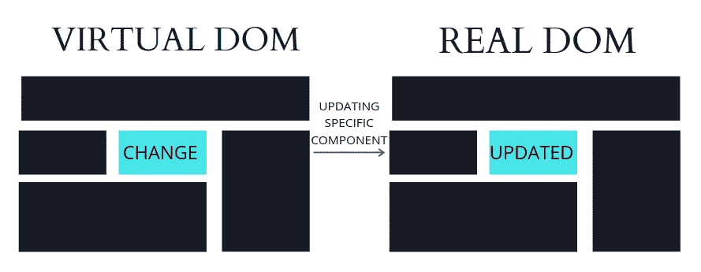

# 开始编码前的反应指南

> 原文：<https://medium.com/geekculture/a-guide-to-react-before-you-start-coding-f19baaac78e2?source=collection_archive---------17----------------------->

学生在开始 web 开发时经常会面临许多挑战和困惑。在开始任何新的语言或框架时，我们面临的主要问题是信息的丰富性。许多学生被大量可用的教程弄糊涂了，试图通过直接跳到编码部分而忽略目标技术的基础来超越自己。出于这个原因，我决定写这篇文章作为对 React 的介绍。我希望理解这个库背后的主要思想将有助于您掌握 ReactJS 的基础知识。

如其文档中所定义的，

> " *React 是一个* ***JavaScript 库*** *用于构建用户界面。"*

让我们开始解码这个定义。

# JavaScript 库:

JavaScript 是最流行和最广泛使用的高级编程语言之一。使用普通 JavaScript(没有任何库)被开发人员称为普通 JavaScript。它需要大量的工作。您将不得不为相同的功能重写代码。JavaScript 库使开发人员能够为常用函数预先编写代码，并开发他们自己的函数。React 就是这样一个 JavaScript 库。另一个常用的库是 jQuerry。

# 组件:用户界面的构建块

组件是 JavaScript 应用程序的构建块。组件仅仅是用户界面的一部分。每一个用户界面都是由一些小界面组成的，这些小界面通常是相互独立的，并且是孤立的，通常在本质上是可重用的。

以 twitter 界面为例，我们可以看到这是 Twitter 主页的三个主要组成部分。

Image 1 — Independent components

现在，这三个单独的组件被组合在一起，以便为用户构建一个完整的用户界面。在 ReactJS 中开发用户界面时，我们创建了这样的组件。许多组件变得可重用，比如图片中的 tweet 组件。

组件之间的另一个重要关系是父/子关系

Image 2 — Parent/Child components

在图 2 中，子部分可以理解为主侧栏组件的子组件。这是组件及其结构背后的一般思想。完整的应用程序由这样的组件构成，并且可以理解为组件树，其中不同的组件被链接在一起并且以这样的方式结合，以彼此交互并形成综合的用户界面

除了组件的可重用性，React 还提供了两个重要特性:

1- JavaScript 扩展— JSX

2-虚拟 DOM —文档对象模型

在我们深入研究他们的解释之前，知道 HTML 是每个网页的关键是很重要的。当在浏览器中打开一个 HTML 文档时，浏览器会创建一个 DOM 来决定如何排列和显示该文档。稍后我们将详细了解 DOM。现在让我们从 JSX 开始。

# JSX

JSX ( JavaScript 扩展)是一个 React 扩展，用于修改 DOM，这实质上意味着改变用户界面和用户界面的外观。JSX 是一个语法扩展，用于实现 UI 更改或 DOM 更新。同样可以通过直接改变 HTML 来实现，但 JSX 提供了增强的性能，因为它与 React 提供的第二个功能，虚拟 DOM 一起工作。让我们详细了解一下 DOM 和虚拟 DOM，以便更好地理解。

# 什么是 DOM？

要了解 DOM(文档对象模型)，首先你需要了解我们在浏览器中看到的每个网页都是一个文档，它也可以显示为 HTML。无论我们如何看待它(在浏览器或 HTML 中)，它都是同一个文档。现在 DOM 是一个用来改变文档的编程接口。它将 JavaScript 等编程语言与网页或文档连接起来，这样我们就可以改变这一点。我们通常称之为更改 DOM 或更新 DOM。这基本上意味着大部分时间都要实时更改用户界面。简而言之，DOM 是 web 页面的面向对象表示，可以用 JavaScript 等脚本语言进行修改。

# 真实与虚拟世界

React 创建原始 DOM 的虚拟图像。因此，对于每个 DOM 对象或组件，都有一个对应的“虚拟 DOM 对象”虚拟 DOM 就像是原始 DOM 的轻量级副本。如图 3 所示。虚拟 DOM 包含真实 DOM 中每个组件或对象的副本，但是它缺乏直接改变 UI 的能力。那么 react 是如何更新 UI 的呢？

Image 3 — Real vs Virtual DOM

# 正在更新虚拟 DOM

每当检测到变化时，首先更新虚拟 DOM。变化可能是由于一些事件，例如用户点击了一些东西或放大了一张照片。因此，无论何时呈现 JSX 文档，它都会更新与特定代码部分链接的虚拟 DOM 组件。因此，如果我们呈现一个父组件，所有子组件也将在虚拟 DOM 中更新，而不是在真实 DOM 中更新，这增强了性能。因为我们正在更新虚拟 DOM，所以不影响真实 DOM 意味着不更新真实 DOM 或用户界面中的所有组件。

Image 4 — Updating Virtual DOM

在图 4 中，仅一个组件发生了变化，但是虚拟 DOM 的所有组件都更新了。因为它们没有被显示，所以它对内存的影响最小。

# 更新真实的 DOM 和 UI

一旦事件完成，React 将比较虚拟和真实 DOM，并只更新真实 DOM 中的特定组件，而不是所有子组件。这就像首先在纸上更新整个设计，然后在地面上只实施特定的更改。

Image 5 — Updating Real DOM

现在在图 5 中，一旦更改完成，react 将比较两个 DOM 并只更新其值在虚拟 DOM 中被更改的那个组件。这种方法节省了机器的内存，以便在每次更改时更新所有组件，并且只更新所需的对象。这就是 JSX 和虚拟 DOM 增强 react 性能的方式。

# 结论

考虑到所有这些，一开始跳到编码可能听起来很有趣，但从长远来看，这可能会花费开发人员大量的时间和资源。最好花些时间理解这个理论，这样就可以避免将来的许多麻烦。我希望这篇文章能帮助你掌握 React 的基础知识。快乐编码。