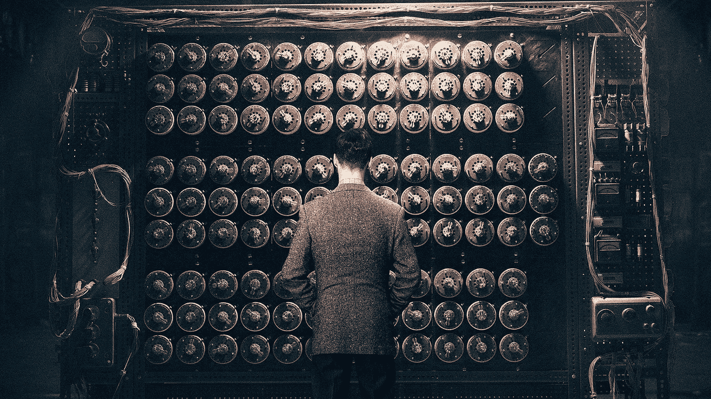
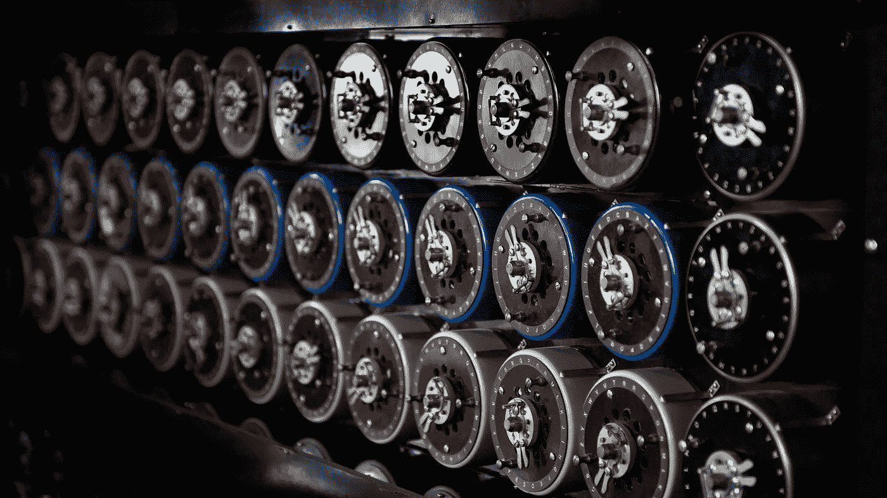
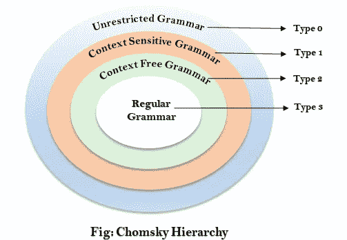
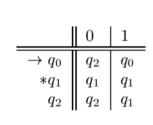
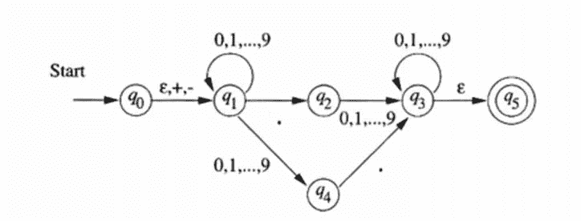

# 计算理论指南—第一部分

> 原文：<https://medium.com/geekculture/a-guide-to-theory-of-computation-part-1-85be9260abfe?source=collection_archive---------15----------------------->

**计算理论**是计算机科学核心中最重要的一部分。我们周围的计算机执行计算更像是一个数学模型，以系统的方式解决问题。每一台实现逻辑的机器都会应用计算理论，因此学习计算理论会让我们深入了解计算机硬件和软件的局限性。

计算理论(TOC)关注的是使用算法解决问题以及如何有效地解决问题。TOC 的本质是帮助开发数学和逻辑模型，有效地运行到停止点。TOC 分为三个主要分支，

> 1)自动机理论和形式语言
> 
> 2)可计算性理论
> 
> 3)计算复杂性理论

# 自动机理论

自动机理论是计算理论的三个主要分支之一，是对抽象计算设备或“机器”的研究。自动机对于研究可判定性和难解性的计算极限是必不可少的。

## 自动机理论基础

在真正深入研究自动机理论之前，我们需要熟悉一下我们在讨论自动机理论时经常使用的术语。

**字母表** —它是一个有限的非空符号集，用**σ表示。**

> 例如，σ= { 0，1}是二进制字母表

**字符串** —它是从字母表中选择的有限符号序列。

> 例如，100100 是二进制字母表中的一个字符串，σ= { 0，1}，。

**语言** —这是一组字符串，全部选自σ*，其中σ是一个特定的字母表。

> 比如所有由 n 个 0 后跟 n 个 1 组成的字符串的语言，对于某些 n **≥** 0: {ε，01，0011，000111，…)。

**问题** —自动机理论中的一个问题是决定一个给定的字符串是否是某种特定语言的成员。

> 例如，给定σ*中的一个字符串 w，判断 w 是否在语言 L 中。

在形式语言理论、计算机科学和语言学中，**乔姆斯基层次结构**是形式语法类的包容层次结构。诺姆·乔姆斯基在 1956 年描述了这种语法层次，它让我们对自动机理论中的语言和语法有了深入的了解。

# 类型 3 |常规语言

乔姆斯基层次中的第三类语言是常规语言。正则语言是那些被**有限自动机**接受的语言。有限自动机有一组状态，它的“控制”从一个状态移动到另一个状态以响应外部输入。

一个有限自动机可以是**确定性的**(不能同时处于一个以上的状态)或者**非确定性的**(可以同时处于几个状态)。

## 确定性有限自动机

确定性有限自动机或简称 DFA 是有限自动机的两种类型之一。我们可以将 DFA 正式定义为一种*、【五元组】符号、*

> A = (Q，∑，δ，q0，F)

> DFA 包括:

1.  Q :状态的有限集合
2.  **∑** :输入符号的有限集
3.  **q0** :初始状态
4.  **F** :最终状态
5.  **δ** :过渡函数

转移函数δ将状态和输入符号作为自变量，然后返回状态。 **δ(q，a) = p，**其中 q 和 p 为状态，a 为输入符号。

**例如，让我们假设一个 DFA 只接受所有 0 和 1 的字符串**

> 五元组描述

> A = ( {q0，q1，q2}，{0，1}，δ，{q0}，{q1})

在上述五元组描述中，q0、q1 和 q2 是状态集 Q，0 和 1 是输入符号集 **∑、** q0 是开始状态，q1 是最终或接受状态。

> 推移图

> 过渡表

为了使 DFA 语言的符号更加精确，我们定义了一个**扩展转移函数**，它描述了当我们从任何状态开始并遵循任何输入序列时会发生什么。
扩展转移函数是取状态 *q* 和字符串 *w* 并返回状态 *p* 的函数。

> δ*( q，w ) = p

借助于扩展的转移函数，我们可以用公式来描述由 DFA 描述的语言。**DFA**的语言可以描述为，

> L(A) = {w | δ*( q0，w)在 F 中

DFA 的语言是将开始状态 *q0* 变为接受状态之一的字符串 *w* 的集合。DFA 接受的语言被称为常规语言。

## 非确定有限自动机

与 DFA 不同，非确定有限自动机或 NFA 可以同时处于几个状态，即 NFA 的转移函数返回 **0，1 或多个**状态。NFA 也接受像 DFA 这样的正则语言，但是它比 DFA 更容易设计。DFA 也比 NFA 有更多的州。

如果我们观察 NFA 的正式五元组描述，除了转移函数的输出之外，它类似于 DFA。

> A = (Q，∑，δ，q0，F)，其中δ返回 0，1 或 1 以上的状态。

一个 NFA 接受一个字符串 *w* 如果有可能做出下一个状态的任何选择序列，同时读取字符 *w，*并从起始状态进入任何接受状态。NFA 接受的语言 *L(A)* 定义为:

> L(A) = { w | δ*( q0，w ) ∩ F ≠ ∅ }

也就是说，L(A)是∑*中的字符串集合 w，使得δ*( q0，w)包含至少一个接受状态。

> NFA 和 DFA 的等价性

> **“每一种能被 NFA 描述的语言也能被 DFA 描述”**

要了解如何将 NFA 转换为 DFA，请查看这篇 javatpoint 文章。

 [## 从 NFA 到 DFA-Java point 的自动机转换

### 在本节中，我们将讨论将 NFA 转换为其等效 DFA 的方法。在 NFA，当一个特定的输入是…

www.javatpoint.com](https://www.javatpoint.com/automata-conversion-from-nfa-to-dfa) 

## 具有ε-转移的有限自动机

当一个 NFA 接受ε(一个空字符串)作为输入并自发地改变其状态时，它就是一个具有ε-跃迁的 **NFA。本质上，NFA 被允许在没有接收输入的情况下自发地进行转换。**

例如，让我们以一个 **ε-NFA** 为例，它接受由可选的+或-符号、一串数字、一个小数点和另一串数字组成的十进制数。

ε-NFA

ε-NFA 的形式定义与 NFA 的定义相同，只是我们必须包括关于ε上跃迁的信息。

> A = (Q，∑，δ，q0，F)，其中δ取自变量，(1)状态，Q 和(2)∑∨{ε}的一个成员。

涉及到ε-NFA 的一个重要概念是状态的**ε-闭包。**它是通过跟踪 Q 中标记为ε的所有离开状态 Q 的转换而获得的。

要查看如何找到ε-闭包，请访问下面的页面。

 [## TOC 中的 epsilon 闭包是什么？

### ε闭包(P)是在ε-跃迁上从状态 P 可达的一组状态。ε闭包是作为…

www.tutorialspoint.com](https://www.tutorialspoint.com/what-is-an-epsilon-closure-in-toc) 

> "一种语言 L 被ε-NFA 接受当且仅当 L 被某些 DFA 接受. "

# 正则表达式和语言

正则表达式是一种定义符号的类型语言。它们是描述软件组件的 NFA 符号的用户友好的替代品。正则表达式本质上是代数描述。

正则表达式相对于自动机的优势在于，它提供了一种声明性的方式来表达我们想要接受的字符串。

对正则表达式执行的操作包括，

1.  **联合–**
    两种常规语言——L1 语和 L2 语——的联合，用 L1 ∪ L2 表示，也是常规的，它表示 L1 和/或 L2 的字符串集。
2.  **串联—**
    两种常规语言 L1 语和 L2 语的串联，用 L1 表示。L2 也是正则的，它表示通过将 L1 的任意字符串与 L2 的任意字符串连接而形成的字符串集。
3.  **克莱尼闭包**–
    如果 L1 是一种正则语言，那么克莱尼闭包即 L1 的 L1*也是正则的，它表示那些字符串的集合，这些字符串是通过从 L1 获取多个字符串并连接这些字符串而形成的，并且同一个字符串可以重复任意次。

> 如果语言，L = L(A)对于一些 DFA，A 那么有一个正则表达式 R，这样 L = L(R)。

我们可以看到正则语言可以用 DFA、NFA、ε-NFA 和正则表达式来描述。不是每种语言都是正则语言，我们可以使用**抽取引理**来识别给定的语言是否正则。

## 正则语言的泵引理

让 L 成为一种常规语言。那么存在一个常数 n，使得对于 L 中的每个字符串 w，使得|w| ≥ n，我们可以将 w 分成三个字符串，w = xyz 使得，

1.  y ≠ ε
2.  |xy| ≤ n
3.  对于所有 k ≥ 0，xyᵏz 也在 l 中

要查看更多关于抽引理的例子，请访问下面的页面。

 [## 正则文法的抽取引理

### 让 L 成为一种常规语言。那么存在一个常数“c ”,使得对于 L | w |≥c 中的每一个字符串 w，我们可以断开…

www.tutorialspoint.com](https://www.tutorialspoint.com/automata_theory/pumping_lemma_for_regular_grammar.htm) 

## 正则语言的闭包性质

1.  两种正则语言的联合是正则的。
2.  两种正则语言的交集是正则的。
3.  正则语言的补码是正则的。
4.  两种规则语言的差异是有规律的。
5.  两种正则语言的串联是正则的。
6.  正则语言的克莱尼闭包(*)是正则的。

我们将在本文的下一部分讨论上下文无关语言、下推自动机、图灵机、np 完全性等。

# 参考

**自动机理论、语言和计算简介** **(第二版)**作者约翰·E·霍普克罗夫特、拉吉夫·莫特瓦尼和杰弗里·d·乌尔曼。

https://www . section . io/engineering-education/introduction-to-theory-of-computing/#:~:text = The % 20 essence % 20 of % 20 The % 20 theory，computer % 20 hardware % 20 and % 20 software % 20 limits。