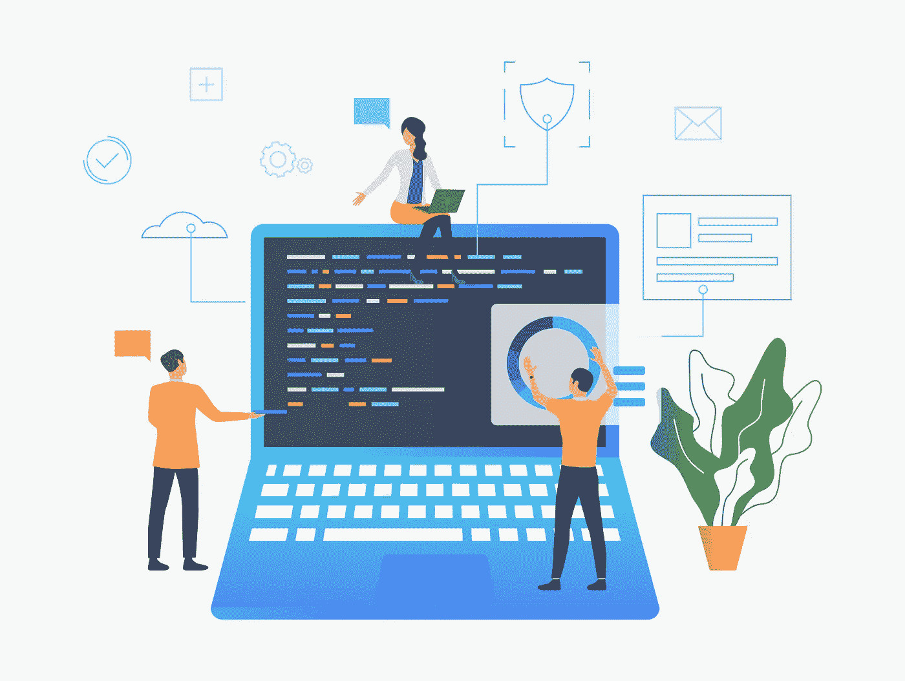
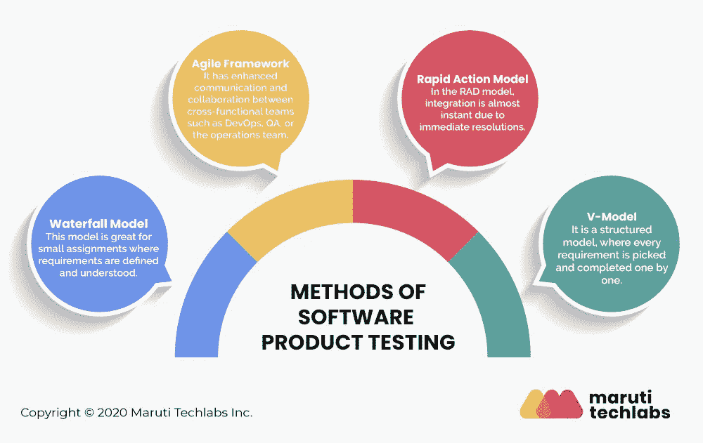

# 顶级软件测试模型指南:哪个是最好的？

> 原文：<https://medium.com/geekculture/a-guide-to-top-software-testing-models-which-one-is-the-best-ce4b19e75070?source=collection_archive---------20----------------------->

软件测试模型是用来证明被测应用程序符合客户期望的策略和测试框架。软件测试是软件开发周期中必不可少的一部分，使得质量分析不可忽视。

在软件开发过程中使用了各种模型，每个模型都有其优点和缺点。本文将着眼于每个软件测试模型及其优缺点。最后，哪种软件测试模型是最好的？我们也会报道的。所以让我们开始吧。

# 5 种类型的软件测试模型

**1。瀑布模型**

在瀑布软件测试模型中，一组测试人员一个接一个地进行小步骤。软件开发依次经历不同的阶段。首先，项目被写下来并被计划。前一阶段完成后，下一阶段才开始。瀑布模型由以下几个阶段组成:

*   需求分析
*   分析阶段
*   软件设计
*   编程实现
*   测试
*   维护

***优点:***

*   它易于实施和维持。
*   对需求和系统进行严格调查的初始阶段有助于在开发阶段的后期节省时间。
*   对资源的需求是最小的。
*   测试在每个阶段完成后进行。

***缺点:***

*   不可能更改或改变要求。
*   一旦进入下一阶段，就不能再进行更改。
*   前一阶段完成后，下一阶段才开始。

**2。验证和确认方法(V-模型)**

在 V 软件测试模型中，开发和测试执行活动是同时进行的。此外，测试从单元级别开始，并扩展到整个系统。专家称，这种模式优于瀑布模式。

***优点:***

*   它节省了时间，增加了成功的机会。
*   像计划和测试这样的活动是在编码之前完成的，因此使得这个模型易于使用。
*   缺陷通常在早期被发现，并且避免了向下的缺陷流。

***缺点:***

*   这是一个不灵活的模型。
*   早期原型不可用。
*   如果中途有任何变化，你需要更新测试文档。

**3。增量模式**

迭代或增量模型建立在重复的基础上。测试过程由多次迭代组成。每次迭代都会增加产品的价值。这个模型由三个阶段组成:每个周期包括几个部分。

*   设计和开发
*   测试
*   最终实施

增量模型的主要好处是它相对灵活，因此测试团队可以快速地对测试过程进行编辑。点击这里了解更多关于[软件测试改进想法](https://marutitech.com/software-testing-improvement-ideas/?utm_source=medium&utm_medium=content_promotion&utm_campaign=Software_Testing_Models)的信息。

***优点:***

*   确保客户对可交付成果的快速和持续开发感到满意。
*   工作软件可以快速开发。
*   产品可以适应不断变化的需求。
*   测试反馈在每个周期结束时立即可用，使它成为一个灵活的模型。

***缺点:***

*   在周期开始时检查所需的努力可能变得困难。
*   由于频繁的重复会快速占用资源，增加了通信开销。

**4。螺旋模型**

螺旋模型有四个阶段——规划、风险分析、工程和评估。它更强调风险分析。

前一个周期结束后，每个周期开始。在每个过程的最后一个阶段之后，团队会得到即时的测试反馈，因此产品的质量仍然很高。每一个上层螺旋都建立在底层螺旋之上。这个模型允许测试团队快速发现错误并纠正它们。

***优点:***

*   重视风险分析。
*   它适用于复杂的大型系统。
*   以后可以添加额外的功能。
*   软件是在周期的早期生产的。

***缺点:***

*   这是一个昂贵的模型，需要高度专业化的风险分析专家。
*   它在简单的项目上不太管用。

**5。极限编程**

极限编程是一种基于短开发周期的软件测试模型。一个项目被分成简单的任务。来自客户的反馈被合并，开发人员继续下一个任务。在极限编程中，开发人员通常成对工作。

***优点:***

*   心中有初步软件设计的客户可以使用极限编程。
*   持续测试和持续集成次要版本可确保软件代码交付至高级版本。

***缺点:***

*   软件开发团队和客户之间的会议增加了时间表。

# 你应该选择哪种软件模式？

当谈到软件测试模型时，一刀切的方法是行不通的。每种测试技术和模型都是为特定的目的而设计的，并且有其相对的优点和缺点。特定模型的选择取决于许多因素，例如项目的性质、客户要求、项目进度和项目的特定需求。

螺旋模型对于大型项目来说是一个很好的选择，这些项目可能需要在开发过程中添加特性。相反，瀑布模型最适合于需求精确的小型项目，并且不需要快速改变它们。迭代和增量方法与大型项目相匹配，在大型项目中，软件的初始版本是在早期生成的，便于客户评估和反馈。

拥有一个专门的专业团队是至关重要的，他们可以在每次迭代中推动项目向前发展。明智的做法是从项目一开始就让你的 [QA 参与到产品开发生命周期](https://marutitech.com/software-testing-in-product-development/?utm_source=medium&utm_medium=content_promotion&utm_campaign=Software_Testing_Models)中。我们马鲁蒂技术实验室部署了一流的 IT 工程师来完成您可能有的任何项目。我们全面的 [QA 服务](https://marutitech.com/quality-engineering-services/?utm_source=medium&utm_medium=content_promotion&utm_campaign=Software_Testing_Models)可以根据您独特的项目和兴趣指导您选择最佳的软件测试模型。[联系我们](https://marutitech.com/contact-us/?utm_source=medium&utm_medium=content_promotion&utm_campaign=Software_Testing_Models)，我们将竭诚为您服务！