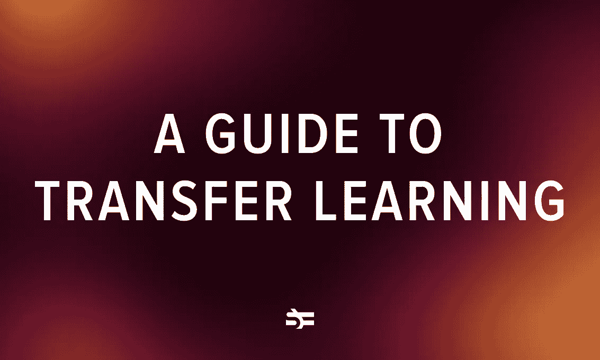

# 迁移学习指南

> 原文：<https://medium.com/geekculture/a-guide-to-transfer-learning-3a3c53656dca?source=collection_archive---------4----------------------->

训练机器学习模型需要大量数据，这些数据并不总是可用的。这就是迁移学习发挥作用的地方，因为它利用了以前训练的模型。在这篇博文中，我们将探讨迁移学习的定义、方法、好处和应用。我们还将讨论各种迁移学习策略，并提供一系列预训练模型。

# **什么是转移** …