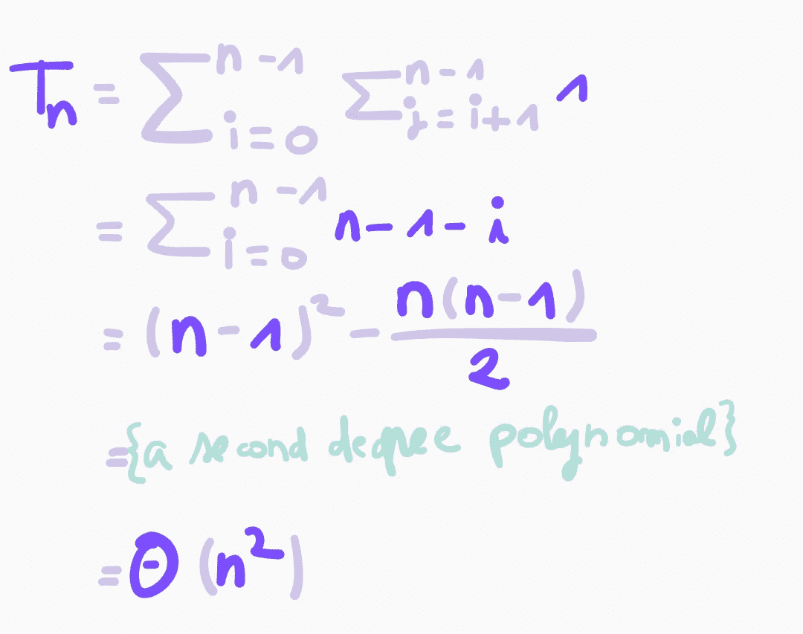
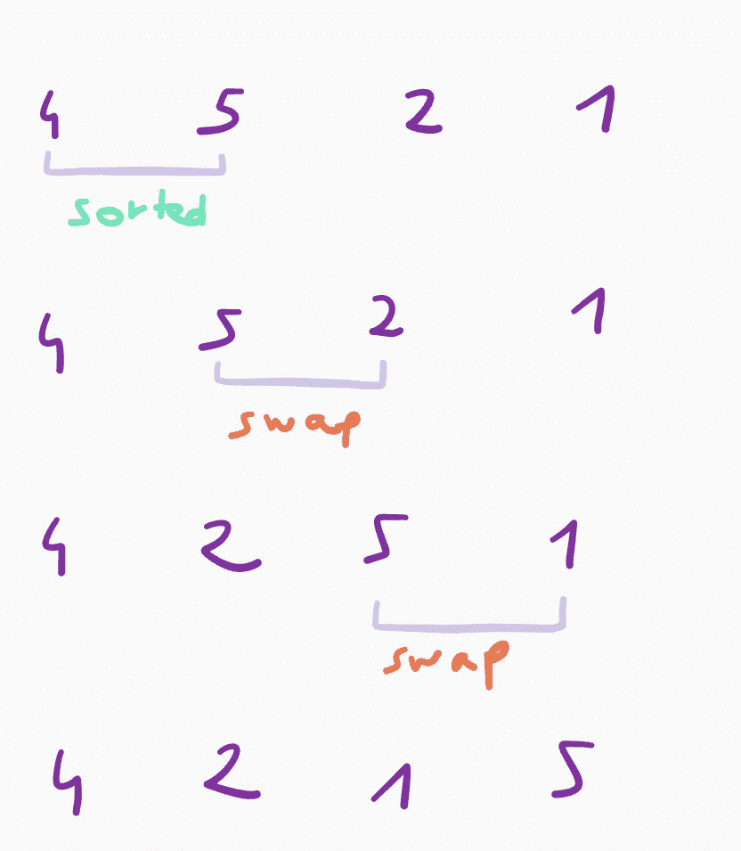
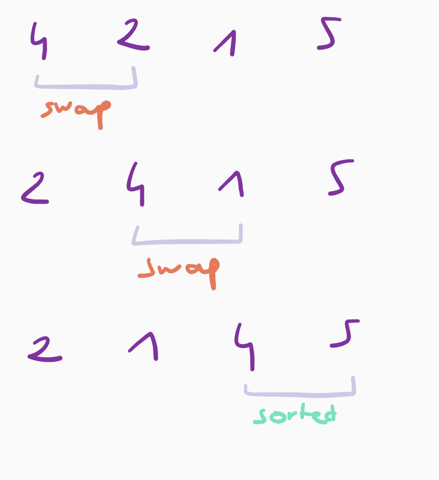
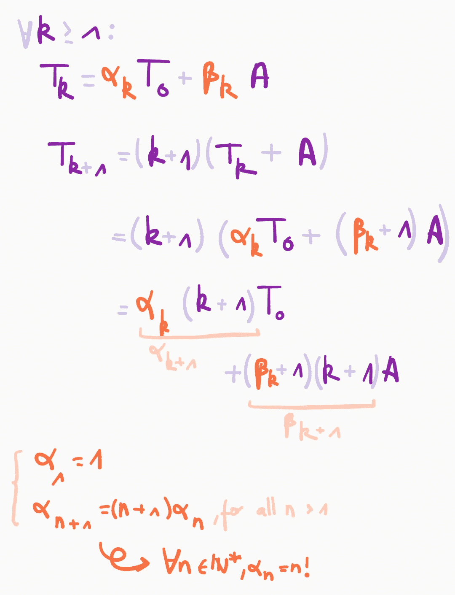
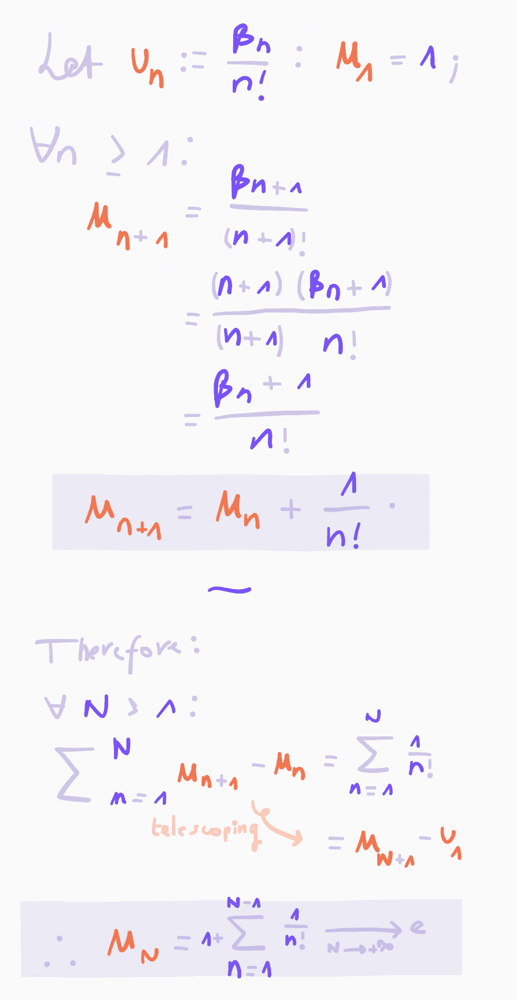
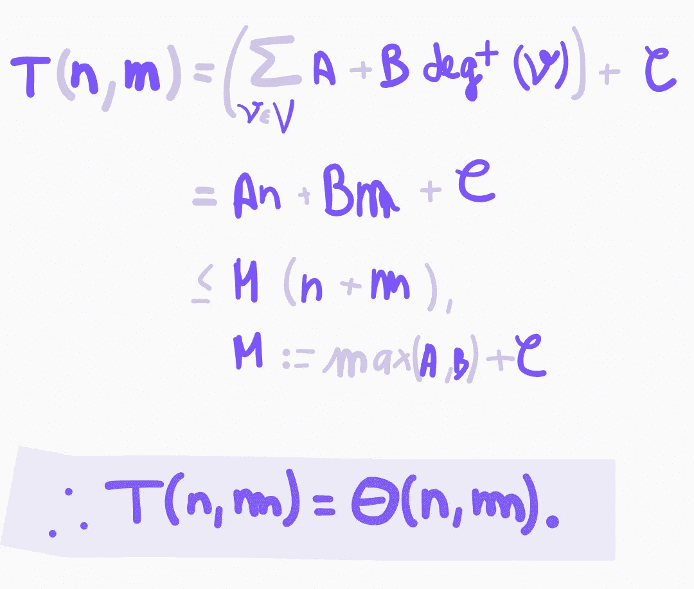
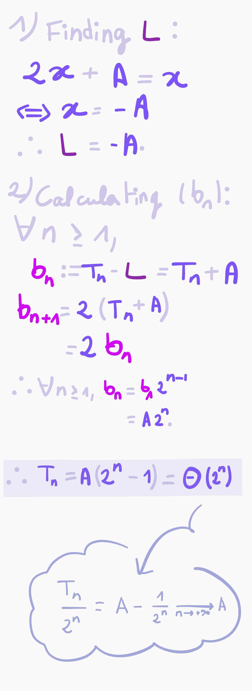

# 算法分析的手写介绍(1/2):渐近符号和例子

> 原文：<https://medium.com/geekculture/a-handwritten-introduction-to-analysis-of-algorithms-1-2-asymptotic-notations-and-examples-57324f6becb5?source=collection_archive---------43----------------------->

这篇文章是关于渐近符号以及我们如何使用它们来估计算法的运行时复杂度。我们将从介绍这些符号背后的数学概念开始。本文的其余部分将给出许多分析一些著名算法的例子，以涵盖广泛的技术

我将用用 Go 和 F#编写的代码来说明本文，这取决于哪种范式更适合每种函数。我会尽量让程序不那么地道，所以没有这些语言的经验不应该成为理解这篇文章的问题。

**先决条件:**

*真实序列:*界限，极限；

*级数:*我们举一个例子，需要级数收敛的基础知识，但这不是理解文章其余部分所必需的；

*编程:*理解以过程风格(对于大多数例子)或函数风格(对于一个例子)编写的简单程序。

# 内容

这个系列有两部分。这是第一个，包含以下部分:

1.  大 O，Omega 和 Theta:动机，形式定义，性质；
2.  具有多项式时间复杂性的算法；
3.  具有阶乘时间复杂性的算法；
4.  多变量复杂性；
5.  指数时间复杂度算法。

第二部分着重分析分治算法和缓冲分析。

# 大 O，ω和θ:动机，定义，性质

## 动机和定义

*渐近表示法是一种估算算法在输入任意大的输入时执行的操作数量的方法，不考虑依赖于编程语言或机器的方面。*

在这句话中，*输入大小*的概念取决于我们使用的数据结构。它可以指存储在一个数组或一个列表中的元素的数量，一个图中节点和边的数量，或者一个数的位数。

我们用映射 t 来表示算法的运行时复杂性:ℕ⟶ℕ；⟼。在接下来的段落中，字母 T、U、V 和 W 指的是这些功能。

> 定义(大 O): *我们说 T =* 𝑂 *(U)当存在* A *，* B *∈ ℕ使得 T ≤* B *U 对于所有大于* A *的自然数。*

这个定义的英文解释是:当 T 的增长速度不比 U 快很多时，T 就是 U 的一个大 O

比如 1 = O(log *n* )和 log *n* = O( *n* )(对于所有*a*0)。

第二个有用的符号是大ω:

> 定义(大ω，knuth):*t =ω(u)当存在* A *，* B *∈ ℕ*使得 T ≥* B *U 对于所有大于* A 的自然数

有一个重要的性质我们会经常用作替代定义: *T 是 U 的大 O 等价于 U 是 T 的大ω*。

证明:假设 T = O(U): T ≤ *B* U 对于某些 *B* ∈ *、*和 T ≤ ( *B* +1) U 也是如此。由于 *B* + 1 ≠ 0，我们可以设置 *C* := 1/( *B* + 1)。所以两边乘以 *C* 得到 U ≥ *C* T:我们证明了 U =ω(T)。反过来，假设 U =ω(T)。然后存在 *C* ∈ ℕ*使得 U ≥ *C* T .由于 *C* ≠ 0，我们设置 *B* = 1/ *C* 两边乘以 *B* : T ≤ *B* U 所以 T = O(U)。

就像大 O 一样，这个定义的英文对等词是 *T 是 U 的一个大ω，当 T 的增长不比 U 慢很多的时候。*

最后，大θ是最重要的符号。这是我们在分析算法时经常使用的方法，因为它给出了算法复杂性的最准确的概念。

> *当 T = O(U)，T =ω(U)时，T =θ(U)。*

当 T 和 U 以大致相同的速度增长时，我们可以说 T 是 U 的大θ*。*

注意你有时候会看到∈而不是等号写某函数是另一个的大 O/大ω/大θ:T∈O(U)。虽然等号更常见，但它可能会引起误解，因为我们可以从等式中得到一些渐近符号所不能满足的性质。特别是 T *=* O(V)和 U *=* O(V)并不暗示 T*=*U*；*T*+*O(V)*=*U*+*O(V)也没有。

## 性能

在这一部分，我们将证明渐近运算的一些性质，这些性质在实践中是很有用的。

*   如果 *T 是 U* 的大θ，那么 *aT 对于任意正实数 *a* 都是 U* 的大θ。这是我们想要忽略依赖于语言和机器的计算元素的事实的正式转录:如果你想要计算一个程序的运行时复杂性，该程序计算一个具有 n 个元素的数组的所有元素的和，你不重视通过元素的索引检索元素的值和修改存储和的变量所需的内部步骤；重要的是它执行一些基本操作 *n* 次。

这个性质的一个重要结果是，我们可以写出某个序列是对数的大θ，而不考虑对数的底。

*   如果比率 U/V 向一个有限的非零极限 l 收敛，那么 V/U 向 1/l 收敛。因此，U/V 和 V/U 都是有界的:U = O(V)和 V = O(U)所以 U =θ(V)。
*   如果 t 是一个次数为 *d* 的多项式序列，那么 t(*n*)=θ(*nᵈ*):低次项可以忽略不计。这个性质来自上面的一个，因为比率 T( *n* )/ *nᵈ* 趋向于 T( *n* )中的 *nᵈ* 的系数。
*   如果 T =θ(U)且 V =θ(W ),则 TV =θ(UW)

*证明:(i)* :假设 T = O(U)，V = O(W)。那么就存在 *A* ， *B* 这样 T ≤ *B* U 和 V ≤ *C* W .既然大家都是非负的，那么 TV ≤ ( *BC* ) UW: TV = O(UW)。由于 T，V，U 和 W 是任意的，由 *(i)* , (U = O(T)和 W = O(V))隐含着 UW = O(TV)。因此，如果 T =θ(U)，V =θ(W)，则 TV =θ(UW)。

很可能你经常遇到大 O 符号，即使大θ更合适。这是对符号的一种滥用。例如，如果我们只使用大 O 符号，线性复杂度将意味着阶乘复杂度。

在进入算法分析的例子之前，最后一个注意事项:渐近分析是一个有用的工具，但是你必须记住，两个算法具有相同的渐近复杂度并不意味着在某些情况下其中一个不能比另一个更有效。有时，乘法常数和低阶项确实很重要。例如，当输入足够小时，内置排序函数通常使用二次复杂度的算法，因为它们可能比线性复杂度的算法更有效(θ(*n*log*n*))，即使 *n* log *n* 比 *n* 增长得更慢。另一个例子:快速排序具有最坏情况的二次复杂度，而合并排序具有线性复杂度，但是快速排序通常被认为比合并排序更有效(部分是因为最坏情况很少发生，并且可以在快速排序中避免)。

# 多项式复杂性

多项式复杂度的算法可能是最容易分析的。在这一部分中，我们将使用我们以前看到的性质来分析几个具有多项式复杂性的算法的例子。

## 数组的最大值

下面实现的函数 *max* 是我们能想到的最简单的算法之一。

它有一个 for 循环，执行子程序(第 8 行到第 10 行)n 次*。子程序的执行不依赖于任何参数:它有一个恒定的运行时间。因此，如果 *C* 表示子程序内部执行的步数， *A* 表示循环前后执行的步数，`max`具有复杂度 T(*n*)*= Cn+A =*θ(*n*)。*

## *选择排序*

*现在让我们来看一个稍微复杂一点的例子:*选择排序。*我们将使用下面的实现:*

*对于数组中的每个元素， *array* [ *i* ]，`selectionSort`用 *j* ≥ *i* 找到最小元素 *array* [ *j* ，并将 *array* [ *i* 与 *array* [ *j* 互换，使*array**

**与 max 函数的主要区别在于，在外循环 *(i)* 的每次迭代中执行的子程序的复杂性取决于迭代变量。有一种依赖于求和公式的方法，它能够计算第 12 到 15 行被执行的次数。我们可以这样做:**

****

**原来选择排序具有二次复杂度(大 Theta 的 *n* )，尽管是*好的*一个；在某种意义上，它仍然比内部循环运行 *n* 次的算法更有效，即使它们具有相同的渐近复杂度。**

**注意，在分析中我们没有计算第 7、8 和 19 行:我们只计算了内部循环中子程序运行的次数。这是因为在分析排序算法的运行时复杂性时，我们通常只计算数组元素之间的比较。但是这并没有改变渐近符号。**

**当然，这种分析是假设在内循环的每次迭代中执行的子程序以恒定的时间运行。特别是，它要求数组索引花费恒定的时间。它适用于数组(分配在连续的内存块上)，但不适用于链表。如果索引的复杂度是由某个函数 U 的大θ的任意函数给定的，那么我们将使用前面看到的乘积公式来说明算法的复杂度是*T*(*n*)=*n***θ(*U*(*n*)=θ(*n*)*θ(***

***我们可以看到，选择排序的复杂度与数组的元素无关。因此，我们不需要讨论最佳情况、一般情况和最坏情况的复杂性。例如，传递给 selection sort 的数组是否已经排序并不重要:在这两种情况下，它将执行相同数量的操作。***

***然而，这并不总是正确的:一些算法在某些输入上比在其他输入上运行得更快，即使它们具有相同的大小。排序算法经常会出现这种情况，我们将在下面的例子中看到。在这些情况下，我们分析最坏情况和最好情况的复杂性。另一个相关的度量是平均情况的复杂性，但是它依赖于更高级和更复杂的概念，我们不会在本文中讨论这些概念。***

## ***冒泡排序***

***冒泡排序是另一种(相当低效的)排序算法。它遍历数组几次，检查每对相邻的元素，并在需要时交换它们。它在遍历数组后终止，没有交换任何对，这表明数组已经排序。下面是我们将使用的版本(摘自维基百科关于冒泡排序的文章:[https://en.wikipedia.org/wiki/Bubble_sort](https://en.wikipedia.org/wiki/Bubble_sort#Optimizing_bubble_sort)):***

***这个分析比前两个更复杂，因为内部循环运行的次数取决于数组的元素，而不仅仅取决于数组的大小。***

***最简单的部分是最佳情况的复杂性。首先，外部循环必须至少运行一次，因为`swapped`最初被设置为`true`。因此，内部循环将至少运行一次，并且从第 10 行到第 13 行的子例程(我们假设花费恒定的时间)将被执行 *n* 次。所以冒泡排序的运行时复杂度不可能比线性好。如果数组已经排序，第 10 行的条件将永远不会满足，`swapped`将保持为假:外部循环不会运行超过一次，并将在 *n* 比较后停止。这证明了最好的运行时复杂度是一个大的θ值 *n.****

**我们现在需要找到内循环中子程序运行次数的上限。如果我们证明存在一个达到这个上限的输入 *A* ，我们就找到了冒泡排序的最坏情况运行时间复杂度。**

**为了给我们一些关于运行冒泡排序时会发生什么的直觉，我们将举一个输入的例子，比如长度为`n = 4`的数组`A = [4; 5; 2; 1]`。下面是外部循环在输入 A 上运行时发生的情况:**

****

**First iteration of the outer loop.**

****

**Second iteration of the outer loop.**

**一个合理的假设是，在外部循环的第 *i* 次迭代之后，数组的最后 *i* 个元素位于正确的位置，也就是说，位于与最终排序后的数组相同的位置。给定一个长度为 *n* ( *n* ≠ 0)的零索引数组 *A* ，我们要证明以下性质:**

> ***Pn(j):外循环第* j *次执行后，对于所有索引*I*≥*n*-*j*(最后一个* j *索引)，* A *[* i *大于等于索引* k *<* i *处的所有元素；***

**对于任意自然数 *j* 使得 1 ≤ *j* ≤ *n.***

**我们将从一个引理开始:**

> ***对于所有指数 A 和 b，* A *[* a *..* b *表示由从索引* a *到* b *的* A *元素组成的数组。***
> 
> ***设* j *为 0 和* n *-1 之间的自然数。设* M *为*A*【0】的最大元素..* j *。* ***运行内循环后，M 至少在数组*** 中的索引 j 处。**
> 
> ***证明大纲:设* k *为* M *的索引。由于* M *属于 A【0..* j *】，则 0 ≤ k ≤ j ≤* n *-1。因此，内部循环的变量* i *将在某个点取值* k *。如果* k *=* j *，那么第 10 行(* `*if array[i] >= array[i + 1]*` *)的求值无关紧要:* M *已经在大于等于* j *的索引处，我们就大功告成了。如果* k *<* j *，则第 10 行评估为真(因为 M 大于或等于索引 l ≤ j 处的所有元素)并且* M *移动到位置* k *+ 1。我们重复完全相同的过程，直到* M *到达索引* j *为止。***

**我们现在可以通过归纳法证明我们的初始性质:**

*   **基本情况:我们应用引理 *j = n* -1。 *M* 是整个数组的最大值。第一次执行内部循环后， *M* 位于索引 *n* -1。这证明 Pn(1)是真的。**
*   **归纳:设 *j* 为 0 到 n-1 之间的自然数，使得 Pn( *j* )为真，即在第 *j* 次执行外循环后，从索引 *n* - *j* on 开始的每个元素都大于或等于更低索引的所有元素。我们想要证明 Pn(j + 1)是真的，也就是说，来自索引*n*-*j*-*1*on 的元素都在最终排序数组中的相同位置。
    设 *M* 为 A[0]的最大值..*n*-*j*-*1*。根据引理，如果我们再运行一次外循环(总共 *j* +1)，那么在某个时刻， *M* 将被移动到索引 *n-j-1* 。由归纳假设，*M*≤*A*[*n*-*j*-1】。因此， *M* 不会进一步移动(除非 M = A[n-j-1]，但这对最终数组中的排序没有影响)。因此，位于索引 *n* - *j* -1 的元件处于正确的位置。由于索引 *n* - *j* -1 之后的元素没有移动(它们已经被排序了，因为它们都比紧跟着它们的元素大)，我们已经证明 Pn( *j* +1)为真。**

**该属性的重要结果是，最多在执行完第 *n* 个外部循环后，对数组进行排序。如果我们传递一个没有重复元素的按相反顺序排序的数组*A*(*A*[*I*]≦*A*[*j*)对于所有不同的索引 *i* ， *j* )就是这种情况。因此，冒泡排序具有二次最坏情况复杂性。**

# **阶乘复杂性**

**具有阶乘复杂性的算法的最自然的例子是寻找一个数组的所有排列，因为正好存在 *n* ！n 个元素的排列。**

## **堆算法**

**堆的算法是一种有效的算法，以产生所有排列的数组。有几种优化它的变体，但是我们将集中在这个简单的实现上:**

**这个算法和它的“奇偶校验技巧”有点反直觉，我们不会细说它为什么是正确的。它需要两个参数，第一个参数必须是第一次调用函数时数组的长度。**

****分析****

**第 12 行到第 16 行的子程序在常数时间内运行，所以当 *k* ≥ 1 时，函数的复杂度为 T(k)=*k*(T(*k*-1)+*A*)，其中 *A* 为第 12 行到第 16 行的复杂度。我们可以证明存在两个序列α和β，使得对于所有的 *k* ≥ 1，T(*k*)=α(*k*)T(0)+β(*k*)*A*，且α( *k* ) = *k* ！(见下图)。**

****

**找到β的通项更难，但这无关紧要。我们会想办法证明 T(*n*)=θ(*n*)！)而没有给它一个明确的值。**

**我们将证明β( *n* )/ *n* ！向一个有限的极限收敛。为此，我们为比率β( *n* )/ *n* )找到一个通项！并利用阶乘的倒数级数收敛的事实:**

****

**所以 T( *n* )/ *n* ！= T(0)+A(β(*n*)/*n*！)，它向一个非零的有限极限收敛:T(*n*)=θ(*n*！).**

# **多变量复杂性和 BFS**

**到目前为止，我们只处理过大小可以用单个变量表示的数据结构。然而，存在其复杂性取决于几个参数的算法。这是涉及图的情况，因为图的大小取决于边的数量和顶点的数量。**

**我们可以像以前一样对多变量函数使用渐近符号。例如，如果 *f* 将ℕ映射到ℕ，那么 *f* ( *m* ，*n*)= o(*m*+*n*)当存在阈值 *A* 和常数因子 *B* 使得 f( *m* ， *n*)<*B*(*m*+*n*)对于所有的 *m* 和 *n* 都大于 a .当一个算法的复杂度是一个 *m* + *n* 的大θ时，我们说它在线性时间内运行【T82**

## **广度优先搜索**

**广度优先搜索(BFS)是一种算法，在一些图中找到从给定顶点到另一个顶点的最短路径。**

**在本节的其余部分， *n* 将表示输入图中顶点的数量，而 *m* 将表示边的数量。**

**我们将使用下面的实现。**

**BFS 首先将除起始点以外的所有顶点标记为未访问，这需要θ(*n*)时间。**

**然后我们维护一个顶点队列。只要队列不为空，我们就弹出下一个顶点，检查它是否不是我们的目标，并将其所有未访问的邻居排队。**

**在最好的情况下，`start = destination`并且唯一重要的操作是构造`visited`列表。所以这个函数的复杂度是θ(n)。然而，我们通常认为最好的复杂度是θ(1)，因为第一个子程序(我们初始化`visited`的地方)并不是算法的一部分。**

**每个顶点不能被访问超过一次，所以外部循环(第 14 行)不会运行超过 *n* 次。第 15 行到第 24 行花费的时间不变。对于每个顶点 *v* ，第 26 到 35 行正好运行 deg⁺( *v* 次，其中 deg⁺( *v* 是 *v* 的出度，即尾部为 *v* 的边的数量。我们介绍的选择排序方法的一个简单应用证明了 BFS 不会比线性差，如下图所示。算法以θ(*n*)步运行的输入的一个例子是具有顶点 0、1 和 2 以及带有`start = 0`和`destination = 2`的边(0，1)和(1，2)的图。**

****

**Analysis of BFS. A, B and C are positive natural numbers. V is the set of vertices in the input graph. deg⁺(*v*) is the number of edges whose tail is *v*.**

**注意，我们关于图是有向图的假设不失一般性。我们可以用度来代替出度，因为度和公式会将乘法因子 2 加到 *m* 上，这在大 Theta 符号中会消失。**

# **指数复杂性**

**[灵感来自杰夫·埃里克森的*算法*，第 1.3 节:汉诺塔]**

**本文的最后一部分是关于指数复杂度的算法。这是指复杂度为θ(*rⁿ*)的算法，其中 *r* 是严格大于 1 的数。这些算法的运行速度在渐近上比多项式算法慢，比指数算法快: *n* = O( *rⁿ* )和 *rⁿ* = O( *n* ！)(对于任何一个*r*1 和 *a* ∈ ℝ).**

## **河内塔**

**我们将通过分析解决汉诺塔难题的算法来说明这一部分。它由几个圆盘和三个杆组成，因此所有圆盘的直径都不同，如果圆盘 A 大于圆盘 B，则圆盘 A 不能位于圆盘 B 上方。所有圆盘都堆叠在杆上，多个圆盘不能同时从一个杆移动到另一个杆。**

**我们将用链表来模拟杆，用不同的整数来模拟盘。我们将使用以下用 F#实现的算法:**

**我们首先创建一个函数，它可以将磁盘从一个杆移动到另一个杆，确保我们不会尝试执行非法移动。主功能`solveHanoi`负责将`original`顶部的`n`圆盘移动到`goal`。**

**这不是本文的目标，但我会尝试给你一些直觉，为什么这个算法是正确的。当 n ≥ 2 时，我们要将第`n`个圆盘从原杆移动到目标。为此，我们首先移动最先出现的`n` -1 个磁盘(我们如何做并不重要——递归调用将为我们找到一个解决方案),这样第`n`个磁盘就在它的杆的顶部结束。然后我们可以将它移动到目标。我们只剩下留在临时杆上的`n` -1 个小圆盘:临时杆成为原点，我们递归。当我们只需要移动一个磁盘时，我们可以直接这样做:这是我们的基本情况。**

****分析****

**对于 *n* ≥ 1，设 T( *n* )表示算法的复杂度，其中 *n* 表示磁盘数。如果 n ≥ 2 那么 T(n) = 2T(n-1) + A，其中 A 是`moveDisk`的复杂度，需要常数时间。基本情况是 T(1) = A，这是一个由 a(*n*+1)=*α*a(*n*)+*β*形式的递推关系定义的序列，其中 *α* 、 *β* 为实数。有一个简单的方法可以找到它的通项，如下图所示。在于引入由 b(*n*)= a(*n*)-*l*定义的序列 *b* ，其中 *L* 是递归函数*x*⟼*α**x*+*β*的唯一不动点。b( *n* )恰好是一个几何数列，它的通项很容易计算。**

****

**`solveHanoi`的复杂度为 t(*n*)=*a*(2*ⁿ*-1)，其中 *A* 为走一步棋所用的时间。**

**在 1883 年发表的最初的问题陈述中，这个难题由 64 个圆盘组成，牧师们把它们从一个钻石针转移到另一个。如果他们每秒移动一个磁盘，他们将需要执行 1.8*10 次⁹移动，连续工作超过 50 亿个世纪。实际证明 2 *ⁿ* -1 是我们解决这个谜题可以执行的最少步骤数，其中 *n* 是圆盘的个数。**

# **结论**

**我们已经探索了几种用于分析算法复杂性的方法。即使没有通用的技术来帮助发现任何一种函数的复杂性，它们也涵盖了广泛的情况。现在你应该对渐近符号有了很好的理解，并且能够将我们看到的方法应用到各种算法中。**

**下一部分将继续我们学习的最后一个例子，并重点讨论如何分析分治算法。它们通常有一个包含对数的复杂度，对数以递减的速率增加。对数算法优于线性算法，线性算法( *n* log *n* )优于二次算法。我们还会提到摊销分析。**

**欢迎在评论中指出错误或值得澄清的部分！**

**🐙**