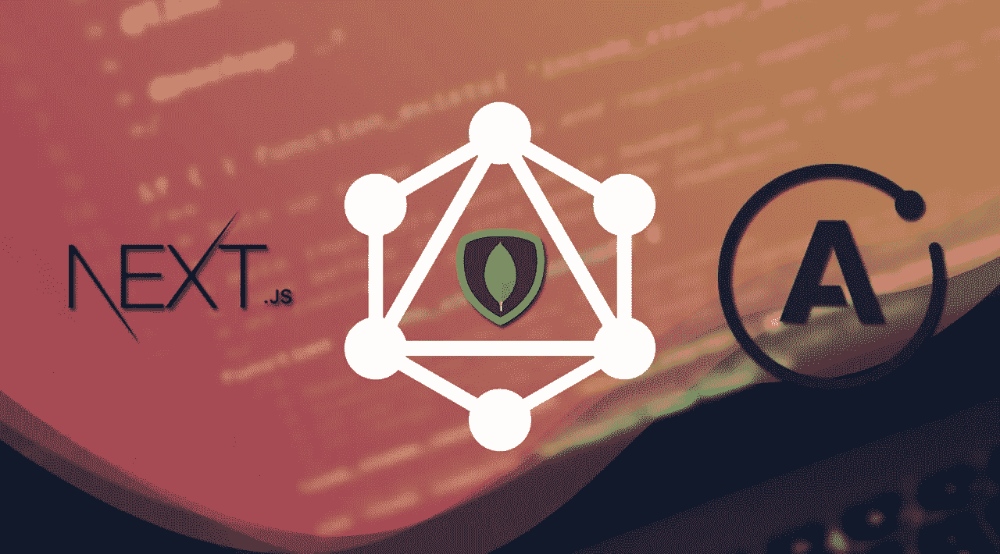
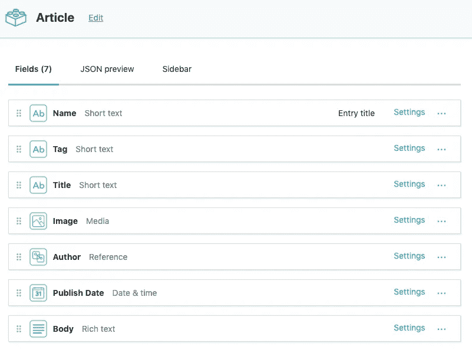
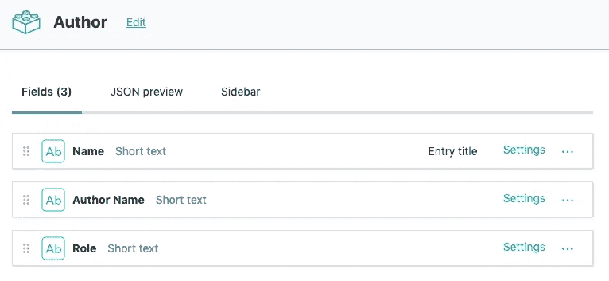
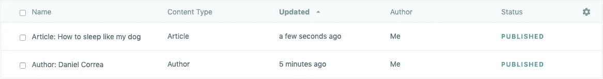
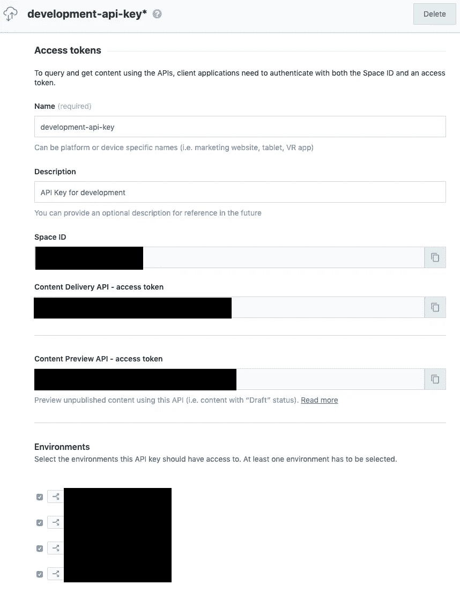
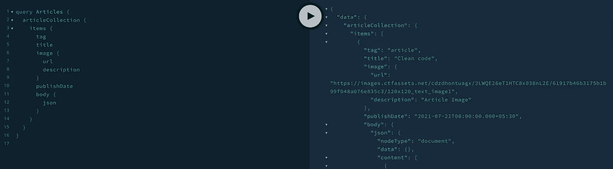

# 一个无头的 CMS 应用:Next.js、Apollo 和 Contentful with GraphQL

> 原文：<https://medium.com/geekculture/a-headless-cms-app-next-js-apollo-and-contentful-with-graphql-e7fcf8ca3d34?source=collection_archive---------15----------------------->



# 介绍

本文将介绍一个带有 Apollo 和 Contentful + GraphQL 项目的 Next.js 的基本设置。

在进入主题之前，应该明确以下概念:

*   [心满意足](https://www.contentful.com/):一个无头 CMS。
*   [Next.js](https://nextjs.org/) : SSR React.js 框架。
*   [GraphQL](https://graphql.org/) :现代 web 应用的查询语言。
*   [Apollo](https://www.apollographql.com/) : GraphQL 实现提供一个数据层。

# 示例项目的源代码

[](https://github.com/KrupaDesai22/article-collection) [## GitHub-krupadesa 22/article-collection:这是一个示例项目，展示了一种…

### 这是一个展示集成 Next、Apollo 和 Contentful 的方法的示例项目。该项目是下一个应用程序…

github.com](https://github.com/KrupaDesai22/article-collection) 

# 给我看看代码！

说够了，让我们把手弄脏吧！

这个示例项目的目标是拥有一个 web 应用程序，它使用 GraphQL 和 Apollo 从 Contentful 获取文章信息，然后使用 Next 呈现它。

# 数据层

为了构建所需的数据架构，我们需要在我们的内容空间中定义以下内容类型:

*   文章
    |- *名称*【独特，必选】{短文本}
    |- *标签*【独特，必选】{短文本，kebabcase}
    |- *标题*【必选】{短文本}
    |- *图片*{媒体—独特类型的图片}
    |- *作者*【必选】{一个参考—独特类型的作者}【T22
*   作者
    |- *姓名*【唯一，必选】{短文}
    |- *作者姓名*【必选】{短文}
    |- *角色*【必选】{短文}

让我们在我们的内容空间中创建这些内容类型，并添加一些数据(不要忘记发布:P):



我们现在可以创建和检索一些内容。让我们创造它！。



有了内容集，我们可以使用[graph QL Playground for Chrome](https://chrome.google.com/webstore/detail/graphql-playground-for-ch/kjhjcgclphafojaeeickcokfbhlegecd?hl=en)得到它(它良好的扩展将帮助你测试你的数据)。

Contentful 使用以下 URL 提供了一个 GraphQL API:

```
https://graphql.contentful.com/content/v1/spaces/<space-id>/environments/<environment-id>
```

现在，您认为我可以从哪里找到空间 id、环境 id、内容交付访问令牌，请遵循以下步骤:

步骤 1:转到设置->API 密钥

第二步:点击添加 API 键->给出所有信息。在那里可以找到 pace-id、environment-id、内容交付访问令牌。



我们需要在 HTTP 头中设置内容交付 API 访问令牌。

```
{
 “Authorization”: “Bearer <access-token>”
}
```

要了解更多，你可以查看所有 GraphQL 内容 API 文档[这里](https://www.contentful.com/developers/docs/references/graphql/)。

现在，我们可以执行简单的查询，比如:

```
query Articles {
  articleCollection {
    items {
      tag
      title
      image {
        url
        description
      }
      publishDate
      body {
        json
      }
    }
  }
}
```

让我们看看在[graph QL Playground for Chrome](https://chrome.google.com/webstore/detail/graphql-playground-for-ch/kjhjcgclphafojaeeickcokfbhlegecd?hl=en)上的回应:(确保你在之前添加了标题显示)



我们得到了所有文章的数据！。这很酷，我们现在有了一个内容架构。

现在让我们看看如何将这些数据转化为强大的组件。

# 下一个应用

创建 Next.js 应用程序:

```
npx create-next-app article-collectioncd article-collection
```

安装项目所需的不同依赖项:

```
yarn add apollo-cache-inmemory apollo-client apollo-link-http graphql graphql-tag
```

运行以下命令并检查您的 Next.js 项目是否在以下 URL 上工作:(在此之前，请检查 repo 无法在此添加所有内容。只是添加高级步骤)

```
yarn dev [http://localhost:3000](http://localhost:3000/)
```

让我们的下一个项目启动并运行，我们可以继续我们的阿波罗客户端配置。

# 阿波罗客户端

首先，创造。 *env.local* 文件。你可以用下面的命令创建这个文件。

```
touch .*env.local*
```

让我们定义我们的访问令牌、空间 id 和环境 id。 *env.local* 文件

```
CONTENTFUL_ACCESS_TOKEN=<access-token>CONTENTFUL_ENVIRONMENT=<environment-id>CONTENTFUL_SPACE_ID=<space-id>
```

我们可以在环境面板中找到这些信息(正如我们之前看到的截图)。在那里，我们还可以使用创建的 API 键检查我们想要授予访问权限的环境。

通过使用令牌和 id 设置本地环境文件，现在让我们创建 apollo 客户机实例:

*   创建一个 *next.config.js* 文件:

```
touch next.config.js
```

将令牌添加到*publiruntimeconfig:*

```
module.exports = {  publicRuntimeConfig: {    CONTENTFUL_ACCESS_TOKEN: process.env.CONTENTFUL_ACCESS_TOKEN,    CONTENTFUL_ENVIRONMENT: process.env.CONTENTFUL_ENVIRONMENT,    CONTENTFUL_SPACE_ID: process.env.CONTENTFUL_SPACE_ID,  },};
```

*   在名为 *apollo* 的文件夹中创建 *client.js* 文件:

```
mkdir apollo touch client.js
```

现在让我们配置一个 [Apollo 客户端实例](https://www.apollographql.com/docs/react/api/apollo-client/)。如果您想了解该实例如何工作及其参数，请查看[文档](https://www.apollographql.com/docs/react/api/apollo-client/)。

一个基本实例需要:

= >一个 [HttpLink](https://www.apollographql.com/docs/link/) 实例，我们在其中定义凭证和 API 端点。apollo 推荐的一个
=>in memory cache 实例。

我们的 Apollo 客户端实例将如下所示:

```
const SPACE = publicRuntimeConfig.CONTENTFUL_SPACE_ID;
const ENVIRONMENT = publicRuntimeConfig.CONTENTFUL_ENVIRONMENT;
const TOKEN = publicRuntimeConfig.CONTENTFUL_ACCESS_TOKEN;
const CONTENTFUL_URL = `https://graphql.contentful.com/content/v1/spaces/${SPACE}/environments/${ENVIRONMENT}`;const httpLink = createHttpLink({
  fetch,
  uri: CONTENTFUL_URL,
  headers: {
    authorization: `Bearer ${TOKEN}`, 
    'Content-Language': 'en-us',
   },
});const client = new ApolloClient({
  link: httpLink,
  cache: new InMemoryCache().restore(initialState || {}),
});
```

为了让所有组件都能访问我们的 Apollo 客户机，我们需要一个提供者。

实现此提供程序的两种方法:

= >在 [Next.js 示例](https://github.com/zeit/next.js/tree/canary/examples/with-apollo)之后:我们必须实现一个定制的 HOC，作为应用程序的提供者。
= >对阿波罗库使用 [Next:它有一个我们将作为提供者使用的特设的实现，公开了一些可配置的选项。](https://github.com/lfades/next-with-apollo)

我采用了第二种方法。它节省了一些时间，我们不想重新发明轮子。让我们安装它吧:

```
yarn add next-with-apollo
```

使用 Next with Apollo 提供的 HOC 返回 Apollo 客户机实例:

```
export default withApollo(
  ({ initialState }) =>
    new ApolloClient({
      link: httpLink,
      cache: new InMemoryCache().restore(initialState || {}),
    }),
);
```

*   使用 *_app.js* 文件中的提供者:

一切就绪后，我们现在可以开始查询了！。

# 查询！

我们有两个查询选项:

= >使用来自 Apollo 的[*use query*](https://www.apollographql.com/docs/react/api/react-hooks/#usequery)*钩子:当 React 组件是客户端时，我们必须执行查询。该选项不适用于 SSR，因为它是一个 React 挂钩。使用我们的 Apollo 客户端实例:该实例在 SSR 期间是可用的！，我们可以用它在服务器上查询。*

*因为我们的目标是在 SSR 中填充页面，所以我们必须使用 Apollo 客户机实例进行查询。我们在[*getInitialProps*](https://nextjs.org/docs/api-reference/data-fetching/getInitialProps)*生命周期方法中这样做。**

**让我们做一个查询来获取文章列表，并将其呈现在我们的主页上。**

**创建一个名为“查询*”*的文件夹，并在其中创建一个 *articles.js* 文件:**

```
**mkdir queriescd queriestouch articles.js**
```

**在 *articles.js* 文件中添加查询。为此，我们使用 [graphql-tag](https://github.com/apollographql/graphql-tag) :**

```
**import gql from 'graphql-tag';export const GET_ALL_ARTICLES = gql`
  query Articles {
    articleCollection {
      items {
        tag
        title
        image {
          url
          description
        }
        author {
          authorName
          role
        }
        publishDate
      }
    }
  }
`;**
```

**然后，通过使用 *getInitialProps* 导入并使用 *pages/index.js* 文件中的查询:**

```
**Home.getInitialProps = async ({ apolloClient }) => {
  const { data, loading, error } = await apolloClient.query({
    query: GET_ALL_ARTICLES,
  });return {
    data,
    loading,
    error,
  };
};**
```

**添加一些花哨的样式，看看结果！**

# **查询单个实例！**

**添加一个获取和呈现单个文章实例的页面。**

**使用[下一个动态路由](https://nextjs.org/docs/routing/dynamic-routes)方法来获得文章实例的动态 URL。在你的*页面*目录下创建一个名为*文章*的文件夹。然后创建一个名为*【标签】. js.* 的文件**

```
**cd pagesmkdir article cd article touch [tag].js**
```

**添加将呈现文章详细信息页面的组件文章。您可以随意构建组件。**

**在*查询/articles.js* 中添加 *GET_ARTICLE* 查询。该查询将有一个标识每篇文章的*标签*参数；记住，**是唯一字段**。
它还有一个*限制:1 个*参数。**

```
**export const GET_ARTICLE = gql`
  query Article($tag: String!) {
    articleCollection(where: { tag: $tag }, limit: 1) {
      items {
        tag
        title
        image {
          url
          description
        }
        author {
          authorName
          role
        }
        publishDate
        body {
          json
        }
      }
    }
  }
`;**
```

**我们现在能够在 *[tag]中使用查询。js* 文件。**

***标签*值在 *ctx* 对象中可用，紧挨着我们的 Apollo 客户端实例。从*查询*对象中获取，如下所示:**

```
**const {
 apolloClient,
 query: { tag },
} = ctx;**
```

**此时， *getInitialProps* 方法应该如下所示:**

```
**Article.getInitialProps = async ctx => {
  const {
    apolloClient,
    query: { tag },
  } = ctx;const { data, loading, error } = await apolloClient.query({
    query: GET_ARTICLE,
    variables: {
      tag,
    },
  });return {
    data,
    loading,
    error,
  };
};**
```

**添加一些样式，看看结果！**

**如果您想知道如何将 RTE 数据解析成 React 组件，您可以在这里找到答案:[富文本 React Render](https://github.com/contentful/rich-text/tree/master/packages/rich-text-react-renderer) 。**

**就是这样。你做到了。！！！！！！！！！！:)**

# ***资源:***

> **[心满意足](https://www.contentful.com/):一个无头 CMS。**
> 
> **[Next.js](https://nextjs.org/) : SSR React.js 框架。**
> 
> **GraphQL :现代 web 应用的查询语言。**
> 
> **[Apollo](https://www.apollographql.com/) : GraphQL 实现提供一个数据层。**
> 
> **[富文本 React 渲染](https://github.com/contentful/rich-text/tree/master/packages/rich-text-react-renderer)**

**快乐学习！呆在家里，注意安全。**