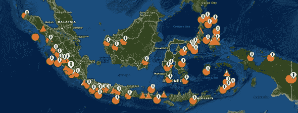
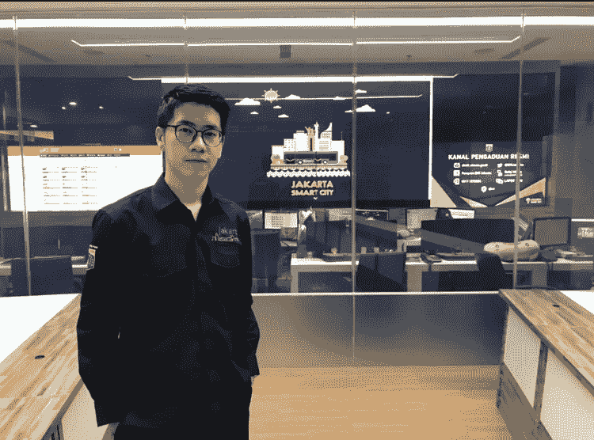
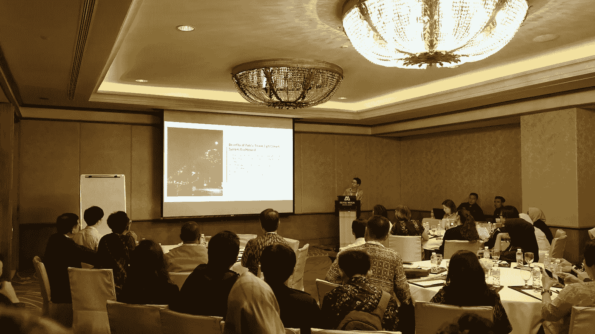

# 从地质学到数据分析的旅程“开始”

> 原文：<https://medium.com/geekculture/a-journey-from-geology-to-data-analytics-the-beginning-aa3a5f4093e9?source=collection_archive---------26----------------------->

如果新冠肺炎·疫情有什么可以教给我们的话，那就是生活在自己的象牙塔里的不可行性。新冠肺炎推动我们探索新的专业领域。

将新冠肺炎视为一个复杂的问题，它跨越了学科界限；需要整合来自不同领域的知识、技能和见解。学科上的精通仍然是必要的，但这还不够。——[国大主席陈英才](https://www.timeshighereducation.com/blog/its-time-rebuild-university-foundation-interdisciplinarity)

这句引语深深打动了我。因为反思这句话，我看到我们的生活——至少是我的生活——也是如此。

# 我选择研究领域的背景

**从很小的时候起，我就一直对政治人物和政治事件感兴趣，并多少被他们的言行所感动。然而，那时候，这还不足以迫使我实现从政的目标。我没有选择政治相关的专业作为我的学士学位。相反，我对科学和户外活动的兴趣决定了我选择地质工程作为学士学位，这是自然科学和野外活动的稳定而完美的结合。**

A glimpse of my kind of outdoor activity: Enjoying the beautiful view from the top of Mount Lawu, between East and Central Java, Indonesia (the man behind the camera: myself)

在多年的地质学研究中，我学到了很多东西，但有一个发现让我特别着迷:作为一个群岛国家，印度尼西亚有许多岛屿，有趣的是，它还位于三大构造板块的交汇处，支持山脉和火山的形成，位于印度尼西亚的大部分地区在*火环*内。这使得印度尼西亚因其美丽的自然风光而成为理想的旅游目的地。当我知道所有这些有趣的事实时，我是在大学里。

Realtime condition [https://magma.vsi.esdm.go.id/](https://magma.vsi.esdm.go.id/) of volcanoes and earthquake in Indonesia

# 如果地质学如此有趣，那我为什么要转行呢？

所有这一切都始于一个震惊全国的全国性事件，与我的大学入学巧合:佐科维-阿霍克当选为 2012-2017 年雅加达省长和副省长。他们表现出善意、良好的态度和在各自领域的高度能力；更重要的是，尽管雅加达市民的背景相当特殊，但他们为他们带来了实实在在的变化。他们不同的背景不仅没有阻碍他们的政治抱负，而且他们在其他领域的不同知识也有助于他们的政治成功。**这两位候选人重新激发了我对政府和公共部门的兴趣；如果有机会，我渴望直接为政府做贡献。**

**随着过去 10-15 年大数据分析领域的大肆宣传，我的决心进一步增强，这让我进一步追随我在该领域的兴趣。** 政府也开始认识到数据分析的重要性——数据收集、利用和可视化，当政府试图制定基于数据的政策时，这些数据可用于为包括政府在内的组织提供见解。一个明显的证据是雅加达智能城市的建立。政府对数据分析重要性的认可为我在政府部门做出贡献提供了机会；今天我在这里，一个政府的数据员。

In front of The Monitoring Room in the Jakarta Smart City Office

# 一路上的挑战

*从地质学家到数据员的转变是一个轻松的过程吗？*

*从地质学过渡到数据分析有哪些挑战？*

过去 3 年，我一直在雅加达政府机构处理政策制定活动，同时在雅加达省政府的背景下学习和深入数据分析领域。

谦虚地说，我努力学习所需的技术技能以及辅助的软技能，因为学习新事物是一个挑战，同时还必须完成办公室的日常任务。为了克服这个挑战，我经常时不时地把我的周末分配给自我发展。

**学习数据分析的必要技能**

从高中起，我就意识到计算机技能可能不适合我。我仍然记得当我不得不学习一段时间的 Turbo Pascal 时，我投入了这么多时间，但都无济于事。当时我曾试图编写一些代码，但由于频繁的标点符号错误，我的代码很少能正常工作。

当你作为一名业务分析师加入 JSC 时，你必须从零开始一点一点地学习所有的技术技能(包括结构化查询语言、编程语言和分析工具)——当然是在朋友和同事的帮助下。所有这些都不容易，但很重要。

令人欣慰的是，这场斗争导致了官方网站 [corona.jakarta.go.id](https://corona.jakarta.go.id/en) 上仪表盘和数据可视化的产生，这应该有利于任何想获得雅加达新冠肺炎最新信息的人。除网站外，与疫情相关的 [*基于数据的政策*](https://apic.id/jurnal/index.php/jsc/article/view/76) 和 [*基于证据的文化*](https://iopscience.iop.org/article/10.1088/1757-899X/1077/1/012034) 两篇学术论文也在国际和国内规模的会议和期刊上发表。

**学习政府官僚如何运作**

当我们谈到政府机构时，许多人会立即想到复杂的官僚机构。正式组织中的官僚主义有其存在的理由，因为它的运作方式受到某些规则的约束。然而，我承认有时太多了。

作为一个相当保守的人，进入这样的工作环境，我比以往任何时候都更清楚地认识到，强大的沟通技巧在政府日常工作中至关重要。在我们的项目中，我们跨部门和机构开展工作。帮助你度过所有环境的不仅仅是技术技能，还有你如何与他人互动和交流。在这种情况下，协作是我们的关键因素。

雅加达智能城市作为雅加达省政府下属的区域商业服务实体，自然是一个让多方合作的创新中心。有机会在雅加达参与创建数字生态系统(如与政府机构、学术机构、创业公司和公司的合作)，让我接触到了各种社会互动。

这些大规模的社交活动塑造了我，以至于这个保守的人现在可以积极参与讨论，甚至可以作为一名演讲者代表雅加达智能城市。此外，我还有一些机会与学术机构的大学生分享数据分析和智能城市相关问题，以拓宽他们的视野。

Being a speaker in the [NVIDIA AI](https://medium.com/u/ab69c39a85e1?source=post_page-----aa3a5f4093e9--------------------------------) (Artificial Intelligence) Event in Singapore

Presenting ‘Using Data in Our City’ in GovInsider Event

# 最后的想法

通过学习多个领域，我现在已经获得了一双眼睛，可以看到超越他们定义的头衔、专业或兴趣的人。我相信，任何来自不同背景的人——就像我这样从事数据分析和政府决策的人——都有能力探索他们能想到的最奇特的领域。

当我们接近尾声时，我想起了一位老人曾经告诉我的另一句话，

> “一个人不是他所想的那样，一个人不是他所说的那样，也不是他所做的那样，而是一个人如何对待他所得到的一切。

我希望我的故事能让那些害怕改变和不确定改变自己道路的人变得坚强。

这是我的故事，你的呢？

# 关于作者

我是雅加达省政府雅加达智能城的一名业务分析师(数据和分析部门)。

我喜欢进行分析，提供见解和建议，帮助决策者做出更好的决策。

在我的空闲时间，我喜欢弹钢琴、跑步和骑自行车。

请通过 [LinkedIn](https://www.linkedin.com/in/hansenwiguna/) 联系汉森