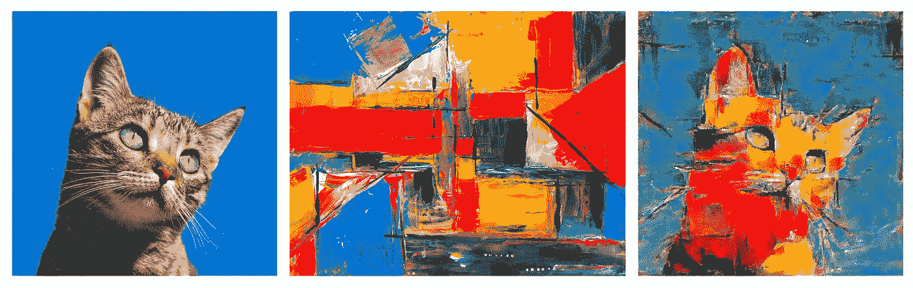
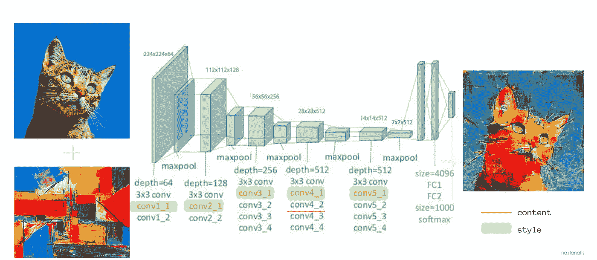
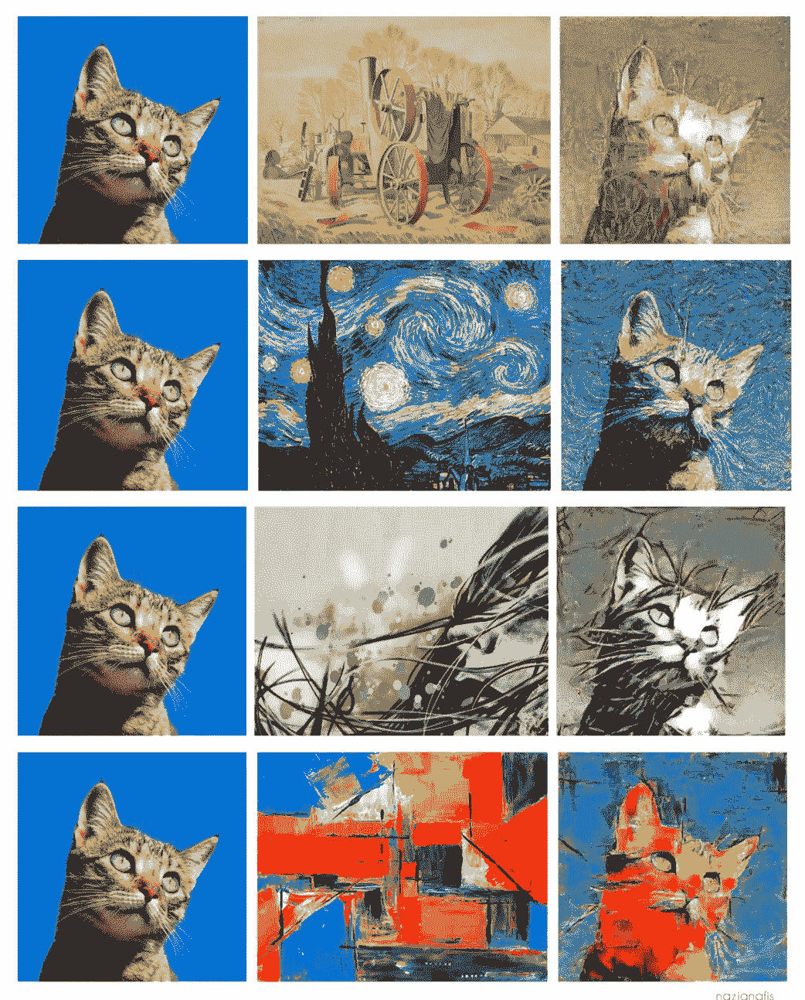

# 神经风格转换的轻量级 PyTorch 实现

> 原文：<https://medium.com/geekculture/a-lightweight-pytorch-implementation-of-neural-style-transfer-86603e5eb551?source=collection_archive---------5----------------------->

## 人工智能过道

## 用卷积神经网络创建您自己的数字艺术，只需简单的五个步骤！



Image by author

艺术超越了人类的存在。我们看到它在整个历史进程中的重要性——从史前时代，通过一些最伟大的河谷文明，君主的堡垒和宫廷，一直到现代技术时代。艺术一直是表达一个人对世界的看法的手段。传奇人物巴勃罗·毕加索曾经说过:

> “我花了四年时间画出拉斐尔的样子，却花了一辈子时间画出一个孩子的样子。”
> 
> *—巴勃罗·毕加索*

大多数艺术都遵循一种模式——一种令人愉悦并刺激我们大脑的模式。下次你看到一幅作品时，试着注意它的颜色主题，或者其中的笔触。你会看到一个模式从中浮现出来。我们人类擅长潜意识地识别这些模式。现在，在神经网络的帮助下，这种识别和人工再造模式的能力也得到发展。

## Gatys 等人的研究论文。

由 *Gatys 等人*撰写的一篇[研究论文](https://arxiv.org/abs/1508.06576)，标题为“艺术风格的神经算法”(最初于 2015 年发布给 ArXiv，随后于 2016 年被 CVPR 会议接受)，是神经风格转移的第一篇论文，至今仍被认为是该领域最具开创性的工作。

在本文中，我们将构建一个轻量级的 PyTorch 实现，如这篇专题论文中所讨论的那样，并学习如何通过五个简单的步骤将流行的艺术风格转移到任何图像上。我们走吧！

# 目录

1.  概观
2.  它是如何工作的？
3.  入门
    –文件描述
    –依赖关系
    –如何在自己的映像上使用 NST？
4.  获得的产量
5.  NST 的应用
6.  承认

# 概观

神经样式转移(NST)是一种获取两个图像(内容图像和样式参考图像)并将它们混合在一起的技术，以便输出看起来像内容图像，但以样式参考图像的样式绘制。

它是**非真实感渲染**更广泛领域内的图像风格化(一种图像处理和操作技术)的一个例子。

# 它是如何工作的？

*   我们利用预先训练的卷积神经网络(在我们的例子中是 VGG19)来提取图像细节。
    –从网络的输入层开始，**最初的几个层激活**代表低级特征，如颜色和纹理(**“样式”**)。
    ——当我们在网络中穿行时，**最后几层**代表更高层次的特征(即**‘内容’**)—例如本例中的猫的眼睛和耳朵。
*   这就是为什么我们从获取内容图像开始，通过 VGG19，并在后期卷积层`(conv4_2)`对网络激活进行采样。
*   然后，我们获取我们的风格图像，通过相同的网络馈送，并在早期到中期卷积层(`conv1_1`、`conv2_1`、`conv3_1`、`conv4_1`、`conv5_1`)对网络激活进行采样。



VGG 19 architecture (image by author)

*   这些激活被编码成一个 **Gram 矩阵表示**，用来表示图像的“风格”。
*   我们的目标是合成一个输出图像，它展示了一个图像的内容和另一个图像的风格。为此，我们计算以下损失:
    –**内容损失**，即内容图像与生成图像**、** –**风格损失**，即从 VGG19、
    –**不同层提取的内容图像和风格图像表示的格拉姆矩阵之间的 L2 距离之和**， 其用于所生成图像的像素之间的空间连续性，从而对其去噪并赋予其视觉连贯性；以及
    –**总损失**，其是所有上述损失的总和乘以它们各自的权重。
*   然后采用迭代**优化技术**(在我们的例子中是 L-BFGS)来逐渐最小化这些损失，以达到期望的结果。

# 入门指南

## ➡ **文件描述**

你可以在 GitHub 上我的[库](https://github.com/nazianafis/Neural-Style-Transfer)里看看神经风格转移的代码。

*   **vgg19.py** 包含 vgg19 模型定义，指定哪个图层用于样式表示，哪个图层用于内容。
*   **NST.py** 是包含最终输出图像的操作、生成、优化、调整和保存等步骤的文件。

```
Neural-Style-Transfer
    ├── data
    |   ├── content-images
    |   ├── style-images
    ├── models/definitions     
    │   ├── **vgg19.py**         # VGG19 model definition
    ├── **NST.py**               # The main python file
    ├── LICENSE
    └── README.md
```

## ➡ **依赖**

*   Python 3.9 以上版本
*   框架:PyTorch
*   库:os、numpy、cv2、matplotlib、torchvision

## ➡ *如何在自己的图像上使用 NST？*

1.  克隆[库](https://github.com/nazianafis/Neural-Style-Transfer)并移动到下载的文件夹:

```
$ git clone https://github.com/nazianafis/Neural-Style-Transfer $ cd Neural-Style-Transfer
```

2.将您的内容/风格图像移动到`data`文件夹中各自的文件夹中。

3.转到`NST.py`，在其中，将`PATH`变量设置为您下载的文件夹。还可以将`CONTENT_IMAGE`、`STYLE_IMAGE`变量设置为您想要的图像

```
$ PATH = <your_path>

$ CONTENT_IMAGE = <your_content_image_name>
$ STYLE_IMAGE = <your_style_image_name>
```

4.跑`NST.py`:

```
$ python NST.py
```

5.就是这样！在`data`内的`output-images`文件夹中找到您生成的图像。

# **获得的输出**

除了本文描述的代码之外，下面的输出图像没有使用任何图像处理程序生成。我鼓励你尝试一下！



📷 — All output images by author

# 实际应用

NST 有许多真实的使用案例。一份非详尽的清单将包括:

*   **照片和视频编辑:**随着风格转移的最新进展，任何人(艺术家或非艺术家)都可以创作自己的艺术杰作，并与世界分享。这一趋势也从著名的终端用户应用程序如 DeepArt 和 Prisma 的兴起中显而易见。
*   **商业艺术:**随着人们对 NFT(不可替代的代币)的强烈好奇心，艺术创作和消费市场的规模只会越来越大。艺术家们现在可以把他们的艺术风格借给/卖给其他人，允许他们的风格的新的和创新的表现与原始的杰作共存。
*   游戏和虚拟现实:元宇宙是最新的流行语。通过增强现实(AR)和虚拟现实(VR)服务的结合，我们正在迅速走向现实世界的数字化，视觉计算(图像和视频处理、计算机图形、计算机视觉)技能被吹捧为在不久的将来需求量很大。

如果你想进入视觉计算领域，现在正是时候！😊

# 承认

这些是我在做这个项目时参考的一些资源。你可能想去看看。

*   PyTorch 关于 NST 的[教程](https://pytorch.org/tutorials/advanced/neural_style_tutorial.html)
*   阿列克萨·戈尔迪奇的[实施](https://github.com/gordicaleksa/pytorch-neural-style-transfer)
*   关于神经风格转移的原始论文由 [*Gatys 等人*](https://www.cv-foundation.org/openaccess/content_cvpr_2016/papers/Gatys_Image_Style_Transfer_CVPR_2016_paper.pdf) 完成。
*   原论文关于 [VGG19](https://arxiv.org/abs/1409.1556)
*   [Wikimedia](https://commons.wikimedia.org/wiki/Category:Images) ， [Unsplash](https://unsplash.com/) 所有的内容和风格图片

在接下来的日子里，我计划通过机器学习来学习更多关于图像生成/处理的知识。我还打算用人工智能创造更多的艺术(我对分形着迷已经有一段时间了！).如果你发现 bugs(🕷)/have 的建议，请随时联系我。

[](https://github.com/nazianafis/Neural-Style-Transfer) [## GitHub-nazianafis/神经类型转移

### 神经风格转移是基于两个输入图像创建一个新图像(称为仿作)的能力…

github.com](https://github.com/nazianafis/Neural-Style-Transfer) 

*我希望这篇文章对你有用。可以在 LinkedIn* *上和我* [*联系，或者关注我的著作*](http://linkedin.com/in/nazianafis) [*这里*](https://nazianafis.medium.com/) *。*

*下次见！*(∫･‿･)ﾉ゛