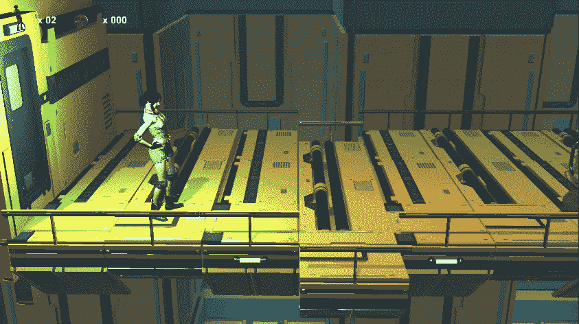
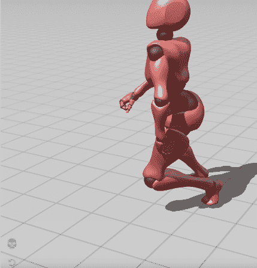
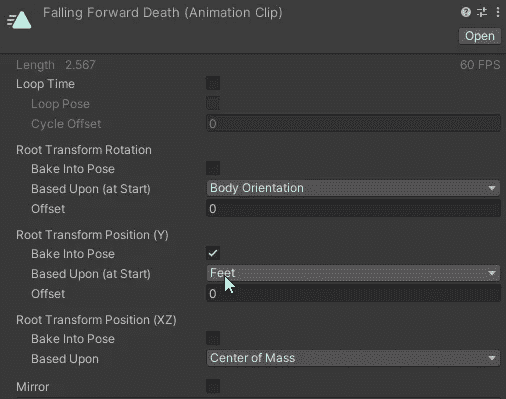
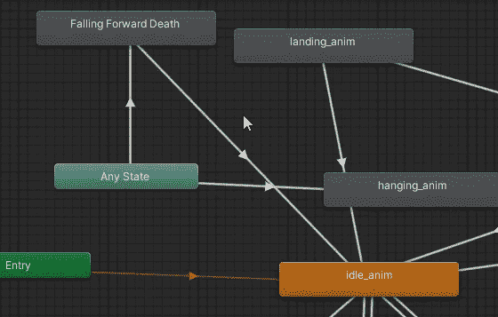
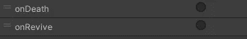
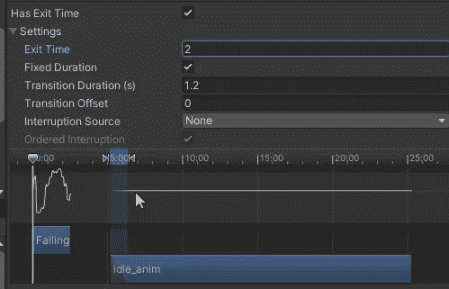
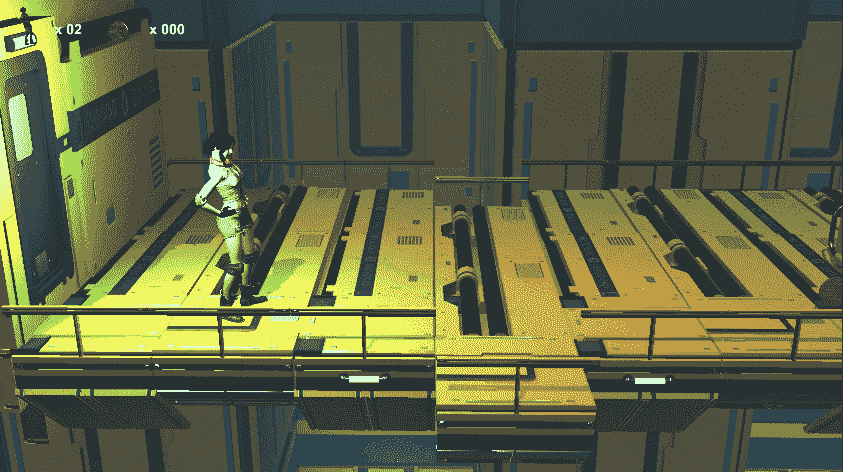

# 一个更酷的死亡和重生程序

> 原文：<https://medium.com/geekculture/a-little-cooler-death-and-respawn-routine-f2ecf0ab6a4a?source=collection_archive---------19----------------------->

**目标**:打造更好的重生特色

在这个教程中，我们将总结一些我们最近学到的东西，以便得到一个比我们用胶囊播放器制作的**更好的重生**。

首先，我从 Mixamo 得到了一个垂死的动画。我沿着 y 轴，用脚作为参照物，在适当的位置烘焙它:这样，它会平坦而真实地落在地上，而不是半空中。

下一步是将这个动画插入到我们已经有的复杂的过渡网络中。这个想法是要触发这个动画，所以它可以用在下降和战斗场景。所以，我们可以从*任何*态过渡到这个态。而从这个状态，我们将只转换到空闲的、默认的状态。

我们稍后将回到动画微调。

## 死亡逻辑

为了死亡，玩家必须进入**死区**触发器。在进入时，我们将调用玩家脚本上的一个方法，专用于死亡逻辑。

和之前一样，我们减去一个生命，然后我们触发死亡动画。之后，我们启动一个 UI 协同程序，显示一个“你死了”的文本，快速的**淡出**。为了确保万无一失，我们通过将速度设置为零来停止角色。

我们还没完呢。下一步将涉及状态机行为。

## 垂死状态机行为

这是我们在 **上运行**进入**状态的代码:禁用角色控制器，就像我们对抓壁架所做的那样——不再跌倒，稍后抓玩家移动脚本，从死亡逻辑脚本启动协程。我不得不这么做，因为我需要延迟的命令，而且只有 MonoBehaviour** 类提供协程。

基本上，当死亡动画开始时，我们启动这个**协程**。这里我们有一个 1.8 秒的小等待，然后是一个循环，我们将角色移动回起始位置(由 *PlayerMovement* 脚本控制)。是的，我们**把**搬了回来，没有中计！速度移动是根据玩家位置和起始位置之间的距离来评估的，目的是使它总是在相同的时间内:离起始位置越远，我们返回的速度就越快。

动画的每一帧我们都检查角色是否回到原位。当这种情况发生时，我们**最终触发**到空闲的转换。

最终，在退出状态时，我们重置速度以避免速度累积的不良后果，并再次启用控制器。

## 动画师过渡调整

正如我所说的，我们需要一些——或多或少的——过渡时间的微调。

即使过渡到死亡动画是由触发参数驱动的，我也将过渡持续时间设置得不那么短:0.5 秒是一个不错的选择。我会设置一个更长的时间，但它是一个更好的动画，对我来说等待时间太长了。

另一方面，回到 idle 需要更多的调整和尝试。

同样，有一个触发器，但我也设置了 2 秒的退出时间。这体现在闲置的动画条被掉落的隔开。结果是在我们真正回到空闲状态之前要等待 2 秒钟。过渡也延长到 1.2 秒，以获得更平滑的效果。

让我们故意死看看结果吧！

