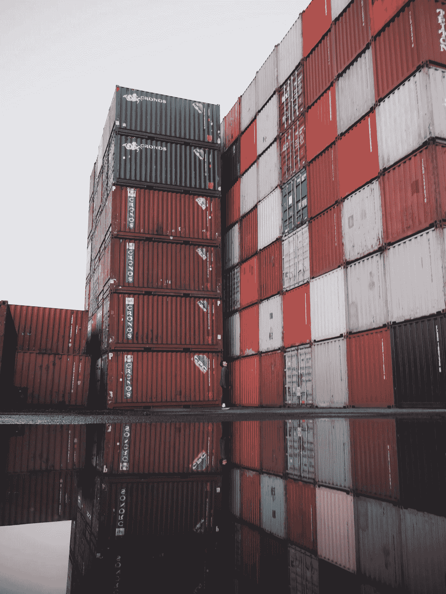
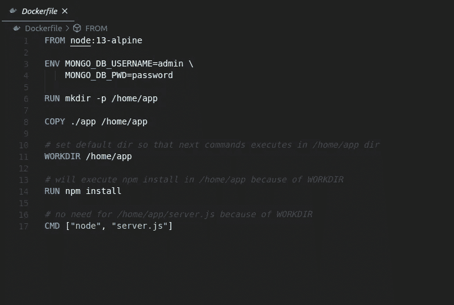
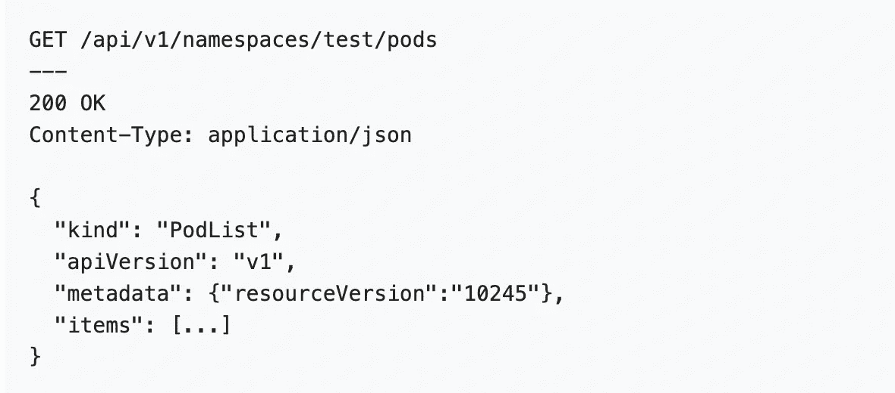
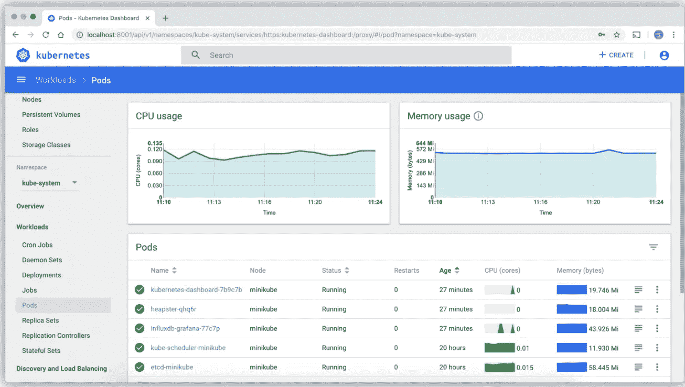

# 看集装箱化

> 原文：<https://medium.com/geekculture/a-look-at-containerization-b0c16fd5d688?source=collection_archive---------37----------------------->

了解操作系统虚拟化的最新趋势和一些最新的监控工具。

Credit to Pat Whelen (Unsplash)

**容器前的寿命**

在过去的二十年中，在开发和生产环境中使用容器化变得越来越流行。但是在深入研究这项技术之前，让我们先回忆一下它之前的生活。

> “您将使用 Python 2.7 进行测试，然后它将在生产中运行于 Python 3 上，奇怪的事情将会发生。或者，您将依赖于某个 SSL 库版本的行为，然后会安装另一个。你将在 Debian 上运行你的测试，在 Red Hat 上生产，各种奇怪的事情都会发生。”—*—所罗门·海克斯*码头工人的创始人

在软件工程世界中，当某些开发人员在他们的环境中使用**不同版本**的依赖关系时，一个非常普遍的错误就发生了。当他们的代码被推进到组织分支中时，在该分支之外工作的其他工程师经常会发现他们自己在执行的时候出现了版本错误。当我们使用容器化时，我们将应用程序的所有依赖项都放在一个位置——这样我们就不再有开发团队使用不同操作系统和安装版本的问题了。容器化比这更进一步，它还确保网络拓扑、安全策略和应用程序的存储是集中的，并且与任何一个开发人员隔离。

**介绍码头工人**

Example of an Dockerfile

尤其是 Docker，它已经成为集装箱技术的首选解决方案，并在很大程度上被认为是集装箱化盛行的原因。当在实际使用中提到该技术时，我们使用容器这个词。容器只是一个运行中的映像实例——我们在 Docker YAML 文件中编写的指令，用于准确指定我们将安装什么文件，使用哪个版本控制软件，等等。)

Docker 映像是在 docker 文件中写入的所有命令执行完毕后创建的。一个形象建立起来之后，我们需要通过运行它们来“赋予它们生命”。被赋予生命或活跃的图像被称为容器。当软件从一个计算环境转移到另一个计算环境时，容器解决了如何使软件可靠运行的问题。

Photo Credit to Mika Baumeister (Unsplash)

为了更好地理解容器，让我们看一个业务用例。PayPal 通过实现不同地点、不同货币和不同语言的支付来促进全球电子商务。PayPal 还有三个子实体，Braintree、PayPal 和 Venmo，它们都以每秒 200 笔支付的速度进行交易。平衡最小的加载时间，同时还需要对应用程序进行更改，这对 PayPal 来说是一个艰巨的挑战。通过利用容器化，特别是 Docker，PayPal 致力于将他们现有的应用程序标准化为一个统一的应用程序。之后，他们将标准化的应用程序迁移到容器中。很快，他们开始看到两种形式的好处:

1)与框架栈分离的部署:一个通用的部署应用程序，遵循相似的过程，而不管编程语言、库和栈。

2)降低负载:由于 Docker 将所有应用程序依赖项打包到一个容器中，PayPal 还能够分离底层操作系统，并获得 10-20%的效率提升，只需在现代操作系统和内核上运行容器即可。

PayPal 现在有超过 200，000 个容器在运行，超过 700 个应用程序迁移到 Docker 的 T2。这种转变**降低了开发时间**和**成本**，并让 Paypal 更好地遵循敏捷开发。

**介绍 Kubernetes**

如此庞大的容器集指向了一个问题:我们如何才能恰当地管理这么多的容器？我们如何恰当地安排重新部署、维护、可用性处理等的时间？

最近发展起来的一项技术提供了解决方案，这就是 Kubernetes(K8S)，一个容器编排工具。通过使用 K8S 的 API，Kubernetes 使您能够自动化、管理和调度由单个容器定义的应用程序，当您有数千个容器在运行时，这是一个重要的选项。

Kubernetes API GET request to retrieve all pods. Taken from [here](https://kubernetes.io/docs/reference/using-api/api-concepts/).

虽然容器的承诺是只需编写一次代码就可以在任何地方运行，但 Kubernetes 提供了从一个集中的位置编排和管理所有容器资源的可能性。迁移到 Kubernetes 从将我们的容器封装到 pod 中开始。术语“豆荚”是用来描述库伯内特斯最小的单位。它通常是一组具有共享存储和网络资源的容器，以及如何运行容器的规范。一个 pod 的内容总是位于同一位置并被共同调度，并且在一个共享的上下文中运行。一组豆荚被称为一个集群。Kubernetes 还让开发人员能够指定需要多少个副本以及每个集群应该调度的时间。

还有 Kubernetes 服务，一个 REST 对象，它被分配了一组 pods，负责整个系统的负载平衡、安全性、可伸缩性和联网。这些特性使 it 部门能够更轻松地为开发人员提供自助式资源访问，并使开发人员能够在非常复杂的微服务架构上进行协作，而无需在其开发环境中模仿整个应用。

**监控集装箱的工具(Docker & Kubernetes)**

虽然使用 kubectl CLI(对集群运行命令的默认命令行工具)来分析集群的性能是一个选项，但设置它需要一些跑腿的工作，而且 CLI 的 UI/UX 还有很多需要改进的地方。开源社区已经发布了一些工具来帮助开发人员在 Web-GUI 和桌面 GUI 环境中监控集群。

1) **Kubernetes 仪表盘**

Kubernetes Dashboard 是由 Kubernetes 自己创建的默认选项，用于观察 Kubernetes 中的容器。web UI 仪表板提供了集群上运行的应用程序的概述，以及创建或修改单个 Kubernetes 资源的概述。但是，在开始时，有一个复杂的身份验证设置，需要您每次通过 enter token 登录或上传 KubeConfig 文件。这对于一个团队来说是一个很好的设置，但是对于一个工程师来说却很麻烦。

Kubernetes Dashboard

无论如何，以下是 Kubernetes 仪表盘的一些核心功能:

*   在 pod 中部署应用程序。
*   窗格中运行的应用程序概述
*   对窗格中正在运行的应用程序进行故障排除
*   更改群集所需的资源量
*   修改和更新集群中容器资源的状态
*   基本指标测量，例如，每个 Kubernetes pod 的 RAM 和 CPU 利用率

2) **普罗米修斯/ FirstM8**

Prometheus 是 Kubernetes 用户中最常见的开源监控工具。Prometheus 的与众不同之处在于它基于给定端点的时间序列检索资源指标的方法。

虽然使用 Prometheus 有几个好处，但它复杂的查询语言使它很难快速使用，而且默认的 WebUI 也有很多不足之处。最近的第三方工具 FirstM8 提供了一个解决方案。

FirstM8 接受来自用户的各自 Kubernetes 实例的 *URI* 、 *IP* 和*端口*号，并使用 PromQL 以时序格式显示来自 Prometheus 服务器及其 API 的数据。

FirstM8’s drag/drop & PromQL execution feature

然而，FirstM8 比 Prometheus Web UI 更上一层楼，因为它允许拖放功能和通过点击按钮执行 PromQL 查询。这为开发人员省去学习一门新语言的麻烦，并立即以可访问的形式获得数据。截至目前，FirstM8 支持范围查询和即时查询，具有单一指标选择、总和/平均值/最小值/最大值和过滤功能。如果你对开始使用这个新的用户界面感兴趣，请查看[这个回购](https://github.com/oslabs-beta/First-M8)来深入了解它，或者[这篇文章](https://derekjunhaochen.medium.com/first-m8-an-easier-way-to-query-prometheus-97e25deed1ae)来探索它背后的更多理论。

**延伸阅读&资源**

[设置 Dockerfiles](https://docs.docker.com/engine/reference/builder/)

[Kubernetes 网络用户界面](https://kubernetes.io/docs/tasks/access-application-cluster/web-ui-dashboard/)

[Paypal 的 Docker 过渡](https://www.slideshare.net/Docker/a-story-of-cultural-change-paypals-2-year-journey-to-150000-containers-with-docker)

[FirstM8](https://github.com/oslabs-beta/First-M8)